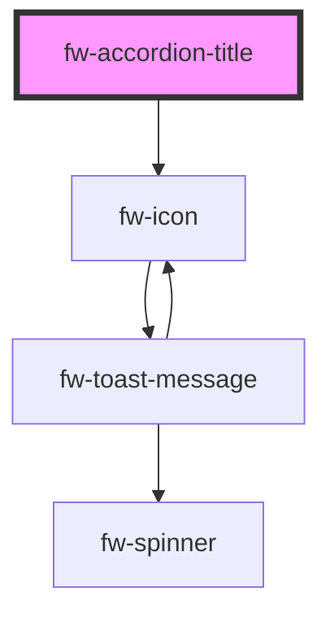

# Accordion Title (fw-accordion-title)

Displays the content inside the component.

<!-- Auto Generated Below -->

## Properties

| Property             | Attribute              | Description                     | Type      | Default |
| -------------------- | ---------------------- | ------------------------------- | --------- | ------- |
| `truncateOnOverflow` | `truncate-on-overflow` | Truncate title on text overflow | `boolean` | `true`  |

## CSS Custom Properties

| Name                                        | Description                          |
| ------------------------------------------- | ------------------------------------ |
| `--fw-accordion-title-background-color`     | Accordion title background color     |
| `--fw-accordion-title-border`               | Accordion title border               |
| `--fw-accordion-title-collapsed-icon-color` | Accordion title collapsed icon color |
| `--fw-accordion-title-expanded-icon-color`  | Accordion title expanded icon color  |
| `--fw-accordion-title-font-size`            | Accordion title font size            |
| `--fw-accordion-title-font-weight`          | Accordion title font weight          |
| `--fw-accordion-title-line-height`          | Accordion title line height          |

## Dependencies

### Depends on

- [fw-icon](../icon)

### Graph

----------------------------------------------

Built with ❤ at Freshworks
