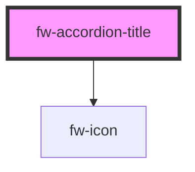

# fw-accordion-title

Displays the content inside the component.

<!-- Auto Generated Below -->

## Properties

| Property             | Attribute              | Description                     | Type      | Default |
| -------------------- | ---------------------- | ------------------------------- | --------- | ------- |
| `truncateOnOverflow` | `truncate-on-overflow` | Truncate title on text overflow | `boolean` | `true`  |

## CSS Custom Properties

| Name                            | Description                 |
| ------------------------------- | --------------------------- |
| `--accordion-title-background`  | Accordion title background  |
| `--accordion-title-border`      | Accordion title border      |
| `--accordion-title-box-shadow`  | Accordion title box shadow  |
| `--accordion-title-font-size`   | Accordion title font size   |
| `--accordion-title-font-weight` | Accordion title font weight |
| `--accordion-title-line-height` | Accordion title line height |

## Dependencies

### Depends on

- [fw-icon](../icon)

### Graph

----------------------------------------------

Built with ❤ at Freshworks
