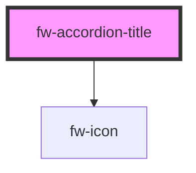

# fw-accordion-title

Displays the content inside the component.

<!-- Auto Generated Below -->

## Properties

| Property | Attribute | Description                | Type      | Default |
| -------- | --------- | -------------------------- | --------- | ------- |
| `bold`   | `bold`    | Displays the title in bold | `boolean` | `true`  |

## Dependencies

### Depends on

- [fw-icon](../icon)

### Graph

----------------------------------------------

Built with ❤ at Freshworks
