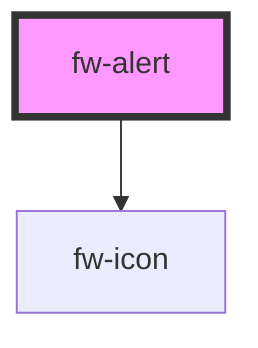

# fw-alert

<!-- Auto Generated Below -->

## Properties

| Property   | Attribute  | Description                                                 | Type                                          | Default     |
| ---------- | ---------- | ----------------------------------------------------------- | --------------------------------------------- | ----------- |
| `closable` | `closable` | Makes the alert closable.                                   | `boolean`                                     | `undefined` |
| `duration` | `duration` | The duration in milliseconds for which alert will be shown. | `number`                                      | `Infinity`  |
| `open`     | `open`     | Indicates whether the alert is open or not.                 | `boolean`                                     | `false`     |
| `type`     | `type`     | The type of alert to be displayed. Defaults to info.        | `"error" \| "info" \| "success" \| "warning"` | `'info'`    |

## Events

| Event    | Description                     | Type               |
| -------- | ------------------------------- | ------------------ |
| `fwHide` | Triggered when alert is hidden. | `CustomEvent<any>` |
| `fwShow` | Triggered when alert is shown.  | `CustomEvent<any>` |

## Methods

### `hide() => Promise<void>`

#### Returns

Type: `Promise<void>`

### `show() => Promise<void>`

#### Returns

Type: `Promise<void>`

## Dependencies

### Depends on

- [fw-icon](../icon)

### Graph

----------------------------------------------

Built with ❤ at Freshworks
