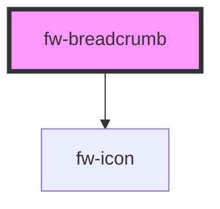

# Breadcrumb (fw-breadcrumb)

Breadcrumbs provide a group of links so users can easily navigate a website's hierarchy.

Breadcrumbs are usually placed before a page's main content with the current page shown last to indicate the user's position in the navigation.

## Demo

By default, breadcrumb items are rendered as buttons so you can use them to navigate single-page applications. In this case, you'll need to add event listeners to handle clicks.

For websites, you'll probably want to use links instead. You can make any breadcrumb item a link by applying an href attribute to it. Now, when the user activates it, they'll be taken to the corresponding page.

```html live
<fw-breadcrumb>
  <fw-breadcrumb-item href="https://example.com/home">
    Homepage
  </fw-breadcrumb-item>

  <fw-breadcrumb-item href="https://example.com/home/services">
    Our Services
  </fw-breadcrumb-item>

  <fw-breadcrumb-item href="https://example.com/home/services/digital">
    Digital Media
  </fw-breadcrumb-item>

  <fw-breadcrumb-item href="https://example.com/home/services/digital/web-design">
    Web Design
  </fw-breadcrumb-item>
</fw-breadcrumb>
```

## Usage

<code-group>
<code-block title="HTML">
```html
<fw-breadcrumb>
  <fw-breadcrumb-item href="https://example.com/home">
    Homepage
  </fw-breadcrumb-item>

  <fw-breadcrumb-item href="https://example.com/home/services">
    Our Services
  </fw-breadcrumb-item>

  <fw-breadcrumb-item href="https://example.com/home/services/digital">
    Digital Media
  </fw-breadcrumb-item>

  <fw-breadcrumb-item href="https://example.com/home/services/digital/web-design">
    Web Design
  </fw-breadcrumb-item>
</fw-breadcrumb>
```
</code-block>

<code-block title="React">
```jsx
import React from "react";
import ReactDOM from "react-dom";
import { FwBreadcrumb, FwBreadcrumbItem, FwIcon } from "@freshworks/crayons/react";
function App() {
  return (<div>
   <FwBreadcrumb>
  <FwBreadcrumbItem href="https://example.com/home">
    Homepage
  </FwBreadcrumbItem>

  <FwBreadcrumbItem href="https://example.com/home/services">
    Our Services
  </FwBreadcrumbItem>

  <FwBreadcrumbItem href="https://example.com/home/services/digital">
    Digital Media
  </FwBreadcrumbItem>

  <FwBreadcrumbItem href="https://example.com/home/services/digital/web-design">
    Web Design
  </FwBreadcrumbItem>
</FwBreadcrumb>
  </div>)
}
```
</code-block>
</code-group>

### Separators

Use the separator slot to change the separator that goes between breadcrumb items. Icons work well, but you can also use text or an image.

```html live
<fw-breadcrumb>
  <span slot="separator">.</span>
  <fw-breadcrumb-item>First</fw-breadcrumb-item>
  <fw-breadcrumb-item>Second</fw-breadcrumb-item>
  <fw-breadcrumb-item>Third</fw-breadcrumb-item> 
</fw-breadcrumb>

<br>

<fw-breadcrumb>
  <fw-icon name="arrow-right" slot="separator"></fw-icon>
  <fw-breadcrumb-item>First</fw-breadcrumb-item>
  <fw-breadcrumb-item>Second</fw-breadcrumb-item>
  <fw-breadcrumb-item>Third</fw-breadcrumb-item> 
</fw-breadcrumb>

<br>

<fw-breadcrumb>
  <span slot="separator">/</span>
  <fw-breadcrumb-item>First</fw-breadcrumb-item>
  <fw-breadcrumb-item>Second</fw-breadcrumb-item>
  <fw-breadcrumb-item>Third</fw-breadcrumb-item> 
</fw-breadcrumb>
```

## Usage

<code-group>
<code-block title="HTML">
```html
<fw-breadcrumb>
  <fw-icon name="arrow-right" slot="separator"></fw-icon>
  <fw-breadcrumb-item>First</fw-breadcrumb-item>
  <fw-breadcrumb-item>Second</fw-breadcrumb-item>
  <fw-breadcrumb-item>Third</fw-breadcrumb-item> 
</fw-breadcrumb>

<br>

<fw-breadcrumb>
  <span slot="separator">/</span>
  <fw-breadcrumb-item>First</fw-breadcrumb-item>
  <fw-breadcrumb-item>Second</fw-breadcrumb-item>
  <fw-breadcrumb-item>Third</fw-breadcrumb-item> 
</fw-breadcrumb>
```
</code-block>

<code-block title="React">
```jsx
import React from "react";
import ReactDOM from "react-dom";
import { FwBreadcrumb, FwBreadcrumbItem, FwIcon } from "@freshworks/crayons/react";
function App() {
  return (<div>
  <FwBreadcrumb>
  <span slot="separator">.</span>
  <FwBreadcrumbItem>First</FwBreadcrumbItem>
  <FwBreadcrumbItem>Second</FwBreadcrumbItem>
  <FwBreadcrumbItem>Third</FwBreadcrumbItem> 
</FwBreadcrumb>

<br>

<FwBreadcrumb>
  <FwIcon name="arrow-right" slot="separator"></FwIcon>
  <FwBreadcrumbItem>First</FwBreadcrumbItem>
  <FwBreadcrumbItem>Second</FwBreadcrumbItem>
  <FwBreadcrumbItem>Third</FwBreadcrumbItem> 
</FwBreadcrumb>

<br>

<FwBreadcrumb>
  <span slot="separator">/</span>
  <FwBreadcrumbItem>First</FwBreadcrumbItem>
  <FwBreadcrumbItem>Second</FwBreadcrumbItem>
  <FwBreadcrumbItem>Third</FwBreadcrumbItem> 
</FwBreadcrumb>
  </div>)
}
```
</code-block>
</code-group>


### Prefix and Suffix

Use the prefix slot to add content before any breadcrumb item.
Use the suffix slot to add content after any breadcrumb item.

```html live
<fw-breadcrumb>
  <fw-breadcrumb-item>
    <fw-icon slot="prefix" name="inbox"></fw-icon>
    Home
  </fw-breadcrumb-item>
  <fw-breadcrumb-item>Articles
     <fw-icon slot="suffix" name="edit"></fw-icon>
  </fw-breadcrumb-item>
  <fw-breadcrumb-item>Travelling</fw-breadcrumb-item>
</fw-breadcrumb>
```

## Usage

<code-group>
<code-block title="HTML">
```html
<fw-breadcrumb>
  <fw-breadcrumb-item>
    <fw-icon slot="prefix" name="inbox"></fw-icon>
    Home
  </fw-breadcrumb-item>
  <fw-breadcrumb-item>Articles
     <fw-icon slot="suffix" name="edit"></fw-icon>
  </fw-breadcrumb-item>
  <fw-breadcrumb-item>Travelling</fw-breadcrumb-item>
</fw-breadcrumb>
```
</code-block>

<code-block title="React">
```jsx
import React from "react";
import ReactDOM from "react-dom";
import { FwBreadcrumb, FwBreadcrumbItem, FwIcon } from "@freshworks/crayons/react";
function App() {
  return (<div>
  <FwBreadcrumb>
  <FwBreadcrumbItem>
    <FwIcon slot="prefix" name="inbox"></FwIcon>
    Home
  </FwBreadcrumbItem>
  <FwBreadcrumbItem>Articles
     <FwIcon slot="suffix" name="edit"></FwIcon>
  </FwBreadcrumbItem>
  <FwBreadcrumbItem>Travelling</FwBreadcrumbItem>
</FwBreadcrumb>
  </div>)
}
```
</code-block>
</code-group>


### Custom Dropdown

Dropdown menus can be placed in a prefix or suffix slot to provide additional options.

```html live
 <fw-breadcrumb>
      <fw-breadcrumb-item>Homepage</fw-breadcrumb-item>
      <fw-breadcrumb-item
        >Our Services
        <fw-popover
          slot="suffix"
          same-width="false"
          style="--popover-min-width: 110px"
          distance="8"
          placement="bottom-start"
        >
          <fw-button size="icon" color="link" slot="popover-trigger"
            ><fw-icon name="three-dots" size="14"></fw-icon>
          </fw-button>

          <fw-list-options
            slot="popover-content"
            id="placementComponent"
          ></fw-list-options>
        </fw-popover>
      </fw-breadcrumb-item>
      <fw-breadcrumb-item>Digital Media</fw-breadcrumb-item>
      <fw-breadcrumb-item> Web Design </fw-breadcrumb-item>
    </fw-breadcrumb>

    <script type="application/javascript">
      var dataSource = [
        {
          value: '1',
          text: 'Page3asdasdaasdasdasda asidjaoish do hoashd oa hdoah od ha',
        },
        { value: '2', text: 'Page4' },
        { value: '3', text: 'Page5' },
      ];
      var placementOptions = document.getElementById('placementComponent');
      placementOptions.options = dataSource;
    </script>
```

## Usage

<code-group>
<code-block title="HTML">
```html
 <fw-breadcrumb>
      <fw-breadcrumb-item>Homepage</fw-breadcrumb-item>
      <fw-breadcrumb-item
        >Our Services
        <fw-popover
          slot="suffix"
          same-width="false"
          style="--popover-min-width: 110px"
          distance="8"
          placement="bottom-start"
        >
          <fw-button size="icon" color="link" slot="popover-trigger"
            ><fw-icon name="three-dots" size="14"></fw-icon>
          </fw-button>

          <fw-list-options
            slot="popover-content"
            id="placementComponent"
          ></fw-list-options>
        </fw-popover>
      </fw-breadcrumb-item>
      <fw-breadcrumb-item>Digital Media</fw-breadcrumb-item>
      <fw-breadcrumb-item> Web Design </fw-breadcrumb-item>
    </fw-breadcrumb>

    <script type="application/javascript">
      var dataSource = [
        {
          value: '1',
          text: 'Page3asdasdaasdasdasda asidjaoish do hoashd oa hdoah od ha',
        },
        { value: '2', text: 'Page4' },
        { value: '3', text: 'Page5' },
      ];
      var placementOptions = document.getElementById('placementComponent');
      placementOptions.options = dataSource;
    </script>
```
</code-block>

<code-block title="React">
```jsx
import React from "react";
import ReactDOM from "react-dom";
import { FwBreadcrumb, FwBreadcrumbItem, FwIcon } from "@freshworks/crayons/react";
function App() {
  var dataSource = [
        {
          value: '1',
          text: 'Page3asdasdaasdasdasda asidjaoish do hoashd oa hdoah od ha',
        },
        { value: '2', text: 'Page4' },
        { value: '3', text: 'Page5' },
      ];

  return (<div>
  <FwBreadcrumb>
      <FwBreadcrumbItem>Homepage</FwBreadcrumbItem>
      <FwBreadcrumbItem
        >Our Services
        <fw-popover
          slot="suffix"
          same-width="false"
          style="--popover-min-width: 110px"
          distance="8"
          placement="bottom-start"
        >
          <fw-button size="icon" color="link" slot="popover-trigger"
            ><fw-icon name="three-dots" size="14"></fw-icon>
          </fw-button>

          <fw-list-options
            slot="popover-content"
            id="placementComponent"
            options={dataSource}
          ></fw-list-options>
        </fw-popover>
      </FwBreadcrumbItem>
      <FwBreadcrumbItem>Digital Media</FwBreadcrumbItem>
      <FwBreadcrumbItem> Web Design </FwBreadcrumbItem>
    </FwBreadcrumb>
  </div>)
}
```
</code-block>
</code-group>


<!-- Auto Generated Below -->


## Properties

| Property | Attribute | Description                                                      | Type     | Default        |
| -------- | --------- | ---------------------------------------------------------------- | -------- | -------------- |
| `label`  | `label`   | Label to be used for screen readers and other assistive devices. | `string` | `'Breadcrumb'` |


## Shadow Parts

| Part     | Description |
| -------- | ----------- |
| `"base"` |             |


## Dependencies

### Depends on

- [fw-icon](../icon)

### Graph


----------------------------------------------

Built with ❤ at Freshworks
