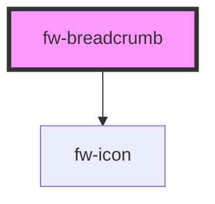

# fw-breadcrumb

<!-- Auto Generated Below -->

## Properties

| Property | Attribute | Description                                                      | Type     | Default        |
| -------- | --------- | ---------------------------------------------------------------- | -------- | -------------- |
| `label`  | `label`   | Label to be used for screen readers and other assistive devices. | `string` | `'Breadcrumb'` |

## Shadow Parts

| Part     | Description |
| -------- | ----------- |
| `"base"` |             |

## Dependencies

### Depends on

- [fw-icon](../icon)

### Graph

----------------------------------------------

Built with ❤ at Freshworks
