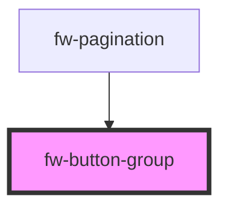

# Button Group (fw-button-group)
Button groups can be used to group related buttons into sections.
## Demo
``` html live
<section>
<fw-button-group label="Test">
    <fw-button>Replace</fw-button>
    <fw-button>Modify</fw-button>
    <fw-button>Cancel</fw-button>
  </fw-button-group>
  </section>
  <br/>

<section>
    <fw-button-group label="Test">
    <fw-button id="b1" size="icon" color="secondary"><fw-icon name="reply" color="black" ></fw-icon> </fw-button>
    <fw-button id="b2" size="icon" color="secondary"><fw-icon name="chat-online" color="black" ></fw-icon> </fw-button>
    <fw-button id="b3" size="icon" color="secondary"><fw-icon name="more-horizontal" color="black" ></fw-icon> </fw-button>
  </fw-button-group>
</section>
```
## Usage

<code-group>
<code-block title="HTML">
```html
<section>
<fw-button-group label="Test">
    <fw-button>Replace</fw-button>
    <fw-button>Modify</fw-button>
    <fw-button>Cancel</fw-button>
  </fw-button-group>
  </section>
<br/>
<section>
    <fw-button-group label="Test">
    <fw-button id="b1" size="icon" color="secondary"><fw-icon name="reply" color="black" ></fw-icon> </fw-button>
    <fw-button id="b2" size="icon" color="secondary"><fw-icon name="chat-online" color="black" ></fw-icon> </fw-button>
    <fw-button id="b3" size="icon" color="secondary"><fw-icon name="more-horizontal" color="black" ></fw-icon> </fw-button>
  </fw-button-group>
</section>
```
</code-block>

<code-block title="React">
```jsx
import React from "react";
import ReactDOM from "react-dom";
import { FwButtonGroup, FwButton, FwIcon } from "@freshworks/crayons/react";
function App() {
  return (<div>
    <FwButtonGroup>
      <FwButton color="secondary"> Replace</FwButton> 
      <FwButton color="secondary">Modify</FwButton> 
      <FwButton color="secondary">Cancel</FwButton>
    </FwButtonGroup>

  <FwButtonGroup>
    <FwButton id="b1" size="icon" color="secondary"><FwIcon name="reply" color="black"></FwIcon> </FwButton> 
    <FwButton id="b1" size="icon" color="secondary"><FwIcon name="chat-online" color="black"></FwIcon> </FwButton>
    <FwButton id="b1" size="icon" color="secondary"><FwIcon name="more-horizontal" color="black"></FwIcon> </FwButton>
  </FwButtonGroup>

  </div>)
}
```
</code-block>
</code-group>


<!-- Auto Generated Below -->


## Properties

| Property | Attribute | Description | Type     | Default |
| -------- | --------- | ----------- | -------- | ------- |
| `label`  | `label`   |             | `string` | `''`    |


## Dependencies

### Used by

 - [fw-pagination](../pagination)

### Graph


----------------------------------------------

Built with ❤ at Freshworks
