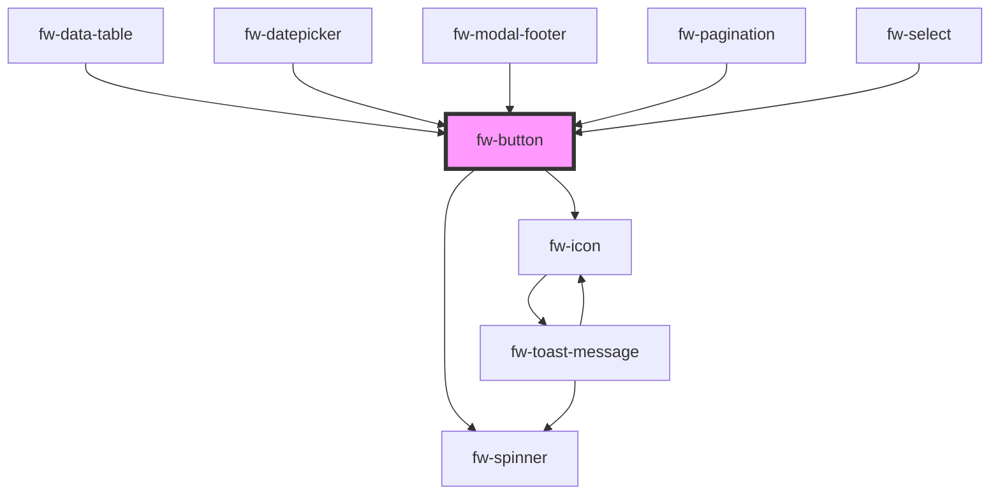

# Button (fw-button)

fw-button displays a button on the user interface and enables performing specific actions based on the button type. The button’s label can be a text, icon, or both.

## Demo

```html live
<section>
  <fw-label value="Try themes"></fw-label>
  <fw-button color="primary"> OK </fw-button>
  <fw-button color="secondary"> Secondary </fw-button>
  <fw-button color="danger"> Don't Click </fw-button>
  <fw-button color="link"> Link Button </fw-button>
  <fw-button color="text"> Plain Text Button </fw-button>
</section>

<br />

<section>
  <fw-label value="Try sizes"></fw-label>
  <fw-button size="mini" color="secondary"> Mini </fw-button>
  <fw-button size="small"> Small </fw-button>
  <fw-button> Default </fw-button>
</section>
<br />

<section>
  <fw-label value="Try icon buttons"></fw-label>
  <fw-button size="icon"
    ><fw-icon name="agent" color="white"></fw-icon>
  </fw-button>
  <fw-button size="icon" color="secondary"
    ><fw-icon name="phone"></fw-icon>
  </fw-button>
</section>
<br />

<section>
  <fw-label value="Caret with icon"></fw-label>
  <fw-button show-caret-icon>
    <fw-icon name="calendar-time" slot="before-label"></fw-icon>
    Select date
  </fw-button>

  <fw-button color="link" show-caret-icon>
    <fw-icon name="calendar-time" slot="before-label"></fw-icon>
    Select date
  </fw-button>
</section>
<br />

<section>
  <fw-label value="Loading state"></fw-label>
  <fw-button loading> Loading </fw-button>
  <fw-button loading color="secondary"> OK </fw-button>
  <fw-button loading color="danger"> Don't Click </fw-button>
</section>
<br />

<section>
  <fw-label value="Disabled"></fw-label>
  <fw-button disabled color="primary"> OK </fw-button>
  <fw-button disabled color="secondary"> OK </fw-button>
  <fw-button disabled color="danger"> Don't Click </fw-button>
</section>

<section>
  <fw-label
    value="Try icon + text buttons Buttons with before-label and after-label"
  ></fw-label>
  <fw-button color="secondary">
    <fw-icon slot="before-label" name="delete"></fw-icon>
    <span>Delete</span>
  </fw-button>
  <fw-button color="primary">
    <span>Copy</span>
    <fw-icon name="code" slot="after-label"></fw-icon>
  </fw-button>
</section>
<br />

<section>
  <fw-label value="Try full length"></fw-label>
  <fw-button color="secondary" size="small" style="display: block;"
    >Span full-width</fw-button
  >
</section>
<br />
```

## Usage

<code-group>
<code-block title="HTML">
``` html
<section>
  <fw-label value="Try themes"></fw-label>
  <fw-button color="primary"> OK </fw-button>
  <fw-button color="secondary"> Secondary </fw-button>
  <fw-button color="danger"> Don't Click </fw-button>
  <fw-button color="link"> Link Button </fw-button>
  <fw-button color="text"> Plain Text Button </fw-button>
</section>

<br />

<section>
  <fw-label value="Try sizes"></fw-label>
  <fw-button size="mini" color="secondary"> Mini </fw-button>
  <fw-button size="small"> Small </fw-button>
  <fw-button> Default </fw-button>
</section>
<br />

<section>
  <fw-label value="Try icon buttons"></fw-label>
  <fw-button size="icon"
    ><fw-icon name="agent" color="white" ></fw-icon>
  </fw-button>
  <fw-button size="icon" color="secondary"
    ><fw-icon name="phone" ></fw-icon>
  </fw-button>
</section>
<br />

<section>
  <fw-label value="Caret with icon"></fw-label>
  <fw-button show-caret-icon>
    <fw-icon name="calendar-time" slot="before-label" ></fw-icon>
    Select date
  </fw-button>

  <fw-button color="link" show-caret-icon>
    <fw-icon name="calendar-time" slot="before-label" ></fw-icon>
    Select date
  </fw-button>
</section>
<br />

<section>
  <fw-label value="Loading state"></fw-label>
  <fw-button loading> Loading </fw-button>
  <fw-button loading color="secondary"> OK </fw-button>
  <fw-button loading color="danger"> Don't Click </fw-button>
</section>
<br />

<section>
  <fw-label value="Disabled"></fw-label>
  <fw-button disabled color="primary"> OK </fw-button>
  <fw-button disabled color="secondary"> OK </fw-button>
  <fw-button disabled color="danger"> Don't Click </fw-button>
</section>
<br />

<section>
  <fw-label value="Try icon + text buttons Buttons with before-label and after-label"></fw-label>
  <fw-button color="secondary">
    <fw-icon slot="before-label" name="delete" ></fw-icon>
    <span>Delete</span>
  </fw-button>
  <fw-button color="primary">
    <span>Copy</span>
    <fw-icon name="code" slot="after-label" ></fw-icon>
  </fw-button>
</section>
<br />

<section>
  <fw-label value="Try full length"></fw-label>
  <fw-button color="secondary" size="small" style="display: block;">Span full-width</fw-button>
</section>
```
</code-block>

<code-block title="React">
```jsx
import React from "react";
import ReactDOM from "react-dom";
import { FwButton, FwIcon } from "@freshworks/crayons/react";
function App() {
  return (<div>
  <section>
  <label>Try themes</label>
  <FwButton color="primary" onFwClick={()=>console.log("fwClick event emitted from button")}> OK </FwButton>
  <FwButton color="secondary"> Secondary </FwButton>
  <FwButton color="danger"> Don't Click </FwButton>
  <FwButton color="link"> Link Button </FwButton>
  <FwButton color="text"> Plain Text Button </FwButton>
</section>

<br />

<section>
  <label>Try sizes</label>
  <FwButton size="mini" color="secondary"> Mini </FwButton>
  <FwButton size="small"> Small </FwButton>
  <FwButton> Default </FwButton>
</section>
<br />

<section>
  <label>Try icon buttons</label>
  <FwButton size="icon"
    ><FwIcon name="agent" color="white"></FwIcon>
  </FwButton>
  <FwButton size="icon" color="secondary"
    ><FwIcon name="phone"></FwIcon>
  </FwButton>
</section>
<br />
<section>
  <label value="Caret with icon"></label>
  <FwButton show-caret-icon>
    <FwIcon name="calendar-time" slot="before-label"></FwIcon>
    Select date
  </FwButton>

  <FwButton color="link" show-caret-icon>
    <fw-icon name="calendar-time" slot="before-label" ></fw-icon>
    Select date
  </FwButton>
</section>
<br />

<section>
  <label>Loading state</label>
  <FwButton loading> Loading </FwButton>
  <FwButton loading color="secondary"> OK </FwButton>
  <FwButton loading color="danger"> Don't Click </FwButton>
</section>
<br />

<section>
  <label>Disabled</label>
  <FwButton disabled color="primary"> OK </FwButton>
  <FwButton disabled color="secondary"> OK </FwButton>
  <FwButton disabled color="danger"> Don't Click </FwButton>
</section>
<br />
<section>
  <label value="Try icon + text buttons Buttons with before-label and after-label"></label>
  <FwButton color="secondary">
    <FwIcon slot="before-label" name="delete"></FwIcon>
    <span>Delete</span>
  </FwButton>
  <FwButton color="primary">
    <span>Copy</span>
    <FwIcon name="code" slot="after-label"></FwIcon>
  </FwButton>
</section>
<br />

<section>
  <FwButton value="Try full length"></FwButton>
  <FwButton color="secondary" size="small" style="display: block;">Span full-width</FwButton>
</section>
  </div>)
```
</code-block>
</code-group>

<!-- Auto Generated Below -->


## Properties

| Property         | Attribute          | Description                                                                  | Type                                                       | Default     |
| ---------------- | ------------------ | ---------------------------------------------------------------------------- | ---------------------------------------------------------- | ----------- |
| `color`          | `color`            | Identifier of  the theme based on which the button is styled.                | `"danger" \| "link" \| "primary" \| "secondary" \| "text"` | `'primary'` |
| `disabled`       | `disabled`         | Disables the button on the interface. Default value is false.                | `boolean`                                                  | `false`     |
| `fileUploaderId` | `file-uploader-id` | Accepts the id of the fw-file-uploader component to upload the file.         | `string`                                                   | `''`        |
| `loading`        | `loading`          | Loading state for the button, Default value is false.                        | `boolean`                                                  | `false`     |
| `modalTriggerId` | `modal-trigger-id` | Accepts the id of the fw-modal component to open it on click.                | `string`                                                   | `''`        |
| `showCaretIcon`  | `show-caret-icon`  | Caret indicator for the button, Default value is false.                      | `boolean`                                                  | `false`     |
| `size`           | `size`             | Size of the button.                                                          | `"icon" \| "icon-small" \| "normal" \| "small"`            | `'normal'`  |
| `throttleDelay`  | `throttle-delay`   | Sets the delay for throttle in milliseconds. Defaults to 200 milliseconds.   | `number`                                                   | `200`       |
| `type`           | `type`             | Button type based on which actions are performed when the button is clicked. | `"button" \| "submit"`                                     | `'button'`  |


## Events

| Event     | Description                                 | Type                |
| --------- | ------------------------------------------- | ------------------- |
| `fwBlur`  | Triggered when the button loses focus.      | `CustomEvent<void>` |
| `fwClick` | Triggered when the button is clicked.       | `CustomEvent<void>` |
| `fwFocus` | Triggered when the button comes into focus. | `CustomEvent<void>` |


## Methods

### `setFocus() => Promise<any>`


#### Returns

Type: `Promise<any>`


## CSS Custom Properties

| Name                                 | Description                           |
| ------------------------------------ | ------------------------------------- |
| `--fw-button-label-vertical-padding` | vertical padding for the button label |
| `--fw-button-min-width`              | minimum width for the button          |


## Dependencies

### Used by

 - [fw-data-table](../data-table)
 - [fw-datepicker](../datepicker)
 - [fw-modal-footer](../modal-footer)
 - [fw-pagination](../pagination)
 - [fw-select](../select)

### Depends on

- [fw-spinner](../spinner)
- [fw-icon](../icon)

### Graph


----------------------------------------------

Built with ❤ at Freshworks
