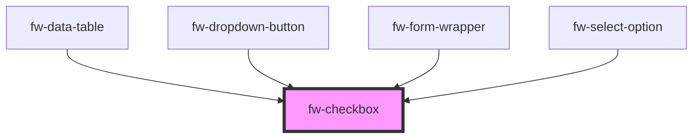

# Checkbox (fw-checkbox)
fw-checkbox displays a check box on the user interface and enables assigning a state (selected or deselected) to it. In the selected state, the check box displayed on the UI is highlighted and contains a check mark. 

## Demo

```html live
<fw-checkbox checked description="Agree or Disagree">Select to agree</fw-checkbox><br><br>
<fw-checkbox checked disabled value="dcb">Disabled check box</fw-checkbox>
```
## Usage

<code-group>
<code-block title="HTML">
```html
<fw-checkbox checked description="Agree or Disagree">Select to agree</fw-checkbox><br><br>
<fw-checkbox checked disabled value="dcb">Disabled check box</fw-checkbox>
```
</code-block>

<code-block title="React">
```jsx
import React from "react";
import ReactDOM from "react-dom";
import { FwCheckbox } from "@freshworks/crayons/react";
function App() {
  return (<div>
    <FwCheckbox checked description="Agree or Disagree">Select to agree</FwCheckbox><br/><br/>
    <FwCheckbox checked disabled value="dcb">Disabled check box</FwCheckbox>
  </div>)
}
```
</code-block>
</code-group>

<!-- Auto Generated Below -->


## Properties

| Property       | Attribute     | Description                                                                                                                                                | Type                         | Default          |
| -------------- | ------------- | ---------------------------------------------------------------------------------------------------------------------------------------------------------- | ---------------------------- | ---------------- |
| `checked`      | `checked`     | Sets the state of the check box to selected. If the attribute’s value is undefined, the value is set to false.                                             | `boolean`                    | `false`          |
| `description`  | `description` | Description to be displayed for the checkbox.                                                                                                              | `string`                     | `''`             |
| `disabled`     | `disabled`    | Disables the check box on the interface. If the attribute’s value is undefined, the value is set to false.                                                 | `boolean`                    | `false`          |
| `handleBlur`   | --            |                                                                                                                                                            | `(_e: any, _o: any) => void` | `(_e, _o) => {}` |
| `handleChange` | --            |                                                                                                                                                            | `(_e: any, _o: any) => void` | `(_e, _o) => {}` |
| `handleFocus`  | --            |                                                                                                                                                            | `(_e: any, _o: any) => void` | `(_e, _o) => {}` |
| `label`        | `label`       | <span style="color:red">**[DEPRECATED]**</span> Use `description` instead. Label displayed on the interface, for the check box.<br/><br/>                  | `string`                     | `''`             |
| `name`         | `name`        | Name of the component, saved as part of form data.                                                                                                         | `string`                     | `''`             |
| `required`     | `required`    | Specifies the input box as a mandatory field and displays an asterisk next to the label. If the attribute’s value is undefined, the value is set to false. | `boolean`                    | `false`          |
| `value`        | `value`       | Identifier corresponding to the component, that is saved when the form data is saved.                                                                      | `string`                     | `''`             |


## Events

| Event      | Description                                       | Type                |
| ---------- | ------------------------------------------------- | ------------------- |
| `fwBlur`   | Triggered when the check box loses focus.         | `CustomEvent<void>` |
| `fwChange` | Triggered when the check box’s value is modified. | `CustomEvent<any>`  |
| `fwFocus`  | Triggered when the check box comes into focus.    | `CustomEvent<void>` |


## Methods

### `nativeRef() => Promise<HTMLInputElement>`

Return native element

#### Returns

Type: `Promise<HTMLInputElement>`


## Dependencies

### Used by

 - [fw-data-table](../data-table)
 - [fw-dropdown-button](../dropdown-button)
 - [fw-form-wrapper](../form-wrapper)
 - [fw-select-option](../select-option)

### Graph


----------------------------------------------

Built with ❤ at Freshworks
