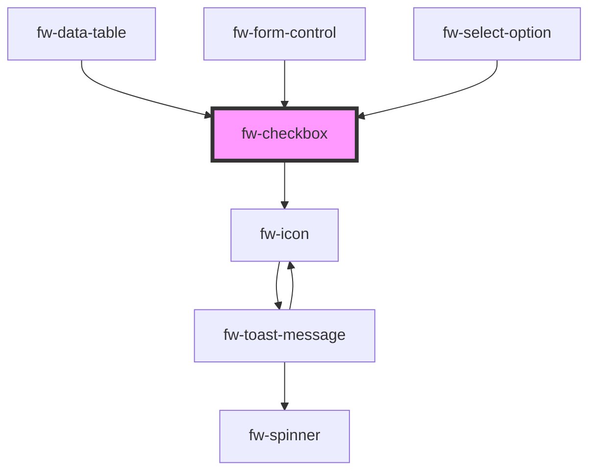

# Checkbox (fw-checkbox)
fw-checkbox displays a check box on the user interface and enables assigning a state (selected or deselected) to it. In the selected state, the check box displayed on the UI is highlighted and contains a check mark. 

## Demo

```html live
<fw-checkbox checked description="Agree or Disagree">Select to agree</fw-checkbox><br><br>
<fw-checkbox checked disabled value="dcb">Disabled check box</fw-checkbox>
```
## Usage

<code-group>
<code-block title="HTML">
```html
<fw-checkbox checked description="Agree or Disagree">Select to agree</fw-checkbox><br><br>
<fw-checkbox checked disabled value="dcb">Disabled check box</fw-checkbox>
```
</code-block>

<code-block title="React">
```jsx
import React from "react";
import ReactDOM from "react-dom";
import { FwCheckbox } from "@freshworks/crayons/react";
function App() {
  return (<div>
    <FwCheckbox checked description="Agree or Disagree">Select to agree</FwCheckbox><br/><br/>
    <FwCheckbox checked disabled value="dcb">Disabled check box</FwCheckbox>
  </div>)
}
```
</code-block>
</code-group>

<!-- Auto Generated Below -->


## Properties

| Property      | Attribute      | Description                                                                                                                                                | Type                               | Default    |
| ------------- | -------------- | ---------------------------------------------------------------------------------------------------------------------------------------------------------- | ---------------------------------- | ---------- |
| `checked`     | `checked`      | Sets the state of the check box to selected. If the attribute’s value is undefined, the value is set to false.                                             | `boolean`                          | `false`    |
| `description` | `description`  | Description to be displayed for the checkbox.                                                                                                              | `string`                           | `''`       |
| `disabled`    | `disabled`     | Disables the check box on the interface. If the attribute’s value is undefined, the value is set to false.                                                 | `boolean`                          | `false`    |
| `errorText`   | `error-text`   | Error text displayed below the radio group.                                                                                                                | `string`                           | `''`       |
| `hintText`    | `hint-text`    | /**   Hint text displayed below the radio group.                                                                                                           | `string`                           | `''`       |
| `label`       | `label`        | <span style="color:red">**[DEPRECATED]**</span> Use `description` instead. Label displayed on the interface, for the check box.<br/><br/>                  | `string`                           | `''`       |
| `name`        | `name`         | Name of the component, saved as part of form data.                                                                                                         | `string`                           | `''`       |
| `required`    | `required`     | Specifies the input box as a mandatory field and displays an asterisk next to the label. If the attribute’s value is undefined, the value is set to false. | `boolean`                          | `false`    |
| `state`       | `state`        | Theme based on which the checkbox is styled.                                                                                                               | `"error" \| "normal" \| "warning"` | `'normal'` |
| `value`       | `value`        | Identifier corresponding to the component, that is saved when the form data is saved.                                                                      | `string`                           | `''`       |
| `warningText` | `warning-text` | Warning text displayed below the radio group.                                                                                                              | `string`                           | `''`       |


## Events

| Event      | Description                                    | Type                |
| ---------- | ---------------------------------------------- | ------------------- |
| `fwBlur`   | Triggered when the check box loses focus.      | `CustomEvent<any>`  |
| `fwChange` | Triggered when the checkbox state is modified. | `CustomEvent<any>`  |
| `fwFocus`  | Triggered when the check box comes into focus. | `CustomEvent<void>` |


## Methods

### `setFocus() => Promise<void>`

Sets focus on a `fw-checkbox`.

#### Returns

Type: `Promise<void>`


## CSS Custom Properties

| Name                 | Description                |
| -------------------- | -------------------------- |
| `--fw-error-color`   | Color of the error text.   |
| `--fw-hint-color`    | Color of the hint text.    |
| `--fw-warning-color` | Color of the warning text. |


## Dependencies

### Used by

 - [fw-data-table](../data-table)
 - [fw-form-control](../form-control)
 - [fw-select-option](../select-option)

### Depends on

- [fw-icon](../icon)

### Graph


----------------------------------------------

Built with ❤ at Freshworks
