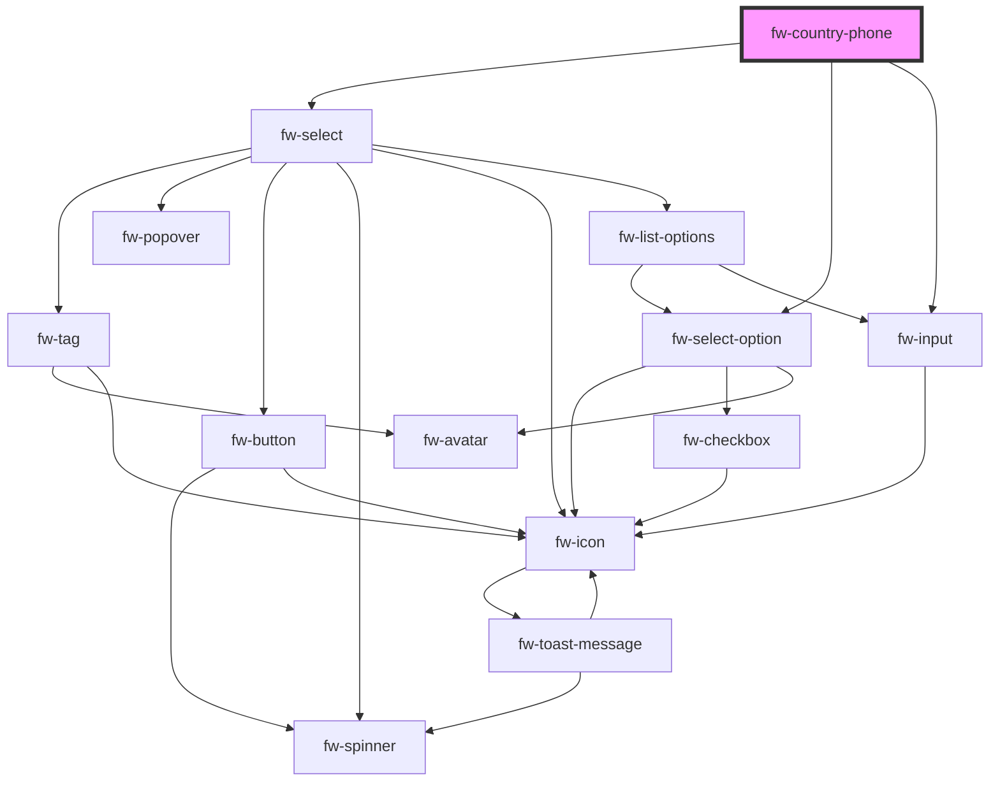

# fw-country-phone

<!-- Auto Generated Below -->

## Properties

| Property            | Attribute             | Description                                                                                                                                                                                                                                                                         | Type                               | Default     |
| ------------------- | --------------------- | ----------------------------------------------------------------------------------------------------------------------------------------------------------------------------------------------------------------------------------------------------------------------------------- | ---------------------------------- | ----------- |
| `clearInput`        | `clear-input`         | Displays a right-justified clear icon in the text box. Clicking the icon clears the input text. If the attribute’s value is undefined, the value is set to false. For a read-only input box, the clear icon is not displayed unless a default value is specified for the input box. | `boolean`                          | `false`     |
| `countryWidth`      | `country-width`       | Adjust country code select dropdown width                                                                                                                                                                                                                                           | `string`                           | `'200'`     |
| `disabled`          | `disabled`            | Disables the component on the interface. If the attribute’s value is undefined, the value is set to false.                                                                                                                                                                          | `boolean`                          | `false`     |
| `errorText`         | `error-text`          | Error text displayed below the text box.                                                                                                                                                                                                                                            | `string`                           | `''`        |
| `hideCountryFlag`   | `hide-country-flag`   | Hide Country Flag in the Country Select                                                                                                                                                                                                                                             | `boolean`                          | `false`     |
| `hideCountryName`   | `hide-country-name`   | Hide Country Name in the Country Select                                                                                                                                                                                                                                             | `boolean`                          | `false`     |
| `hintText`          | `hint-text`           | Hint text displayed below the text box.                                                                                                                                                                                                                                             | `string`                           | `''`        |
| `inputLabel`        | `input-label`         | * Label displayed on the interface, for the input component.                                                                                                                                                                                                                        | `string`                           | `undefined` |
| `inputPlaceholder`  | `input-placeholder`   | Text displayed in the text box before a user enters a value.                                                                                                                                                                                                                        | `string`                           | `undefined` |
| `name`              | `name`                | Name of the component, saved as part of form data.                                                                                                                                                                                                                                  | `string`                           | `''`        |
| `readonly`          | `readonly`            | If true, the user cannot enter a value in the input box. If the attribute’s value is undefined, the value is set to false.                                                                                                                                                          | `boolean`                          | `false`     |
| `required`          | `required`            | Specifies the input box as a mandatory field and displays an asterisk next to the label. If the attribute’s value is undefined, the value is set to false.                                                                                                                          | `boolean`                          | `false`     |
| `requiredInnerHint` | `required-inner-hint` | Specifies hint from inside the component after valdating phone number.                                                                                                                                                                                                              | `boolean`                          | `false`     |
| `selectLabel`       | `select-label`        | * Label displayed on the interface, for the input component.                                                                                                                                                                                                                        | `string`                           | `undefined` |
| `selectPlaceholder` | `select-placeholder`  | Text displayed in the text box before a user enters a value.                                                                                                                                                                                                                        | `string`                           | `undefined` |
| `state`             | `state`               | Theme based on which the text box is styled.                                                                                                                                                                                                                                        | `"error" \| "normal" \| "warning"` | `'normal'`  |
| `value`             | `value`               | Default value displayed in the input box & select dropdown after extracting valid phone number                                                                                                                                                                                      | `string`                           | `''`        |
| `warningText`       | `warning-text`        | Warning text displayed below the text box.                                                                                                                                                                                                                                          | `string`                           | `''`        |

## Events

| Event             | Description                            | Type               |
| ----------------- | -------------------------------------- | ------------------ |
| `fwTelBlur`       | Triggered when phone element is blur.  | `CustomEvent<any>` |
| `fwTelInput`      | Triggered when phone element is input. | `CustomEvent<any>` |
| `fwTelInputClear` | Triggered when clear icon is clicked.  | `CustomEvent<any>` |

## Methods

### `getLibMethods() => Promise<{ isValidPhoneNumber: (text: string, defaultCountry?: CountryCode | { defaultCountry?: CountryCode; defaultCallingCode?: string; }) => boolean; parsePhoneNumber(...args: any[]): any; }>`

#### Returns

Type: `Promise<{ isValidPhoneNumber: (text: string, defaultCountry?: CountryCode | { defaultCountry?: CountryCode; defaultCallingCode?: string; }) => boolean; parsePhoneNumber(...args: any[]): any; }>`

## Dependencies

### Depends on

- [fw-select](../select)
- [fw-select-option](../select-option)
- [fw-input](../input)

### Graph

----------------------------------------------

Built with ❤ at Freshworks
