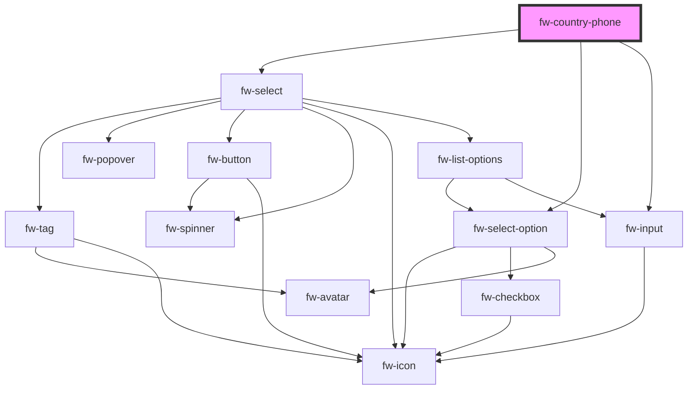

#  CountryPhone(fw-country-phone)

fw-country-phone displays a country code selector & input element for entering phone Number

## Demo
```html live
<fw-country-phone
    value=""
    name="country-code"
    clear-input
    select-placeholder="select country code"
    input-placeholder="Enter phone number"
    required
    input-label="Support phone number"
    select-label="Country Code"
    error-text="Error message text"
    warning-text="Please use numbers for user ID"
    state="normal"
  ></fw-country-phone>
<fw-country-phone
    value="+919999999999"
    name="country-code"
    clear-input
    select-placeholder="select country code"
    input-placeholder="Enter phone number"
    required
    input-label="Support phone number"
    select-label="Country Code"
    error-text="Error message text"
    warning-text="Please use numbers for user ID"
    state="normal"
  ></fw-country-phone>
  <fw-country-phone
    value="+919999999999"
    name="country-code"
    clear-input
    select-placeholder="select country code"
    input-placeholder="Enter phone number"
    required
    input-label="Support phone number"
    select-label="Country Code"
    hint-text="select country code to get valid phonenumber"
    warning-text="Please use numbers for user ID"
    state="normal"
  ></fw-country-phone>
  <fw-country-phone
  value="+1264497275926449727599878978789798798789798798789787897987897897897878978978787897989878"
  name="country-code"
  clear-input
  select-placeholder="select country code"
  input-placeholder="Enter phone number"
  required
  input-label="Support phone number"
  select-label="Country Code"
  hint-text="Input hint text"
  warning-text="select country code to get valid phonenumber"
  state="warning"
></fw-country-phone>
  <fw-country-phone
  value="+1264497275926449727599878978789798798789798798789787897987897897897878978978787897989878"
  name="country-code"
  clear-input
  select-placeholder="select country code"
  input-placeholder="Enter phone number"
  required
  input-label="Support phone number"
  select-label="Country Code"
  hint-text="Input hint text"
  error-text="Invalid Country Phone Number"
  state="error"
></fw-country-phone>
```


## Usage

<code-group>
<code-block title="HTML">
```html
<fw-country-phone
    value=""
    name="country-code"
    clear-input
    select-placeholder="select country code"
    input-placeholder="Enter phone number"
    required
    input-label="Support phone number"
    select-label="Country Code"
    error-text="Error message text"
    warning-text="Please use numbers for user ID"
    state="normal"
  ></fw-country-phone>
<fw-country-phone
    value="+919999999999"
    name="country-code"
    clear-input
    select-placeholder="select country code"
    input-placeholder="Enter phone number"
    required
    input-label="Support phone number"
    select-label="Country Code"
    error-text="Error message text"
    warning-text="Please use numbers for user ID"
    state="normal"
    style="--fw-select-width: 0 0 400px"
  ></fw-country-phone>
  <fw-country-phone
    value="+919999999999"
    name="country-code"
    clear-input
    select-placeholder="select country code"
    input-placeholder="Enter phone number"
    required
    input-label="Support phone number"
    select-label="Country Code"
    hint-text="select country code to get valid phonenumber"
    warning-text="Please use numbers for user ID"
    state="normal"
  ></fw-country-phone>
    <fw-country-phone
  value="+1264497275926449727599878978789798798789798798789787897987897897897878978978787897989878"
  name="country-code"
  clear-input
  select-placeholder="select country code"
  input-placeholder="Enter phone number"
  required
  input-label="Support phone number"
  select-label="Country Code"
  hint-text="Input hint text"
  warning-text="select country code to get valid phonenumber"
  state="warning"
></fw-country-phone>
  <fw-country-phone
  value="+1264497275926449727599878978789798798789798798789787897987897897897878978978787897989878"
  name="country-code"
  clear-input
  select-placeholder="select country code"
  input-placeholder="Enter phone number"
  required
  input-label="Support phone number"
  select-label="Country Code"
  hint-text="Input hint text"
  error-text="Invalid Country Phone Number"
  state="error"
></fw-country-phone>
```
</code-block>

<code-block title="React">
```jsx
import React from "react";
import ReactDOM from "react-dom";
import { FwCountryPhone } from "@freshworks/crayons/react";
function App() {
  return (<div>
      <FwCountryPhone
      value="+919999999999"
      name="country-code"
      clearInput
      selectPlaceholder="select country code"
      inputPlaceholder="Enter phone number"
      required
      inputLabel="Support phone number"
      selectLabel="Country Code"
      errorText="Error message text"
      warningText="Please use numbers for user ID"
      state="normal">
      </FwCountryPhone>
      <FwCountryPhone
      value="+919999999999"
      name="country-code"
      clearInput
      selectPlaceholder="select country code"
      inputPlaceholder="Enter phone number"
      required
      inputLabel="Support phone number"
      selectLabel="Country Code"
      hintText="select country code to get valid phonenumber"
      warningText="Please use numbers for user ID"
      state="normal">
      </FwCountryPhone>
      <FwCountryPhone
      value="+1264497275926449727599878978789798798789798798789787897987897897897878978978787897989878"
      name="country-code"
      clearInput
      selectPlaceholder="select country code"
      inputPlaceholder="Enter phone number"
      required
      inputLabel="Support phone number"
      selectLabel="Country Code"
      hintText="Input hint text"
      warningText="select country code to get valid phonenumber"
      state="warning"
      style={{"--fw-select-width": '0 0 300px'}}
      >
      </FwCountryPhone>
      <FwCountryPhone
      value="+1264497275926449727599878978789798798789798798789787897987897897897878978978787897989878"
      name="country-code"
      clearInput
      selectPlaceholder="select country code"
      inputPlaceholder="Enter phone number"
      required
      inputLabel="Support phone number"
      selectLabel="Country Code"
      hintText="Input hint text"
      errorText="Invalid Country Phone Number"
      state="error">
      </FwCountryPhone>
 </div>);
```
</code-block>
</code-group>


<!-- Auto Generated Below -->


## Properties

| Property            | Attribute            | Description                                                                                                                                                                                                                                                                         | Type                               | Default     |
| ------------------- | -------------------- | ----------------------------------------------------------------------------------------------------------------------------------------------------------------------------------------------------------------------------------------------------------------------------------- | ---------------------------------- | ----------- |
| `clearInput`        | `clear-input`        | Displays a right-justified clear icon in the text box. Clicking the icon clears the input text. If the attribute’s value is undefined, the value is set to false. For a read-only input box, the clear icon is not displayed unless a default value is specified for the input box. | `boolean`                          | `false`     |
| `disabled`          | `disabled`           | Disables the component on the interface. If the attribute’s value is undefined, the value is set to false.                                                                                                                                                                          | `boolean`                          | `false`     |
| `errorText`         | `error-text`         | Error text displayed below the text box.                                                                                                                                                                                                                                            | `string`                           | `''`        |
| `hideCountryFlag`   | `hide-country-flag`  | Hide Country Flag in the Country Select                                                                                                                                                                                                                                             | `boolean`                          | `false`     |
| `hideCountryName`   | `hide-country-name`  | Hide Country Name in the Country Select                                                                                                                                                                                                                                             | `boolean`                          | `false`     |
| `hintText`          | `hint-text`          | Hint text displayed below the text box.                                                                                                                                                                                                                                             | `string`                           | `''`        |
| `inputLabel`        | `input-label`        | * Label displayed on the interface, for the input component.                                                                                                                                                                                                                        | `string`                           | `undefined` |
| `inputPlaceholder`  | `input-placeholder`  | Text displayed in the text box before a user enters a value.                                                                                                                                                                                                                        | `string`                           | `undefined` |
| `name`              | `name`               | Name of the component, saved as part of form data.                                                                                                                                                                                                                                  | `string`                           | `''`        |
| `readonly`          | `readonly`           | If true, the user cannot enter a value in the input box. If the attribute’s value is undefined, the value is set to false.                                                                                                                                                          | `boolean`                          | `false`     |
| `required`          | `required`           | Specifies the input box as a mandatory field and displays an asterisk next to the label. If the attribute’s value is undefined, the value is set to false.                                                                                                                          | `boolean`                          | `false`     |
| `selectLabel`       | `select-label`       | * Label displayed on the interface, for the input component.                                                                                                                                                                                                                        | `string`                           | `undefined` |
| `selectPlaceholder` | `select-placeholder` | Text displayed in the text box before a user enters a value.                                                                                                                                                                                                                        | `string`                           | `undefined` |
| `state`             | `state`              |  Theme based on which the text box is styled.                                                                                                                                                                                                                                       | `"error" \| "normal" \| "warning"` | `'normal'`  |
| `value`             | `value`              | Default value displayed in the input box & select dropdown after extracting valid phone number                                                                                                                                                                                      | `string`                           | `''`        |
| `warningText`       | `warning-text`       | Warning text displayed below the text box.                                                                                                                                                                                                                                          | `string`                           | `''`        |


## Events

| Event          | Description                            | Type               |
| -------------- | -------------------------------------- | ------------------ |
| `fwBlur`       | Triggered when phone element is blur.  | `CustomEvent<any>` |
| `fwFocus`      | Triggered when input is focused.       | `CustomEvent<any>` |
| `fwInput`      | Triggered when phone element is input. | `CustomEvent<any>` |
| `fwInputClear` | Triggered when clear icon is clicked.  | `CustomEvent<any>` |


## Methods

### `isValidPhoneNumber(value: string, countryCode: CountryCode) => Promise<boolean>`

Checks PhoneNumber is Valid or Not

#### Returns

Type: `Promise<boolean>`

after validation PhoneNumber with countryCode

### `parsePhoneNumber(...args: any[]) => Promise<any>`

Validates PhoneNumber provided and return extra details

#### Returns

Type: `Promise<any>`

{countryCode, countryCallingCode, nationalNumber,  number, metadata }


## CSS Custom Properties

| Name                | Description                               |
| ------------------- | ----------------------------------------- |
| `--fw-select-width` | Adjust country code select dropdown width |


## Dependencies

### Depends on

- [fw-select](../select)
- [fw-select-option](../select-option)
- [fw-input](../input)

### Graph


----------------------------------------------

Built with ❤ at Freshworks
