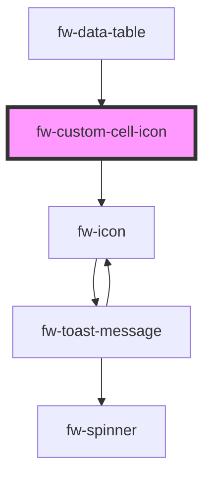

# fw-custom-cell-icon

<!-- Auto Generated Below -->

## Properties

| Property  | Attribute | Description | Type     | Default     |
| --------- | --------- | ----------- | -------- | ----------- |
| `color`   | `color`   |             | `string` | `'#647A8E'` |
| `library` | `library` |             | `string` | `'crayons'` |
| `name`    | `name`    |             | `string` | `''`        |
| `size`    | `size`    |             | `number` | `18`        |
| `src`     | `src`     |             | `any`    | `null`      |

## Dependencies

### Used by

 - [fw-data-table](../..)

### Depends on

- [fw-icon](../../../icon)

### Graph

----------------------------------------------

Built with ❤ at Freshworks
