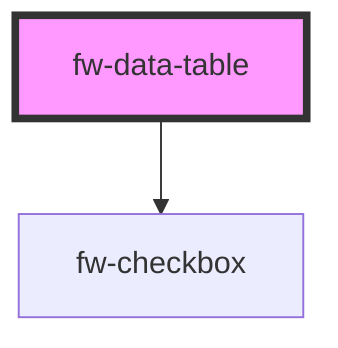

# DataTable (fw-data-table)
fw-data-table are used for data visualization.

## Usage

```html live
  <fw-data-table id="datatable" is-selectable="true" label="Data table 1">
  </fw-data-table>

  <script type="application/javascript">
    var data = {
      columns: [{
        "key": "name",
        "text": "Name",
        "orderIndex": 1
      }, {
        "key": "group",
        "text": "Group",
        "orderIndex": 3
      }, {
        "key": "role",
        "text": "Role",
        "orderIndex": 2
      }],
      persons: [{
        "id": "1234",
        "name": "Alexander Goodman", 
        "role": "Administrator", 
        "group": "L1 Support"
      }, {
        "id": "2345",
        "name": "Ambrose Wayne", 
        "role": "Supervisor", 
        "group": "L1 Support"
      }, {
        "id": "3456",
        "name": "August hines",
        "role": "Agent",
        "group": "L1 support"
      }]
    }

    var datatable = document.getElementById('datatable');
    datatable.columns = data.columns;
    datatable.rows = data.persons;
  </script>
```

<code-group>
<code-block title="HTML">
```html 
  <fw-data-table id="datatable" is-selectable="true" label="Data table 1">
  </fw-data-table>
```

```javascript
  var data = {
    columns: [{
      "key": "name",
      "text": "Name",
      "orderIndex": 1
    }, {
      "key": "group",
      "text": "Group",
      "orderIndex": 3
    }, {
      "key": "role",
      "text": "Role",
      "orderIndex": 2
    }],
    persons: [{
      "id": "1234",
      "name": "Alexander Goodman", 
      "role": "Administrator", 
      "group": "L1 Support"
    }, {
      "id": "2345",
      "name": "Ambrose Wayne", 
      "role": "Supervisor", 
      "group": "L1 Support"
    }, {
      "id": "3456",
      "name": "August hines",
      "role": "Agent",
      "group": "L1 support"
    }]
  }

  var datatable = document.getElementById('datatable');
  datatable.columns = data.columns;
  datatable.rows = data.persons;
```
</code-block>

<code-block title="React">

```jsx
import React from "react";
import ReactDOM from "react-dom";
import { FWDataTable } from "@freshworks/crayons/react";
function App() {

  let data = {
      columns: [{
        "key": "name",
        "text": "Name",
        "orderIndex": 1
      }, {
        "key": "group",
        "text": "Group",
        "orderIndex": 3
      }, {
        "key": "role",
        "text": "Role",
        "orderIndex": 2
      }],
      persons: [{
        "id": "1234",
        "name": "Alexander Goodman", 
        "role": "Administrator", 
        "group": "L1 Support"
      }, {
        "id": "2345",
        "name": "Ambrose Wayne", 
        "role": "Supervisor", 
        "group": "L1 Support"
      }, {
        "id": "3456",
        "name": "August hines",
        "role": "Agent",
        "group": "L1 support"
      }]
    };

  return (
    <FWDataTable columns={data.columns} rows={data.persons} label="Data Table 1" isSelectable>
    </FWDataTable>
  );
}
```
</code-block>
</code-group>

<!-- Auto Generated Below -->


## Properties

| Property       | Attribute       | Description                                                                            | Type                | Default |
| -------------- | --------------- | -------------------------------------------------------------------------------------- | ------------------- | ------- |
| `columns`      | --              | Columns Array of objects that provides information regarding the columns in the table. | `DataTableColumn[]` | `[]`    |
| `isSelectable` | `is-selectable` | isSelectable Boolean based on which selectable options appears for rows in the table.  | `boolean`           | `false` |
| `label`        | `label`         | Label attribute is not visible on screen. There for accessibility purposes.            | `string`            | `''`    |
| `rows`         | --              | Rows Array of objects to be displayed in the table.                                    | `DataTableRow[]`    | `[]`    |


## Events

| Event               | Description                                                         | Type               |
| ------------------- | ------------------------------------------------------------------- | ------------------ |
| `fwSelectionChange` | fwSelectionChange Emits this event when row is selected/unselected. | `CustomEvent<any>` |


## Methods

### `getSelectedIds() => Promise<string[]>`

getSelectedIds

#### Returns

Type: `Promise<string[]>`

an array of selected row IDs

### `getSelectedRows() => Promise<DataTableRow[]>`

getSelectedRows

#### Returns

Type: `Promise<DataTableRow[]>`

selected rows from the data table


## Dependencies

### Depends on

- [fw-checkbox](../checkbox)

### Graph


----------------------------------------------

Built with ❤ at Freshworks
