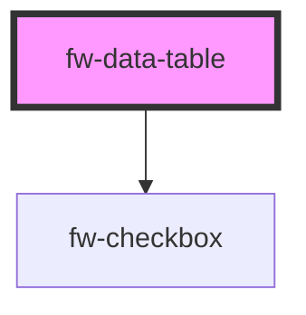

# DataTable (fw-data-table)
fw-data-table are used for data visualization.

## Usage

```html live
  <fw-data-table id="datatable" is-selectable="true" label="Data table 1">
  </fw-data-table>

  <script type="application/javascript">
    var data = {
      columns: [{
        "key": "name",
        "text": "Name",
        "orderIndex": 1
      }, {
        "key": "group",
        "text": "Group",
        "orderIndex": 3
      }, {
        "key": "role",
        "text": "Role",
        "orderIndex": 2
      }],
      persons: [{
        "id": "1234",
        "name": "Alexander Goodman", 
        "role": "Administrator", 
        "group": "L1 Support"
      }, {
        "id": "2345",
        "name": "Ambrose Wayne", 
        "role": "Supervisor", 
        "group": "L1 Support"
      }, {
        "id": "3456",
        "name": "August hines",
        "role": "Agent",
        "group": "L1 support"
      }]
    }

    var datatable = document.getElementById('datatable');
    datatable.columns = data.columns;
    datatable.rows = data.persons;
  </script>
```

<code-group>
<code-block title="HTML">
```html 
  <fw-data-table id="datatable" is-selectable="true" label="Data table 1">
  </fw-data-table>
```

```javascript
  var data = {
    columns: [{
      "key": "name",
      "text": "Name",
      "orderIndex": 1
    }, {
      "key": "group",
      "text": "Group",
      "orderIndex": 3
    }, {
      "key": "role",
      "text": "Role",
      "orderIndex": 2
    }],
    persons: [{
      "id": "1234",
      "name": "Alexander Goodman", 
      "role": "Administrator", 
      "group": "L1 Support"
    }, {
      "id": "2345",
      "name": "Ambrose Wayne", 
      "role": "Supervisor", 
      "group": "L1 Support"
    }, {
      "id": "3456",
      "name": "August hines",
      "role": "Agent",
      "group": "L1 support"
    }]
  }

  var datatable = document.getElementById('datatable');
  datatable.columns = data.columns;
  datatable.rows = data.persons;
```
</code-block>

<code-block title="React">

```jsx
import React from "react";
import ReactDOM from "react-dom";
import { FWDataTable } from "@freshworks/crayons/react";
function App() {

  let data = {
      columns: [{
        "key": "name",
        "text": "Name",
        "orderIndex": 1
      }, {
        "key": "group",
        "text": "Group",
        "orderIndex": 3
      }, {
        "key": "role",
        "text": "Role",
        "orderIndex": 2
      }],
      persons: [{
        "id": "1234",
        "name": "Alexander Goodman", 
        "role": "Administrator", 
        "group": "L1 Support"
      }, {
        "id": "2345",
        "name": "Ambrose Wayne", 
        "role": "Supervisor", 
        "group": "L1 Support"
      }, {
        "id": "3456",
        "name": "August hines",
        "role": "Agent",
        "group": "L1 support"
      }]
    };

  return (
    <FWDataTable columns={data.columns} rows={data.persons} label="Data Table 1" isSelectable>
    </FWDataTable>
  );
}
```
</code-block>
</code-group>

## Custom cells 

### Crayons provided variants

#### Anchor column variant

Row value for this column variant should be an object with the following properties:
1. text - Text to be displayed in the cell
2. href - url to point to when the text is clicked

```html live
  <fw-data-table id="datatable-2" label="Data table 2">
  </fw-data-table>

  <script type="application/javascript">
    var data = {
      columns: [{
        "key": "search",
        "text": "Search Engine",
        "orderIndex": 1,
        "variant": "anchor"
      }, {
        "key": "rank",
        "text": "Rank",
        "orderIndex": 2
      }],
      rows: [{
        "id": "001",
        "search": { "text": "Google", "href": "https://www.google.com" },
        "rank": 1
      }, {
        "id": "002",
        "search": { "text": "Bing", "href": "https://www.bing.com" },
        "rank": 2
      }, {
        "id": "003",
        "search": { "text": "DuckDuckGo", "href": "https://www.duckduckgo.com" },
        "rank": 3
      }]
    };

    var datatable = document.getElementById('datatable-2');
    datatable.columns = data.columns;
    datatable.rows = data.rows;
  </script>
```

<code-group>
<code-block title="HTML">
```html 
  <fw-data-table id="datatable-2" label="Data table 2">
  </fw-data-table>
```

```javascript
  var data = {
    columns: [{
      "key": "search",
      "text": "Search Engine",
      "orderIndex": 1,
      "variant": "anchor"
    }, {
      "key": "rank",
      "text": "Rank",
      "orderIndex": 2
    }],
    rows: [{
      "id": "001",
      "search": { "text": "Google", "href": "https://www.google.com" },
      "rank": 1
    }, {
      "id": "002",
      "search": { "text": "Bing", "href": "https://www.bing.com" },
      "rank": 2
    }, {
      "id": "003",
      "search": { "text": "DuckDuckGo", "href": "https://www.duckduckgo.com" },
      "rank": 3
    }]
  };

  var datatable = document.getElementById('datatable-2');
  datatable.columns = data.columns;
  datatable.rows = data.rows;
```
</code-block>

<code-block title="React">

```jsx
import React from "react";
import ReactDOM from "react-dom";
import { FWDataTable } from "@freshworks/crayons/react";
function App() {

  var data = {
    columns: [{
      "key": "search",
      "text": "Search Engine",
      "orderIndex": 1,
      "variant": "anchor"
    }, {
      "key": "rank",
      "text": "Rank",
      "orderIndex": 2
    }],
    rows: [{
      "id": "001",
      "search": { "text": "Google", "href": "https://www.google.com" },
      "rank": 1
    }, {
      "id": "002",
      "search": { "text": "Bing", "href": "https://www.bing.com" },
      "rank": 2
    }, {
      "id": "003",
      "search": { "text": "DuckDuckGo", "href": "https://www.duckduckgo.com" },
      "rank": 3
    }]
  };

  return (
    <FWDataTable columns={data.columns} rows={data.persons} label="Data Table 2">
    </FWDataTable>
  );
}
```
</code-block>
</code-group>

#### User column variant

Row value for this column variant should be an object with the following properties:
1. name - Name of the user
2. email - email of the user
3. image (optional) - url of the user image to be displayed in the avatar

*If image property is not present, user's initials from the name property will be shown inside the avatar.*

```html live
  <fw-data-table id="datatable-3" label="Data table 3">
  </fw-data-table>
  
  <script type="application/javascript">
    var data = {
      columns: [{
        "key": "createdby",
        "text": "Created By",
        "orderIndex": 1,
        "variant": "user"
      }, {
        "key": "objectname",
        "text": "Object Name",
        "orderIndex": 2
      }],
      rows: [{
        "id": "0011",
        "objectname": "Hotels",
        "createdby": { 
          "image": "https://images.unsplash.com/photo-1614644147798-f8c0fc9da7f6?ixlib=rb-1.2.1&ixid=MnwxMjA3fDB8MHxwaG90by1wYWdlfHx8fGVufDB8fHx8&auto=format&fit=crop&w=300&q=80",
          "name": "Alexander Goodman", 
          "email": "alexander.goodman@freshdesk.com" 
        }
      }, {
        "id": "0022",
        "objectname": "Bookings",
        "createdby": { 
          "image": "https://images.unsplash.com/photo-1633332755192-727a05c4013d?ixlib=rb-1.2.1&ixid=MnwxMjA3fDB8MHxwaG90by1wYWdlfHx8fGVufDB8fHx8&auto=format&fit=crop&w=300&q=80",
          "name": "Ambrose Wayne", 
          "email": "ambrose.wayne@freshdesk.com" 
        }
      }, {
        "id": "0033",
        "objectname": "Ratings",
        "createdby": {
          "image": "https://images.unsplash.com/photo-1507003211169-0a1dd7228f2d?ixlib=rb-1.2.1&ixid=MnwxMjA3fDB8MHxwaG90by1wYWdlfHx8fGVufDB8fHx8&auto=format&fit=crop&w=300&q=80",
          "name": "August hines", 
          "email": "august.hines@freshdesk.com" 
        }
      }]
    }; 

    var datatable = document.getElementById('datatable-3');
    datatable.columns = data.columns;
    datatable.rows = data.rows;
  </script>
```

<code-group>
<code-block title="HTML">
```html 
  <fw-data-table id="datatable-3" label="Data table 3">
  </fw-data-table>
```

```javascript
  var data = {
    columns: [{
      "key": "createdby",
      "text": "Created By",
      "orderIndex": 1,
      "variant": "user"
    }, {
      "key": "objectname",
      "text": "Object Name",
      "orderIndex": 2
    }],
    rows: [{
      "id": "0011",
      "objectname": "Hotels",
      "createdby": { 
        "image": "https://images.unsplash.com/photo-1614644147798-f8c0fc9da7f6?ixlib=rb-1.2.1&ixid=MnwxMjA3fDB8MHxwaG90by1wYWdlfHx8fGVufDB8fHx8&auto=format&fit=crop&w=300&q=80",
        "name": "Alexander Goodman", 
        "email": "alexander.goodman@freshdesk.com" 
      }
    }, {
      "id": "0022",
      "objectname": "Bookings",
      "createdby": { 
        "image": "https://images.unsplash.com/photo-1633332755192-727a05c4013d?ixlib=rb-1.2.1&ixid=MnwxMjA3fDB8MHxwaG90by1wYWdlfHx8fGVufDB8fHx8&auto=format&fit=crop&w=300&q=80",
        "name": "Ambrose Wayne", 
        "email": "ambrose.wayne@freshdesk.com" 
      }
    }, {
      "id": "0033",
      "objectname": "Ratings",
      "createdby": {
        "image": "https://images.unsplash.com/photo-1507003211169-0a1dd7228f2d?ixlib=rb-1.2.1&ixid=MnwxMjA3fDB8MHxwaG90by1wYWdlfHx8fGVufDB8fHx8&auto=format&fit=crop&w=300&q=80",
        "name": "August hines", 
        "email": "august.hines@freshdesk.com" 
      }
    }]
  }; 

  var datatable = document.getElementById('datatable-3');
  datatable.columns = data.columns;
  datatable.rows = data.rows;
```
</code-block>

<code-block title="React">

```jsx
import React from "react";
import ReactDOM from "react-dom";
import { FWDataTable } from "@freshworks/crayons/react";
function App() {

  var data = {
    columns: [{
      "key": "createdby",
      "text": "Created By",
      "orderIndex": 1,
      "variant": "user"
    }, {
      "key": "objectname",
      "text": "Object Name",
      "orderIndex": 2
    }],
    rows: [{
      "id": "0011",
      "objectname": "Hotels",
      "createdby": { 
        "image": "https://images.unsplash.com/photo-1614644147798-f8c0fc9da7f6?ixlib=rb-1.2.1&ixid=MnwxMjA3fDB8MHxwaG90by1wYWdlfHx8fGVufDB8fHx8&auto=format&fit=crop&w=300&q=80",
        "name": "Alexander Goodman", 
        "email": "alexander.goodman@freshdesk.com" 
      }
    }, {
      "id": "0022",
      "objectname": "Bookings",
      "createdby": { 
        "image": "https://images.unsplash.com/photo-1633332755192-727a05c4013d?ixlib=rb-1.2.1&ixid=MnwxMjA3fDB8MHxwaG90by1wYWdlfHx8fGVufDB8fHx8&auto=format&fit=crop&w=300&q=80",
        "name": "Ambrose Wayne", 
        "email": "ambrose.wayne@freshdesk.com" 
      }
    }, {
      "id": "0033",
      "objectname": "Ratings",
      "createdby": {
        "image": "https://images.unsplash.com/photo-1507003211169-0a1dd7228f2d?ixlib=rb-1.2.1&ixid=MnwxMjA3fDB8MHxwaG90by1wYWdlfHx8fGVufDB8fHx8&auto=format&fit=crop&w=300&q=80",
        "name": "August hines", 
        "email": "august.hines@freshdesk.com" 
      }
    }]
  };

  return (
    <FWDataTable columns={data.columns} rows={data.persons} label="Data Table 3">
    </FWDataTable>
  );
}
```
</code-block>
</code-group>

### Custom templates

This codeblock shows how to use custom cell function to display HTML content in a cell.

``` js{4-6}
  var columns = [{
    "key": "bookname",
    "text": "Book name",
    "customTemplate": (createElement, props) => {
      return createElement('b', {}, props.text);
    }
  }]
```

``` js
  // Usage examples for createElement:
  // Params should be either (tagName, children) or (tagName, properties, children)
  createElement('div', [createElement('h2', 'Hello')]);
  createElement('div#foo.bar.baz', [createElement('h2', 'Hello')]);
  createElement('div.bar.baz', [createElement('h2', 'Hello')]);
  createElement('div', {className: 'greeting'}, [createElement('h2', 'Hello')]);
```


<!-- Auto Generated Below -->


## Properties

| Property       | Attribute       | Description                                                                            | Type                | Default |
| -------------- | --------------- | -------------------------------------------------------------------------------------- | ------------------- | ------- |
| `columns`      | --              | Columns Array of objects that provides information regarding the columns in the table. | `DataTableColumn[]` | `[]`    |
| `isSelectable` | `is-selectable` | isSelectable Boolean based on which selectable options appears for rows in the table.  | `boolean`           | `false` |
| `label`        | `label`         | Label attribute is not visible on screen. There for accessibility purposes.            | `string`            | `''`    |
| `rows`         | --              | Rows Array of objects to be displayed in the table.                                    | `DataTableRow[]`    | `[]`    |


## Events

| Event               | Description                                                         | Type               |
| ------------------- | ------------------------------------------------------------------- | ------------------ |
| `fwSelectionChange` | fwSelectionChange Emits this event when row is selected/unselected. | `CustomEvent<any>` |


## Methods

### `getSelectedIds() => Promise<string[]>`

getSelectedIds

#### Returns

Type: `Promise<string[]>`

an array of selected row IDs

### `getSelectedRows() => Promise<DataTableRow[]>`

getSelectedRows

#### Returns

Type: `Promise<DataTableRow[]>`

selected rows from the data table


## Dependencies

### Depends on

- [fw-checkbox](../checkbox)

### Graph


----------------------------------------------

Built with ❤ at Freshworks
