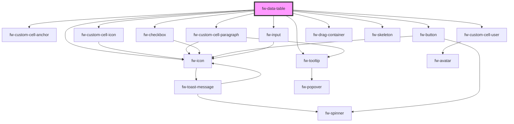

# DataTable (fw-data-table)
fw-data-table are used for data visualization.

## Basic Usage

```html live
  <fw-data-table id="datatable" is-selectable="true" label="Data table 1">
  </fw-data-table>

  <script type="application/javascript">
    var data = {
      columns: [{
        "key": "name",
        "text": "Name"
      }, {
        "key": "group",
        "text": "Group"
      }, {
        "key": "role",
        "text": "Role"
      }],
      persons: [{
        "id": "1234",
        "name": "Alexander Goodman", 
        "role": "Administrator", 
        "group": "L1 Support"
      }, {
        "id": "2345",
        "name": "Ambrose Wayne", 
        "role": "Supervisor", 
        "group": "L1 Support"
      }, {
        "id": "3456",
        "name": "August hines",
        "role": "Agent",
        "group": "L1 support"
      }]
    }

    var datatable = document.getElementById('datatable');
    datatable.columns = data.columns;
    datatable.rows = data.persons;
  </script>
```

<code-group>
<code-block title="HTML">
```html 
  <fw-data-table id="datatable" is-selectable="true" label="Data table 1">
  </fw-data-table>
```

```javascript
  var data = {
    columns: [{
      "key": "name",
      "text": "Name"
    }, {
      "key": "group",
      "text": "Group"
    }, {
      "key": "role",
      "text": "Role"
    }],
    persons: [{
      "id": "1234",
      "name": "Alexander Goodman", 
      "role": "Administrator", 
      "group": "L1 Support"
    }, {
      "id": "2345",
      "name": "Ambrose Wayne", 
      "role": "Supervisor", 
      "group": "L1 Support"
    }, {
      "id": "3456",
      "name": "August hines",
      "role": "Agent",
      "group": "L1 support"
    }]
  }

  var datatable = document.getElementById('datatable');
  datatable.columns = data.columns;
  datatable.rows = data.persons;
```
</code-block>

<code-block title="React">

```jsx
import React from "react";
import ReactDOM from "react-dom";
import { FwDataTable } from "@freshworks/crayons/react";
function App() {

  let data = {
      columns: [{
        "key": "name",
        "text": "Name"
      }, {
        "key": "group",
        "text": "Group"
      }, {
        "key": "role",
        "text": "Role"
      }],
      persons: [{
        "id": "1234",
        "name": "Alexander Goodman", 
        "role": "Administrator", 
        "group": "L1 Support"
      }, {
        "id": "2345",
        "name": "Ambrose Wayne", 
        "role": "Supervisor", 
        "group": "L1 Support"
      }, {
        "id": "3456",
        "name": "August hines",
        "role": "Agent",
        "group": "L1 support"
      }]
    };

  return (
    <FwDataTable columns={data.columns} rows={data.persons} label="Data Table 1" isSelectable>
    </FwDataTable>
  );
}
```
</code-block>
</code-group>

## Custom cells 

### Crayons provided variants

#### Anchor column variant

Row value for this column variant should be an object with the following properties:
1. text - Text to be displayed in the cell
2. href - url to point to when the text is clicked

```html live
  <fw-data-table id="datatable-2" label="Data table 2">
  </fw-data-table>

  <script type="application/javascript">
    var data = {
      columns: [{
        "key": "search",
        "text": "Search Engine",
        "position": 1,
        "variant": "anchor"
      }, {
        "key": "rank",
        "text": "Rank",
        "position": 2
      }],
      rows: [{
        "id": "001",
        "search": { "text": "Google", "href": "https://www.google.com" },
        "rank": 1
      }, {
        "id": "002",
        "search": { "text": "Bing", "href": "https://www.bing.com" },
        "rank": 2
      }, {
        "id": "003",
        "search": { "text": "DuckDuckGo", "href": "https://www.duckduckgo.com" },
        "rank": 3
      }]
    };

    var datatable = document.getElementById('datatable-2');
    datatable.columns = data.columns;
    datatable.rows = data.rows;
  </script>
```

<code-group>
<code-block title="HTML">
```html 
  <fw-data-table id="datatable-2" label="Data table 2">
  </fw-data-table>
```

```javascript
  var data = {
    columns: [{
      "key": "search",
      "text": "Search Engine",
      "position": 1,
      "variant": "anchor"
    }, {
      "key": "rank",
      "text": "Rank",
      "position": 2
    }],
    rows: [{
      "id": "001",
      "search": { "text": "Google", "href": "https://www.google.com" },
      "rank": 1
    }, {
      "id": "002",
      "search": { "text": "Bing", "href": "https://www.bing.com" },
      "rank": 2
    }, {
      "id": "003",
      "search": { "text": "DuckDuckGo", "href": "https://www.duckduckgo.com" },
      "rank": 3
    }]
  };

  var datatable = document.getElementById('datatable-2');
  datatable.columns = data.columns;
  datatable.rows = data.rows;
```
</code-block>

<code-block title="React">

```jsx
import React from "react";
import ReactDOM from "react-dom";
import { FwDataTable } from "@freshworks/crayons/react";
function App() {

  var data = {
    columns: [{
      "key": "search",
      "text": "Search Engine",
      "position": 1,
      "variant": "anchor"
    }, {
      "key": "rank",
      "text": "Rank",
      "position": 2
    }],
    rows: [{
      "id": "001",
      "search": { "text": "Google", "href": "https://www.google.com" },
      "rank": 1
    }, {
      "id": "002",
      "search": { "text": "Bing", "href": "https://www.bing.com" },
      "rank": 2
    }, {
      "id": "003",
      "search": { "text": "DuckDuckGo", "href": "https://www.duckduckgo.com" },
      "rank": 3
    }]
  };

  return (
    <FwDataTable columns={data.columns} rows={data.rows} label="Data Table 2">
    </FwDataTable>
  );
}
```
</code-block>
</code-group>

#### User column variant

Row value for this column variant should be an object with the following properties:
1. name - Name of the user
2. email - email of the user
3. image (optional) - url of the user image to be displayed in the avatar

*If image property is not present, user's initials from the name property will be shown inside the avatar.*

```html live
  <fw-data-table id="datatable-3" label="Data table 3">
  </fw-data-table>
  
  <script type="application/javascript">
    var data = {
      columns: [{
        "key": "createdby",
        "text": "Created By",
        "position": 1,
        "variant": "user"
      }, {
        "key": "objectname",
        "text": "Object Name",
        "position": 2
      }],
      rows: [{
        "id": "0011",
        "objectname": "Hotels",
        "createdby": { 
          "image": "https://images.unsplash.com/photo-1614644147798-f8c0fc9da7f6?ixlib=rb-1.2.1&ixid=MnwxMjA3fDB8MHxwaG90by1wYWdlfHx8fGVufDB8fHx8&auto=format&fit=crop&w=300&q=80",
          "name": "Alexander Goodman", 
          "email": "alexander.goodman@freshdesk.com",
          "alt": "Profile picture of Alexander Goodman"
        }
      }, {
        "id": "0022",
        "objectname": "Bookings",
        "createdby": { 
          "image": "https://images.unsplash.com/photo-1633332755192-727a05c4013d?ixlib=rb-1.2.1&ixid=MnwxMjA3fDB8MHxwaG90by1wYWdlfHx8fGVufDB8fHx8&auto=format&fit=crop&w=300&q=80",
          "name": "Ambrose Wayne", 
          "email": "ambrose.wayne@freshdesk.com",
          "alt": "Profile picture of Ambrose Wayne"
        }
      }, {
        "id": "0033",
        "objectname": "Ratings",
        "createdby": {
          "image": "https://images.unsplash.com/photo-1507003211169-0a1dd7228f2d?ixlib=rb-1.2.1&ixid=MnwxMjA3fDB8MHxwaG90by1wYWdlfHx8fGVufDB8fHx8&auto=format&fit=crop&w=300&q=80",
          "name": "August hines", 
          "email": "august.hines@freshdesk.com",
          "alt": "Profile picture of August hines"
        }
      }]
    }; 

    var datatable = document.getElementById('datatable-3');
    datatable.columns = data.columns;
    datatable.rows = data.rows;
  </script>
```

<code-group>
<code-block title="HTML">
```html 
  <fw-data-table id="datatable-3" label="Data table 3">
  </fw-data-table>
```

```javascript
  var data = {
    columns: [{
      "key": "createdby",
      "text": "Created By",
      "position": 1,
      "variant": "user"
    }, {
      "key": "objectname",
      "text": "Object Name",
      "position": 2
    }],
    rows: [{
      "id": "0011",
      "objectname": "Hotels",
      "createdby": { 
        "image": "https://images.unsplash.com/photo-1614644147798-f8c0fc9da7f6?ixlib=rb-1.2.1&ixid=MnwxMjA3fDB8MHxwaG90by1wYWdlfHx8fGVufDB8fHx8&auto=format&fit=crop&w=300&q=80",
        "name": "Alexander Goodman", 
        "email": "alexander.goodman@freshdesk.com",
        "alt": "Profile picture of Alexander Goodman"
      }
    }, {
      "id": "0022",
      "objectname": "Bookings",
      "createdby": { 
        "image": "https://images.unsplash.com/photo-1633332755192-727a05c4013d?ixlib=rb-1.2.1&ixid=MnwxMjA3fDB8MHxwaG90by1wYWdlfHx8fGVufDB8fHx8&auto=format&fit=crop&w=300&q=80",
        "name": "Ambrose Wayne", 
        "email": "ambrose.wayne@freshdesk.com",
        "alt": "Profile picture of Ambrose Wayne"
      }
    }, {
      "id": "0033",
      "objectname": "Ratings",
      "createdby": {
        "image": "https://images.unsplash.com/photo-1507003211169-0a1dd7228f2d?ixlib=rb-1.2.1&ixid=MnwxMjA3fDB8MHxwaG90by1wYWdlfHx8fGVufDB8fHx8&auto=format&fit=crop&w=300&q=80",
        "name": "August hines", 
        "email": "august.hines@freshdesk.com",
        "alt": "Profile picture of August hines"
      }
    }]
  }; 

  var datatable = document.getElementById('datatable-3');
  datatable.columns = data.columns;
  datatable.rows = data.rows;
```
</code-block>

<code-block title="React">

```jsx
import React from "react";
import ReactDOM from "react-dom";
import { FwDataTable } from "@freshworks/crayons/react";
function App() {

  var data = {
    columns: [{
      "key": "createdby",
      "text": "Created By",
      "position": 1,
      "variant": "user"
    }, {
      "key": "objectname",
      "text": "Object Name",
      "position": 2
    }],
    rows: [{
      "id": "0011",
      "objectname": "Hotels",
      "createdby": { 
        "image": "https://images.unsplash.com/photo-1614644147798-f8c0fc9da7f6?ixlib=rb-1.2.1&ixid=MnwxMjA3fDB8MHxwaG90by1wYWdlfHx8fGVufDB8fHx8&auto=format&fit=crop&w=300&q=80",
        "name": "Alexander Goodman", 
        "email": "alexander.goodman@freshdesk.com",
        "alt": "Profile picture of Alexander Goodman"
      }
    }, {
      "id": "0022",
      "objectname": "Bookings",
      "createdby": { 
        "image": "https://images.unsplash.com/photo-1633332755192-727a05c4013d?ixlib=rb-1.2.1&ixid=MnwxMjA3fDB8MHxwaG90by1wYWdlfHx8fGVufDB8fHx8&auto=format&fit=crop&w=300&q=80",
        "name": "Ambrose Wayne", 
        "email": "ambrose.wayne@freshdesk.com",
        "alt": "Profile picture of Ambrose Wayne"
      }
    }, {
      "id": "0033",
      "objectname": "Ratings",
      "createdby": {
        "image": "https://images.unsplash.com/photo-1507003211169-0a1dd7228f2d?ixlib=rb-1.2.1&ixid=MnwxMjA3fDB8MHxwaG90by1wYWdlfHx8fGVufDB8fHx8&auto=format&fit=crop&w=300&q=80",
        "name": "August hines", 
        "email": "august.hines@freshdesk.com",
        "alt": "Profile picture of August hines"
      }
    }]
  };

  return (
    <FwDataTable columns={data.columns} rows={data.rows} label="Data Table 3">
    </FwDataTable>
  );
}
```
</code-block>
</code-group>

#### Icon column variant

```html live
  <fw-data-table id="datatable-31" label="Data table 31">
  </fw-data-table>

  <script type="application/javascript">
    var data = {
      columns: [{
        "key": "icon",
        "text": "Icon",
        "position": 1,
        "variant": "icon"
      }, {
        "key": "name",
        "text": "Icon name",
        "position": 2
      }],
      rows: [{
        "id": "0011",
        "icon": { "name": "agent" },
        "name": "Agent"
      }, {
        "id": "0022",
        "icon": { "name": "chat-online" },
        "name": "Chat"
      }]
    }; 

    var datatable = document.getElementById('datatable-31');
    datatable.columns = data.columns;
    datatable.rows = data.rows;
  </script>
```

<code-group>
<code-block title="HTML">
```html 
  <fw-data-table id="datatable-31" label="Data table 31">
  </fw-data-table>
```

```javascript
  var data = {
      columns: [{
        "key": "icon",
        "text": "Icon",
        "position": 1,
        "variant": "icon"
      }, {
        "key": "name",
        "text": "Icon name",
        "position": 2
      }],
      rows: [{
        "id": "0011",
        "icon": { "name": "agent" },
        "name": "Agent"
      }, {
        "id": "0022",
        "icon": { "name": "chat-online" },
        "name": "Chat"
      }]
    }; 

  var datatable = document.getElementById('datatable-31');
  datatable.columns = data.columns;
  datatable.rows = data.rows;
```
</code-block>

<code-block title="React">

```jsx
import React from "react";
import ReactDOM from "react-dom";
import { FwDataTable } from "@freshworks/crayons/react";
function App() {

  var data = {
      columns: [{
        "key": "icon",
        "text": "Icon",
        "position": 1,
        "variant": "icon"
      }, {
        "key": "name",
        "text": "Icon name",
        "position": 2
      }],
      rows: [{
        "id": "0011",
        "icon": { "name": "agent" },
        "name": "Agent"
      }, {
        "id": "0022",
        "icon": { "name": "chat-online" },
        "name": "Chat"
      }]
    }; 

  return (
    <FwDataTable columns={data.columns} rows={data.rows} label="Data Table 31">
    </FwDataTable>
  );
}
```
</code-block>
</code-group>


#### Paragraph column variant

We can use this column variant when we have a bigger text and we need to trim/show this text. Row value for this column variant should be an object with the following properties:

1. text: Paragraph to trim. Only first three lines from this paragraph would be visible initially. User has to expand to see the full text.

```html live
  <fw-data-table id="datatable-32" label="Data table 32">
  </fw-data-table>
  
  <script type="application/javascript">
    var data = {
      columns: [{
        "key": "objectname",
        "text": "Object Name"
      }, {
        "key": "objectdesc",
        "text": "Object Description",
        "variant": "paragraph",
        "widthProperties": {
          "width": "600px"
        }
      }],
      rows: [{
        "id": "0011",
        "objectname": "Hotels",
        "objectdesc": { 
          "text": "Fusce nec nibh ut dui rutrum lobortis. In eu lacus molestie, dignissim erat sit amet, mollis tortor. Aliquam arcu felis, sollicitudin nec venenatis eu, fermentum sit amet ligula. Donec tempus lacus a malesuada pulvinar. In risus lorem, egestas non dui sed, tempus semper nisi. Proin blandit hendrerit suscipit. Phasellus eleifend diam sed mi ultrices, id consequat eros aliquet. Nunc gravida gravida auctor. Ut gravida accumsan justo non scelerisque. Aliquam blandit nisl a tincidunt ultricies." 
        }
      }]
    }; 

    var datatable = document.getElementById('datatable-32');
    datatable.columns = data.columns;
    datatable.rows = data.rows;
  </script>
```

<code-group>
<code-block title="HTML">
```html 
  <fw-data-table id="datatable-32" label="Data table 32">
  </fw-data-table>
```

```javascript
  var data = {
    columns: [{
      "key": "objectname",
      "text": "Object Name"
    }, {
      "key": "objectdesc",
      "text": "Object Description",
      "variant": "paragraph",
      "widthProperties": {
        "width": "600px"
      }
    }],
    rows: [{
      "id": "0011",
      "objectname": "Hotels",
      "objectdesc": { 
        "text": "Fusce nec nibh ut dui rutrum lobortis. In eu lacus molestie, dignissim erat sit amet, mollis tortor. Aliquam arcu felis, sollicitudin nec venenatis eu, fermentum sit amet ligula. Donec tempus lacus a malesuada pulvinar. In risus lorem, egestas non dui sed, tempus semper nisi. Proin blandit hendrerit suscipit. Phasellus eleifend diam sed mi ultrices, id consequat eros aliquet. Nunc gravida gravida auctor. Ut gravida accumsan justo non scelerisque. Aliquam blandit nisl a tincidunt ultricies." 
      }
    }]
  }; 

  var datatable = document.getElementById('datatable-32');
  datatable.columns = data.columns;
  datatable.rows = data.rows;
```
</code-block>

<code-block title="React">

```jsx
import React from "react";
import ReactDOM from "react-dom";
import { FwDataTable } from "@freshworks/crayons/react";
function App() {

  var data = {
    columns: [{
      "key": "objectname",
      "text": "Object Name"
    }, {
      "key": "objectdesc",
      "text": "Object Description",
      "variant": "paragraph",
      "widthProperties": {
        "width": "600px"
      }
    }],
    rows: [{
      "id": "0011",
      "objectname": "Hotels",
      "objectdesc": { 
        "text": "Fusce nec nibh ut dui rutrum lobortis. In eu lacus molestie, dignissim erat sit amet, mollis tortor. Aliquam arcu felis, sollicitudin nec venenatis eu, fermentum sit amet ligula. Donec tempus lacus a malesuada pulvinar. In risus lorem, egestas non dui sed, tempus semper nisi. Proin blandit hendrerit suscipit. Phasellus eleifend diam sed mi ultrices, id consequat eros aliquet. Nunc gravida gravida auctor. Ut gravida accumsan justo non scelerisque. Aliquam blandit nisl a tincidunt ultricies." 
      }
    }]
  }; 

  return (
    <FwDataTable columns={data.columns} rows={data.rows} label="Data Table 32">
    </FwDataTable>
  );
}
```
</code-block>
</code-group>

### Custom templates

This codeblock shows how to use custom cell function to display HTML content in a cell.

``` js{4-6}
  var columns = [{
    "key": "bookname",
    "text": "Book name",
    "customTemplate": (createElement, props) => {
      return createElement('b', {}, props.text);
    }
  }]
```

``` js
  // Usage examples for createElement:
  // Params should be either (tagName, children) or (tagName, properties, children)
  createElement('div', [createElement('h2', 'Hello')]);
  createElement('div#foo.bar.baz', [createElement('h2', 'Hello')]);
  createElement('div.bar.baz', [createElement('h2', 'Hello')]);
  createElement('div', {className: 'greeting'}, [createElement('h2', 'Hello')]);
```

## Column text alignment

You can set text alignment in the column by passing the textAlign in column configuration. In the below example, column 'Icon' is center aligned.

```html live
  <fw-data-table id="data-table-40" label="Data table 40">
  </fw-data-table>

  <script type="application/javascript">
    var data = {
      columns: [{
        "key": "icon",
        "text": "Icon",
        "variant": "icon",
        "textAlign": "center",
        "widthProperties": {
          "width": "140px"
        }
      }, {
        "key": "name",
        "text": "Object Name"
      }, {
        "key": "description",
        "text": "description"
      }],
      rows: [{
        "id": "01",
        "icon": { "name": "company" },
        "name": "Company",
        "description": "Contains information about the company."
      }, {
        "id": "02",
        "icon": { "name": "calendar" },
        "name": "Bookings",
        "description": "Contains information about the booking made."
      }]
    };

    var datatable = document.getElementById('data-table-40');
    datatable.columns = data.columns;
    datatable.rows = data.rows;
  </script>
```

<code-group>
<code-block title="HTML">
```html 
  <fw-data-table id="datatable-40" label="Data table 40">
  </fw-data-table>
```

```javascript
  var data = {
    columns: [{
      "key": "icon",
      "text": "Icon",
      "variant": "icon",
      "textAlign": "center",
      "widthProperties": {
        "width": "140px"
      }
    }, {
      "key": "name",
      "text": "Object Name"
    }, {
      "key": "description",
      "text": "description"
    }],
    rows: [{
      "id": "01",
      "icon": { "name": "company" },
      "name": "Company",
      "description": "Contains information about the company."
    }, {
      "id": "02",
      "icon": { "name": "calendar" },
      "name": "Bookings",
      "description": "Contains information about the booking made."
    }]
  };

  var datatable = document.getElementById('data-table-40');
  datatable.columns = data.columns;
  datatable.rows = data.rows;
```
</code-block>

<code-block title="React">

```jsx
import React from "react";
import ReactDOM from "react-dom";
import { FwDataTable } from "@freshworks/crayons/react";
function App() {

  var data = {
    columns: [{
      "key": "icon",
      "text": "Icon",
      "variant": "icon",
      "textAlign": "center",
      "widthProperties": {
        "width": "140px"
      }
    }, {
      "key": "name",
      "text": "Object Name"
    }, {
      "key": "description",
      "text": "description"
    }],
    rows: [{
      "id": "01",
      "icon": { "name": "company" },
      "name": "Company",
      "description": "Contains information about the company."
    }, {
      "id": "02",
      "icon": { "name": "calendar" },
      "name": "Bookings",
      "description": "Contains information about the booking made."
    }]
  };

  return (
    <FwDataTable columns={data.columns} rows={data.rows} label="Data Table 40">
    </FwDataTable>
  );
}
```
</code-block>
</code-group>

## Row Actions:

You can easily add an actions column by passing in rowActions prop to the component.

*You can also use icons instead of text in buttons. Pass 'iconName' and 'iconLibrary' properties as part of configuration.*

```html live
  <fw-data-table id="datatable-4"  is-selectable="true" is-all-selectable="true" label="Data table 4">
  </fw-data-table>

  <script type="application/javascript">
    var data = {
      columns: [{
        "key": "name",
        "text": "Name"
      }, {
        "key": "role",
        "text": "Role"
      }],
      rows: [{
        "id": "0001",
        "name": "Alexander Goodman",
        "role": "Member"
      }, {
        "id": "0002",
        "name": "Ambrose Wayne",
        "role": "Member"
      }, {
        "id": "0003",
        "name": "August hines",
        "role": "Administrator"
      }],
      rowActions: [{
        "name": "Alert",
        "handler": (rowData) => {
          window.alert(rowData.name);
        }
      }, {
        "name": "Delete",
        "handler": async (rowData) => {
          let deletePromise = new Promise((resolve, reject) => {
            const dataTable = document.querySelector('#datatable-4');
            setTimeout(() => {
              if (dataTable) {
                dataTable.rows = dataTable.rows.filter((row) => (row.id !== rowData.id));
                resolve();
              } else {
                reject();
              }
            }, 3000); 
          });
          await deletePromise;
        },
        "hideForRowIds": ["0003"]
      }]
    }

    var datatable4 = document.getElementById('datatable-4');
    datatable4.columns = data.columns;
    datatable4.rows = data.rows;
    datatable4.rowActions = data.rowActions;
  </script>
```

<code-group>
<code-block title="HTML">

```html
  <fw-data-table id="datatable-4"  is-selectable="true" is-all-selectable="true" label="Data table 4">
  </fw-data-table>
```

```javascript
  var data = {
    columns: [{
      "key": "name",
      "text": "Name"
    }, {
      "key": "role",
      "text": "Role"
    }],
    rows: [{
      "id": "0001",
      "name": "Alexander Goodman",
      "role": "Member"
    }, {
      "id": "0002",
      "name": "Ambrose Wayne",
      "role": "Member"
    }, {
      "id": "0003",
      "name": "August hines",
      "role": "Administrator"
    }],
    rowActions: [{
      "name": "Alert",
      "handler": (rowData) => {
        window.alert(rowData.name);
      }
    }, {
      "name": "Delete",
      "handler": async (rowData) => {
        let deletePromise = new Promise((resolve, reject) => {
          const dataTable = document.querySelector('#datatable-4');
          setTimeout(() => {
            if (dataTable) {
              dataTable.rows = dataTable.rows.filter((row) => (row.id !== rowData.id));
              resolve();
            } else {
              reject();
            }
          }, 3000); 
        });
        await deletePromise;
      },
      "hideForRowIds": ["0003"]
    }]
  }

  var datatable4 = document.getElementById('datatable-4');
  datatable4.columns = data.columns;
  datatable4.rows = data.rows;
  datatable4.rowActions = data.rowActions;
```

</code-block>

<code-block title="React">

```jsx
  import React from "react";
  import ReactDOM from "react-dom";
  import { FwDataTable } from "@freshworks/crayons/react";
  function App() {

    var data = {
      columns: [{
        "key": "name",
        "text": "Name"
      }, {
        "key": "role",
        "text": "Role"
      }],
      rows: [{
        "id": "0001",
        "name": "Alexander Goodman",
        "role": "Member"
      }, {
        "id": "0002",
        "name": "Ambrose Wayne",
        "role": "Member"
      }, {
        "id": "0003",
        "name": "August hines",
        "role": "Administrator"
      }],
      rowActions: [{
        "name": "Alert",
        "handler": (rowData) => {
          window.alert(rowData.name);
        }
      }, {
        "name": "Delete",
        "handler": async (rowData) => {
          let deletePromise = new Promise((resolve, reject) => {
            const dataTable = document.querySelector('#datatable-4');
            setTimeout(() => {
              if (dataTable) {
                dataTable.rows = dataTable.rows.filter((row) => (row.id !== rowData.id));
                resolve();
              } else {
                reject();
              }
            }, 3000); 
          });
          await deletePromise;
        },
        "hideForRowIds": ["0003"]
      }]
    }

    return (
      <FwDataTable columns={data.columns} rows={data.rows} rowActions={data.rowActions} label="Data Table 3">
      </FwDataTable>
    );
  }
```

</code-block>
</code-group>

## Hide columns

To hide certain columns, we can pass the 'hide' property set to true in the column's configuration.

```html live
  <span>'Role' column hidden in below table.</span> <br><br>
  <fw-data-table id="datatable-5" label="Data table 5">
  </fw-data-table>

  <script type="application/javascript">
    var data = {
      columns: [{
        "key": "name",
        "text": "Name"
      }, {
        "key": "role",
        "text": "Role",
        "hide": true
      }],
      rows: [{
        "id": "0001",
        "name": "Alexander Goodman",
        "role": "Member"
      }, {
        "id": "0002",
        "name": "Ambrose Wayne",
        "role": "Member"
      }]
    }

    var datatable5 = document.getElementById('datatable-5');
    datatable5.columns = data.columns;
    datatable5.rows = data.rows;
  </script>
```

<code-group>
<code-block title="HTML">

```html
  <fw-data-table id="datatable-5" label="Data table 5">
  </fw-data-table>
```

```javascript
  var data = {
    columns: [{
      "key": "name",
      "text": "Name"
    }, {
      "key": "role",
      "text": "Role",
      "hide": true
    }],
    rows: [{
      "id": "0001",
      "name": "Alexander Goodman",
      "role": "Member"
    }, {
      "id": "0002",
      "name": "Ambrose Wayne",
      "role": "Member"
    }]
  }

  var datatable5 = document.getElementById('datatable-5');
  datatable5.columns = data.columns;
  datatable5.rows = data.rows;
```

</code-block>

<code-block title="React">

```jsx
  import React from "react";
  import ReactDOM from "react-dom";
  import { FwDataTable } from "@freshworks/crayons/react";
  function App() {

    var data = {
      columns: [{
        "key": "name",
        "text": "Name"
      }, {
        "key": "role",
        "text": "Role",
        "hide": true
      }],
      rows: [{
        "id": "0001",
        "name": "Alexander Goodman",
        "role": "Member"
      }, {
        "id": "0002",
        "name": "Ambrose Wayne",
        "role": "Member"
      }]
    }

    return (
      <FwDataTable columns={data.columns} rows={data.rows} label="Data Table 5">
      </FwDataTable>
    );
  }
```

</code-block>
</code-group>

## Column lock

We can lock column using 'lock' in column's configuration. 

```html live
  <fw-data-table id="datatable-51" label="Data table 51" show-settings="true">
  </fw-data-table>

  <script type="application/javascript">
    var data = {
      columns: [{
        "key": "name",
        "text": "Name",
        "lock": true
      }, {
        "key": "role",
        "text": "Role"
      }],
      rows: [{
        "id": "0001",
        "name": "Alexander Goodman",
        "role": "Member"
      }]
    }

    var datatable51 = document.getElementById('datatable-51');
    datatable51.columns = data.columns;
    datatable51.rows = data.rows;
  </script>
```

<code-group>
<code-block title="HTML">

```html
  <fw-data-table id="datatable-51" label="Data table 51" show-settings="true">
  </fw-data-table>
```

```javascript
  var data = {
    columns: [{
      "key": "name",
      "text": "Name",
      "lock": true
    }, {
      "key": "role",
      "text": "Role"
    }],
    rows: [{
      "id": "0001",
      "name": "Alexander Goodman",
      "role": "Member"
    }]
  }

  var datatable51 = document.getElementById('datatable-51');
  datatable51.columns = data.columns;
  datatable51.rows = data.rows;
```

</code-block>

<code-block title="React">

```jsx
  import React from "react";
  import ReactDOM from "react-dom";
  import { FwDataTable } from "@freshworks/crayons/react";
  function App() {

    var data = {
      columns: [{
        "key": "name",
        "text": "Name",
        "lock": true
      }, {
        "key": "role",
        "text": "Role"
      }],
      rows: [{
        "id": "0001",
        "name": "Alexander Goodman",
        "role": "Member"
      }]
    }

    return (
      <FwDataTable columns={data.columns} rows={data.rows} label="Data Table 51" showSettings>
      </FwDataTable>
    );
  }
```

</code-block>
</code-group>

## Column width

We can pass width for every column using 'widthProperties' in column's configuration. Every column has a minimum width of 40px and maximum width of 1000px by default. We can override min/max width for every column using the 'widthProperties' too.

```html live
  <span>'Name' column has 400px width and 'Role' column has 200px width.</span> <br><br>
  <fw-data-table id="datatable-6" label="Data table 6">
  </fw-data-table>

  <script type="application/javascript">
    var data = {
      columns: [{
        "key": "name",
        "text": "Name",
        "widthProperties": {
          "minWidth": "400px"
        }
      }, {
        "key": "role",
        "text": "Role",
        "widthProperties": {
          "width": "200px"
        }
      }, {
        "key": "level",
        "text": "Level"
      }],
      rows: [{
        "id": "0001",
        "name": "Alexander Goodman",
        "role": "Member",
        "level": "L1"
      }, {
        "id": "0002",
        "name": "Ambrose Wayne",
        "role": "Member",
        "level": "L2"
      }]
    }

    var datatable6 = document.getElementById('datatable-6');
    datatable6.columns = data.columns;
    datatable6.rows = data.rows;
  </script>
```

<code-group>
<code-block title="HTML">

```html
  <fw-data-table id="datatable-6" label="Data table 6">
  </fw-data-table>
```

```javascript
  var data = {
      columns: [{
        "key": "name",
        "text": "Name",
        "widthProperties": {
          "minWidth": "400px"
        }
      }, {
        "key": "role",
        "text": "Role",
        "widthProperties": {
          "width": "200px"
        }
      }, {
        "key": "level",
        "text": "Level"
      }],
      rows: [{
        "id": "0001",
        "name": "Alexander Goodman",
        "role": "Member",
        "level": "L1"
      }, {
        "id": "0002",
        "name": "Ambrose Wayne",
        "role": "Member",
        "level": "L2"
      }]
    }

  var datatable6 = document.getElementById('datatable-6');
  datatable6.columns = data.columns;
  datatable6.rows = data.rows;
```

</code-block>

<code-block title="React">

```jsx
  import React from "react";
  import ReactDOM from "react-dom";
  import { FwDataTable } from "@freshworks/crayons/react";
  function App() {

    var data = {
      columns: [{
        "key": "name",
        "text": "Name",
        "widthProperties": {
          "minWidth": "400px"
        }
      }, {
        "key": "role",
        "text": "Role",
        "widthProperties": {
          "width": "200px"
        }
      }, {
        "key": "level",
        "text": "Level"
      }],
      rows: [{
        "id": "0001",
        "name": "Alexander Goodman",
        "role": "Member",
        "level": "L1"
      }, {
        "id": "0002",
        "name": "Ambrose Wayne",
        "role": "Member",
        "level": "L2"
      }]
    }

    return (
      <FwDataTable columns={data.columns} rows={data.rows} label="Data Table 6">
      </FwDataTable>
    );
  }
```

</code-block>
</code-group>

## Formatting data 

We can format row's data before rendering into a cell by passing 'formatData' in column's configuration. 

*This option wont work when using this with 'variant' or 'customTemplate' properties in column's configuration.*

```html live
  <fw-data-table id="datatable-7" label="Data table 7">
  </fw-data-table>

  <script type="application/javascript">
    var months = ['Jan','Feb','Mar','Apr','May','Jun','Jul','Aug','Sep','Oct','Nov','Dec']
    var data = {
      columns: [{
        "key": "name",
        "text": "Name"
      }, {
        "key": "courses",
        "text": "Courses",
        "formatData": (courses) => {
          return courses.join(', ');
        }
      }, {
        "key": "appliedon",
        "text": "Applied on",
        "formatData": (ISOString) => {
          const date = new Date(ISOString);
          return date.getDate() + " " + months[date.getMonth()] + ", " + date.getFullYear();
        }
      }],
      rows: [{
        "id": "0001",
        "name": "Alexander Goodman",
        "courses": ["HTML", "CSS", "JS"],
        "appliedon": "2021-10-21T14:48:00.000Z"
      }, {
        "id": "0002",
        "name": "Ambrose Wayne",
        "courses": ["Ruby on Rails", "PostgreSQL"],
        "appliedon": "2022-01-14T16:14:00.000Z"
      }]
    }

    var datatable7 = document.getElementById('datatable-7');
    datatable7.columns = data.columns;
    datatable7.rows = data.rows;
  </script>
```

<code-group>
<code-block title="HTML">

```html
  <fw-data-table id="datatable-7" label="Data table 7">
  </fw-data-table>
```

```javascript
  var months = ['Jan','Feb','Mar','Apr','May','Jun','Jul','Aug','Sep','Oct','Nov','Dec']
  var data = {
    columns: [{
      "key": "name",
      "text": "Name"
    }, {
      "key": "courses",
      "text": "Courses",
      "formatData": (courses) => {
        return courses.join(', ');
      }
    }, {
      "key": "appliedon",
      "text": "Applied on",
      "formatData": (ISOString) => {
        const date = new Date(ISOString);
        return date.getDate() + " " + months[date.getMonth()] + ", " + date.getFullYear();
      }
    }],
    rows: [{
      "id": "0001",
      "name": "Alexander Goodman",
      "courses": ["HTML", "CSS", "JS"],
      "appliedon": "2021-10-21T14:48:00.000Z"
    }, {
      "id": "0002",
      "name": "Ambrose Wayne",
      "courses": ["Ruby on Rails", "PostgreSQL"],
      "appliedon": "2022-01-14T16:14:00.000Z"
    }]
  }

  var datatable7 = document.getElementById('datatable-7');
  datatable7.columns = data.columns;
  datatable7.rows = data.rows;
```

</code-block>

<code-block title="React">

```jsx
  import React from "react";
  import ReactDOM from "react-dom";
  import { FwDataTable } from "@freshworks/crayons/react";
  function App() {

    var months = ['Jan','Feb','Mar','Apr','May','Jun','Jul','Aug','Sep','Oct','Nov','Dec']
    var data = {
      columns: [{
        "key": "name",
        "text": "Name"
      }, {
        "key": "courses",
        "text": "Courses",
        "formatData": (courses) => {
          return courses.join(', ');
        }
      }, {
        "key": "appliedon",
        "text": "Applied on",
        "formatData": (ISOString) => {
          const date = new Date(ISOString);
          return date.getDate() + " " + months[date.getMonth()] + ", " + date.getFullYear();
        }
      }],
      rows: [{
        "id": "0001",
        "name": "Alexander Goodman",
        "courses": ["HTML", "CSS", "JS"],
        "appliedon": "2021-10-21T14:48:00.000Z"
      }, {
        "id": "0002",
        "name": "Ambrose Wayne",
        "courses": ["Ruby on Rails", "PostgreSQL"],
        "appliedon": "2022-01-14T16:14:00.000Z"
      }]
    }

    return (
      <FwDataTable columns={data.columns} rows={data.rows} label="Data Table 7">
      </FwDataTable>
    );
  }
```

</code-block>
</code-group>

## Table settings

Table settings help with reordering and hide/show of columns. To enable table settings, pass the 'show-settings' prop to the table.

```html live 
  <fw-data-table id="datatable-8" label="Data table 8" show-settings="true">
  </fw-data-table>

  <script type="application/javascript">
    var months = ['Jan','Feb','Mar','Apr','May','Jun','Jul','Aug','Sep','Oct','Nov','Dec']
    var data = {
      columns: [{
        "key": "name",
        "text": "Name"
      }, {
        "key": "courses",
        "text": "Courses",
        "formatData": (courses) => {
          return courses.join(', ');
        }
      }, {
        "key": "appliedon",
        "text": "Applied on",
        "formatData": (ISOString) => {
          const date = new Date(ISOString);
          return date.getDate() + " " + months[date.getMonth()] + ", " + date.getFullYear();
        }
      }],
      rows: [{
        "id": "0001",
        "name": "Alexander Goodman",
        "courses": ["HTML", "CSS", "JS"],
        "appliedon": "2021-10-21T14:48:00.000Z"
      }, {
        "id": "0002",
        "name": "Ambrose Wayne",
        "courses": ["Ruby on Rails", "PostgreSQL"],
        "appliedon": "2022-01-14T16:14:00.000Z"
      }]
    }

    var datatable8 = document.getElementById('datatable-8');
    datatable8.columns = data.columns;
    datatable8.rows = data.rows;
  </script>
```

<code-group>
<code-block title="HTML">

```html
  <fw-data-table id="datatable-8" label="Data table 8" show-settings="true">
  </fw-data-table>
```

```javascript
  var months = ['Jan','Feb','Mar','Apr','May','Jun','Jul','Aug','Sep','Oct','Nov','Dec']
  var data = {
    columns: [{
      "key": "name",
      "text": "Name"
    }, {
      "key": "courses",
      "text": "Courses",
      "formatData": (courses) => {
        return courses.join(', ');
      } 
    }, {
      "key": "appliedon",
      "text": "Applied on",
      "formatData": (ISOString) => {
        const date = new Date(ISOString);
        return date.getDate() + " " + months[date.getMonth()] + ", " + date.getFullYear();
      }
    }],
    rows: [{
      "id": "0001",
      "name": "Alexander Goodman",
      "courses": ["HTML", "CSS", "JS"],
      "appliedon": "2021-10-21T14:48:00.000Z"
    }, {
      "id": "0002",
      "name": "Ambrose Wayne",
      "courses": ["Ruby on Rails", "PostgreSQL"],
      "appliedon": "2022-01-14T16:14:00.000Z"
    }]
  }

  var datatable8 = document.getElementById('datatable-8');
  datatable8.columns = data.columns;
  datatable8.rows = data.rows;
```

</code-block>

<code-block title="React">

```jsx
  import React from "react";
  import ReactDOM from "react-dom";
  import { FwDataTable } from "@freshworks/crayons/react";
  function App() {

    var months = ['Jan','Feb','Mar','Apr','May','Jun','Jul','Aug','Sep','Oct','Nov','Dec']
    var data = {
      columns: [{
        "key": "name",
        "text": "Name"
      }, {
        "key": "courses",
        "text": "Courses",
        "formatData": (courses) => {
          return courses.join(', ');
        }
      }, {
        "key": "appliedon",
        "text": "Applied on",
        "formatData": (ISOString) => {
          const date = new Date(ISOString);
          return date.getDate() + " " + months[date.getMonth()] + ", " + date.getFullYear();
        }
      }],
      rows: [{
        "id": "0001",
        "name": "Alexander Goodman",
        "courses": ["HTML", "CSS", "JS"],
        "appliedon": "2021-10-21T14:48:00.000Z"
      }, {
        "id": "0002",
        "name": "Ambrose Wayne",
        "courses": ["Ruby on Rails", "PostgreSQL"],
        "appliedon": "2022-01-14T16:14:00.000Z"
      }]
    }

    return (
      <FwDataTable columns={data.columns} rows={data.rows} showSettings={true} label="Data Table 8">
      </FwDataTable>
    );
  }
```

</code-block>
</code-group>


## Loading table

We can load a table using the 'loadTable' method available on the table. 

```html live
  <div style="width: 590px;">
     <span>
      <fw-toggle id="toggle-table" size="medium"></fw-toggle>
      <span class="fw-ml-8">Load table</span>
    </span>
    <br><br>
    <fw-data-table id="datatable-9"  is-selectable="true" is-all-selectable="true" label="Data table 9">
    </fw-data-table>
  </div>

  <script type="application/javascript">
    var data = {
      columns: [{
        "key": "name",
        "text": "Name",
        "widthProperties": {
          "width": "200px"
        }
      }, {
        "key": "role",
        "text": "Role",
        "widthProperties": {
          "width": "200px"
        }
      }],
      rows: [{
        "id": "0001",
        "name": "Alexander Goodman",
        "role": "Member"
      }],
      rowActions: [{
        "name": "Alert",
        "handler": (rowData) => {
          window.alert(rowData.name);
        }
      }, {
        "name": "Delete",
        "handler": async (rowData) => {
          let deletePromise = new Promise((resolve, reject) => {
            const dataTable = document.querySelector('#datatable-4');
            setTimeout(() => {
              if (dataTable) {
                dataTable.rows = dataTable.rows.filter((row) => (row.id !== rowData.id));
                resolve();
              } else {
                reject();
              }
            }, 3000); 
          });
          await deletePromise;
        },
        "hideForRowIds": ["0003"]
      }],
      actionsColumn: { "width": "150px" }
    }

    var datatable9 = document.getElementById('datatable-9');
    datatable9.columns = data.columns;
    datatable9.rows = data.rows;
    datatable9.rowActions = data.rowActions;
    datatable9.actionsColumnProperties = data.actionsColumn;

    var toggle = document.getElementById('toggle-table');
    toggle.addEventListener('fwChange', (event) => {
        datatable9.loadTable(event.detail.checked);
    });
  </script>
```

<code-group>
<code-block title="HTML">

```html
  <div style="width: 590px;">
     <span>
      <fw-toggle id="toggle-table" size="medium"></fw-toggle>
      <span class="fw-ml-8">Load table</span>
    </span>
    <br><br>
    <fw-data-table id="datatable-9"  is-selectable="true" is-all-selectable="true" label="Data table 9">
    </fw-data-table>
  </div>
```

```javascript
  var data = {
    columns: [{
      "key": "name",
      "text": "Name",
      "widthProperties": {
        "width": "300px"
      }
    }, {
      "key": "role",
      "text": "Role",
      "widthProperties": {
        "width": "300px"
      }
    }],
    rows: [{
      "id": "0001",
      "name": "Alexander Goodman",
      "role": "Member"
    }],
    rowActions: [{
      "name": "Alert",
      "handler": (rowData) => {
        window.alert(rowData.name);
      }
    }, {
      "name": "Delete",
      "handler": async (rowData) => {
        let deletePromise = new Promise((resolve, reject) => {
          const dataTable = document.querySelector('#datatable-4');
          setTimeout(() => {
            if (dataTable) {
              dataTable.rows = dataTable.rows.filter((row) => (row.id !== rowData.id));
              resolve();
            } else {
              reject();
            }
          }, 3000); 
        });
        await deletePromise;
      },
      "hideForRowIds": ["0003"]
    }]
  }

  var datatable9 = document.getElementById('datatable-9');
  datatable9.columns = data.columns;
  datatable9.rows = data.rows;
  datatable9.rowActions = data.rowActions;

  var toggle = document.getElementById('toggle-table');
  toggle.addEventListener('fwChange', (event) => {
      datatable9.loadTable(event.detail.checked);
  });
```

</code-block>

<code-block title="React">

```jsx
  import React, { useRef } from "react";
  import ReactDOM from "react-dom";
  import { FwDataTable } from "@freshworks/crayons/react";
  function App() {

    var dataTable = useRef(null);

    var toggle = (event) => {
      dataTable.current.loadTable(event.detail.checked);
    }

    var data = {
      columns: [{
        "key": "name",
        "text": "Name",
        "widthProperties": {
          "width": "300px"
        }
      }, {
        "key": "role",
        "text": "Role",
        "widthProperties": {
          "width": "300px"
        }
      }],
      rows: [{
        "id": "0001",
        "name": "Alexander Goodman",
        "role": "Member"
      }],
      rowActions: [{
        "name": "Alert",
        "handler": (rowData) => {
          window.alert(rowData.name);
        }
      }, {
        "name": "Delete",
        "handler": async (rowData) => {
          let deletePromise = new Promise((resolve, reject) => {
            const dataTable = document.querySelector('#datatable-4');
            setTimeout(() => {
              if (dataTable) {
                dataTable.rows = dataTable.rows.filter((row) => (row.id !== rowData.id));
                resolve();
              } else {
                reject();
              }
            }, 3000); 
          });
          await deletePromise;
        },
        "hideForRowIds": ["0003"]
      }]
    }

    return (
      <>
        <FwToggle onFwChange={toggle}></FwToggle><br></br>
        <FwDataTable columns={data.columns} rows={data.rows} rowActions={data.rowActions} isSelectable  label="Data Table 2" ref={dataTable}>
        </FwDataTable>
      </>
    );
  }
```

</code-block>
</code-group>

## Saving column configuration

For auto saving configuration into localStorage, you can add 'autoSaveSettings' prop to the table.

```html
  <data-table id="data-table-10" label="data table 10" auto-save-settings="true"> 
  </data-table>
```

Data table exposes couple of method to get and set column configuration.

``` js{2-3}
  let dataTable = document.querySelector('data-table#config');
  // getColumnConfig helps retrive configuration in JSON format
  let dataTableConfiguration = dataTable.getTableSettings(); 
  // setColumnConfig helps set the configuration. 
  dataTable.setTableSettings(dataTableConfiguration); 
```

<!-- Auto Generated Below -->


## Properties

| Property           | Attribute            | Description                                                                                                                                            | Type                | Default |
| ------------------ | -------------------- | ------------------------------------------------------------------------------------------------------------------------------------------------------ | ------------------- | ------- |
| `autoSaveSettings` | `auto-save-settings` | autoSaveSettings to enable auto saving of table settings to `localstorage`. If set to `true`, make sure `id` attribute is also set to the `data-table` | `boolean`           | `false` |
| `columns`          | --                   | Columns Array of objects that provides information regarding the columns in the table.                                                                 | `DataTableColumn[]` | `[]`    |
| `isAllSelectable`  | `is-all-selectable`  | isAllSelectable Boolean based on which select all option appears in the table header                                                                   | `boolean`           | `false` |
| `isLoading`        | `is-loading`         | To disable table during async operations                                                                                                               | `boolean`           | `false` |
| `isSelectable`     | `is-selectable`      | isSelectable Boolean based on which selectable options appears for rows in the table.                                                                  | `boolean`           | `false` |
| `label`            | `label`              | Label attribute is not visible on screen. There for accessibility purposes.                                                                            | `string`            | `''`    |
| `rowActions`       | --                   | To enable bulk actions on the table.                                                                                                                   | `DataTableAction[]` | `[]`    |
| `rows`             | --                   | Rows Array of objects to be displayed in the table.                                                                                                    | `DataTableRow[]`    | `[]`    |
| `shimmerCount`     | `shimmer-count`      | shimmerCount number of shimmer rows to show during initial loading                                                                                     | `number`            | `4`     |
| `showSettings`     | `show-settings`      | showSettings is used to show the settings button on the table.                                                                                         | `boolean`           | `false` |


## Events

| Event               | Description                                                         | Type               |
| ------------------- | ------------------------------------------------------------------- | ------------------ |
| `fwSelectAllChange` | fwSelectAllChange Emits this event when select all is checked.      | `CustomEvent<any>` |
| `fwSelectionChange` | fwSelectionChange Emits this event when row is selected/unselected. | `CustomEvent<any>` |


## Methods

### `getSelectedIds() => Promise<string[]>`

getSelectedIds

#### Returns

Type: `Promise<string[]>`

an array of selected row IDs

### `getSelectedRows() => Promise<DataTableRow[]>`

getSelectedRows

#### Returns

Type: `Promise<DataTableRow[]>`

selected rows from the data table

### `getTableSettings() => Promise<{}>`

getTableSettings

#### Returns

Type: `Promise<{}>`

columnConfig object

### `loadTable(state?: boolean) => Promise<boolean>`

loadTable - Method to call when we want to change table loading state

#### Returns

Type: `Promise<boolean>`

isLoading current state

### `selectAllRows(checked?: boolean) => Promise<string[]>`

selectAllRows method we can use to select/unselect rows in the table

#### Returns

Type: `Promise<string[]>`


### `setTableSettings(columnConfig: any) => Promise<DataTableColumn[]>`

setTableSettings

#### Returns

Type: `Promise<DataTableColumn[]>`


## Dependencies

### Depends on

- [fw-custom-cell-anchor](./custom-cells/anchor)
- [fw-custom-cell-user](./custom-cells/user)
- [fw-custom-cell-icon](./custom-cells/icon)
- [fw-custom-cell-paragraph](./custom-cells/paragraph)
- [fw-checkbox](../checkbox)
- [fw-tooltip](../tooltip)
- [fw-button](../button)
- [fw-icon](../icon)
- [fw-input](../input)
- [fw-drag-container](../drag-container)
- [fw-skeleton](../skeleton)

### Graph


----------------------------------------------

Built with  at Freshworks
