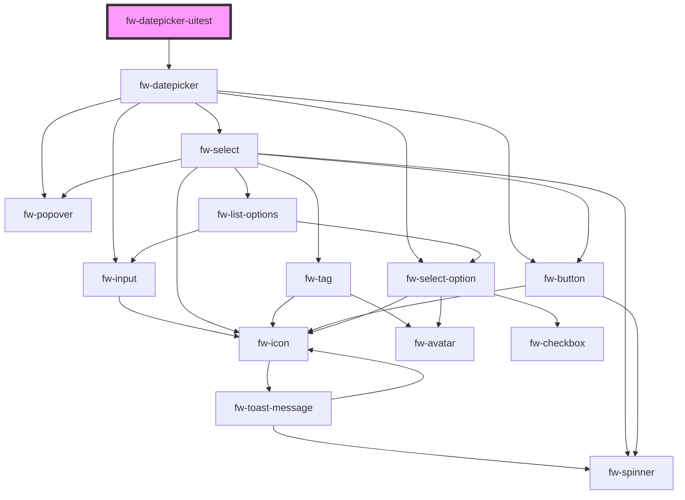

# fw-datepicker-uitest

<!-- Auto Generated Below -->

## Methods

### `testShowSingleDatePicker() => Promise<void>`

#### Returns

Type: `Promise<void>`

## Dependencies

### Depends on

- [fw-datepicker](..)

### Graph

----------------------------------------------

Built with ❤ at Freshworks
