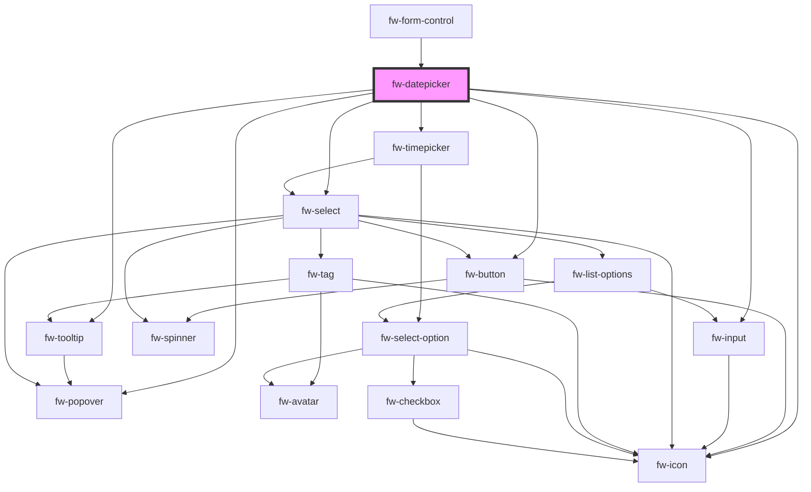

# Datepicker (fw-datepicker)

fw-datepicker displays an input box with a calendar that enables selecting a date or date range. The values preselected in the input box and calendar are based on the fw-datepicker attribute values.

All the date formats passed as attribute's values must be valid [ISO Date format](https://en.wikipedia.org/wiki/ISO_8601).

## Demo

### Single Datepicker with no props passed
The datepicker will have the default display format as MM/dd/yyyy, maxYear set as the current year and minYear as 1970. By default the Cancel and Update buttons will be displayed, which can be removed by passing the props, 'showFooter' as 'false'. On selecting a date and clicking the Update button, the date will be updated in the input field. When Cancel button is clicked after selecting a date, the selected date will not be updated.

```html live
<fw-datepicker
  id="date1"
></fw-datepicker>
```

### with value
The value should be of the ISO format and it will be as MM/dd/yyyy (default format).

```html live
<fw-datepicker
  value="2022-07-31"
></fw-datepicker>
```

### with value and displayFormat

```html live
<fw-datepicker
  value="2022-07-31"
  display-format="dd-MM-yyyy"
></fw-datepicker>
```

### with showFooter set as false
When the showFooter prop is set as false, the Update and Cancel buttons will not be displayed. When user clicks any date, it will be updated in the input box.

```html live
<fw-datepicker
  value="2022-07-31"
  show-footer="false"
></fw-datepicker>
```

### with clearInput
When clearInput prop is passed, the date input textbox will have a cross icon to clear the input value. The icon will appear as soon as the user starts typing.

```html live
<fw-datepicker
  value="2022-07-31"
  clear-input
></fw-datepicker>
```

### with readOnly

```html live
<fw-datepicker
  value="2022-07-31"
  readonly
></fw-datepicker>
```

### with locale

```html live
<fw-datepicker
  locale="fr"
></fw-datepicker>
```

### with maxYear and minYear
maxYear specifies the year upto which the user can select dates and the minYear specifies the year from which the user can select the dates. The year dropdown contains the year values from  minYear to maxYear. The default value of minYear is '1970' and maxYear is currentYear.

```html live
<fw-datepicker
  max-year="2020"
  min-year="2010"
  value="2020-01-04"
></fw-datepicker>
```

### with maxDate and minDate
maxDate specifies the maximal selectable date in the calender and the minDate specifies the minimal selectable date. The minYear and maxYear values will be set as per the minDate and the maxDate when they are specified. The dates that fall beyond the minDate and maxDate will be disabled in the calender.

```html live
<fw-datepicker
  max-date="2020-07-31"
  min-date="2020-01-05"
  value="2020-06-06"
></fw-datepicker>
```

## Prop precedence 
Among the 4 props maxYear, minYear, minDate and maxDate, the prop maxdate has the highest precedence over the other three. The precedence is of the following order, maxdate > minDate > maxYear > minYear

### Example 1
If a datepicker component has the props maxDate and minDate specified and if they contradict with each other, the minDate gets ignored and the maxYear will be set as per the maxDate specified, minYear as the default value '1970' and minDate as undefined.
In the below example, minyear will be reset to '1970', maxYear as '2020', minDate as 'undefined' and maxDate as specified, i.e '2020-07-31'

```html live
<fw-datepicker
  max-date="2020-07-31"
  min-date="2022-08-31"
  value="2020-06-06"
></fw-datepicker>
```

### Example 2
If maxYear and minYear specified and they contradict with each other, the minYear value gets ignored and reset as default value '1970', maxYear will be set as specified. 
In the below example, minyear will be reset to '1970'. The dates that fall beyond the minYear and maxYear will be disabled in the calender.

```html live
<fw-datepicker
  max-year="2020"
  min-year="2022"
  value="2020-06-06"
></fw-datepicker>
```

### Example 3
If maxYear and maxDate specified and if they contradict with each other, the maxYear value gets ignored and reset as per the maxDate. In the below example, the maxYear will be reset as '2022'. The dates that fall beyond the maxDate will be disabled in the calender.

```html live
<fw-datepicker
  max-year="2020"
  max-date="2022-07-21"
  value="2022-04-06"
></fw-datepicker>
```

### Example 4
If minYear and minDate specified and if they contradict with each other, the minYear value gets ignored and reset as per the minDate. In the below example, the minYear will be reset as '2019'. The dates that fall beyond the minDate will be disabled in the calender.

```html live
<fw-datepicker
  min-year="2020"
  min-date="2019-07-21"
  value="2020-06-06"
></fw-datepicker>
```

## Validations

If invalid value/invalid date format is entered  in the date input textbox  or passed to the value props, the datepicker will be highlighted in error state and a error tooltip will be displayed next to the value. The invalid value will not submitted to backend if update button is clicked. 

The below examples depict various invalid value and contradicting props scenarios.

```html live
      <h4 style="margin-bottom:5px; margin-top: 0">Datepicker with min-year, invalid value and clear-input prop set</h4>
      <fw-datepicker
        min-year="2021"
        value="2020-07-31"
        clear-input
      ></fw-datepicker>
      <br />

      <h4 style="margin-bottom:5px; margin-top: 0">Min date '2020-07-31' and min year as '2021'</h4>
      <fw-datepicker
        min-year="2021"
        min-date="2020-07-31"
      ></fw-datepicker>
      <br />

      <h4 style="margin-bottom:5px; margin-top: 0">With Max date as '2021-07-31' and no value explicitly set</h4>
      <fw-datepicker
        id="date1"
        display-format="dd/MM/yyyy"
        max-date="2021-07-31"
      ></fw-datepicker>
      <br/>

      <h4 style="margin-bottom:5px; margin-top: 0">Max date '2022-07-31' and invalid value explicitly set as '2023-07-31"</h4>
      <fw-datepicker
        value="2023-07-31"
        max-date="2022-07-31"
      ></fw-datepicker>
      <br/>

      <h4 style="margin-bottom:5px; margin-top: 0">With Min date as '2020-07-31' and no value explicitly set</h4>
      <fw-datepicker
        min-date="2020-07-31"
      ></fw-datepicker>
      <br />

      <h4 style="margin-bottom:5px; margin-top: 0">Max date '2022-07-31' and Max year as '2023'</h4>
      <fw-datepicker
        max-year="2023"
        max-date="2022-07-31"
      ></fw-datepicker>
      <br />

      <h4 style="margin-bottom:5px; margin-top: 0">Min date '2022-07-31' and invalid value explicitly set as '2020-07-31"</h4>
      <fw-datepicker
        value="2020-07-31"
        min-date="2022-07-31"
      ></fw-datepicker>
      <br />

      <h4 style="margin-bottom:5px; margin-top: 0">Contradicting Max date '2022-07-31' and Min date as '2023-07-31"</h4>
      <fw-datepicker
        min-date="2023-07-31"
        max-date="2022-07-31"
      ></fw-datepicker>
      <br />

      <h4 style="margin-bottom:5px; margin-top: 0">Contradicting max-year '2020' and min-year '2022'</h4>
      <fw-datepicker
        min-year="2022"
        max-year="2020"
      ></fw-datepicker>
      <br />

      <h4 style="margin-bottom:5px; margin-top: 0">Max year as '2022' and invalid value explicitly set as '2023-07-31"</h4>
      <fw-datepicker
        value="2023-07-31"
        max-year="2022"
      ></fw-datepicker>
      <br />

      <h4 style="margin-bottom:5px; margin-top: 0">Min year as '2020' and invalid value explicitly set as '2019-07-31"</h4>
      <fw-datepicker
        value="2019-07-31"
        min-year="2020"
      ></fw-datepicker>
      <br />

      <h4 style="margin-bottom:5px; margin-top: 0">Max year as '2020' Min-year as '2019' and Max-date as '2022-07-31'</h4>
      <fw-datepicker
        min-year="2019"
        max-year="2020"
        max-date="2022-07-31"
      ></fw-datepicker>
      <br />

      <h4 style="margin-bottom:5px; margin-top: 0">Max year as '2020' Min-year as '2019' and Max-date as '2021-07-31' and Min-date as '2022-07-31'</h4>
      <fw-datepicker
        min-year="2019"
        max-year="2020"
        max-date="2021-07-31"
        min-date="2022-07-31"
      ></fw-datepicker>
      <br />

      <h4 style="margin-bottom:5px; margin-top: 0">showErrorOnInvalidDate set to false and Min date '2020-07-31' invalid value set as '2019-07-31' </h4>
      <fw-datepicker
        show-error-on-invalid-date="false"
        value="2019-07-31"
        min-date="2020-07-31"
      ></fw-datepicker>
      <br />
```

### with tooltipErrorText
This  can be used to pass custom error message in the tooltip for error scenarios. On hovering over the alert icon next to teh invalid value, this custom error msg will be displayed.

```html live
<fw-datepicker
  tooltip-error-text="Invalid value provided !"
  max-year="2020"
  value="2022-01-02"
></fw-datepicker>
```

### with showErrorOnInvalidDate
Setting the prop to false will not highlight the datepicker in error state and will not display the error msg in the tooltip. However, the invalid value will not be submitted to backend on clicking 'Update' button.

```html live
<fw-datepicker
  show-error-on-invalid-date="false"
></fw-datepicker>
```

# Date Range picker 
Enables user to select a range of dates. The prop 'mode' has to be set as 'range' for date range picker.

## Demo

```html live
  <fw-datepicker
    mode="range"
  ></fw-datepicker>
```

### with value
The value should contain the start date and end date and should be of ISO format.

```html live
  <fw-datepicker
    mode="range"
    value="2023-07-25 to 2023-07-31"
  ></fw-datepicker>
```

### with fromDate and toDate
Should be of ISO format. When specified, the value will be displayed as per the fromDate and toDate.

```html live
  <fw-datepicker
    mode="range"
    from-date="2022-01-02"
    to-date="2022-01-04"
  ></fw-datepicker>
```

## Input Validations

If invalid value/invalid date format is entered  in the date input textbox  or passed to the value props, the datepicker will be highlighted in error state and a error tooltip will be displayed next to the value. The invalid value will not submitted to backend if update button is clicked. 

The below examples depict various invalid value and contradicting props scenarios.

```html live
<div style="padding:60px">

    <h4 style="margin-bottom:5px; margin-top: 0">Min date '2020-07-31' and min year as '2021'</h4>
    <fw-datepicker
      mode="range"
      min-year="2021"
      min-date="2020-07-31"
      value="2022-08-12 to 2022-08-21"
    ></fw-datepicker>
    <br />

    <h4 style="margin-bottom:5px; margin-top: 0">With Max date as '2021-07-31' and no value explicitly set</h4>
    <fw-datepicker
      mode="range"
      id="date1"
      display-format="dd/MM/yyyy"
      max-date="2021-07-31"
    ></fw-datepicker>
    <br/>

    <h4 style="margin-bottom:5px; margin-top: 0">Max date '2022-07-31' and invalid value explicitly set as '2023-07-30 to 2023-07-31"</h4>
    <fw-datepicker
      mode="range"
      value="2023-07-30 to 2023-07-31"
      max-date="2022-07-31"
    ></fw-datepicker>
    <br/>

    <h4 style="margin-bottom:5px; margin-top: 0">With Min date as '2020-07-31' and no value explicitly set</h4>
    <fw-datepicker
      mode="range"
      min-date="2020-07-31"
    ></fw-datepicker>
    <br />

    <h4 style="margin-bottom:5px; margin-top: 0">Max date '2022-07-31' and Max year as '2023'</h4>
    <fw-datepicker
      mode="range"
      max-year="2023"
      max-date="2022-07-31"
    ></fw-datepicker>
    <br />

    <h4 style="margin-bottom:5px; margin-top: 0">Min date '2022-07-31' and invalid value explicitly set as '2020-07-30 to 2020-07-31"</h4>
    <fw-datepicker
      mode="range"
      value="2020-07-30 to 2020-07-31"
      min-date="2022-07-31"
    ></fw-datepicker>
    <br />

    <h4 style="margin-bottom:5px; margin-top: 0">Contradicting Max date '2022-07-31' and Min date as '2023-07-31"</h4>
    <fw-datepicker
      mode="range"
      min-date="2023-07-31"
      max-date="2022-07-31"
    ></fw-datepicker>
    <br />

    <h4 style="margin-bottom:5px; margin-top: 0">Contradicting max-year '2020' and min-year '2022'</h4>
    <fw-datepicker
      mode="range"
      min-year="2022"
      max-year="2020"
    ></fw-datepicker>
    <br />

    <h4 style="margin-bottom:5px; margin-top: 0">Max year as '2022' and invalid value explicitly set as '2023-07-30 to 2023-07-31"</h4>
    <fw-datepicker
      mode="range"
      value="2023-07-30 to 2023-07-31"
      max-year="2022"
    ></fw-datepicker>
    <br />

    <h4 style="margin-bottom:5px; margin-top: 0">Min year as '2020' and invalid value explicitly set as '2019-07-30 to 2019-07-31"</h4>
    <fw-datepicker
      mode="range"
      value="2019-07-30 to 2019-07-31"
      min-year="2020"
    ></fw-datepicker>
    <br />

    <h4 style="margin-bottom:5px; margin-top: 0">Max year as '2020' Min-year as '2019' and Max-date as '2022-07-31'</h4>
    <fw-datepicker
      mode="range"
      min-year="2019"
      max-year="2020"
      max-date="2022-07-31"
    ></fw-datepicker>
    <br />

    <h4 style="margin-bottom:5px; margin-top: 0">Max year as '2020' Min-year as '2019' and Max-date as '2021-07-31' and Min-date as '2022-07-31'</h4>
    <fw-datepicker
      mode="range"
      min-year="2019"
      max-year="2020"
      max-date="2021-07-31"
      min-date="2022-07-31"
    ></fw-datepicker>
    <br />

    <h4 style="margin-bottom:5px; margin-top: 0">showErrorOnInvalidDate set to false</h4>
    <fw-datepicker
      mode="range"
      show-error-on-invalid-date="false"
    ></fw-datepicker>
    <br />
  </div>

```


## Usage

<code-group>
<code-block title="HTML">
```html
<fw-label value="Single date picker" color="yellow"></fw-label><br/>
<fw-datepicker id="date1" value="2021-12-02" display-format="DD-MM-YYYY"></fw-datepicker>
<fw-label value="A date range picker" color="yellow"></fw-label><br/>
<fw-datepicker
  mode="range"
  from-date="2022-01-02"
  to-date="2022-01-04"
  display-format="dd-MM-yyyy"
></fw-datepicker>
<fw-label value="Date picker with readonly attribute" color="yellow"></fw-label
><br />
<fw-datepicker readonly></fw-datepicker>
<fw-label
  value="Date picker with show-footer and clear-input attributes"
  color="yellow"
></fw-label
><br />
<fw-datepicker show-footer="false" clear-input></fw-datepicker>
<fw-label value="Date picker with locale" color="yellow"></fw-label><br />
<fw-datepicker locale="fr"></fw-datepicker>
<script type="text/javascript">
  // Get the selected date using fwChange listener.
  document
    .querySelector('#date1')
    .addEventListener('fwChange', (e) => console.log(e.detail.value));
</script>
```
</code-block>

<code-block title="React">
```jsx
import React from "react";
import ReactDOM from "react-dom";
import { FwLabel, FwDatepicker } from "@freshworks/crayons/react";
function App() {

var getSelectedDate = function(e) {
console.log(e.detail.value);
}

return (<div>
<label>Single date picker</label><br/>
<FwDatepicker value="2021-12-02" display-format="dd-MM-yyyy" onFwChange={getSelectedDate}></FwDatepicker>
<label>A date range picker</label><br/>
<FwDatepicker mode="range"
  from-date="2022-01-02"
  to-date="2022-01-04"
  display-format="DD-MM-YYYY"></FwDatepicker>
<FwLabel value="Date picker with readonly attribute" color="yellow"></FwLabel><br />
<FwDatepicker readonly></FwDatepicker>
<FwLabel
value="Date picker with show-footer and clear-input attributes"
color="yellow"

> </FwLabel
> <br /> > <FwDatepicker showFooter={false} clearInput></FwDatepicker> > <label value="Date picker with locale" color="yellow"></label><br /> > <FwDatepicker locale="fr"></FwDatepicker>

  </div>)
}
```
</code-block>
</code-group>

## Date time picker

Date time picker is currently supported only on single date picker.

```html live
<fw-label value="Default date time picker" color="yellow"></fw-label><br />
<fw-datepicker show-time-picker></fw-datepicker>
<br />
<fw-label value="Date time picker with custom format" color="yellow"></fw-label
><br />
<fw-datepicker
  show-time-picker
  display-format="dd-MM-yyyy"
  time-format="hh:mm"
></fw-datepicker>
<br />
<fw-label value="Date time picker with locale support" color="yellow"></fw-label
><br />
<fw-datepicker show-time-picker locale="ar"></fw-datepicker>
<br />
<fw-label value="Date time picker with time range" color="yellow"></fw-label
><br />
<fw-datepicker show-time-picker id="time-range" locale="es"></fw-datepicker>
<br />
<fw-label value="Date time picker with value" color="yellow"></fw-label><br />
<fw-datepicker
  show-time-picker
  value="2022-07-22T06:00:00.000Z"
></fw-datepicker>
<br />
<fw-label value="Date time picker with value updated dynamically" color="yellow"></fw-label><br />

<fw-datepicker
    id="dtp"
      show-time-picker
      value="2022-07-22T06:00:00.000Z"
    ></fw-datepicker>
    <script type="application/javascript">
      var a = document.querySelector('#dtp');
      setTimeout(() => {
        a.value = "2022-01-01T12:00:00Z"
      }, 3000)
    </script>
<script type="application/javascript">
  var timePicker = document.getElementById('time-range');
  timePicker.timeProps = {
    minTime: '10:00',
    maxTime: '18:00',
    interval: 60,
  };
  timePicker.addEventListener('fwChange', (e) => {
    console.log(e.detail);
  });
</script>
```

<code-group>
<code-block title="HTML">
```html
 <fw-label value="Default date time picker" color="yellow"></fw-label><br />
    <fw-datepicker show-time-picker></fw-datepicker>
    <br />
    <fw-label
      value="Date time picker with custom format"
      color="yellow"
    ></fw-label
    ><br />
    <fw-datepicker
      show-time-picker
      display-format="dd-MM-yyyy"
      time-format="hh:mm"
    ></fw-datepicker>
    <br />
    <fw-label
      value="Date time picker with locale support"
      color="yellow"
    ></fw-label
    ><br />
    <fw-datepicker show-time-picker locale="ar"></fw-datepicker>
    <br />
    <fw-label value="Date time picker with time range" color="yellow"></fw-label
    ><br />
    <fw-datepicker show-time-picker id="time-range" locale="es"></fw-datepicker>
    <br />
    <fw-label value="Date time picker with value" color="yellow"></fw-label
    ><br />
    <fw-datepicker
      show-time-picker
      value="2022-07-22T06:00:00.000Z"
    ></fw-datepicker>
    <br />
    <script type="application/javascript">
      var timePicker = document.getElementById('time-range');
      timePicker.timeProps = {
        minTime: '10:00',
        maxTime: '18:00',
        interval: 60,
      };
      timePicker.addEventListener('fwChange', (e) => {
        console.log(e.detail);
      });
    </script>
```
</code-block>
</code-block>
</code-group>

<!-- Auto Generated Below -->


## Properties

| Property                 | Attribute                    | Description                                                                                                                                                    | Type                               | Default                    |
| ------------------------ | ---------------------------- | -------------------------------------------------------------------------------------------------------------------------------------------------------------- | ---------------------------------- | -------------------------- |
| `cancelText`             | `cancel-text`                |                                                                                                                                                                | `string`                           | `''`                       |
| `clearInput`             | `clear-input`                | Displays a clear icon in the text box. Clicking the icon clears the value. Default `false`                                                                     | `boolean`                          | `false`                    |
| `debounceTimer`          | `debounce-timer`             | Debounce timer for date input.                                                                                                                                 | `number`                           | `800`                      |
| `disabled`               | `disabled`                   | Make the datepicker box as disabled. Default `false`                                                                                                           | `boolean`                          | `false`                    |
| `displayFormat`          | `display-format`             | Format in which the date values selected in the calendar are populated in the input box. Defaults to the locale specific display format.                       | `string`                           | `undefined`                |
| `errorText`              | `error-text`                 | Error text displayed below the text box.                                                                                                                       | `string`                           | `''`                       |
| `fromDate`               | `from-date`                  | Starting date of the date range that is preselected in the calendar, if mode is range. Must be a date later than the min-date value and valid ISO date format. | `string`                           | `undefined`                |
| `fullWidth`              | `full-width`                 | To make the datepicker occupy full width of the container. Default value is false.                                                                             | `boolean`                          | `false`                    |
| `hintText`               | `hint-text`                  | Hint text displayed below the text box.                                                                                                                        | `string`                           | `''`                       |
| `hoistTooltip`           | `hoist-tooltip`              | Option to prevent the tooltip from being clipped when the component is placed inside a container with `overflow: auto\|hidden\|scroll`.                        | `boolean`                          | `true`                     |
| `label`                  | `label`                      | Label displayed on the interface, for the component.                                                                                                           | `string`                           | `''`                       |
| `locale`                 | `locale`                     | Locale for which datepicker needs to be shown. Defaults to browser's current locale.                                                                           | `string`                           | `undefined`                |
| `maxDate`                | `max-date`                   | Latest date a user can select in the calendar, if mode is range. Must be a valid ISO date format if set.                                                       | `string`                           | `undefined`                |
| `maxYear`                | `max-year`                   | Maximum year that needs to be displayed in the year dropdown.                                                                                                  | `number`                           | `new Date().getFullYear()` |
| `minDate`                | `min-date`                   | Earliest date a user can select in the calendar, if mode is range. Must be a valid ISO date format if set.                                                     | `string`                           | `undefined`                |
| `minYear`                | `min-year`                   | Minimum year that needs to be displayed in the year dropdown.                                                                                                  | `number`                           | `1970`                     |
| `mode`                   | `mode`                       | Type of date selection enabled for the calendar. If the value is range, a user can select a date range in the calendar.                                        | `"range" \| "single date"`         | `'single date'`            |
| `name`                   | `name`                       | Name of the component, saved as part of form data.                                                                                                             | `string`                           | `''`                       |
| `placeholder`            | `placeholder`                | Text displayed in the input box before a user selects a date or date range.                                                                                    | `string`                           | `undefined`                |
| `readonly`               | `readonly`                   | Make the input box as readonly. Default `false`                                                                                                                | `boolean`                          | `false`                    |
| `required`               | `required`                   | Specifies the input box as a mandatory field and displays an asterisk next to the label. If the attribute’s value is undefined, the value is set to false.     | `boolean`                          | `false`                    |
| `showErrorOnInvalidDate` | `show-error-on-invalid-date` | Displays alert icon and tooltip when user inputs an invalid date in the textbox. Default value is true.                                                        | `boolean`                          | `true`                     |
| `showFooter`             | `show-footer`                | Indicates if footer needs to be shown. Default `true`.                                                                                                         | `boolean`                          | `true`                     |
| `showTimePicker`         | `show-time-picker`           | Whether the time-picker should be shown in the date-picker. Supports single date picker only.                                                                  | `boolean`                          | `false`                    |
| `state`                  | `state`                      | Theme based on which the input of the datepicker is styled.                                                                                                    | `"error" \| "normal" \| "warning"` | `'normal'`                 |
| `timeFormat`             | `time-format`                | The format of time picker .                                                                                                                                    | `string`                           | `undefined`                |
| `timeProps`              | --                           | The props for the time picker. Refer the fw-timepicker for valid format.                                                                                       | `{}`                               | `{}`                       |
| `toDate`                 | `to-date`                    | Ending date of the date range that is preselected in the calendar, if mode is range. Must be a date earlier than the max-date value and valid ISO date format. | `string`                           | `undefined`                |
| `tooltipErrorText`       | `tooltip-error-text`         | Error text displayed on the tooltip for invalid date inputs.                                                                                                   | `any`                              | `undefined`                |
| `updateText`             | `update-text`                |                                                                                                                                                                | `string`                           | `''`                       |
| `value`                  | `value`                      | Date that is preselected in the calendar, if mode is single date or undefined. If set this must be valid ISO date format.                                      | `string`                           | `undefined`                |
| `warningText`            | `warning-text`               | Warning text displayed below the text box.                                                                                                                     | `string`                           | `''`                       |


## Events

| Event         | Description                                   | Type               |
| ------------- | --------------------------------------------- | ------------------ |
| `fwBlur`      | Triggered when the input box loses focus.     | `CustomEvent<any>` |
| `fwChange`    | Triggered when the update button clicked      | `CustomEvent<any>` |
| `fwDateInput` | Triggered when text is entered in  input box. | `CustomEvent<any>` |


## Methods

### `clearValue() => Promise<void>`

Clears the input value and unselects selected date.

#### Returns

Type: `Promise<void>`


### `getValue() => Promise<string | { fromDate: string; toDate: string; }>`

Returns the date value in ISO format.

#### Returns

Type: `Promise<string | { fromDate: string; toDate: string; }>`


### `setFocus() => Promise<void>`

Sets focus on a specific `fw-datepicker`. Use this method instead of the global `input.focus()`.

#### Returns

Type: `Promise<void>`


## CSS Custom Properties

| Name                 | Description                |
| -------------------- | -------------------------- |
| `--fw-error-color`   | Color of the error text.   |
| `--fw-hint-color`    | Color of the hint text.    |
| `--fw-label-color`   | Color of the label.        |
| `--fw-warning-color` | Color of the warning text. |


## Dependencies

### Used by

 - [fw-form-control](../form-control)

### Depends on

- [fw-tooltip](../tooltip)
- [fw-icon](../icon)
- [fw-button](../button)
- [fw-input](../input)
- [fw-timepicker](../timepicker)
- [fw-popover](../popover)
- [fw-select](../select)

### Graph


----------------------------------------------

Built with ❤ at Freshworks
