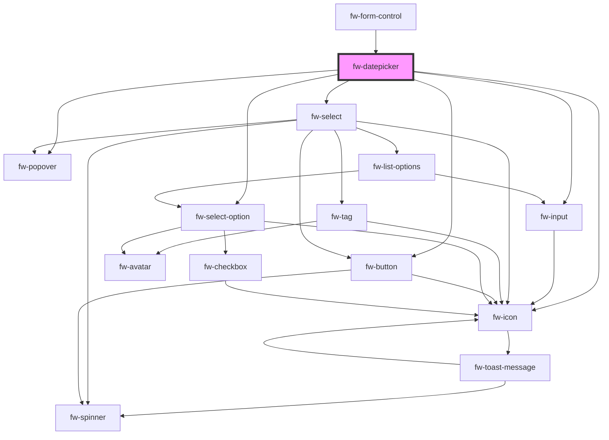

# Datepicker (fw-datepicker)

fw-datepicker displays an input box with a calendar that enables selecting a date or date range. The values preselected in the input box and calendar are based on the fw-datepicker attribute values.

All the date formats passed as attribute's values must be valid [ISO Date format](https://en.wikipedia.org/wiki/ISO_8601).

## Demo

```html live
<fw-label value="Single date picker" color="yellow"></fw-label><br />
<fw-datepicker value="2021-12-02" display-format="dd-MM-yyyy"></fw-datepicker>
<fw-label value="A date range picker" color="yellow"></fw-label><br />
<fw-datepicker
  mode="range"
  from-date="2022-01-02"
  to-date="2022-01-04"
  display-format="dd-MM-yyyy"
></fw-datepicker>
<fw-label value="Date picker with readonly attribute" color="yellow"></fw-label
><br />
<fw-datepicker readonly></fw-datepicker>
<fw-label value="Date picker with locale" color="yellow"></fw-label><br />
<fw-datepicker locale="fr"></fw-datepicker>
```

## Usage

<code-group>
<code-block title="HTML">
```html
<fw-label value="Single date picker" color="yellow"></fw-label><br/>
<fw-datepicker value="2021-12-02" display-format="DD-MM-YYYY"></fw-datepicker>
<fw-label value="A date range picker" color="yellow"></fw-label><br/>
<fw-datepicker
  mode="range"
  from-date="2022-01-02"
  to-date="2022-01-04"
  display-format="DD-MM-YYYY"
></fw-datepicker>
<fw-label value="Date picker with readonly attribute" color="yellow"></fw-label
><br />
<fw-datepicker readonly></fw-datepicker>
<fw-label value="Date picker with locale" color="yellow"></fw-label><br />
<fw-datepicker locale="fr"></fw-datepicker>
```
</code-block>

<code-block title="React">
```jsx
import React from "react";
import ReactDOM from "react-dom";
import { FwDatepicker } from "@freshworks/crayons/react";
function App() {
  return (<div>
    <label>Single date picker</label><br/>
    <FwDatepicker value="2021-12-02" display-format="DD-MM-YYYY"></FwDatepicker>
    <label>A date range picker</label><br/>
    <FwDatepicker mode="range"
  from-date="2022-01-02"
  to-date="2022-01-04"
  display-format="DD-MM-YYYY"></FwDatepicker>
  <label value="Date picker with readonly attribute" color="yellow"></label><br />
  <FwDatepicker readonly></FwDatepicker>
  <label value="Date picker with locale" color="yellow"></label><br />
  <FwDatepicker locale="fr"></FwDatepicker>
  </div>)
}
```
</code-block>
</code-group>

<!-- Auto Generated Below -->


## Properties

| Property        | Attribute        | Description                                                                                                                                                    | Type                               | Default                    |
| --------------- | ---------------- | -------------------------------------------------------------------------------------------------------------------------------------------------------------- | ---------------------------------- | -------------------------- |
| `cancelText`    | `cancel-text`    |                                                                                                                                                                | `string`                           | `''`                       |
| `displayFormat` | `display-format` | Format in which the date values selected in the calendar are populated in the input box. Defaults to the locale specific display format.                       | `string`                           | `undefined`                |
| `errorText`     | `error-text`     | Error text displayed below the text box.                                                                                                                       | `string`                           | `''`                       |
| `fromDate`      | `from-date`      | Starting date of the date range that is preselected in the calendar, if mode is range. Must be a date later than the min-date value and valid ISO date format. | `string`                           | `undefined`                |
| `hintText`      | `hint-text`      | Hint text displayed below the text box.                                                                                                                        | `string`                           | `''`                       |
| `label`         | `label`          | Label displayed on the interface, for the component.                                                                                                           | `string`                           | `''`                       |
| `locale`        | `locale`         | Locale for which datepicker needs to be shown. Defaults to browser's current locale.                                                                           | `string`                           | `undefined`                |
| `maxDate`       | `max-date`       | Latest date a user can select in the calendar, if mode is range. Must be a valid ISO date format if set.                                                       | `string`                           | `undefined`                |
| `maxYear`       | `max-year`       | Maximum year that needs to be displayed in the year dropdown.                                                                                                  | `number`                           | `new Date().getFullYear()` |
| `minDate`       | `min-date`       | Earliest date a user can select in the calendar, if mode is range. Must be a valid ISO date format if set.                                                     | `string`                           | `undefined`                |
| `minYear`       | `min-year`       | Minimum year that needs to be displayed in the year dropdown.                                                                                                  | `number`                           | `1970`                     |
| `mode`          | `mode`           | Type of date selection enabled for the calendar. If the value is range, a user can select a date range in the calendar.                                        | `"range" \| "single date"`         | `'single date'`            |
| `name`          | `name`           | Name of the component, saved as part of form data.                                                                                                             | `string`                           | `''`                       |
| `placeholder`   | `placeholder`    | Text displayed in the input box before a user selects a date or date range.                                                                                    | `string`                           | `undefined`                |
| `readonly`      | `readonly`       | Make the input box as readonly. Default `false`                                                                                                                | `boolean`                          | `false`                    |
| `required`      | `required`       | Specifies the input box as a mandatory field and displays an asterisk next to the label. If the attribute’s value is undefined, the value is set to false.     | `boolean`                          | `false`                    |
| `state`         | `state`          | Theme based on which the input of the datepicker is styled.                                                                                                    | `"error" \| "normal" \| "warning"` | `'normal'`                 |
| `toDate`        | `to-date`        | Ending date of the date range that is preselected in the calendar, if mode is range. Must be a date earlier than the max-date value and valid ISO date format. | `string`                           | `undefined`                |
| `updateText`    | `update-text`    |                                                                                                                                                                | `string`                           | `''`                       |
| `value`         | `value`          | Date that is preselected in the calendar, if mode is single date or undefined. If set this must be valid ISO date format.                                      | `string`                           | `undefined`                |
| `warningText`   | `warning-text`   | Warning text displayed below the text box.                                                                                                                     | `string`                           | `''`                       |


## Events

| Event      | Description                               | Type               |
| ---------- | ----------------------------------------- | ------------------ |
| `fwBlur`   | Triggered when the input box loses focus. | `CustomEvent<any>` |
| `fwChange` | Triggered when the update button clicked  | `CustomEvent<any>` |


## Methods

### `getValue() => Promise<string | { fromDate: string; toDate: string; }>`

Returns the date value in ISO format.

#### Returns

Type: `Promise<string | { fromDate: string; toDate: string; }>`


### `setFocus() => Promise<void>`

Sets focus on a specific `fw-datepicker`. Use this method instead of the global `input.focus()`.

#### Returns

Type: `Promise<void>`


## CSS Custom Properties

| Name                 | Description                |
| -------------------- | -------------------------- |
| `--fw-error-color`   | Color of the error text.   |
| `--fw-hint-color`    | Color of the hint text.    |
| `--fw-label-color`   | Color of the label.        |
| `--fw-warning-color` | Color of the warning text. |


## Dependencies

### Used by

 - [fw-form-control](../form-control)

### Depends on

- [fw-popover](../popover)
- [fw-input](../input)
- [fw-icon](../icon)
- [fw-select](../select)
- [fw-select-option](../select-option)
- [fw-button](../button)

### Graph


----------------------------------------------

Built with ❤ at Freshworks
