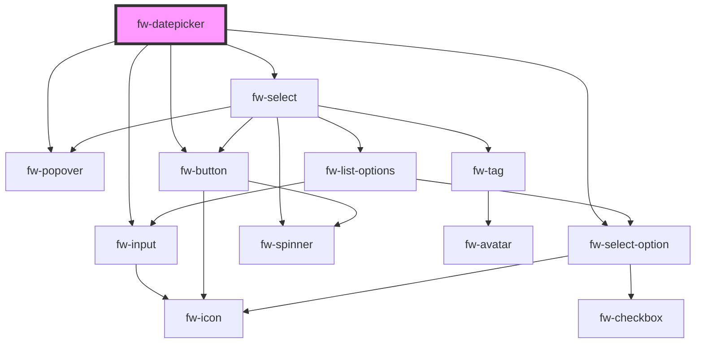

# Datepicker (fw-datepicker)
fw-datepicker displays an input box with a calendar that enables selecting a date or date range. The values preselected in the input box and calendar are based on the fw-datepicker attribute values.

## Demo

``` html live
<fw-label value="Single date picker" color="yellow"></fw-label><br/>
<fw-datepicker value="22-05-2020" date-format="DD-MM-YYYY"></fw-datepicker>
<fw-label value="A date range picker" color="yellow"></fw-label><br/>
<fw-datepicker mode="range" min-date="10-05-2020" max-date="10-07-2020" from-date="12-05-2020" to-date="14-05-2020"></fw-datepicker>
```


## Usage

<code-group>
<code-block title="HTML">
```html
<fw-label value="Single date picker" color="yellow"></fw-label><br/>
<fw-datepicker value="22-05-2020" date-format="DD-MM-YYYY"></fw-datepicker>
<fw-label value="A date range picker" color="yellow"></fw-label><br/>
<fw-datepicker mode="range" min-date="10-05-2020" max-date="10-07-2020" from-date="12-05-2020" to-date="14-05-2020"></fw-datepicker>
```
</code-block>


<code-block title="React">
```jsx
import React from "react";
import ReactDOM from "react-dom";
import { FwDatepicker } from "@freshworks/crayons/react";
function App() {
  return (<div>
    <label>Single date picker</label><br/>
    <FwDatepicker value="22-05-2020" dateFormat="DD-MM-YYYY"></FwDatepicker>
    <label>A date range picker</label><br/>
    <FwDatepicker mode="range" minDate="10-05-2020" maxDate="10-07-2020" fromDate="12-05-2020" toDate="14-05-2020"></FwDatepicker>
  </div>)
}
```
</code-block>
</code-group>


<!-- Auto Generated Below -->


## Properties

| Property      | Attribute     | Description                                                                                                                          | Type                       | Default         |
| ------------- | ------------- | ------------------------------------------------------------------------------------------------------------------------------------ | -------------------------- | --------------- |
| `dateFormat`  | `date-format` | Format in which the date values selected in the calendar are populated in the input box and saved when the form data is saved.       | `string`                   | `'DD-MM-YYYY'`  |
| `fromDate`    | `from-date`   | Starting date of the date range that is preselected in the calendar, if mode is range. Must be a date later than the min-date value. | `string`                   | `undefined`     |
| `maxDate`     | `max-date`    | Latest date a user can select in the calendar, if mode is range.                                                                     | `string`                   | `undefined`     |
| `minDate`     | `min-date`    | Earliest date a user can select in the calendar, if mode is range.                                                                   | `string`                   | `undefined`     |
| `mode`        | `mode`        | Type of date selection enabled for the calendar. If the value is range, a user can select a date range in the calendar.              | `"range" \| "single date"` | `'single date'` |
| `name`        | `name`        | Name of the component, saved as part of form data.                                                                                   | `string`                   | `''`            |
| `placeholder` | `placeholder` | Text displayed in the input box before a user selects a date or date range.                                                          | `string`                   | `undefined`     |
| `toDate`      | `to-date`     | Ending date of the date range that is preselected in the calendar, if mode is range. Must be a date earlier than the max-date value. | `string`                   | `undefined`     |
| `value`       | `value`       | Date that is preselected in the calendar, if mode is single date or undefined.                                                       | `string`                   | `undefined`     |


## Events

| Event      | Description                              | Type               |
| ---------- | ---------------------------------------- | ------------------ |
| `fwChange` | Triggered when the update button clicked | `CustomEvent<any>` |


## Dependencies

### Depends on

- [fw-popover](../popover)
- [fw-input](../input)
- [fw-select](../select)
- [fw-select-option](../select-option)
- [fw-button](../button)

### Graph


----------------------------------------------

Built with ❤ at Freshworks
