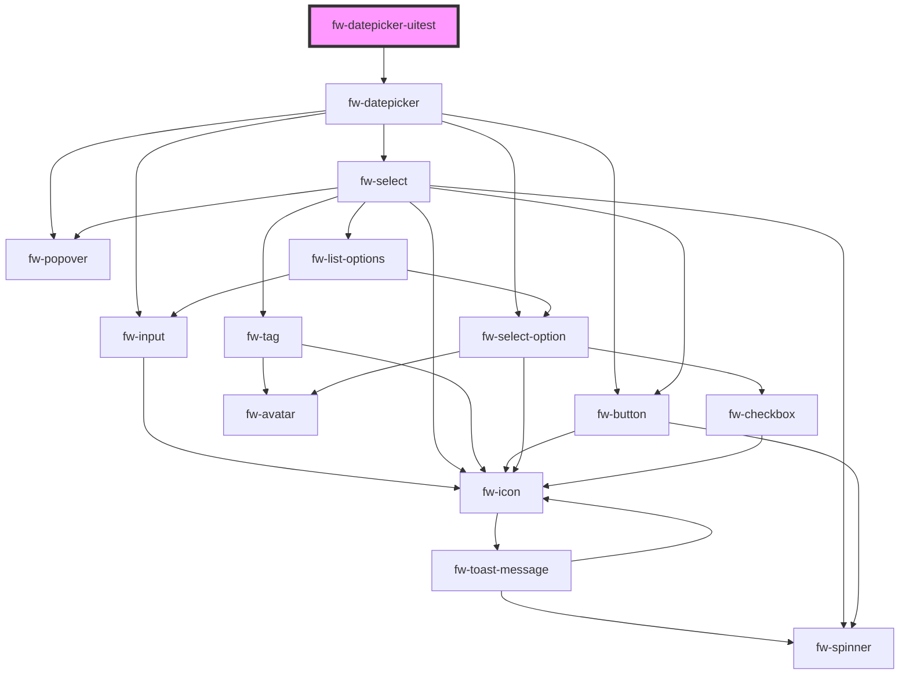

# Datepicker (fw-datepicker)

fw-datepicker displays an input box with a calendar that enables selecting a date or date range. The values preselected in the input box and calendar are based on the fw-datepicker attribute values.

All the date formats passed as attribute's values must be valid [ISO Date format](https://en.wikipedia.org/wiki/ISO_8601).

## Demo

```html live
<fw-label value="Single date picker" color="yellow"></fw-label><br />
<fw-datepicker value="2021-12-02" display-format="DD-MM-YYYY"></fw-datepicker>
<fw-datepicker-uitest ></fw-datepicker-uitest>
<fw-label value="A date range picker" color="yellow"></fw-label><br />
<fw-datepicker
  mode="range"
  from-date="2022-01-02"
  to-date="2022-01-04"
  display-format="DD-MM-YYYY"
></fw-datepicker>
```

## Usage

<code-group>
<code-block title="HTML">
```html
<fw-label value="Single date picker" color="yellow"></fw-label><br/>
<fw-datepicker value="2021-12-02" display-format="DD-MM-YYYY"></fw-datepicker>
<fw-label value="A date range picker" color="yellow"></fw-label><br/>
<fw-datepicker
  mode="range"
  from-date="2022-01-02"
  to-date="2022-01-04"
  display-format="DD-MM-YYYY"
></fw-datepicker>
```
</code-block>

<code-block title="React">
```jsx
import React from "react";
import ReactDOM from "react-dom";
import { FwDatepicker } from "@freshworks/crayons/react";
function App() {
  return (<div>
    <label>Single date picker</label><br/>
    <FwDatepicker value="2021-12-02" display-format="DD-MM-YYYY"></FwDatepicker>
    <label>A date range picker</label><br/>
    <FwDatepicker mode="range"
  from-date="2022-01-02"
  to-date="2022-01-04"
  display-format="DD-MM-YYYY"></FwDatepicker>
  </div>)
}
```
</code-block>
</code-group>

<!-- Auto Generated Below -->


## Methods

### `testShowSingleDatePicker() => Promise<void>`


#### Returns

Type: `Promise<void>`


## Dependencies

### Depends on

- [fw-datepicker](.)

### Graph


----------------------------------------------

Built with ❤ at Freshworks
