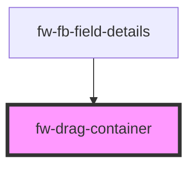

# fw-drag-container

<!-- Auto Generated Below -->

## Properties

| Property           | Attribute           | Description                                                                                                                   | Type      | Default |
| ------------------ | ------------------- | ----------------------------------------------------------------------------------------------------------------------------- | --------- | ------- |
| `acceptFrom`       | `accept-from`       | Id of the fw-sortable element from which draggable content can be accepted. Add comma separated id's for multiple containers. | `string`  | `''`    |
| `addOnDrop`        | `add-on-drop`       | Whether the drag element should be added to the container on drop. If set to false, the placeholder will be retained.         | `boolean` | `true`  |
| `copy`             | `copy`              | Whether the drag element should be moved or copied.                                                                           | `boolean` | `true`  |
| `placeholderClass` | `placeholder-class` | The class name for the drag/drop placeholder. Add space separated class names for multiple classes                            | `string`  | `''`    |
| `sortable`         | `sortable`          | Whether the list should be sortable.                                                                                          | `boolean` | `true`  |

## Events

| Event    | Description                                                       | Type                |
| -------- | ----------------------------------------------------------------- | ------------------- |
| `fwDrop` | Triggered when an draggable item is dropped inside the container. | `CustomEvent<void>` |

## Dependencies

### Used by

 - [fw-fb-field-details](../form-builder/fb-field)

### Graph

----------------------------------------------

Built with ❤ at Freshworks
