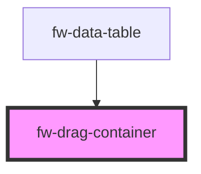

# Drag Container (fw-drag-container)

fw-drag-container can be used to reorder a list items via drag and drop or move/copy items between two fw-drag-container elements.

## Demo

fw-drag-container is a custom component with an open shadow that acts as a wrapper to the list items having `draggable` attribute as true, that can be dragged and dropped with in the wrapper to change their order.

```html live
<template>
  <div>
    <fw-label value="Sort items within a container"></fw-label>
    <fw-drag-container class="drag-container" id="defaultSort">
      <fw-drag-item>Item 1</fw-drag-item>
      <fw-drag-item>Item 2</fw-drag-item>
      <fw-drag-item>Item 3</fw-drag-item>
      <fw-drag-item
        >Item 4 <fw-icon slot="suffix" name="bulb"></fw-icon>
      </fw-drag-item>
    </fw-drag-container>
    <br />
    <fw-label value="Pinned items within a container"></fw-label>
    <fw-drag-container class="drag-container" id="pinnedSort">
      <fw-drag-item pinned="top">Item 1</fw-drag-item>
      <fw-drag-item>Item 2</fw-drag-item>
      <fw-drag-item>Item 3</fw-drag-item>
      <fw-drag-item>Item 4</fw-drag-item>
      <fw-drag-item pinned="bottom">Item 5</fw-drag-item>
    </fw-drag-container>
  </div>
</template>
<style>
  .drag-container {
    width: 300px;
    padding: 20px;
    border: 1px solid black;
  }
  fw-drag-item {
    margin-bottom: 8px;
  }
</style>
```

Demo for dragging items from one container to another container.

```html live
<template>
  <div>
    <fw-label value="Copying items from on container to another"></fw-label>
    <fw-label
      value="Item 1-5 are allows to be sorted with Item 6-9 but not the other way around."
    ></fw-label>
    <div class="container">
      <fw-drag-container class="drag-container" sortable="false" id="from">
        <fw-drag-item>Item 1</fw-drag-item>
        <fw-drag-item>Item 2</fw-drag-item>
        <fw-drag-item>Item 3</fw-drag-item>
        <fw-drag-item>Item 4</fw-drag-item>
        <fw-drag-item>Item 5</fw-drag-item>
      </fw-drag-container>

      <fw-drag-container
        class="drag-container"
        id="to"
        accept-from="from"
        placeholder-class="placeholder"
      >
        <fw-drag-item>Item 6</fw-drag-item>
        <fw-drag-item>Item 7</fw-drag-item>
        <fw-drag-item>Item 8</fw-drag-item>
        <fw-drag-item>Item 9</fw-drag-item>
      </fw-drag-container>
    </div>
    <fw-label value="Moving items from on container to another"></fw-label>
    <fw-label
      value="Item 1-5 are allows to be sorted with Item 6-9 but not the other way around."
    ></fw-label>
    <div class="container">
      <fw-drag-container class="drag-container" sortable="false" id="moveFrom">
        <fw-drag-item>Item 1</fw-drag-item>
        <fw-drag-item>Item 2</fw-drag-item>
        <fw-drag-item>Item 3</fw-drag-item>
        <fw-drag-item>Item 4</fw-drag-item>
        <fw-drag-item>Item 5</fw-drag-item>
      </fw-drag-container>

      <fw-drag-container
        class="drag-container"
        id="moveTo"
        accept-from="moveFrom"
        placeholder-class="placeholder"
        copy="false"
      >
        <fw-drag-item>Item 6</fw-drag-item>
        <fw-drag-item>Item 7</fw-drag-item>
        <fw-drag-item>Item 8</fw-drag-item>
        <fw-drag-item>Item 9</fw-drag-item>
      </fw-drag-container>
    </div>
  </div>
</template>
<style>
  .container {
    width: 400px;
    padding: 20px;
    border: 1px solid black;
    display: flex;
    justify-content: space-between;
  }
  .drag-container {
    width: 150px;
    padding: 20px;
    border: 1px solid black;
  }
  fw-drag-item {
    margin-bottom: 8px;
  }
  .placeholder {
    width: 150px;
    background-color: blueviolet;
    height: 5px;
  }
</style>
```

`fwDrop` event will be emitted during a successful drop event, and can be used to detect the dropped item.

```html live
<fw-drag-container id="drop">
  <fw-drag-item>Item 1</fw-drag-item>
  <fw-drag-item>Item 2</fw-drag-item>
  <fw-drag-item>Item 3</fw-drag-item>
  <fw-drag-item>Item 4</fw-drag-item>
  <fw-drag-item>Item 5</fw-drag-item>
</fw-drag-container>
<script type="application/javascript">
  var drop = document.getElementById('drop');
  drop.addEventListener('fwDrop', (e) => {
    console.log(e.detail);
  });
</script>
```

```javascript
var drop = document.getElementById('drop');
drop.addEventListener('fwDrop', (e) => {
  console.log(e.detail);
});
```

<!-- Auto Generated Below -->


## Properties

| Property           | Attribute           | Description                                                                                                                   | Type      | Default |
| ------------------ | ------------------- | ----------------------------------------------------------------------------------------------------------------------------- | --------- | ------- |
| `acceptFrom`       | `accept-from`       | Id of the fw-sortable element from which draggable content can be accepted. Add comma separated id's for multiple containers. | `string`  | `''`    |
| `addOnDrop`        | `add-on-drop`       | Whether the drag element should be added to the container on drop. If set to false, the placeholder will be retained.         | `boolean` | `true`  |
| `copy`             | `copy`              | Whether the drag element should be moved or copied.                                                                           | `boolean` | `true`  |
| `placeholderClass` | `placeholder-class` | The class name for the drag/drop placeholder. Add space separated class names for multiple classes                            | `string`  | `''`    |
| `sortable`         | `sortable`          | Whether the list should be sortable.                                                                                          | `boolean` | `true`  |


## Events

| Event    | Description                                                       | Type                |
| -------- | ----------------------------------------------------------------- | ------------------- |
| `fwDrop` | Triggered when an draggable item is dropped inside the container. | `CustomEvent<void>` |


## Dependencies

### Used by

 - [fw-data-table](../data-table)

### Graph


----------------------------------------------

Built with ❤ at Freshworks
