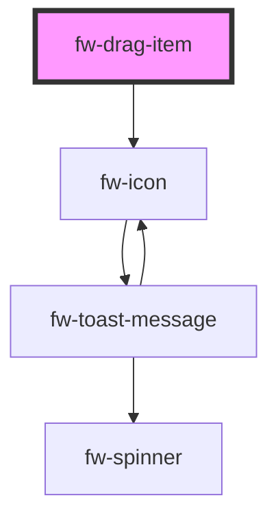

# Drag Item (fw-drag-item)

fw-drag-item can used as a row component inside fw-drag-container.

## Demo

fw-drag-item can be dragged via clicking and holding the mouse on the drag-icon.

```html live
<fw-drag-item>
  <span>Drag Me via the drag icon</span>
</fw-drag-item>
```

<!-- Auto Generated Below -->


## Properties

| Property       | Attribute        | Description                                                                           | Type                | Default     |
| -------------- | ---------------- | ------------------------------------------------------------------------------------- | ------------------- | ----------- |
| `disabled`     | `disabled`       | Whether the drag is disabled or not.                                                  | `boolean`           | `false`     |
| `pinned`       | `pinned`         | Pinned position of the drag item, other drag item cannot be placed above or below it. | `"bottom" \| "top"` | `undefined` |
| `showDragIcon` | `show-drag-icon` | Whether the drag icon should be visible.                                              | `boolean`           | `true`      |


## Dependencies

### Depends on

- [fw-icon](../icon)

### Graph


----------------------------------------------

Built with ❤ at Freshworks
