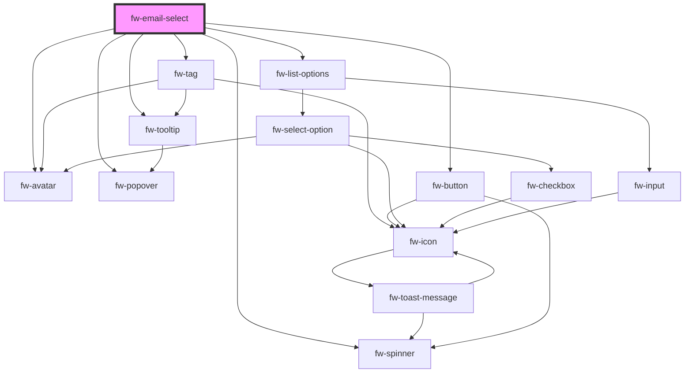

# fw-email-select

<!-- Auto Generated Below -->

## Properties

| Property           | Attribute            | Description                                                                                                                                                                                                                     | Type      | Default            |
| ------------------ | -------------------- | ------------------------------------------------------------------------------------------------------------------------------------------------------------------------------------------------------------------------------- | --------- | ------------------ |
| `allowDeselect`    | `allow-deselect`     | Whether clicking on the already selected option disables it.                                                                                                                                                                    | `boolean` | `false`            |
| `debounceTimer`    | `debounce-timer`     | Debounce timer for the search promise function.                                                                                                                                                                                 | `number`  | `300`              |
| `disabled`         | `disabled`           | Disables the component on the interface. If the attribute’s value is undefined, the value is set to false.                                                                                                                      | `boolean` | `false`            |
| `max`              | `max`                | Works with `multiple` enabled. Configures the maximum number of options that can be selected with a multi-select component.                                                                                                     | `number`  | `Number.MAX_VALUE` |
| `maxEmailsAllowed` | `max-emails-allowed` | Maximum number of emails allowed.                                                                                                                                                                                               | `number`  | `50`               |
| `multiple`         | `multiple`           | Enables selection of multiple options. If the attribute’s value is undefined, the value is set to false.                                                                                                                        | `boolean` | `false`            |
| `name`             | `name`               | Name of the component, saved as part of form data.                                                                                                                                                                              | `string`  | `''`               |
| `options`          | `options`            | The data for the select component, the options will be of type array of fw-select-options.                                                                                                                                      | `any`     | `undefined`        |
| `placeholder`      | `placeholder`        | Text displayed in the list box before an option is selected.                                                                                                                                                                    | `string`  | `undefined`        |
| `readonly`         | `readonly`           | If true, the user cannot modify the default value selected. If the attribute's value is undefined, the value is set to true.                                                                                                    | `boolean` | `false`            |
| `search`           | `search`             | Filter function which takes in filterText and dataSource and return a Promise. Where filter text is the text to filter the value in dataSource array. The returned promise should contain the array of options to be displayed. | `any`     | `undefined`        |
| `selectedOptions`  | --                   | Array of the options that is displayed as the default selection, in the list box. Must be a valid option corresponding to the fw-select-option components used in Select.                                                       | `any[]`   | `[]`               |
| `value`            | `value`              | Value of the option that is displayed as the default selection, in the list box. Must be a valid value corresponding to the fw-select-option components used in Select.                                                         | `any`     | `undefined`        |

## Events

| Event      | Description                                                                 | Type               |
| ---------- | --------------------------------------------------------------------------- | ------------------ |
| `fwBlur`   | Triggered when the list box loses focus.                                    | `CustomEvent<any>` |
| `fwChange` | Triggered when a value is selected or deselected from the list box options. | `CustomEvent<any>` |
| `fwFocus`  | Triggered when the list box comes into focus.                               | `CustomEvent<any>` |

## Methods

### `getSelectedItem() => Promise<any>`

#### Returns

Type: `Promise<any>`

### `setFocus() => Promise<any>`

#### Returns

Type: `Promise<any>`

### `setSelectedOptions(options: any[]) => Promise<any>`

#### Returns

Type: `Promise<any>`

### `setSelectedValues(values: string | string[]) => Promise<any>`

#### Returns

Type: `Promise<any>`

## Dependencies

### Depends on

- [fw-tag](../tag)
- [fw-avatar](../avatar)
- [fw-tooltip](../tooltip)
- [fw-popover](../popover)
- [fw-button](../button)
- [fw-spinner](../spinner)
- [fw-list-options](../options-list)

### Graph

----------------------------------------------

Built with ❤ at Freshworks
