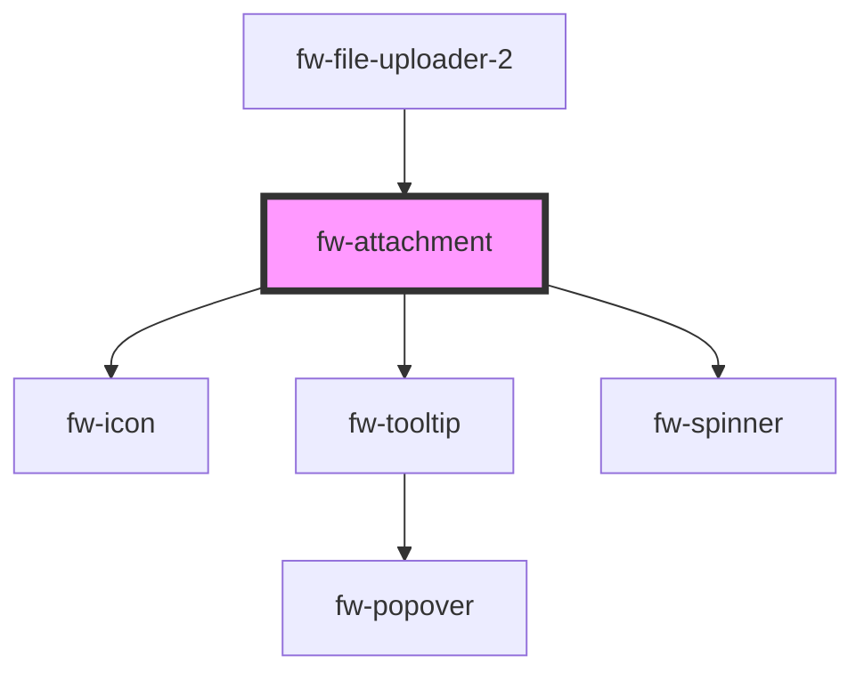

# fw-attachment

<!-- Auto Generated Below -->

## Properties

| Property              | Attribute               | Description                                                                            | Type                                           | Default     |
| --------------------- | ----------------------- | -------------------------------------------------------------------------------------- | ---------------------------------------------- | ----------- |
| `addedToLibrary`      | `added-to-library`      | Boolean value to set if the attachment is added in library or not                      | `boolean`                                      | `false`     |
| `enableLibraryAdding` | `enable-library-adding` | To enable library adding related feature                                               | `boolean`                                      | `false`     |
| `errorMessage`        | `error-message`         | Error message text to display below the attachment                                     | `string`                                       | `''`        |
| `index`               | `index`                 | Index order of the attachment file starting from 0                                     | `number`                                       | `-1`        |
| `isPrivateMode`       | `is-private-mode`       | Set private mode for different styles                                                  | `boolean`                                      | `false`     |
| `label`               | `label`                 | Name of the attachment file to be displayed (including the file extension)             | `string`                                       | `''`        |
| `parseSize`           | `parse-size`            | Boolean used to display size as passed or convert them to relatives like KB, MB etc... | `boolean`                                      | `true`      |
| `size`                | `size`                  | Size of the attachment in bytes                                                        | `number`                                       | `0`         |
| `state`               | `state`                 | State of the attachment for styling                                                    | `"error" \| "failed" \| "loading" \| "normal"` | `'normal'`  |
| `type`                | `type`                  | File type                                                                              | `string`                                       | `null`      |
| `value`               | `value`                 | Value or id related to the attached file                                               | `any`                                          | `undefined` |

## Events

| Event             | Description                                           | Type               |
| ----------------- | ----------------------------------------------------- | ------------------ |
| `fwDelete`        | Event triggered to delete the attachment file         | `CustomEvent<any>` |
| `fwModifyLibrary` | Event triggered to add / remove file from the library | `CustomEvent<any>` |
| `fwReupload`      | Event triggered to reupload                           | `CustomEvent<any>` |

## Dependencies

### Used by

 - [fw-file-uploader-2](..)

### Depends on

- [fw-icon](../../icon)
- [fw-tooltip](../../tooltip)
- [fw-spinner](../../spinner)

### Graph

----------------------------------------------

Built with ❤ at Freshworks
