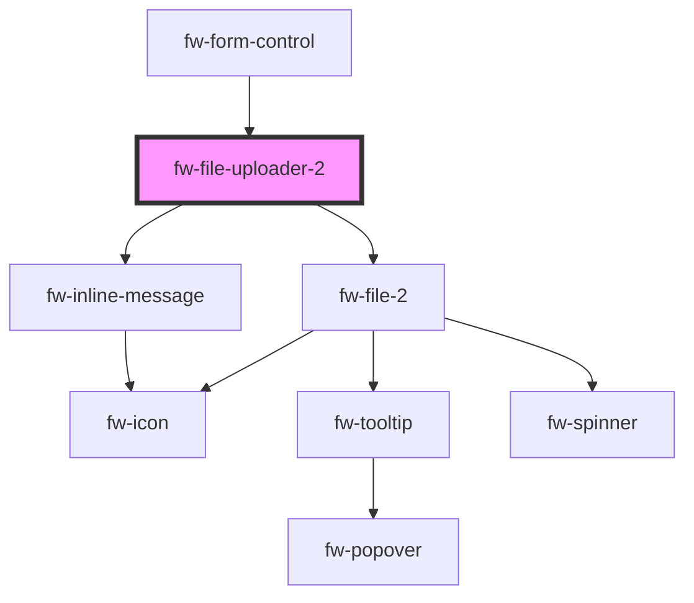

# File uploader 2 (fw-file-uploader-2)

### Default auto upload file uploader

```html live
  <fw-file-uploader-2 
    name="sample"
    id="file-uploader-00"
    description="We support .png, .jpeg and .jpg upto 25MB"
    max-file-size="5"
    accept=".png,.jpeg,.jpg"
    action-u-r-l="https://mocktarget.apigee.net/echo"
    multiple="true"
  >
  </fw-file-uploader-2>
```

<code-group>
<code-block title="HTML">

```html
  <fw-file-uploader-2 
    name="sample"
    id="file-uploader-00"
    description="We support .png, .jpeg and .jpg upto 25MB"
    max-file-size="5"
    accept=".png,.jpeg,.jpg"
    action-u-r-l="https://mocktarget.apigee.net/echo"
    multiple="true"
  >
  </fw-file-uploader-2>
```

</code-block>

<code-block title="React">

```jsx
  import { FwFileUploader2 } from "@freshworks/crayons/react";
  function App() {
    return (
      <>
        <FwFileUploader2 
          name="sample"
          id="file-uploader-00"
          description="We support .png, .jpeg and .jpg upto 25MB"
          maxFileSize="5"
          accept=".png,.jpeg,.jpg"
          actionURL="https://mocktarget.apigee.net/echo"
          multiple="true"
        >
        </FwFileUploader2>
      </>
    );
  }
```

</code-block>
</code-group>

### File uploader with initial values set

```html live
  <div class="fw-flex fw-flex-column fw-justify-center">
    <fw-file-uploader-2 
      name="sample"
      id="file-uploader-01"
      description="We support .png, .jpeg and .jpg upto 25MB"
      max-file-size="5"
      accept=".png,.jpeg,.jpg"
      action-u-r-l="https://mocktarget.apigee.net/echo"
      multiple="true"
      style="width: 400px;"
    >
    </fw-file-uploader-2>
  </div>

  <script type="application/javascript">
    var fileUploader1 = document.querySelector("#file-uploader-01");
    fileUploader1.initialFiles = [{
      file: new File([new Blob(new Uint8Array([
        137,80,78,71,13,10,26,10,0,0,0,13,73,72,68,82,0,0,0,8,0,0,
        0,8,8,2,0,0,0,75,109,41,220,0,0,0,34,73,68,65,84,8,215,99,120,
        173,168,135,21,49])
      )], 'file1.png', {type: 'png', lastModified: Date.now()})
    }, {
      file: new File([new Blob(new Uint8Array([
        137,80,78,71,13])
      )], 'file2.png', {type: 'png', lastModified: Date.now()}),
      progress: 20,
      error: 'Failed to upload file'
    }, {
      file: new File([new Blob(new Uint8Array([
        137,80,78,71,13,10,26,10,0,0,0,13,73,72,68,82,0,0,0,8,0,0,
        0,8,8,2,0,0,0,75,109,41,220,0,0,0,34,73,68,65,84,8,215,99,120,
        173,168,135,21,49,0,241,255,15,90,104,8,33,129,83,7,97,163,136,
        214,129,93,2,43,2,0,181,31,90,179,225,252,176,37,0,0,0,0,73,69,
        78,68,174,66,96,130])
      )], 'file3.png', {type: 'png', lastModified: Date.now()}),
      progress: -1,
      error: 'Failed to upload file'
    }];
  </script>
```

<code-group>
<code-block title="HTML">

```html
  <div class="fw-flex fw-flex-column fw-justify-center">
    <fw-file-uploader-2 
      name="sample"
      id="file-uploader-01"
      description="We support .png, .jpeg and .jpg upto 25MB"
      max-file-size="5"
      accept=".png,.jpeg,.jpg"
      action-u-r-l="https://mocktarget.apigee.net/echo"
      multiple="true"
      style="width: 400px;"
    >
    </fw-file-uploader-2>
  </div>
```

```javascript
  var fileUploader1 = document.querySelector("#file-uploader-01");
  fileUploader1.initialFiles = [{
    file: new File([new Blob(new Uint8Array([
      137,80,78,71,13,10,26,10,0,0,0,13,73,72,68,82,0,0,0,8,0,0,
      0,8,8,2,0,0,0,75,109,41,220,0,0,0,34,73,68,65,84,8,215,99,120,
      173,168,135,21,49])
    )], 'file1.png', {type: 'png', lastModified: Date.now()})
  }, {
    file: new File([new Blob(new Uint8Array([
      137,80,78,71,13])
    )], 'file2.png', {type: 'png', lastModified: Date.now()}),
    progress: 20,
    error: 'Failed to upload file'
  }, {
    file: new File([new Blob(new Uint8Array([
      137,80,78,71,13,10,26,10,0,0,0,13,73,72,68,82,0,0,0,8,0,0,
      0,8,8,2,0,0,0,75,109,41,220,0,0,0,34,73,68,65,84,8,215,99,120,
      173,168,135,21,49,0,241,255,15,90,104,8,33,129,83,7,97,163,136,
      214,129,93,2,43,2,0,181,31,90,179,225,252,176,37,0,0,0,0,73,69,
      78,68,174,66,96,130])
    )], 'file3.png', {type: 'png', lastModified: Date.now()}),
    progress: -1,
    error: 'Failed to upload file'
  }];
```

</code-block>

<code-block title="React">

```jsx
  import { FwFileUploader2 } from "@freshworks/crayons/react";
  function App() {
    const initialFiles = [{
      file: new File([new Blob(new Uint8Array([
        137,80,78,71,13,10,26,10,0,0,0,13,73,72,68,82,0,0,0,8,0,0,
        0,8,8,2,0,0,0,75,109,41,220,0,0,0,34,73,68,65,84,8,215,99,120,
        173,168,135,21,49])
      )], 'file1.png', {type: 'png', lastModified: Date.now()})
    }, {
      file: new File([new Blob(new Uint8Array([
        137,80,78,71,13])
      )], 'file2.png', {type: 'png', lastModified: Date.now()}),
      progress: 20,
      error: 'Failed to upload file'
    }, {
      file: new File([new Blob(new Uint8Array([
        137,80,78,71,13,10,26,10,0,0,0,13,73,72,68,82,0,0,0,8,0,0,
        0,8,8,2,0,0,0,75,109,41,220,0,0,0,34,73,68,65,84,8,215,99,120,
        173,168,135,21,49,0,241,255,15,90,104,8,33,129,83,7,97,163,136,
        214,129,93,2,43,2,0,181,31,90,179,225,252,176,37,0,0,0,0,73,69,
        78,68,174,66,96,130])
      )], 'file3.png', {type: 'png', lastModified: Date.now()}),
      progress: -1,
      error: 'Failed to upload file'
    }];
    return (
      <>
        <FwFileUploader2 
          name="sample"
          id="file-uploader-01"
          description="We support .png, .jpeg and .jpg upto 25MB"
          maxFileSize="5"
          accept=".png,.jpeg,.jpg"
          actionURL="https://mocktarget.apigee.net/echo"
          multiple="true"
          style={{
            width: '400px'
          }}
          initialFiles={initialFiles}
        >
        </FwFileUploader2>
      </>
    );
  }
```

</code-block>
</code-group>

### File upload on a button trigger

```html live
  <div class="fw-flex fw-flex-column fw-justify-center">
    <div style="width: 400px;" class="fw-flex fw-flex-column">
      <fw-file-uploader-2 
        name="sample"
        id="file-uploader-02"
        description="We support .png, .jpeg and .jpg upto 25MB"
        max-file-size="5"
        action-u-r-l="https://run.mocky.io/v3/893d19d2-c988-4273-a907-9c18d78be753?mocky-delay=1000ms"
        multiple="true"
        is-batch-upload="true"
      >
      </fw-file-uploader-2>
      <br/>
      <fw-button id="file-uploader-button-02">Upload file</fw-button>
    </div>
  </div>
  <script type="application/javascript">
    var fileUploader2 = document.querySelector("#file-uploader-02");
    var fileUploaderButton2 = document.querySelector("#file-uploader-button-02");
    fileUploaderButton2.addEventListener('click', () => {
      fileUploader2.uploadFiles();
    });
  </script>
```

<code-group>
<code-block title="HTML">

```html
  <div class="fw-flex fw-flex-column fw-justify-center">
    <div style="width: 400px;" class="fw-flex fw-flex-column">
      <fw-file-uploader-2 
        name="sample"
        id="file-uploader-02"
        description="We support .png, .jpeg and .jpg upto 25MB"
        max-file-size="5"
        action-u-r-l="https://run.mocky.io/v3/893d19d2-c988-4273-a907-9c18d78be753?mocky-delay=1000ms"
        multiple="true"
        is-batch-upload="true"
      >
      </fw-file-uploader-2>
      <br/>
      <fw-button id="file-uploader-button-02">Upload file</fw-button>
    </div>
  </div>
```

```javascript
  var fileUploader2 = document.querySelector("#file-uploader-02");
  var fileUploaderButton2 = document.querySelector("#file-uploader-button-02");
  fileUploaderButton2.addEventListener('click', () => {
    fileUploader2.uploadFiles();
  });
```

</code-block>

<code-block title="React">

```jsx
  import { useRef } from 'react';
  import { FwFileUploader2, FwButton } from "@freshworks/crayons/react";
  function App() {

    const fileUploader = useRef(null);

    return (
      <>
        <FwFileUploader2 
          name="sample"
          id="file-uploader-02"
          description="We support .png, .jpeg and .jpg upto 25MB"
          maxFileSize="5"
          actionURL="https://run.mocky.io/v3/893d19d2-c988-4273-a907-9c18d78be753?mocky-delay=1000ms"
          multiple="true"
          isBatchUpload="true"
          ref={fileUploader}
        >
        </FwFileUploader2>
        <FwButton onClick={() => fileUploader.current.uploadFiles()}>Upload</FwButton>
      </>
    );
  }
```

</code-block>
</code-group>

### File uploader as part of a form

```html live
  <div class="fw-flex fw-flex-column fw-justify-center">
    <form style="width: 400px;" class="fw-flex fw-flex-column fw-justify-center" id="sample-form" action="https://mocktarget.apigee.net/echo" method="post" onsubmit>
      <fw-file-uploader-2
        name="sample-2"
        id="file-uploader-03"
        description="We support .png, .jpeg and .jpg upto 25MB"
        max-file-size="5"
        accept=".png,.jpeg,.jpg"
        multiple="true"
        is-batch-upload="true"
      >
      </fw-file-uploader-2>
      <br/>
      <fw-button type="submit">Upload file</fw-button>
    </form>
  </div>

  <script type="application/javascript">
    var sampleForm = document.getElementById("sample-form");
    var fileUploader3 = document.getElementById("file-uploader-03");
    sampleForm.addEventListener("submit", async (e) => {
      e.preventDefault() // Cancel redirection
      var files = await fileUploader3.getFiles();
      console.log(files); // Perform action to send file to a server
      fileUploader3.reset(); // reset the form to initial state
    });
  </script>
```

<code-group>
<code-block title="HTML">

```html
  <div class="fw-flex fw-flex-column fw-justify-center">
    <form style="width: 400px;" class="fw-flex fw-flex-column fw-justify-center" id="sample-form" action="https://mocktarget.apigee.net/echo" method="post" onsubmit>
      <fw-file-uploader-2
        name="sample-2"
        id="file-uploader-03"
        description="We support .png, .jpeg and .jpg upto 25MB"
        max-file-size="5"
        accept=".png,.jpeg,.jpg"
        multiple="true"
        is-batch-upload="true"
      >
      </fw-file-uploader-2>
      <br/>
      <fw-button type="submit">Upload file</fw-button>
    </form>
  </div>
```

```javascript
  var sampleForm = document.getElementById("sample-form");
  var fileUploader3 = document.getElementById("file-uploader-03");
  sampleForm.addEventListener("submit", async (e) => {
    e.preventDefault() // Cancel redirection
    var files = await fileUploader3.getFiles();
    console.log(files); // Perform action to send file to a server
    fileUploader3.reset(); // reset the form to initial state
  });
```

</code-block>

<code-block title="React">

```jsx
  import { useRef } from 'react';
  import { FwFileUploader2, FwButton } from "@freshworks/crayons/react";

  function App() {

    const fileUploader = useRef(null);

    return (
      <>
        <form style={{width: '400px'}} class="fw-flex fw-flex-column fw-justify-center" id="sample-form" action="https://mocktarget.apigee.net/echo" method="post" onSubmit={async (e) => {
            e.preventDefault() // Cancel redirection
            var files = await fileUploader.current.getFiles();
            console.log(files); // Perform action to send file to a server
            fileUploader.current.reset(); // reset the form to initial state
          }}
        >
          <FwFileUploader2
            name="sample-2"
            id="file-uploader-03"
            description="We support .png, .jpeg and .jpg upto 25MB"
            maxFileSize="5"
            accept=".png,.jpeg,.jpg"
            multiple="true"
            isBatchUpload="true"
            ref={fileUploader}
          >
          </FwFileUploader2>
          <br/>
          <FwButton type="submit">Upload file</FwButton>
        </form>
      </>
    );
  }
```

</code-block>
</code-group>

### File upload - retry cases

```html live
  <div class="fw-flex fw-flex-column fw-justify-center">
    <div>
      <fw-toggle id="succeed-toggle" size="small" checked="false">Switch to succeed file upload</fw-toggle><br><br>
    </div>
    <div style="width: 400px;" class="fw-flex fw-flex-column">
      <fw-file-uploader-2 
        id="file-uploader-04"
        description="We support .png, .jpeg and .jpg upto 25MB"
        max-file-size="5"
        accept=".png,.jpeg,.jpg"
        action-u-r-l="/no-api"
        is-batch-upload="true"
      >
      </fw-file-uploader-2>
      <br/>
      <fw-button id="file-uploader-button-04">Upload file</fw-button>
    </div>
  </div>

  <script type="application/javascript">
    var fileUploader4 = document.querySelector('#file-uploader-04');
    var succeedToggle = document.querySelector('#succeed-toggle');
    var fileUploaderButton4 = document.querySelector('#file-uploader-button-04')
    fileUploader4.fileUploadError = 'Toggle the switch to successfully upload the file'; // Error message text
    succeedToggle.addEventListener('fwChange', (event) => {
      if (event.currentTarget.checked === true) {
        fileUploader4.actionURL = 'https://mocktarget.apigee.net/echo';
      } else {
        fileUploader4.actionURL = '/no-api';
      }
    });

    fileUploader4.addEventListener('fwFilesUploaded', (event) => {
      console.log(event); // Will be called when all file requests are sent.
    });
    fileUploader4.addEventListener('fwFileReuploaded', (event) => {
      console.log(event); // Will be called a retry attempt request is sent.
    });
    fileUploaderButton4.addEventListener('click', () => {
      fileUploader4.uploadFiles();
    });
  </script>
```

<code-group>
<code-block title="HTML">

```html
  <div class="fw-flex fw-flex-column fw-justify-center">
    <div>
      <fw-toggle id="succeed-toggle" size="small" checked="false">Switch to succeed file upload</fw-toggle><br><br>
    </div>
    <div style="width: 400px;" class="fw-flex fw-flex-column">
      <fw-file-uploader-2 
        id="file-uploader-04"
        description="We support .png, .jpeg and .jpg upto 25MB"
        max-file-size="5"
        accept=".png,.jpeg,.jpg"
        action-u-r-l="/no-api"
        is-batch-upload="true"
      >
      </fw-file-uploader-2>
      <br/>
      <fw-button id="file-uploader-button-04">Upload file</fw-button>
    </div>
  </div>
```

```javascript
  var fileUploader4 = document.querySelector('#file-uploader-04');
  var succeedToggle = document.querySelector('#succeed-toggle');
  var fileUploaderButton4 = document.querySelector('#file-uploader-button-04')
  fileUploader4.fileUploadError = 'Toggle the switch to successfully upload the file'; // Error message text
  succeedToggle.addEventListener('fwChange', (event) => {
    if (event.currentTarget.checked === true) {
      fileUploader4.actionURL = 'https://mocktarget.apigee.net/echo';
    } else {
      fileUploader4.actionURL = '/no-api';
    }
  });

  fileUploader4.addEventListener('fwFilesUploaded', (event) => {
    console.log(event); // Will be called when all file requests are sent.
  });
  fileUploader4.addEventListener('fwFileReuploaded', (event) => {
    console.log(event); // Will be called a retry attempt request is sent.
  });
  fileUploaderButton4.addEventListener('click', () => {
    fileUploader4.uploadFiles();
  });
```

</code-block>

<code-block title="React">

```jsx
  import { useRef } from 'react';
  import { FwToggle, FwFileUploader2, FwButton } from "@freshworks/crayons/react";

  function App() {

    const fileUploader = useRef(null);

    return (
      <>
        <div>
          <FwToggle
            id="succeed-toggle"
            size="small"
            checked="false"
            onFwChange={(e) => {
              if (e.currentTarget.checked === true) {
                fileUploader.current.actionURL = 'https://mocktarget.apigee.net/echo';
              } else {
                fileUploader.current.actionURL = '/no-api';
              }
            }}
          >
            Switch to succeed file upload
          </FwToggle>
        </div>
        <div style={{ width: '400px' }} class="fw-flex fw-flex-column">
          <FwFileUploader2
            id="file-uploader-04"
            description="We support .png, .jpeg and .jpg upto 25MB"
            maxFileSize="5"
            accept=".png,.jpeg,.jpg"
            actionURL="/no-api"
            isBatchUpload="true"
            ref={fileUploader}
            onFwFilesUploaded={(e) => console.log(e)}
            onFwFileReuploaded={(e) => console.log(e)}
          >
          </FwFileUploader2>
          <FwButton onClick={() => fileUploader.current.uploadFiles()}>Upload file</FwButton>
        </div>
      </>
    );
  }
```

</code-block>
</code-group>

### File upload - modify header request

```html live
  <div class="fw-flex fw-flex-column fw-justify-center">
    <div style="width: 400px;" class="fw-flex fw-flex-column">
      <fw-file-uploader-2 
        name="sample"
        id="file-uploader-05"
        description="We support .png, .jpeg and .jpg upto 25MB"
        max-file-size="5"
        accept=".png,.jpeg,.jpg"
        action-u-r-l="https://mocktarget.apigee.net/echo"
        is-batch-upload="true"
      >
      </fw-file-uploader-2>
      <br/>
      <fw-button id="file-uploader-button-05">Upload file</fw-button>
    </div>
  </div>

  <script type="application/javascript">
    var fileUploader5 = document.querySelector('#file-uploader-05');
    var filesUploaderButton5 = document.querySelector('#file-uploader-button-05');
    fileUploader5.modifyRequest = (xhr) => {
      var token = 'sample';
      xhr.setRequestHeader('Authorization', token); // adding a header to the request
      return xhr;
    }
    fileUploader5.addEventListener('fwFilesUploaded', (event) => {
      console.log(JSON.parse(event.detail.response).headers.authorization); // Will be called the first time when all file requests are sent.
    });
    filesUploaderButton5.addEventListener('click', () => {
      fileUploader5.uploadFiles();
    });
  </script>
```

<code-group>
<code-block title="HTML">

```html
  <div class="fw-flex fw-flex-column fw-justify-center">
    <div style="width: 400px;" class="fw-flex fw-flex-column">
      <fw-file-uploader-2 
        name="sample"
        id="file-uploader-05"
        description="We support .png, .jpeg and .jpg upto 25MB"
        max-file-size="5"
        accept=".png,.jpeg,.jpg"
        action-u-r-l="https://mocktarget.apigee.net/echo"
        is-batch-upload="true"
      >
      </fw-file-uploader-2>
      <br/>
      <fw-button id="file-uploader-button-05">Upload file</fw-button>
    </div>
  </div>
```

```javascript
  var fileUploader5 = document.querySelector('#file-uploader-05');
  var filesUploaderButton5 = document.querySelector('#file-uploader-button-05');
  fileUploader5.modifyRequest = (xhr) => {
    var token = 'sample';
    xhr.setRequestHeader('Authorization', token); // adding a header to the request
    return xhr;
  };
  fileUploader5.addEventListener('fwFilesUploaded', (event) => {
    console.log(JSON.parse(event.detail.response).headers.authorization); // Will be called the first time when all file requests are sent.
  });
  filesUploaderButton5.addEventListener('click', () => {
    fileUploader5.uploadFiles();
  });
```

</code-block>

<code-block title="React">

```jsx
  import { useRef } from 'react';
  import { FwFileUploader2, FwButton } from "@freshworks/crayons/react";

  function App() {

    const fileUploader = useRef(null);

    return (
      <>
        <FwFileUploader2 
          name="sample"
          id="file-uploader-05"
          description="We support .png, .jpeg and .jpg upto 25MB"
          maxFileSize="5"
          accept=".png,.jpeg,.jpg"
          actionURL="https://mocktarget.apigee.net/echo"
          isBatchUpload="true"
          ref={fileUploader}
          modifyRequest={(xhr) => {
            var token = 'sample';
            xhr.setRequestHeader('Authorization', token); // adding a header to the request
            return xhr;
          }}
          onFwFilesUploaded={(e) => {
            console.log(JSON.parse(e.detail.response).headers.authorization);
          }}
        >
        </FwFileUploader2>
        <FwButton onClick={() => fileUploader.current.uploadFiles()}>Upload File</FwButton>
      </>
    );
  }
```

</code-block>
</code-group>

### File upload - custom upload and reset buttons

```html live
  <div class="fw-flex fw-flex-column fw-justify-center">
    <div style="width: 400px;" class="fw-flex fw-flex-column">
      <fw-file-uploader-2 
        name="sample"
        id="file-uploader-06"
        description="We support .png, .jpeg and .jpg upto 25MB"
        max-file-size="5"
        accept=".png,.jpeg,.jpg"
        action-u-r-l="https://mocktarget.apigee.net/echo"
        is-batch-upload="true"
      >
      </fw-file-uploader-2>
      <br/>
      <button id="custom-submit">Submit</button>
      <br/>
      <button id="custom-reset">Reset</button>
    </div>
  </div>

  <script type="application/javascript">
    var fileUploader6 = document.querySelector("#file-uploader-06");
    var customButton = document.querySelector("#custom-submit");
    var customReset = document.querySelector("#custom-reset");
    customButton.addEventListener('click', () => {
      fileUploader6.uploadFiles(); // Calling uploadFiles from the custom submit
    });
    customReset.addEventListener('click', () => {
      fileUploader6.reset(); // To return component to initial state
    });
    fileUploader6.addEventListener('fwFilesUploaded', (event) => {
      console.log(event);
    });
  </script>
```

<code-group>
<code-block title="HTML">

```html
  <div class="fw-flex fw-flex-column fw-justify-center">
    <div style="width: 400px;" class="fw-flex fw-flex-column">
      <fw-file-uploader-2 
        name="sample"
        id="file-uploader-06"
        description="We support .png, .jpeg and .jpg upto 25MB"
        max-file-size="5"
        accept=".png,.jpeg,.jpg"
        action-u-r-l="https://mocktarget.apigee.net/echo"
        is-batch-upload="true"
      >
      </fw-file-uploader-2>
      <br/>
      <button id="custom-submit">Submit</button>
      <br/>
      <button id="custom-reset">Reset</button>
    </div>
  </div>
```

```javascript
  var fileUploader6 = document.querySelector("#file-uploader-06");
  var customButton = document.querySelector("#custom-submit");
  var customReset = document.querySelector("#custom-reset");
  customButton.addEventListener('click', () => {
    fileUploader6.uploadFiles(); // Calling uploadFiles from the custom submit
  });
  customReset.addEventListener('click', () => {
    fileUploader6.reset(); // To return component to initial state
  });
  fileUploader6.addEventListener('fwFilesUploaded', (event) => {
    console.log(event);
  });
```

</code-block>

<code-block title="React">

```jsx
  import { useRef } from 'react';
  import { FwFileUploader2 } from "@freshworks/crayons/react";

  function App() {

    const fileUploader = useRef(null);

    return (
      <>
        <FwFileUploader2 
          name="sample"
          id="file-uploader-06"
          description="We support .png, .jpeg and .jpg upto 25MB"
          maxFileSize="5"
          accept=".png,.jpeg,.jpg"
          actionURL="https://mocktarget.apigee.net/echo"
          isBatchUpload="true"
          ref={fileUploader}
        >
        </FwFileUploader2>
        <br/>
        <button onClick={(e) => fileUploader.current.uploadFiles()}>Submit</button>
        <br/>
        <button onClick={(e) => fileUploader.current.reset()}>Reset</button>
      </>
    );
  }
```

</code-block>
</code-group>

### Restrict attachment size

```html live
<div class="fw-flex fw-flex-column fw-justify-center">
  <fw-file-uploader-2 
    name="sample"
    id="file-uploader-07"
    description="We support .png, .jpeg and .jpg upto 25MB"
    max-file-size="5"
    accept=".png,.jpeg,.jpg"
    action-u-r-l="https://mocktarget.apigee.net/echo"
    multiple="true"
    style="width: 400px; --max-attachment-block-width: auto; --max-attachment-block-height: 120px;"
    restrict-attachment-block="true"
  >
  </fw-file-uploader-2>
</div>

<script type="application/javascript">
  var fileUploader7 = document.querySelector("#file-uploader-07");
  fileUploader7.initialFiles = [{
    file: new File([new Blob(new Uint8Array([
      137,80,78,71,13,10,26,10,0,0,0,13,73,72,68,82,0,0,0,8,0,0,
      0,8,8,2,0,0,0,75,109,41,220,0,0,0,34,73,68,65,84,8,215,99,120,
      173,168,135,21,49])
    )], 'file1.png', {type: 'png', lastModified: Date.now()})
  }, {
    file: new File([new Blob(new Uint8Array([
      137,80,78,71,13])
    )], 'file2.png', {type: 'png', lastModified: Date.now()}),
  }, {
    file: new File([new Blob(new Uint8Array([
      137,80,78,71,13,10,26,10,0,0,0,13,73,72,68,82,0,0,0,8,0,0,
      0,8,8,2,0,0,0,75,109,41,220,0,0,0,34,73,68,65,84,8,215,99,120,
      173,168,135,21,49,0,241,255,15,90,104,8,33,129,83,7,97,163,136,
      214,129,93,2,43,2,0,181,31,90,179,225,252,176,37,0,0,0,0,73,69,
      78,68,174,66,96,130])
    )], 'file3.png', {type: 'png', lastModified: Date.now()}),
  }, {
    file: new File([new Blob(new Uint8Array([
      137,80,78,71,13])
    )], 'file4.png', {type: 'png', lastModified: Date.now()}),
  }, {
    file: new File([new Blob(new Uint8Array([
      137,80,78,71,13])
    )], 'file5.png', {type: 'png', lastModified: Date.now()}),
  }, {
    file: new File([new Blob(new Uint8Array([
      137,80,78,71,13])
    )], 'file6.png', {type: 'png', lastModified: Date.now()}),
  }];
</script>
```

<code-group>
<code-block title="HTML">

```html
  <div class="fw-flex fw-flex-column fw-justify-center">
    <fw-file-uploader-2 
      name="sample"
      id="file-uploader-07"
      description="We support .png, .jpeg and .jpg upto 25MB"
      max-file-size="5"
      accept=".png,.jpeg,.jpg"
      action-u-r-l="https://mocktarget.apigee.net/echo"
      multiple="true"
      style="width: 400px; --max-attachment-block-width: auto; --max-attachment-block-height: 120px;"
      restrict-attachment-block="true"
    >
    </fw-file-uploader-2>
  </div>
```

```javascript
  var fileUploader7 = document.querySelector("#file-uploader-07");
  fileUploader7.initialFiles = [{
    file: new File([new Blob(new Uint8Array([
      137,80,78,71,13,10,26,10,0,0,0,13,73,72,68,82,0,0,0,8,0,0,
      0,8,8,2,0,0,0,75,109,41,220,0,0,0,34,73,68,65,84,8,215,99,120,
      173,168,135,21,49])
    )], 'file1.png', {type: 'png', lastModified: Date.now()})
  }, {
    file: new File([new Blob(new Uint8Array([
      137,80,78,71,13])
    )], 'file2.png', {type: 'png', lastModified: Date.now()}),
  }, {
    file: new File([new Blob(new Uint8Array([
      137,80,78,71,13,10,26,10,0,0,0,13,73,72,68,82,0,0,0,8,0,0,
      0,8,8,2,0,0,0,75,109,41,220,0,0,0,34,73,68,65,84,8,215,99,120,
      173,168,135,21,49,0,241,255,15,90,104,8,33,129,83,7,97,163,136,
      214,129,93,2,43,2,0,181,31,90,179,225,252,176,37,0,0,0,0,73,69,
      78,68,174,66,96,130])
    )], 'file3.png', {type: 'png', lastModified: Date.now()}),
  }, {
    file: new File([new Blob(new Uint8Array([
      137,80,78,71,13])
    )], 'file4.png', {type: 'png', lastModified: Date.now()}),
  }, {
    file: new File([new Blob(new Uint8Array([
      137,80,78,71,13])
    )], 'file5.png', {type: 'png', lastModified: Date.now()}),
  }, {
    file: new File([new Blob(new Uint8Array([
      137,80,78,71,13])
    )], 'file6.png', {type: 'png', lastModified: Date.now()}),
  }];
```

</code-block>

<code-block title="React">

```jsx
  import { FwFileUploader2 } from "@freshworks/crayons/react";
  function App() {
    const initialFiles = [{
      file: new File([new Blob(new Uint8Array([
        137,80,78,71,13,10,26,10,0,0,0,13,73,72,68,82,0,0,0,8,0,0,
        0,8,8,2,0,0,0,75,109,41,220,0,0,0,34,73,68,65,84,8,215,99,120,
        173,168,135,21,49])
      )], 'file1.png', {type: 'png', lastModified: Date.now()})
    }, {
      file: new File([new Blob(new Uint8Array([
        137,80,78,71,13])
      )], 'file2.png', {type: 'png', lastModified: Date.now()}),
    }, {
      file: new File([new Blob(new Uint8Array([
        137,80,78,71,13,10,26,10,0,0,0,13,73,72,68,82,0,0,0,8,0,0,
        0,8,8,2,0,0,0,75,109,41,220,0,0,0,34,73,68,65,84,8,215,99,120,
        173,168,135,21,49,0,241,255,15,90,104,8,33,129,83,7,97,163,136,
        214,129,93,2,43,2,0,181,31,90,179,225,252,176,37,0,0,0,0,73,69,
        78,68,174,66,96,130])
      )], 'file3.png', {type: 'png', lastModified: Date.now()}),
    }, {
      file: new File([new Blob(new Uint8Array([
        137,80,78,71,13])
      )], 'file4.png', {type: 'png', lastModified: Date.now()}),
    }, {
      file: new File([new Blob(new Uint8Array([
        137,80,78,71,13])
      )], 'file5.png', {type: 'png', lastModified: Date.now()}),
    }, {
      file: new File([new Blob(new Uint8Array([
        137,80,78,71,13])
      )], 'file6.png', {type: 'png', lastModified: Date.now()}),
    }];
    return (
      <>
        <FwFileUploader2 
          name="sample"
          id="file-uploader-07"
          description="We support .png, .jpeg and .jpg upto 25MB"
          maxFileSize="5"
          accept=".png,.jpeg,.jpg"
          actionURL="https://mocktarget.apigee.net/echo"
          multiple="true"
          style={{
            width: '400px',
            '--max-attachment-block-width': 'auto',
            '--max-attachment-block-height': '80px'
          }}
          restrictAttachmentBlock="true"
          initialFiles={initialFiles}
        >
        </FwFileUploader2>
      </>
    );
  }
```

</code-block>
</code-group>


<!-- Auto Generated Below -->


## Properties

| Property                       | Attribute                          | Description                                                                                                                                   | Type                                      | Default                                                                      |
| ------------------------------ | ---------------------------------- | --------------------------------------------------------------------------------------------------------------------------------------------- | ----------------------------------------- | ---------------------------------------------------------------------------- |
| `accept`                       | `accept`                           | accept - comma separated string. tells us what file formats file uploader should accept.                                                      | `string`                                  | `''`                                                                         |
| `acceptError`                  | `accept-error`                     | acceptError - Error message to display when format is invalid.                                                                                | `any`                                     | `TranslationController.t('fileUploader2.acceptError')`                       |
| `actionParams`                 | --                                 | actionParams - additional information to send to server other than the file.                                                                  | `{ [prop: string]: any; }`                | `{}`                                                                         |
| `actionURL`                    | `action-u-r-l`                     | actionURL - URL to make server call.                                                                                                          | `string`                                  | `''`                                                                         |
| `description`                  | `description`                      | description - file uploader description.                                                                                                      | `any`                                     | `undefined`                                                                  |
| `errors`                       | `errors`                           | errors - errors collection. Mutable as this can be set from form control too based on form validations.                                       | `any`                                     | `[]`                                                                         |
| `fileUploadError`              | `file-upload-error`                | fileUploadError - Error message when a file upload fails.                                                                                     | `any`                                     | `undefined`                                                                  |
| `filesLimit`                   | `files-limit`                      | Max files allowed to upload.                                                                                                                  | `number`                                  | `10`                                                                         |
| `hideLabel`                    | `hide-label`                       | Use this prop to show the label on the component.                                                                                             | `boolean`                                 | `true`                                                                       |
| `infoText`                     | `info-text`                        |                                                                                                                                               | `string`                                  | `''`                                                                         |
| `initialFiles`                 | --                                 | to load default values in file uploader component.                                                                                            | `InitialUploaderFile[]`                   | `[]`                                                                         |
| `isBatchUpload`                | `is-batch-upload`                  | Upload all files in one single shot                                                                                                           | `boolean`                                 | `false`                                                                      |
| `maxFileSize`                  | `max-file-size`                    | maxFileSize - maximum file size the file uploader must accept.                                                                                | `number`                                  | `0`                                                                          |
| `maxFileSizeError`             | `max-file-size-error`              | maxFileSizeError - Error message to display when file size exceeds limit                                                                      | `any`                                     | `TranslationController.t('fileUploader2.maxFileSizeError')`                  |
| `maxFilesLimitError`           | `max-files-limit-error`            | maxFilesLimitError - Error message when going beyond files limit.                                                                             | `any`                                     | `TranslationController.t(     'fileUploader2.maxFilesLimitError'   )`        |
| `modifyRequest`                | --                                 | modify request                                                                                                                                | `(xhr: XMLHttpRequest) => XMLHttpRequest` | `(xhr) => xhr`                                                               |
| `multiple`                     | `multiple`                         | multiple - upload multiple files.                                                                                                             | `boolean`                                 | `false`                                                                      |
| `name`                         | `name`                             | name - field name                                                                                                                             | `string`                                  | `''`                                                                         |
| `required`                     | `required`                         | field acts as a mandatory field and displays an asterisk next to the label. If the attribute’s value is undefined, the value is set to false. | `boolean`                                 | `false`                                                                      |
| `restrictAttachmentBlock`      | `restrict-attachment-block`        | restrict the width of the attachment in the file uploader                                                                                     | `boolean`                                 | `false`                                                                      |
| `simpleInterfaceForSingleMode` | `simple-interface-for-single-mode` | Use a simple interface for the single file mode.                                                                                              | `boolean`                                 | `false`                                                                      |
| `smallerUniformLabel`          | `smaller-uniform-label`            | To maintain the same label styling as other form elements.                                                                                    | `boolean`                                 | `false`                                                                      |
| `text`                         | `text`                             | text - file uploader text.                                                                                                                    | `any`                                     | `undefined`                                                                  |
| `totalFileSizeAllowed`         | `total-file-size-allowed`          | Max total size allowed for upload                                                                                                             | `number`                                  | `0`                                                                          |
| `totalFileSizeAllowedError`    | `total-file-size-allowed-error`    | totalFileSizeAllowedError - Total file size (combination of all files) allowed for upload.                                                    | `any`                                     | `TranslationController.t(     'fileUploader2.totalFileSizeAllowedError'   )` |


## Events

| Event              | Description                                                             | Type               |
| ------------------ | ----------------------------------------------------------------------- | ------------------ |
| `fwChange`         | Event that triggers when uploading is in progress, completed or failed. | `CustomEvent<any>` |
| `fwFileReuploaded` | Triggered during a file reupload.                                       | `CustomEvent<any>` |
| `fwFilesUploaded`  | Triggered during batch upload, when all files are uploaded.             | `CustomEvent<any>` |
| `fwRemove`         | Event that triggers when removing a file from the file uploader.        | `CustomEvent<any>` |


## Methods

### `getFiles() => Promise<UploaderFile[]>`

get all locally available files in the component

#### Returns

Type: `Promise<UploaderFile[]>`

FileList of all locally available files in the component

### `getFilesList() => Promise<FileList>`


#### Returns

Type: `Promise<FileList>`


### `reset() => Promise<void>`

reset file uploader

#### Returns

Type: `Promise<void>`


### `setFocus() => Promise<void>`


#### Returns

Type: `Promise<void>`


### `uploadFiles() => Promise<void>`

uploadFile

#### Returns

Type: `Promise<void>`

fileUploadPromise


## CSS Custom Properties

| Name                        | Description                         |
| --------------------------- | ----------------------------------- |
| `--fw-file-uploader-border` | border color for file uploader      |
| `--max-attachment-height`   | max-height for the attachment block |
| `--max-attachment-width`    | max width for the attachment block  |


## Dependencies

### Used by

 - [fw-form-control](../form-control)

### Depends on

- [fw-file-2](file-2)
- [fw-inline-message](../inline-message)

### Graph


----------------------------------------------

Built with ❤ at Freshworks
