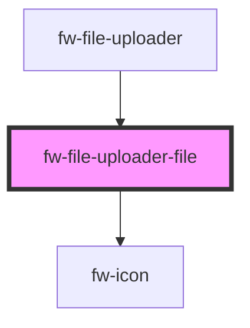

# fw-file-uploader-file

<!-- Auto Generated Below -->

## Properties

| Property | Attribute | Description | Type     | Default |
| -------- | --------- | ----------- | -------- | ------- |
| `fileId` | `file-id` | file Id     | `number` | `null`  |
| `name`   | `name`    | file name   | `string` | `''`    |

## Events

| Event          | Description                                            | Type               |
| -------------- | ------------------------------------------------------ | ------------------ |
| `fwRemoveFile` | removeFile - event that gets triggered on file removal | `CustomEvent<any>` |

## Dependencies

### Used by

 - [fw-file-uploader](..)

### Depends on

- [fw-icon](../../icon)

### Graph

----------------------------------------------

Built with ❤ at Freshworks
