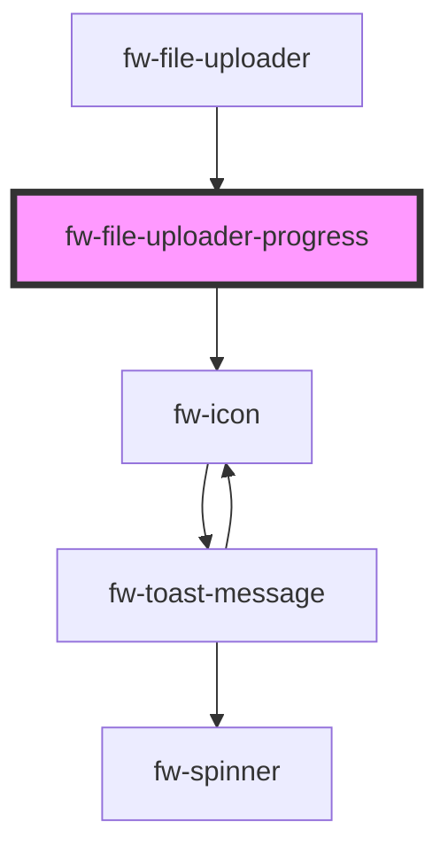

# fw-file-uploader-progress

<!-- Auto Generated Below -->

## Properties

| Property              | Attribute   | Description                    | Type     | Default     |
| --------------------- | ----------- | ------------------------------ | -------- | ----------- |
| `error`               | `error`     | error text for the file upload | `string` | `''`        |
| `fileId` _(required)_ | `file-id`   | file Id                        | `number` | `undefined` |
| `fileName`            | `file-name` | file name                      | `string` | `''`        |
| `progress`            | `progress`  | file upload progress           | `number` | `0`         |

## Events

| Event           | Description                                  | Type               |
| --------------- | -------------------------------------------- | ------------------ |
| `fwRetryUpload` | retryUpload event to emit in case of a retry | `CustomEvent<any>` |

## Dependencies

### Used by

 - [fw-file-uploader](..)

### Depends on

- [fw-icon](../../icon)

### Graph

----------------------------------------------

Built with ❤ at Freshworks
