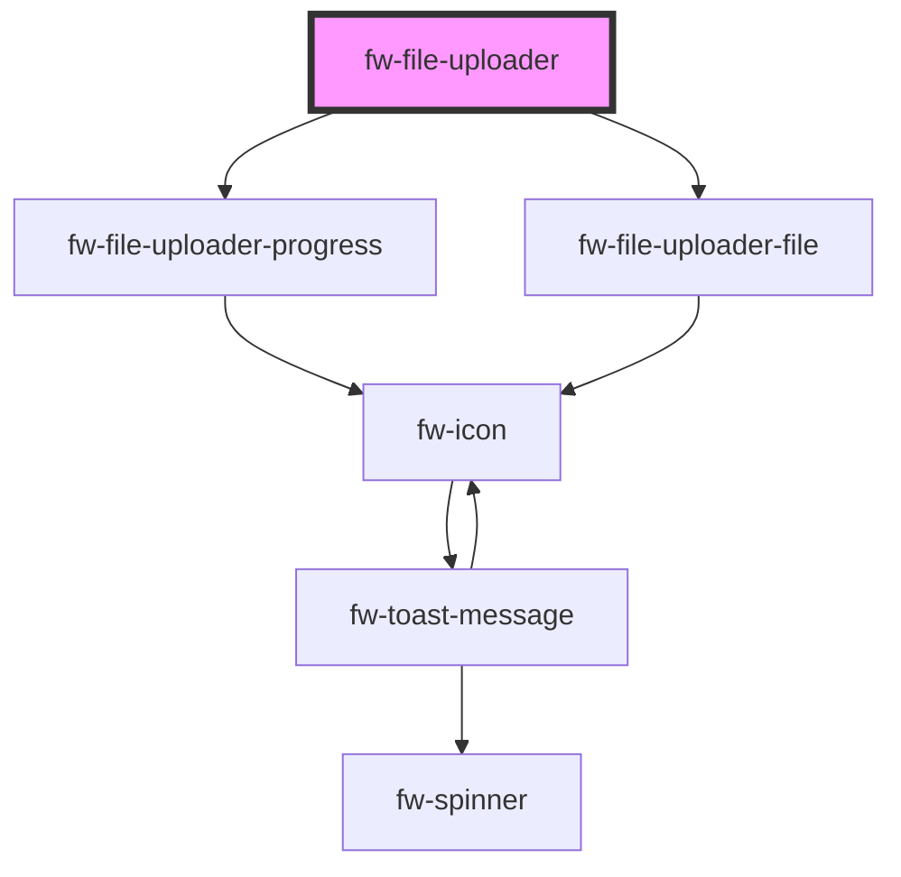

# File uploader (fw-file-uploader)

fw-file-uploader can be used to upload files to a server.

```html live
  <div class="fw-flex fw-flex-column fw-justify-center">
    <fw-file-uploader 
      id="file-uploader-1"
      text="Upload CSV"
      description="or drag and drop your csv file here"
      hint="File size must be within 5MB"
      max-file-size="5"
      accept=".csv"
    >
    </fw-file-uploader>
    <br/>
    <fw-button file-uploader-id="file-uploader-1">Upload file</fw-button>
  </div>

  <script type="application/javascript">
    const fileUploader = document.querySelector('#file-uploader-1');
    fileUploader.addEventListener('filesUploaded', (event) => {
      console.log(event);
    });
  </script>
```

<code-group>
<code-block title="HTML">

```html
  <div class="fw-flex fw-flex-column fw-justify-center">
    <fw-file-uploader 
      id="file-uploader-1"
      text="Upload CSV"
      description="or drag and drop your csv file here"
      hint="File size must be within 5MB"
      max-file-size="5"
      accept=".csv"
    >
    </fw-file-uploader>
    <br/>
    <fw-button file-uploader-id="file-uploader-1">Upload file</fw-button>
  </div>
```

```javascript
  const fileUploader = document.querySelector('#file-uploader-1');
  fileUploader.addEventListener('filesUploaded', (event) => {
    console.log(event);
  });
```

</code-block>

<code-block title="React">

```jsx
  import React from "react";
  import ReactDOM from "react-dom";
  import { FwFileUploader, FwButton } from "@freshworks/crayons/react";
  function App() {

    let updateState = (event) => {
      console.log(event.detail);
    };

    return (
      <>
        <FwFileUploader 
          id="file-uploader-1"
          text="Upload CSV"
          description="or drag and drop your csv file here"
          hint="File size must be within 5MB"
          maxFileSize={5}
          accept=".csv"
          onFilesUploaded={(event) => updateState(event)}
        >
        </FwFileUploader>
        <FwButton fileUploaderId="file-uploader-1">Upload</FwButton>
      </>
    );
  }
```

</code-block>
</code-group>

<!-- Auto Generated Below -->


## Properties

| Property             | Attribute               | Description                                                                              | Type                | Default        |
| -------------------- | ----------------------- | ---------------------------------------------------------------------------------------- | ------------------- | -------------- |
| `accept`             | `accept`                | accept - comma separated string. tells us what file formats file uploader should accept. | `string`            | `''`           |
| `acceptError`        | `accept-error`          | acceptError - Error message to display when format is invalid.                           | `any`               | `undefined`    |
| `actionParams`       | `action-params`         | actionParams - additional information to send to server other than the file.             | `any`               | `{}`           |
| `actionURL`          | `action-u-r-l`          | actionURL - URL to make server call.                                                     | `string`            | `''`           |
| `description`        | `description`           | description - file uploader description.                                                 | `any`               | `undefined`    |
| `fileUploadError`    | `file-upload-error`     | fileUploadError - Error message when a file upload fails.                                | `any`               | `undefined`    |
| `filesLimit`         | `files-limit`           | Max files allowed to upload.                                                             | `number`            | `10`           |
| `hint`               | `hint`                  | hint - file uploader hint text.                                                          | `string`            | `''`           |
| `maxFileSize`        | `max-file-size`         | maxFileSize - maximum file size the file uploader must accept.                           | `number`            | `0`            |
| `maxFileSizeError`   | `max-file-size-error`   | maxFileSizeError - Error message to display when file size exceeds limit                 | `any`               | `undefined`    |
| `maxFilesLimitError` | `max-files-limit-error` | maxFilesLimitError - Error message when going beyond files limit.                        | `any`               | `undefined`    |
| `modifyRequest`      | --                      | modify request                                                                           | `(xhr: any) => any` | `(xhr) => xhr` |
| `multiple`           | `multiple`              | multiple - upload multiple files.                                                        | `boolean`           | `false`        |
| `text`               | `text`                  | text - file uploader text.                                                               | `any`               | `undefined`    |


## Events

| Event              | Description                                                         | Type               |
| ------------------ | ------------------------------------------------------------------- | ------------------ |
| `fwFileReuploaded` | fileReuploaded - event that gets emitted when file is reuploaded    | `CustomEvent<any>` |
| `fwFilesUploaded`  | filesUploaded - event that gets emitted when files get uploaded     | `CustomEvent<any>` |
| `fwStageChanged`   | stageChanged - event that gets emitted when component stage changes | `CustomEvent<any>` |


## Methods

### `uploadFiles() => Promise<void>`

uploadFiles - uploads the files to the server. emits an after file is uploaded.

#### Returns

Type: `Promise<void>`


## Dependencies

### Depends on

- [fw-file-uploader-progress](progress)
- [fw-file-uploader-file](file)

### Graph


----------------------------------------------

Built with ❤ at Freshworks
