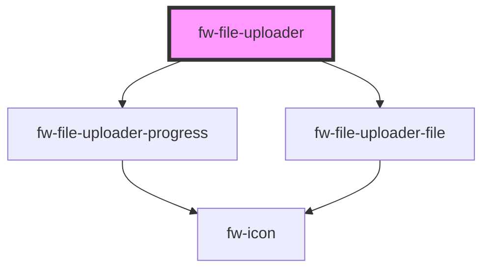

# File uploader (fw-file-uploader)

fw-file-uploader can be used to upload files to a server.

#### File uploader as a standalone (without a form and with action url)

```html live
  <div class="fw-flex fw-flex-column fw-justify-center">
    <fw-file-uploader 
      name="sample"
      id="file-uploader-1"
      text="Upload CSV"
      description="or drag and drop your csv file here"
      hint="File size must be within 5MB"
      max-file-size="5"
      accept=".png"
      action-u-r-l="https://mocktarget.apigee.net/echo"
    >
    </fw-file-uploader>
    <br/>
    <fw-button file-uploader-id="file-uploader-1">Upload file</fw-button>
  </div>

  <script type="application/javascript">
    const fileUploader1 = document.querySelector('#file-uploader-1');
    fileUploader1.addEventListener('fwFilesUploaded', (event) => {
      console.log(event);
    });
  </script>
```

<code-group>
<code-block title="HTML">

```html
  <div class="fw-flex fw-flex-column fw-justify-center">
    <fw-file-uploader 
      id="file-uploader-1"
      text="Upload CSV"
      description="or drag and drop your csv file here"
      hint="File size must be within 5MB"
      max-file-size="5"
      accept=".csv"
    >
    </fw-file-uploader>
    <br/>
    <fw-button file-uploader-id="file-uploader-1">Upload file</fw-button>
  </div>
```

```javascript
  const fileUploader = document.querySelector('#file-uploader-1');
  fileUploader.addEventListener('fwFilesUploaded', (event) => {
    console.log(event);
  });
```

</code-block>

<code-block title="React">

```jsx
  import React from "react";
  import ReactDOM from "react-dom";
  import { FwFileUploader, FwButton } from "@freshworks/crayons/react";
  function App() {

    let updateState = (event) => {
      console.log(event.detail);
    };

    return (
      <>
        <FwFileUploader 
          id="file-uploader-1"
          text="Upload CSV"
          description="or drag and drop your csv file here"
          hint="File size must be within 5MB"
          maxFileSize={5}
          accept=".csv"
          onFilesUploaded={(event) => updateState(event)}
        >
        </FwFileUploader>
        <FwButton fileUploaderId="file-uploader-1">Upload</FwButton>
      </>
    );
  }
```

</code-block>
</code-group>

#### File uploader inside a form.

```html live
  <div class="fw-flex fw-flex-column fw-justify-center">
    <form class="fw-flex fw-flex-column fw-justify-center" id="sample-form" action="https://mocktarget.apigee.net/echo" method="post" onsubmit>
      <fw-file-uploader 
        name="sample-2"
        id="file-uploader-2"
        text="Upload CSV"
        description="or drag and drop your csv file here"
        hint="File size must be within 5MB"
        max-file-size="5"
        accept=".png"
        multiple="true"
      >
      </fw-file-uploader>
      <br/>
      <fw-button type="submit">Upload file</fw-button>
    </form>
  </div>

  <script type="application/javascript">
    const sampleForm = document.getElementById("sample-form");
    const fileUploader2 = document.getElementById("file-uploader-2");
    sampleForm.addEventListener("submit", async (e) => {
      e.preventDefault() // Cancel redirection
      const files = await fileUploader2.getFiles();
      console.log(files); // Perform action to send file to a server
      fileUploader2.reset(); // reset the form to initial state
    });
  </script>
```

<code-group>
<code-block title="HTML">

```html
  <div class="fw-flex fw-flex-column fw-justify-center">
    <form class="fw-flex fw-flex-column fw-justify-center" id="sample-form" action="https://mocktarget.apigee.net/echo" method="post" onsubmit>
      <fw-file-uploader 
        name="sample-2"
        id="file-uploader-2"
        text="Upload CSV"
        description="or drag and drop your csv file here"
        hint="File size must be within 5MB"
        max-file-size="5"
        accept=".png"
        multiple="true"
      >
      </fw-file-uploader>
      <br/>
      <fw-button type="submit">Upload file</fw-button>
    </form>
  </div>
```

```javascript
  const sampleForm = document.getElementById("sample-form");
  const fileUploader2 = document.getElementById("file-uploader-2");
  sampleForm.addEventListener("submit", async (e) => {
    e.preventDefault() // Cancel redirection
    const files = await fileUploader2.getFiles();
    console.log(files); // Perform action to send file to a server
    fileUploader2.reset(); // reset the form to initial state
  });
```

</code-block>

<code-block title="React">

```jsx
  import { useRef } from 'react';
  import { FwFileUploader, FwButton } from "@freshworks/crayons/react";
  function App() {

    const fileUploader = useRef(null);
    const updateState = async (event) => {
      event.preventDefault();
      const files = await fileUploader.getFiles();
      console.log(files);
      fileUploader.reset();
    };

    return (
      <>
        <form onSubmit={(event) => updateState(event)}>
          <FwFileUploader
            name="sample-2"
            id="file-uploader-2"
            text="Upload CSV"
            description="or drag and drop your csv file here"
            hint="File size must be within 5MB"
            maxFileSize="5"
            accept=".png"
            multiple="true"
            ref={fileUploader}
          >
          </FwFileUploader>
          <FwButton type="submit">Upload</FwButton>
        </form>
      </>
    );
  }
```

</code-block>
</code-group>

#### File uploader - upload failure and reupload example

```html live
  <div class="fw-flex fw-flex-column fw-justify-center">
    <div>
      <fw-toggle id="succeed-toggle" size="small" checked="false">Switch to succeed file upload</fw-toggle><br><br>
    </div>
    <fw-file-uploader 
      name="sample"
      id="file-uploader-3"
      text="Upload CSV"
      description="or drag and drop your csv file here"
      hint="File size must be within 5MB"
      max-file-size="5"
      accept=".png"
      action-u-r-l="/no-api"
    >
    </fw-file-uploader>
    <br/>
    <fw-button file-uploader-id="file-uploader-3">Upload file</fw-button>
  </div>

  <script type="application/javascript">
    const fileUploader3 = document.querySelector('#file-uploader-3');
    const succeedToggle = document.querySelector('#succeed-toggle');
    fileYploader3.fileUploadError = 'Toggle the switch to successfully upload the file'; // Error message text
    succeedToggle.addEventListener('fwChange', (event) => {
      if (event.currentTarget.checked === true) {
        fileUploader3.actionURL = 'https://mocktarget.apigee.net/echo';
      } else {
        fileUploader3.actionURL = '/no-api';
      }
    });

    fileUploader3.addEventListener('fwFilesUploaded', (event) => {
      console.log(event); // Will be called when all file requests are sent.
    });
    fileUploader3.addEventListener('fwFileReuploaded', (event) => {
      console.log(event); // Will be called a retry attempt request is sent.
    });
  </script>
```

<code-group>
<code-block title="HTML">

```html
  <div class="fw-flex fw-flex-column fw-justify-center">
    <div>
      <fw-toggle id="succeed-toggle" size="small" checked="false">Switch to succeed file upload</fw-toggle><br><br>
    </div>
    <fw-file-uploader 
      name="sample"
      id="file-uploader-3"
      text="Upload CSV"
      description="or drag and drop your csv file here"
      hint="File size must be within 5MB"
      max-file-size="5"
      accept=".png"
      action-u-r-l="/no-api"
    >
    </fw-file-uploader>
    <br/>
    <fw-button file-uploader-id="file-uploader-3">Upload file</fw-button>
  </div>
```

```javascript
  const fileUploader3 = document.querySelector('#file-uploader-3');
  const succeedToggle = document.querySelector('#succeed-toggle');
  fileYploader3.fileUploadError = 'Toggle the switch to successfully upload the file'; // Error message text
  succeedToggle.addEventListener('fwChange', (event) => {
    if (event.currentTarget.checked === true) {
      fileUploader3.actionURL = 'https://mocktarget.apigee.net/echo';
    } else {
      fileUploader3.actionURL = '/no-api';
    }
  });

  fileUploader3.addEventListener('fwFilesUploaded', (event) => {
    console.log(event); // Will be called when all file requests are sent.
  });
  fileUploader3.addEventListener('fwFileReuploaded', (event) => {
    console.log(event); // Will be called a retry attempt request is sent.
  });
```

</code-block>

<code-block title="React">

```jsx
  import { useRef } from 'react';
  import { FwToggle, FwFileUploader, FwButton } from "@freshworks/crayons/react";

  function App() {

    const fileUploader = useRef(null);

    const toggleChange = (event) => {
      if (event.currentTarget.checked === true) {
        fileUploader.current.actionURL = 'https://mocktarget.apigee.net/echo';
      } else {
        fileUploader.current.actionURL = '/no-api';
      }
    }

    const filesUploaded = (event) => {
      console.log(event);
    }

    const fileReuploaded = (event) => {
      console.log(event);
    }

    return (
      <div className="App">
        <FwToggle
          id="succeed-toggle"
          size="small"
          checked="false"
          onFwChange={(event) => toggleChange(event)}
        >

        </FwToggle>
        <div>
          <FwFileUploader
            name="sample"
            id="file-uploader-3"
            text="Upload CSV"
            description="or drag and drop your csv file here"
            hint="File size must be within 5MB"
            max-file-size="5"
            accept=".png"
            action-u-r-l="/no-api"
            onFwFilesUploaded={(event) => filesUploaded(event)}
            onFwFileReuploaded={(event) => fileReuploaded(event)}
            ref={fileUploader}
          >
          </FwFileUploader>
          <FwButton file-uploader-id="file-uploader-3">Upload</FwButton>
        </div>
      </div>
    );

  }
```

</code-block>
</code-group>

#### File uploader - Modify header tokens in the request

Modify the header using the 'modifyHeader' prop. We will receive the XHR request as the first param in the modifyHeader function call.

```html live
  <div class="fw-flex fw-flex-column fw-justify-center">
    <fw-file-uploader 
      name="sample"
      id="file-uploader-4"
      text="Upload CSV"
      description="or drag and drop your csv file here"
      hint="File size must be within 5MB"
      max-file-size="5"
      accept=".png"
      action-u-r-l="https://mocktarget.apigee.net/echo"
    >
    </fw-file-uploader>
    <br/>
    <fw-button file-uploader-id="file-uploader-4">Upload file</fw-button>
  </div>

  <script type="application/javascript">
    const fileUploader4 = document.querySelector('#file-uploader-4');
    fileUploader4.modifyRequest = (xhr) => {
      const token = 'sample';
      xhr.setRequestHeader('Authorization', token); // adding a header to the request
      return xhr;
    }
    fileUploader4.addEventListener('fwFilesUploaded', (event) => {
      console.log(JSON.parse(event.detail.response).headers.authorization); // Will be called the first time when all file requests are sent.
    });
  </script>
```

<code-group>
<code-block title="HTML">

```html
  <div class="fw-flex fw-flex-column fw-justify-center">
    <fw-file-uploader 
      name="sample"
      id="file-uploader-4"
      text="Upload CSV"
      description="or drag and drop your csv file here"
      hint="File size must be within 5MB"
      max-file-size="5"
      accept=".png"
      action-u-r-l="https://mocktarget.apigee.net/echo"
    >
    </fw-file-uploader>
    <br/>
    <fw-button file-uploader-id="file-uploader-4">Upload file</fw-button>
  </div>
```

```javascript
  const fileUploader4 = document.querySelector('#file-uploader-4');
  fileUploader4.modifyRequest = (xhr) => {
    const token = 'sample';
    xhr.setRequestHeader('Authorization', token); // adding a header to the request
    return xhr;
  }
  fileUploader4.addEventListener('fwFilesUploaded', (event) => {
    console.log(JSON.parse(event.detail.response).headers.authorization); // Will be called the first time when all file requests are sent.
  });
```

</code-block>

<code-block title="React">

```jsx
  import { useRef } from 'react';
  import { FwFileUploader, FwButton } from "@freshworks/crayons/react";
  function App() {

    const fileUploader = useRef(null);

    const filesUploaded = (event) => {
      console.log(JSON.parse(event.detail.response).headers.authorization); // Will be called the first time when all file requests are sent.
    }

    return (
      <div className="App">
        <div>
          <FwFileUploader
            name="sample"
            id="file-uploader-4"
            text="Upload CSV"
            description="or drag and drop your csv file here"
            hint="File size must be within 5MB"
            max-file-size="5"
            accept=".png"
            action-u-r-l="https://mocktarget.apigee.net/echo"
            modifyRequest={(xhr) => {
              const token = 'sample';
              xhr.setRequestHeader('Authorization', token); // adding a header to the request
              return xhr;
            }}
            onFwFilesUploaded={(event) => filesUploaded(event)}
            ref={fileUploader}
          >
          </FwFileUploader>
          <FwButton file-uploader-id="file-uploader-4">Upload</FwButton>
        </div>
      </div>
    );

  }
```

</code-block>
</code-group>

#### File uploader - custom buttons to upload / reset

```html live
  <div class="fw-flex fw-flex-column fw-justify-center">
    <fw-file-uploader 
      name="sample"
      id="file-uploader-5"
      text="Upload CSV"
      description="or drag and drop your csv file here"
      hint="File size must be within 5MB"
      max-file-size="5"
      accept=".png"
      action-u-r-l="https://mocktarget.apigee.net/echo"
    >
    </fw-file-uploader>
    <br/>
    <button id="custom-submit">Submit</button>
    <br/>
    <button id="custom-reset">Reset</button>
  </div>

  <script type="application/javascript">
    const fileUploader5 = document.querySelector("#file-uploader-5");
    const customButton = document.querySelector("#custom-submit");
    const customReset = document.querySelector("#custom-reset");
    customButton.addEventListener('click', () => {
      fileUploader5.uploadFiles(); // Calling uploadFiles from the custom submit
    });
    customReset.addEventListener('click', () => {
      fileUploader5.reset(); // To return component to initial state
    });
    fileUploader5.addEventListener('fwFilesUploaded', (event) => {
      console.log(event);
    });
  </script>
```

<code-group>
<code-block title="HTML">

```html
  <div class="fw-flex fw-flex-column fw-justify-center">
    <fw-file-uploader 
      name="sample"
      id="file-uploader-5"
      text="Upload CSV"
      description="or drag and drop your csv file here"
      hint="File size must be within 5MB"
      max-file-size="5"
      accept=".png"
      action-u-r-l="https://mocktarget.apigee.net/echo"
    >
    </fw-file-uploader>
    <br/>
    <button id="custom-submit">Submit</button>
    <br/>
    <button id="custom-reset">Reset</button>
  </div>
```

```javascript
  const fileUploader5 = document.querySelector("#file-uploader-5");
  const customButton = document.querySelector("#custom-submit");
  const customReset = document.querySelector("#custom-reset");
  customButton.addEventListener('click', () => {
    fileUploader5.uploadFiles(); // Calling uploadFiles from the custom submit
  });
  customReset.addEventListener('click', () => {
    fileUploader5.reset(); // To return component to initial state
  });
  fileUploader5.addEventListener('fwFilesUploaded', (event) => {
    console.log(event);
  });
```

</code-block>

<code-block title="React">

```jsx
  import { useRef } from 'react'
  import { FwFileUploader } from "@freshworks/crayons/react";
  function App() {

    const fileUploader = useRef(null);

    return (
      <div className="App">
        <div>
          <FwFileUploader
            name="sample"
            id="file-uploader-5"
            text="Upload CSV"
            description="or drag and drop your csv file here"
            hint="File size must be within 5MB"
            max-file-size="5"
            accept=".png"
            action-u-r-l="https://mocktarget.apigee.net/echo"
            onFwFilesUploaded={(event) => console.log(event)}
            ref={fileUploader}
          >
          </FwFileUploader>
          <br/>
          <button id="custom-submit" onClick={() => fileUploader.current.uploadFiles()}>Submit</button>
          <br/>
          <button id="custom-reset" onClick={() => fileUploader.current.reset()}>Reset</button>
        </div>
      </div>
    );
  }
```

</code-block>
</code-group>

<!-- Auto Generated Below -->


## Properties

| Property             | Attribute               | Description                                                                              | Type                | Default        |
| -------------------- | ----------------------- | ---------------------------------------------------------------------------------------- | ------------------- | -------------- |
| `accept`             | `accept`                | accept - comma separated string. tells us what file formats file uploader should accept. | `string`            | `''`           |
| `acceptError`        | `accept-error`          | acceptError - Error message to display when format is invalid.                           | `any`               | `undefined`    |
| `actionParams`       | `action-params`         | actionParams - additional information to send to server other than the file.             | `any`               | `{}`           |
| `actionURL`          | `action-u-r-l`          | actionURL - URL to make server call.                                                     | `string`            | `''`           |
| `description`        | `description`           | description - file uploader description.                                                 | `any`               | `undefined`    |
| `fileUploadError`    | `file-upload-error`     | fileUploadError - Error message when a file upload fails.                                | `any`               | `undefined`    |
| `filesLimit`         | `files-limit`           | Max files allowed to upload.                                                             | `number`            | `10`           |
| `hint`               | `hint`                  | hint - file uploader hint text.                                                          | `string`            | `''`           |
| `maxFileSize`        | `max-file-size`         | maxFileSize - maximum file size the file uploader must accept.                           | `number`            | `0`            |
| `maxFileSizeError`   | `max-file-size-error`   | maxFileSizeError - Error message to display when file size exceeds limit                 | `any`               | `undefined`    |
| `maxFilesLimitError` | `max-files-limit-error` | maxFilesLimitError - Error message when going beyond files limit.                        | `any`               | `undefined`    |
| `modifyRequest`      | --                      | modify request                                                                           | `(xhr: any) => any` | `(xhr) => xhr` |
| `multiple`           | `multiple`              | multiple - upload multiple files.                                                        | `boolean`           | `false`        |
| `name`               | `name`                  | name - field name                                                                        | `string`            | `''`           |
| `text`               | `text`                  | text - file uploader text.                                                               | `any`               | `undefined`    |


## Events

| Event              | Description                                                         | Type               |
| ------------------ | ------------------------------------------------------------------- | ------------------ |
| `fwFileReuploaded` | fileReuploaded - event that gets emitted when file is reuploaded    | `CustomEvent<any>` |
| `fwFilesUploaded`  | filesUploaded - event that gets emitted when files get uploaded     | `CustomEvent<any>` |
| `fwStageChanged`   | stageChanged - event that gets emitted when component stage changes | `CustomEvent<any>` |


## Methods

### `getFiles() => Promise<FileList>`

get all locally available files in the component

#### Returns

Type: `Promise<FileList>`

FileList of all locally available files in the component

### `reset() => Promise<void>`

reset file uploader

#### Returns

Type: `Promise<void>`


### `uploadFiles() => Promise<void>`

uploadFiles - uploads the files to the server. emits an after file is uploaded.

#### Returns

Type: `Promise<void>`


## CSS Custom Properties

| Name                        | Description                    |
| --------------------------- | ------------------------------ |
| `--fw-file-uploader-border` | border color for file uploader |


## Dependencies

### Depends on

- [fw-file-uploader-progress](progress)
- [fw-file-uploader-file](file)

### Graph


----------------------------------------------

Built with ❤ at Freshworks
