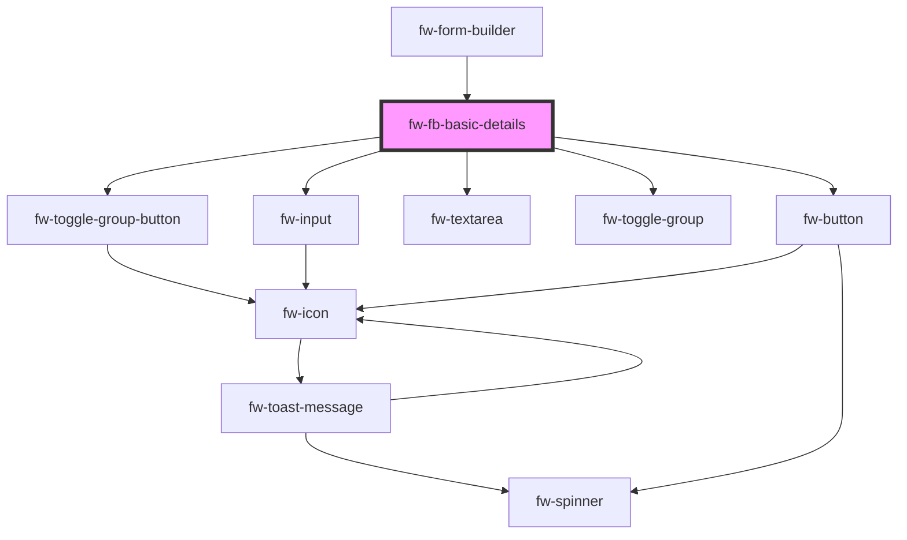

# fw-fb-basic-details

<!-- Auto Generated Below -->

## Properties

| Property          | Attribute           | Description                                | Type  | Default     |
| ----------------- | ------------------- | ------------------------------------------ | ----- | ----------- |
| `jsonFormBuilder` | `json-form-builder` | json data input to render the form builder | `any` | `undefined` |

## Events

| Event      | Description                                   | Type               |
| ---------- | --------------------------------------------- | ------------------ |
| `fwChange` | Triggered when the card in focus is selected. | `CustomEvent<any>` |

## Dependencies

### Used by

 - [fw-form-builder](..)

### Depends on

- [fw-toggle-group-button](../../toggle-group-button)
- [fw-input](../../input)
- [fw-textarea](../../textarea)
- [fw-toggle-group](../../toggle-group)
- [fw-button](../../button)

### Graph

----------------------------------------------

Built with ❤ at Freshworks
