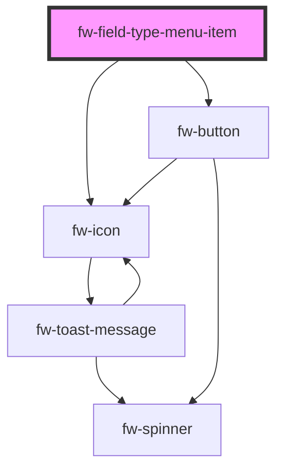

# fw-field-type-menu-item

<!-- Auto Generated Below -->

## Properties

| Property              | Attribute               | Description                                                                                                | Type      | Default     |
| --------------------- | ----------------------- | ---------------------------------------------------------------------------------------------------------- | --------- | ----------- |
| `dataProvider`        | `data-provider`         | data source used to set and edit the field values                                                          | `any`     | `null`      |
| `disabled`            | `disabled`              | Disables the component on the interface. If the attribute’s value is undefined, the value is set to false. | `boolean` | `false`     |
| `iconBackgroundColor` | `icon-background-color` | backgroundcolor for the icon                                                                               | `string`  | `'#ebeff3'` |
| `iconName`            | `icon-name`             | set the icon path to be used                                                                               | `string`  | `''`        |
| `index`               | `index`                 | index attached inside the parent group component                                                           | `number`  | `-1`        |
| `label`               | `label`                 | Label displayed as header in the card.                                                                     | `string`  | `''`        |
| `name`                | `name`                  | Name of the component, saved as part of the form data.                                                     | `string`  | `''`        |
| `value`               | `value`                 | field type attached to the item which will be broadcasted for adding the field type.                       | `string`  | `''`        |

## Events

| Event        | Description                                   | Type               |
| ------------ | --------------------------------------------- | ------------------ |
| `fwAddClick` | Triggered when the card in focus is selected. | `CustomEvent<any>` |

## Dependencies

### Depends on

- [fw-icon](../../icon)
- [fw-button](../../button)

### Graph

----------------------------------------------

Built with ❤ at Freshworks
