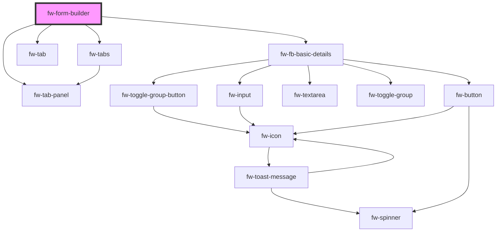

# fw-form-builder

<!-- Auto Generated Below -->

## Properties

| Property          | Attribute           | Description                                            | Type     | Default     |
| ----------------- | ------------------- | ------------------------------------------------------ | -------- | ----------- |
| `jsonFormBuilder` | `json-form-builder` | json data input to render the form builder             | `any`    | `undefined` |
| `name`            | `name`              | Name of the component, saved as part of the form data. | `string` | `''`        |

## Events

| Event      | Description                                       | Type               |
| ---------- | ------------------------------------------------- | ------------------ |
| `fwExpand` | Triggered when the field is expanded or collapsed | `CustomEvent<any>` |

## Dependencies

### Depends on

- [fw-tabs](../tabs)
- [fw-tab](../tab)
- [fw-tab-panel](../tab-panel)
- [fw-fb-basic-details](fb-basic-details)

### Graph

----------------------------------------------

Built with ❤ at Freshworks
