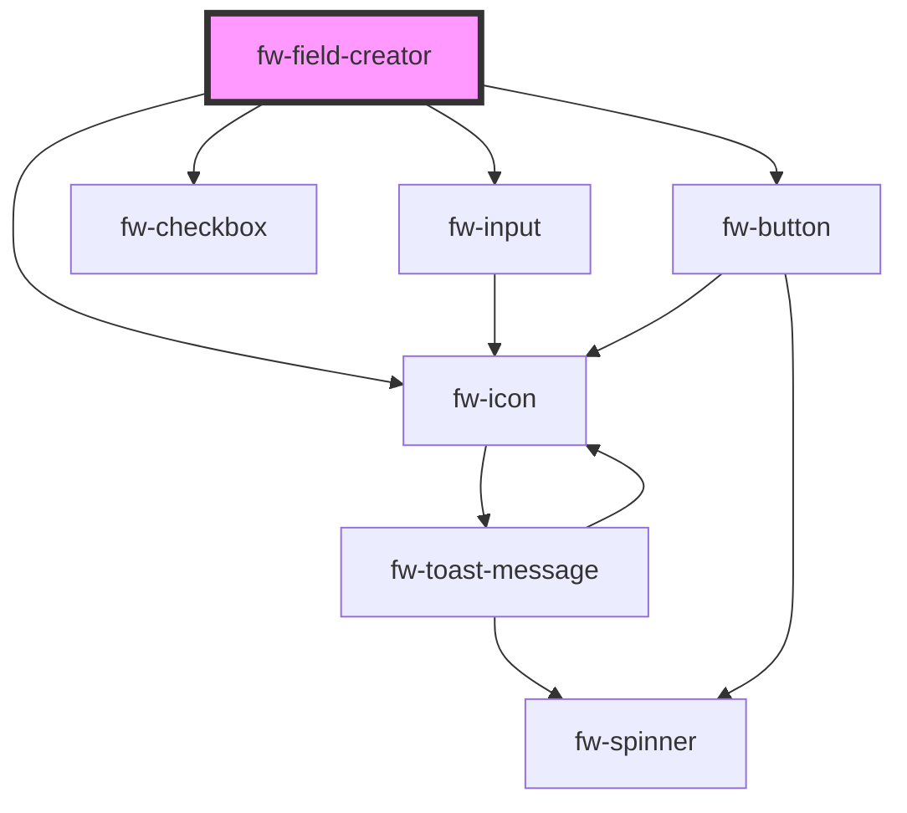

# fw-field-type-menu-item

<!-- Auto Generated Below -->

## Properties

| Property       | Attribute       | Description                                                                                                | Type      | Default |
| -------------- | --------------- | ---------------------------------------------------------------------------------------------------------- | --------- | ------- |
| `dataProvider` | `data-provider` | data source used to set and edit the field values                                                          | `any`     | `null`  |
| `disabled`     | `disabled`      | Disables the component on the interface. If the attribute’s value is undefined, the value is set to false. | `boolean` | `false` |
| `expanded`     | `expanded`      | Property to determine expanded state or collapsed                                                          | `boolean` | `false` |
| `index`        | `index`         | index attached inside the parent group component                                                           | `number`  | `-1`    |
| `name`         | `name`          | Name of the component, saved as part of the form data.                                                     | `string`  | `''`    |

## Events

| Event      | Description                                           | Type               |
| ---------- | ----------------------------------------------------- | ------------------ |
| `fwExpand` | Triggered when the field is expanded or collapsed     | `CustomEvent<any>` |
| `fwSubmit` | Triggered when the field details need to be submitted | `CustomEvent<any>` |

## Dependencies

### Depends on

- [fw-input](../input)
- [fw-checkbox](../checkbox)
- [fw-icon](../icon)
- [fw-button](../button)

### Graph

----------------------------------------------

Built with ❤ at Freshworks
