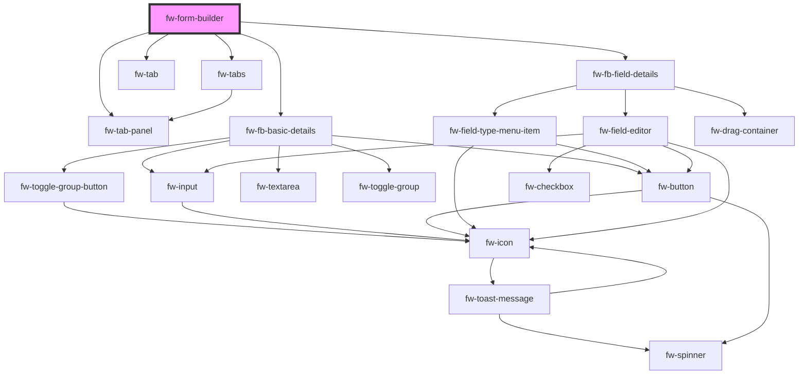

# fw-form-builder

<!-- Auto Generated Below -->

## Properties

| Property     | Attribute     | Description                                            | Type     | Default     |
| ------------ | ------------- | ------------------------------------------------------ | -------- | ----------- |
| `jsonPreset` | `json-preset` | json data input to render the form builder             | `any`    | `undefined` |
| `name`       | `name`        | Name of the component, saved as part of the form data. | `string` | `''`        |

## Events

| Event      | Description                                      | Type               |
| ---------- | ------------------------------------------------ | ------------------ |
| `fwUpdate` | Triggered when any change in the form is updated | `CustomEvent<any>` |

## Methods

### `setFormCreated(value: boolean) => Promise<void>`

#### Returns

Type: `Promise<void>`

## Dependencies

### Depends on

- [fw-tabs](../tabs)
- [fw-tab](../tab)
- [fw-tab-panel](../tab-panel)
- [fw-fb-basic-details](fb-basic-details)
- [fw-fb-field-details](fb-field)

### Graph

----------------------------------------------

Built with ❤ at Freshworks
