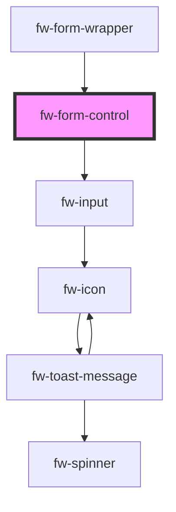

# fw-form-control

<!-- Auto Generated Below -->

## Properties

| Property      | Attribute     | Description | Type     | Default     |
| ------------- | ------------- | ----------- | -------- | ----------- |
| `error`       | `error`       |             | `any`    | `undefined` |
| `inputType`   | `input-type`  |             | `any`    | `undefined` |
| `label`       | `label`       |             | `any`    | `undefined` |
| `name`        | `name`        |             | `string` | `''`        |
| `placeholder` | `placeholder` |             | `any`    | `undefined` |
| `required`    | `required`    |             | `any`    | `undefined` |
| `touched`     | `touched`     |             | `any`    | `undefined` |
| `type`        | `type`        |             | `any`    | `undefined` |

## Dependencies

### Used by

 - [fw-form-wrapper](../form-wrapper)

### Depends on

- [fw-input](../input)

### Graph

----------------------------------------------

Built with ❤ at Freshworks
