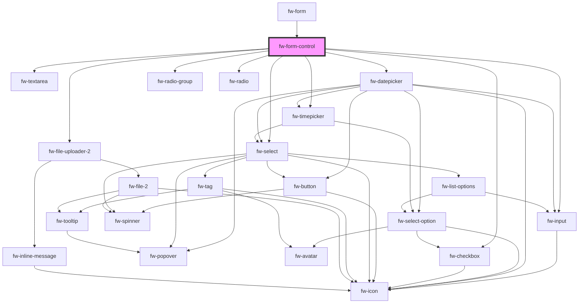

# Form Control (fw-form-control)

`Form Control` component used with `fw-form` component. Please refer [fw-form](../form/#demo-static-form) for usage 

<!-- Auto Generated Below -->

## Properties

| Property       | Attribute       | Description                                                                                                                                               | Type                                                                                                                                                                                                   | Default     |
| -------------- | --------------- | --------------------------------------------------------------------------------------------------------------------------------------------------------- | ------------------------------------------------------------------------------------------------------------------------------------------------------------------------------------------------------ | ----------- |
| `choices`      | `choices`       |                                                                                                                                                           | `any`                                                                                                                                                                                                  | `[]`        |
| `controlProps` | `control-props` | Contains values for crayons components. Useful when rendering crayons components implicitly via form-control. Not required when using controls via slots. | `any`                                                                                                                                                                                                  | `undefined` |
| `disabled`     | `disabled`      | Disable the field from being editable                                                                                                                     | `boolean`                                                                                                                                                                                              | `false`     |
| `error`        | `error`         |                                                                                                                                                           | `string`                                                                                                                                                                                               | `''`        |
| `fieldProps`   | `field-props`   | Additional props can be passed here for crayons components. Useful when rendering crayons components implicitly via form-control.                         | `any`                                                                                                                                                                                                  | `{}`        |
| `hint`         | `hint`          |                                                                                                                                                           | `string`                                                                                                                                                                                               | `''`        |
| `label`        | `label`         |                                                                                                                                                           | `any`                                                                                                                                                                                                  | `undefined` |
| `name`         | `name`          |                                                                                                                                                           | `any`                                                                                                                                                                                                  | `undefined` |
| `placeholder`  | `placeholder`   |                                                                                                                                                           | `string`                                                                                                                                                                                               | `''`        |
| `required`     | `required`      |                                                                                                                                                           | `boolean`                                                                                                                                                                                              | `false`     |
| `shouldRender` | `should-render` | Prop to determine whether to render the form-control or not. Default to true.                                                                             | `boolean`                                                                                                                                                                                              | `true`      |
| `touched`      | `touched`       |                                                                                                                                                           | `boolean`                                                                                                                                                                                              | `false`     |
| `type`         | `type`          |                                                                                                                                                           | `"CHECKBOX" \| "DATE" \| "DATE_TIME" \| "DECIMAL" \| "DROPDOWN" \| "EMAIL" \| "FILES" \| "MULTI_SELECT" \| "NUMBER" \| "PARAGRAPH" \| "RADIO" \| "RELATIONSHIP" \| "TEL" \| "TEXT" \| "TIME" \| "URL"` | `'TEXT'`    |
| `value`        | `value`         | Value of the slotted custom field on fw-form-control                                                                                                      | `any`                                                                                                                                                                                                  | `undefined` |

## Methods

### `setFocus() => Promise<void>`

Set Focus on the child

#### Returns

Type: `Promise<void>`

## Dependencies

### Used by

 - [fw-form](../form)

### Depends on

- [fw-input](../input)
- [fw-textarea](../textarea)
- [fw-datepicker](../datepicker)
- [fw-checkbox](../checkbox)
- [fw-radio-group](../radio-group)
- [fw-radio](../radio)
- [fw-select](../select)
- [fw-timepicker](../timepicker)
- [fw-file-uploader-2](../file-uploader-2)

### Graph

----------------------------------------------

Built with ❤ at Freshworks
