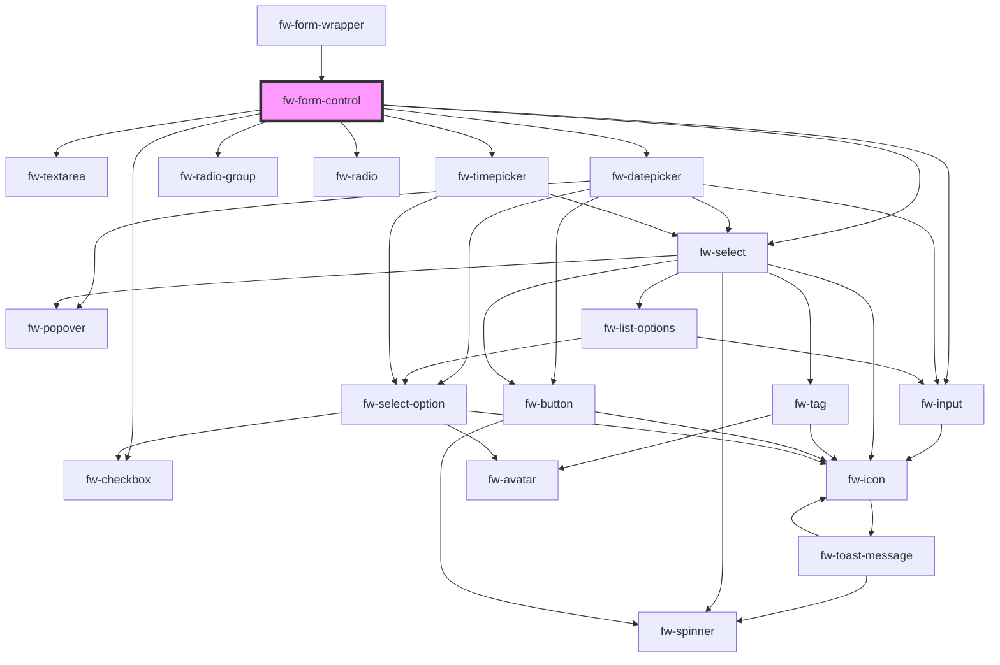

# fw-form-control

<!-- Auto Generated Below -->

## Properties

| Property      | Attribute     | Description | Type                                                                                                                                              | Default     |
| ------------- | ------------- | ----------- | ------------------------------------------------------------------------------------------------------------------------------------------------- | ----------- |
| `choices`     | `choices`     |             | `any`                                                                                                                                             | `undefined` |
| `error`       | `error`       |             | `string`                                                                                                                                          | `''`        |
| `hint`        | `hint`        |             | `string`                                                                                                                                          | `''`        |
| `label`       | `label`       |             | `string`                                                                                                                                          | `''`        |
| `name`        | `name`        |             | `string`                                                                                                                                          | `''`        |
| `placeholder` | `placeholder` |             | `string`                                                                                                                                          | `''`        |
| `required`    | `required`    |             | `boolean`                                                                                                                                         | `false`     |
| `touched`     | `touched`     |             | `boolean`                                                                                                                                         | `false`     |
| `type`        | `type`        |             | `"CHECKBOX" \| "DATE" \| "DECIMAL" \| "DROPDOWN" \| "EMAIL" \| "MULTI_SELECT" \| "NUMBER" \| "PARAGRAPH" \| "RADIO" \| "TEXT" \| "TIME" \| "URL"` | `'TEXT'`    |

## Dependencies

### Used by

 - [fw-form-wrapper](../form-wrapper)

### Depends on

- [fw-input](../input)
- [fw-textarea](../textarea)
- [fw-datepicker](../datepicker)
- [fw-checkbox](../checkbox)
- [fw-radio-group](../radio-group)
- [fw-radio](../radio)
- [fw-select](../select)
- [fw-timepicker](../timepicker)

### Graph

----------------------------------------------

Built with ❤ at Freshworks
