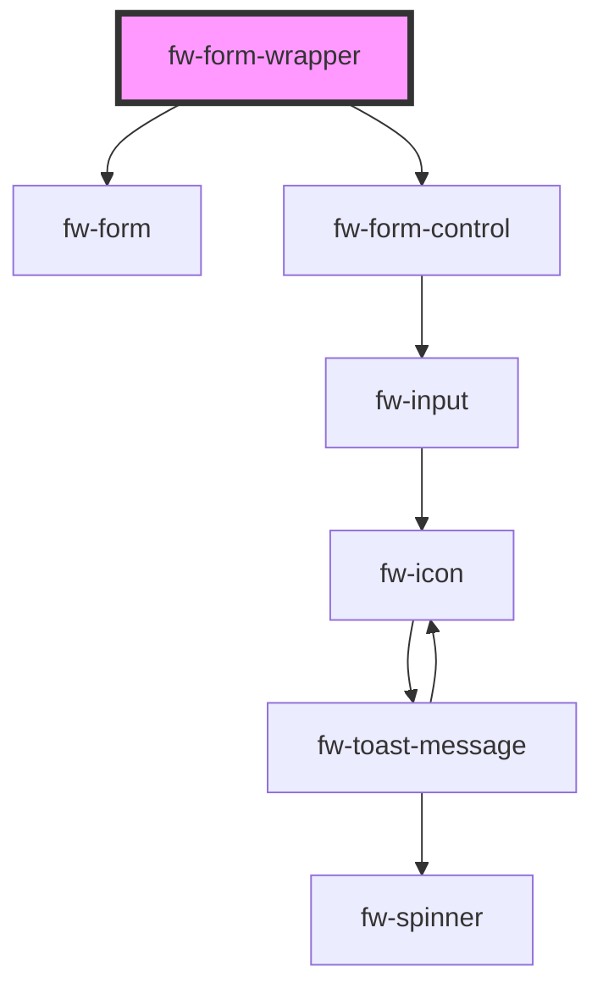

# fw-form-wrapper

<!-- Auto Generated Below -->

## Properties

| Property           | Attribute           | Description | Type  | Default     |
| ------------------ | ------------------- | ----------- | ----- | ----------- |
| `formSchema`       | `form-schema`       |             | `any` | `undefined` |
| `initialErrors`    | `initial-errors`    |             | `any` | `undefined` |
| `initialValues`    | `initial-values`    |             | `any` | `undefined` |
| `validationSchema` | `validation-schema` |             | `any` | `undefined` |

## Dependencies

### Depends on

- [fw-form](../form)
- [fw-form-control](../form-control)

### Graph

----------------------------------------------

Built with ❤ at Freshworks
