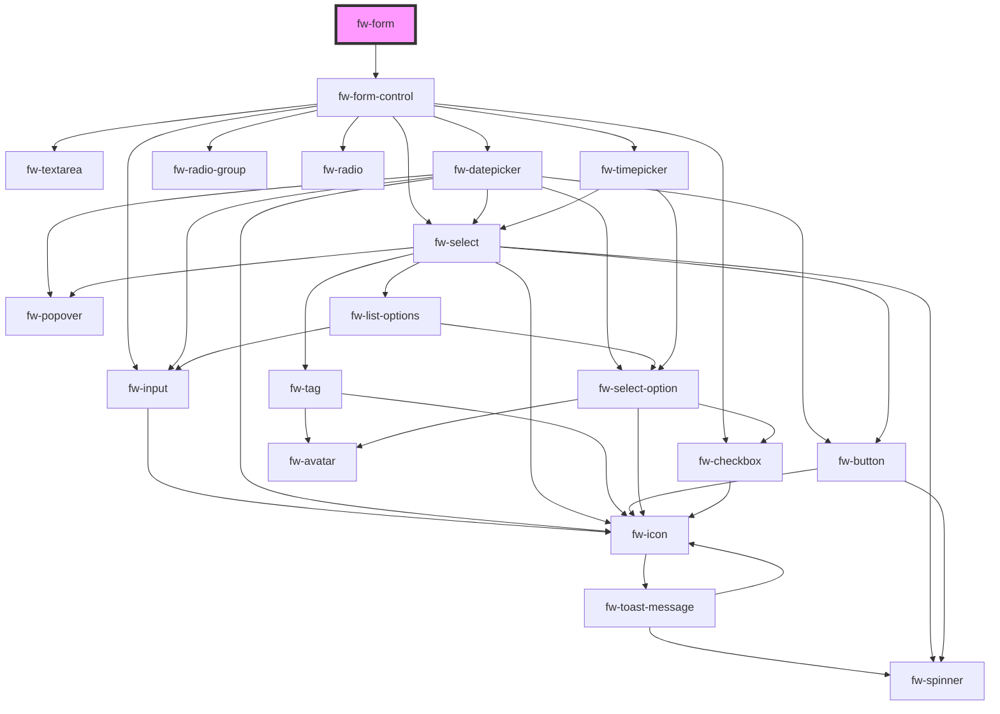

# Form (fw-form)

**Dynamic Form** - Render dynamic form based on the schema passed as a prop.\
**Static Form** - Render form based on the children passed as slots.

## Demo Dynamic Form

Pass `formSchema` to render Dynamic Form. You can also pass `initialValues` to the form.

```html live
<div id="form-container">
  <button id="submit">Submit</button>
  <button id="reset">Reset</button>
</div>
<script type="application/javascript">
  var form = document.createElement('fw-form');
  var formContainer = document.querySelector('#form-container');
  document.querySelector('#submit').addEventListener('click', async (e) => {
    const { values, isValid } = await form.doSubmit(e);
    console.log({ values, isValid });

    if (isValid) {
      // make ajax post end point with values
      // fetch("/post",values);

      // if error from backend , set Errors - passing key value pair
      form.setFieldErrors({
        first_name: 'First Name must be unique <<Server Error>>',
      });

      // reset the form if required if success
      // formRef.current.doReset(e);
    }
  });
  document.querySelector('#reset').addEventListener('click', (e) => {
    form.doReset(e);
  });
  var formSchema = {
    title: 'Test Form',
    name: 'Test Form',
    fields: [
      {
        id: '2978f820-704b-46c7-9f88-110e14e34a8c',
        name: 'first_name',
        label: 'First Name',
        type: 'TEXT',
        position: 3,
        required: true,
        editable: true,
        visible: true,
        deleted: false,
        link: null,
        placeholder: 'Enter…',
        hint: 'Please provide a text of at max 100 characters',
        field_options: { lego_unique_field: 'true' },
        filterable: true,
        searchable: true,
        parent_id: null,
        choices: [],
      },

      {
        id: '3978f820-704b-46c7-9f88-110e14e34a8c',
        name: 'last_name',
        label: 'Last Name',
        type: 'TEXT',
        position: 3,
        required: true,
        editable: true,
        visible: true,
        deleted: false,
        link: null,
        placeholder: 'Enter…',
        hint: 'Please provide a text of at max 100 characters',
        field_options: { lego_unique_field: 'true' },
        filterable: true,
        searchable: true,
        parent_id: null,
        choices: [],
      },

      {
        id: '42aecb8f-25cf-47ce-89c6-5410fe3d4315',
        name: 'languages_known',
        label: 'Languages Known',
        type: 'MULTI_SELECT',
        position: 13,
        required: true,
        editable: true,
        visible: true,
        deleted: false,
        link: null,
        placeholder: 'Enter…',
        hint: 'Select one or more values',
        field_options: {},
        filterable: true,
        searchable: true,
        parent_id: null,
        choices: [
          {
            id: 1,
            value: 'English',
            position: 1,
            dependent_ids: {},
          },
          {
            id: 2,
            value: 'Hindi',
            position: 2,
            dependent_ids: {},
          },
          {
            id: 3,
            value: 'Tamil',
            position: 3,
            dependent_ids: {},
          },
        ],
      },

      {
        id: '6978f820-704b-46c7-9f88-110e14e34a8c',
        name: 'email',
        label: 'Email',
        type: 'EMAIL',
        position: 3,
        required: true,
        editable: true,
        visible: true,
        deleted: false,
        link: null,
        placeholder: 'Enter…',
        hint: 'Please provide an email Id',
        field_options: {},
        filterable: true,
        searchable: true,
        parent_id: null,
        choices: [],
      },

      {
        id: 'f319f86f-1b6a-49cb-b4b6-cf487be94595',
        name: 'date_of_birth',
        label: 'Date Of Birth',
        type: 'DATE',
        position: 11,
        required: true,
        editable: true,
        visible: true,
        deleted: false,
        link: null,
        Placeholder: 'Enter…',
        hint: 'Please enter your date of birth',
        field_options: {},
        filterable: true,
        searchable: true,
        parent_id: null,
        choices: [],
      },

      {
        id: 'f319f86f-1b6a-49cb-b4b6-cf487be94595',
        name: 'landmark',
        label: 'Landmark',
        type: 'PARAGRAPH',
        position: 7,
        required: true,
        editable: true,
        visible: true,
        deleted: false,
        link: null,
        Placeholder: 'Enter some text…',
        hint: 'Please enter the nearest landmark',
        field_options: {},
        filterable: false,
        searchable: true,
        parent_id: null,
        choices: [],
      },

      {
        id: 'f319f86f-1b6a-49cb-b4b6-cf487be94595',
        name: 'is_indian_citizen',
        label: 'Indian Citizen?',
        type: 'CHECKBOX',
        position: 7,
        required: true,
        editable: true,
        visible: true,
        deleted: false,
        link: null,
        placeholder: null,
        hint: 'Check or Uncheck the box',
        field_options: {},
        filterable: true,
        searchable: true,
        parent_id: null,
        choices: [],
      },

      {
        id: '8978f820-704b-46c7-9f88-110e14e34a8c',
        name: 'phone_number',
        label: 'Phone number',
        type: 'TEXT',
        position: 3,
        required: true,
        editable: true,
        visible: true,
        deleted: false,
        link: null,
        placeholder: 'Enter…',
        hint: 'Please provide your phone number',
        field_options: {},
        filterable: true,
        searchable: true,
        parent_id: null,
        choices: [],
      },

      {
        id: 'f319f86f-1b6a-49cb-b4b6-cf487be94595',
        name: 'pincode',
        label: 'Pincode',
        type: 'NUMBER',
        position: 8,
        required: false,
        editable: true,
        visible: true,
        deleted: false,
        link: null,
        Placeholder: 'Enter…',
        hint: 'Please enter your Pincode',
        field_options: {},
        filterable: true,
        searchable: true,
        parent_id: null,
        choices: [],
      },

      {
        id: 'ba53775e-2948-4065-8a59-d99d4494e845',
        name: 'gender',
        label: 'Gender',
        type: 'RADIO',
        position: 5,
        required: true,
        editable: true,
        visible: true,
        deleted: false,
        link: null,
        placeholder: null,
        hint: 'Please specify your gender',
        field_options: {},
        filterable: true,
        searchable: true,
        parent_id: null,
        choices: [
          {
            id: 1,
            value: 'Female',
            position: 1,
            dependent_ids: {},
          },
          {
            id: 2,
            value: 'Male',
            position: 2,
            dependent_ids: {},
          },
        ],
      },

      {
        id: '42aecb8f-25cf-47ce-89c6-5410fe3d4315',
        name: 'order_status',
        label: 'Order Status',
        type: 'DROPDOWN',
        position: 4,
        required: true,
        editable: true,
        visible: true,
        deleted: false,
        link: null,
        placeholder: 'Enter…',
        hint: 'Select a value',
        field_options: {},
        filterable: true,
        searchable: true,
        parent_id: null,
        choices: [
          {
            id: 1,
            value: 'open',
            position: 1,
            dependent_ids: {},
          },
          {
            id: 2,
            value: 'pending',
            position: 2,
            dependent_ids: {},
          },
          {
            id: 3,
            value: 'closed',
            position: 3,
            dependent_ids: {},
          },
        ],
      },

      {
        id: 'f319f86f-1b6a-49cb-b4b6-cf487be94595',
        name: 'amount_paid',
        label: 'Amount Paid',
        type: 'DECIMAL',
        position: 10,
        required: true,
        editable: true,
        visible: true,
        deleted: false,
        link: null,
        Placeholder: 'Enter…',
        hint: 'Please enter the amount paid',
        field_options: {},
        filterable: true,
        searchable: true,
        parent_id: null,
        choices: [],
      },
    ],
  };
  var initialValues = {
    is_indian_citizen: true,
  };
  formContainer.prepend(form);
  // do any customisation on the field schema to match the props of crayons components.
  var fields = formSchema.fields.map((field) => {
    // select expects `text` and `value` prop
    if (field.type === "DROPDOWN" || field.type === "MULTI_SELECT") {
      return {
        ...field,
        choices: field.choices?.map((f) =>{
          return {
            ...f,
            text: f.value,
            value: f.id
          }
        })
      };
    } else return field;
  });

  var formSchema1 = {
    ...formSchema,
    fields: fields,
  };
  form.formSchema = formSchema1;
  form.initialValues = initialValues;
</script>
```

## Usage Dynamic Form

<code-group>
<code-block title="HTML">
```html 
<div id="form-container">
  <button id="submit">Submit</button>
  <button id="reset">Reset</button>
</div>
<script type="application/javascript">
  var form = document.createElement('fw-form');
  var formContainer = document.querySelector('#form-container');
  document.querySelector('#submit').addEventListener('click', async (e) => {
    const { values, isValid } = await form.doSubmit(e);
    console.log({ values, isValid });

    if (isValid) {
      // make ajax post end point with values
      // fetch("/post",values);

      // if error from backend , set Errors - passing key value pair
      // set Errors on the form
      form.setFieldErrors({
        first_name: 'First Name must be unique <<Server Error>>',
      });

      // reset the form if required if success
      // formRef.current.doReset(e);
    }

    });
    document.querySelector('#reset').addEventListener('click', (e) => {
      form.doReset(e);
    });
    var formSchema = {
    title: 'Test Form',
    name: 'Test Form',
    fields: [
      {
        id: '2978f820-704b-46c7-9f88-110e14e34a8c',
        name: 'first_name',
        label: 'First Name',
        type: 'TEXT',
        position: 3,
        required: true,
        editable: true,
        visible: true,
        deleted: false,
        link: null,
        placeholder: 'Enter…',
        hint: 'Please provide a text of at max 100 characters',
        field_options: { lego_unique_field: 'true' },
        filterable: true,
        searchable: true,
        parent_id: null,
        choices: [],
      },

      {
        id: '3978f820-704b-46c7-9f88-110e14e34a8c',
        name: 'last_name',
        label: 'Last Name',
        type: 'TEXT',
        position: 3,
        required: true,
        editable: true,
        visible: true,
        deleted: false,
        link: null,
        placeholder: 'Enter…',
        hint: 'Please provide a text of at max 100 characters',
        field_options: { lego_unique_field: 'true' },
        filterable: true,
        searchable: true,
        parent_id: null,
        choices: [],
      },

      {
        id: '42aecb8f-25cf-47ce-89c6-5410fe3d4315',
        name: 'languages_known',
        label: 'Languages Known',
        type: 'MULTI_SELECT',
        position: 13,
        required: true,
        editable: true,
        visible: true,
        deleted: false,
        link: null,
        placeholder: 'Enter…',
        hint: 'Select one or more values',
        field_options: {},
        filterable: true,
        searchable: true,
        parent_id: null,
        choices: [
          {
            id: 1,
            value: 'English',
            position: 1,
            dependent_ids: {},
          },
          {
            id: 2,
            value: 'Hindi',
            position: 2,
            dependent_ids: {},
          },
          {
            id: 3,
            value: 'Tamil',
            position: 3,
            dependent_ids: {},
          },
        ],
      },

      {
        id: '6978f820-704b-46c7-9f88-110e14e34a8c',
        name: 'email',
        label: 'Email',
        type: 'EMAIL',
        position: 3,
        required: true,
        editable: true,
        visible: true,
        deleted: false,
        link: null,
        placeholder: 'Enter…',
        hint: 'Please provide an email Id',
        field_options: {},
        filterable: true,
        searchable: true,
        parent_id: null,
        choices: [],
      },

      {
        id: 'f319f86f-1b6a-49cb-b4b6-cf487be94595',
        name: 'date_of_birth',
        label: 'Date Of Birth',
        type: 'DATE',
        position: 11,
        required: true,
        editable: true,
        visible: true,
        deleted: false,
        link: null,
        Placeholder: 'Enter…',
        hint: 'Please enter your date of birth',
        field_options: {},
        filterable: true,
        searchable: true,
        parent_id: null,
        choices: [],
      },

      {
        id: 'f319f86f-1b6a-49cb-b4b6-cf487be94595',
        name: 'landmark',
        label: 'Landmark',
        type: 'PARAGRAPH',
        position: 7,
        required: true,
        editable: true,
        visible: true,
        deleted: false,
        link: null,
        Placeholder: 'Enter some text…',
        hint: 'Please enter the nearest landmark',
        field_options: {},
        filterable: false,
        searchable: true,
        parent_id: null,
        choices: [],
      },

      {
        id: 'f319f86f-1b6a-49cb-b4b6-cf487be94595',
        name: 'is_indian_citizen',
        label: 'Indian Citizen?',
        type: 'CHECKBOX',
        position: 7,
        required: true,
        editable: true,
        visible: true,
        deleted: false,
        link: null,
        placeholder: null,
        hint: 'Check or Uncheck the box',
        field_options: {},
        filterable: true,
        searchable: true,
        parent_id: null,
        choices: [],
      },

      {
        id: '8978f820-704b-46c7-9f88-110e14e34a8c',
        name: 'phone_number',
        label: 'Phone number',
        type: 'TEXT',
        position: 3,
        required: true,
        editable: true,
        visible: true,
        deleted: false,
        link: null,
        placeholder: 'Enter…',
        hint: 'Please provide your phone number',
        field_options: {},
        filterable: true,
        searchable: true,
        parent_id: null,
        choices: [],
      },

      {
        id: 'f319f86f-1b6a-49cb-b4b6-cf487be94595',
        name: 'pincode',
        label: 'Pincode',
        type: 'NUMBER',
        position: 8,
        required: false,
        editable: true,
        visible: true,
        deleted: false,
        link: null,
        Placeholder: 'Enter…',
        hint: 'Please enter your Pincode',
        field_options: {},
        filterable: true,
        searchable: true,
        parent_id: null,
        choices: [],
      },

      {
        id: 'ba53775e-2948-4065-8a59-d99d4494e845',
        name: 'gender',
        label: 'Gender',
        type: 'RADIO',
        position: 5,
        required: true,
        editable: true,
        visible: true,
        deleted: false,
        link: null,
        placeholder: null,
        hint: 'Please specify your gender',
        field_options: {},
        filterable: true,
        searchable: true,
        parent_id: null,
        choices: [
          {
            id: 1,
            value: 'Female',
            position: 1,
            dependent_ids: {},
          },
          {
            id: 2,
            value: 'Male',
            position: 2,
            dependent_ids: {},
          },
        ],
      },

      {
        id: '42aecb8f-25cf-47ce-89c6-5410fe3d4315',
        name: 'order_status',
        label: 'Order Status',
        type: 'DROPDOWN',
        position: 4,
        required: true,
        editable: true,
        visible: true,
        deleted: false,
        link: null,
        placeholder: 'Enter…',
        hint: 'Select a value',
        field_options: {},
        filterable: true,
        searchable: true,
        parent_id: null,
        choices: [
          {
            id: 1,
            value: 'open',
            position: 1,
            dependent_ids: {},
          },
          {
            id: 2,
            value: 'pending',
            position: 2,
            dependent_ids: {},
          },
          {
            id: 3,
            value: 'closed',
            position: 3,
            dependent_ids: {},
          },
        ],
      },

      {
        id: 'f319f86f-1b6a-49cb-b4b6-cf487be94595',
        name: 'amount_paid',
        label: 'Amount Paid',
        type: 'DECIMAL',
        position: 10,
        required: true,
        editable: true,
        visible: true,
        deleted: false,
        link: null,
        Placeholder: 'Enter…',
        hint: 'Please enter the amount paid',
        field_options: {},
        filterable: true,
        searchable: true,
        parent_id: null,
        choices: [],
      },
    ],

};
var initialValues = {
is_indian_citizen: true,
};
formContainer.prepend(form);
// do any customisation on the field schema to match the props of crayons components.
const fields = formSchema?.fields?.map((field) => {
    // select expects `text` and `value` prop
    if (field.type === "DROPDOWN" || field.type === "MULTI_SELECT") {
      return {
        ...field,
        choices: field.choices?.map((f) =>{
          return {
            ...f,
            text: f.value,
            value: f.id
          }
        })
      };
    } else return field;
});

const formSchema1 = {
  ...formSchema,
  fields: fields,
};
form.formSchema = formSchema1;

form.initialValues = initialValues;
</script>

````
</code-block>

<code-block title="React">
```jsx
import React, {useRef} from "react";
import ReactDOM from "react-dom";
import {FwForm,FwButton} from "@freshworks/crayons/react";
function App() {
  const formSchema = {
  title: "Test Form",
  name: "Test Form",
  fields: [
    {
      id: "2978f820-704b-46c7-9f88-110e14e34a8c",
      name: "first_name",
      label: "First Name",
      type: "TEXT",
      position: 3,
      required: true,
      editable: true,
      visible: true,
      deleted: false,
      link: null,
      placeholder: "Enter…",
      hint: "Please provide a text of at max 100 characters",
      field_options: { lego_unique_field: "true" },
      filterable: true,
      searchable: true,
      parent_id: null,
      choices: [],
    },

    {
      id: "3978f820-704b-46c7-9f88-110e14e34a8c",
      name: "last_name",
      label: "Last Name",
      type: "TEXT",
      position: 3,
      required: true,
      editable: true,
      visible: true,
      deleted: false,
      link: null,
      placeholder: "Enter…",
      hint: "Please provide a text of at max 100 characters",
      field_options: { lego_unique_field: "true" },
      filterable: true,
      searchable: true,
      parent_id: null,
      choices: [],
    },

    {
      id: "42aecb8f-25cf-47ce-89c6-5410fe3d4315",
      name: "languages_known",
      label: "Languages Known",
      type: "MULTI_SELECT",
      position: 13,
      required: true,
      editable: true,
      visible: true,
      deleted: false,
      link: null,
      placeholder: "Enter…",
      hint: "Select one or more values",
      field_options: {},
      filterable: true,
      searchable: true,
      parent_id: null,
      choices: [
        {
          id: 1,
          value: "English",
          position: 1,
          dependent_ids: {},
        },
        {
          id: 2,
          value: "Hindi",
          position: 2,
          dependent_ids: {},
        },
        {
          id: 3,
          value: "Tamil",
          position: 3,
          dependent_ids: {},
        },
      ],
    },

    {
      id: "6978f820-704b-46c7-9f88-110e14e34a8c",
      name: "email",
      label: "Email",
      type: "EMAIL",
      position: 3,
      required: true,
      editable: true,
      visible: true,
      deleted: false,
      link: null,
      placeholder: "Enter…",
      hint: "Please provide an email Id",
      field_options: {},
      filterable: true,
      searchable: true,
      parent_id: null,
      choices: [],
    },

    {
      id: "f319f86f-1b6a-49cb-b4b6-cf487be94595",
      name: "date_of_birth",
      label: "Date Of Birth",
      type: "DATE",
      position: 11,
      required: true,
      editable: true,
      visible: true,
      deleted: false,
      link: null,
      placeholder: "Enter…",
      hint: "Please enter your date of birth",
      field_options: {},
      filterable: true,
      searchable: true,
      parent_id: null,
      choices: [],
    },

    {
      id: "f319f86f-1b6a-49cb-b4b6-cf487be94595",
      name: "landmark",
      label: "Landmark",
      type: "PARAGRAPH",
      position: 7,
      required: true,
      editable: true,
      visible: true,
      deleted: false,
      link: null,
      placeholder: "Enter some text…",
      hint: "Please enter the nearest landmark",
      field_options: {},
      filterable: false,
      searchable: true,
      parent_id: null,
      choices: [],
    },

    {
      id: "f319f86f-1b6a-49cb-b4b6-cf487be94595",
      name: "is_indian_citizen",
      label: "Indian Citizen?",
      type: "CHECKBOX",
      position: 7,
      required: true,
      editable: true,
      visible: true,
      deleted: false,
      link: null,
      placeholder: null,
      hint: "Check or Uncheck the box",
      field_options: {},
      filterable: true,
      searchable: true,
      parent_id: null,
      choices: [],
    },

    {
      id: "8978f820-704b-46c7-9f88-110e14e34a8c",
      name: "phone_number",
      label: "Phone number",
      type: "TEXT",
      position: 3,
      required: true,
      editable: true,
      visible: true,
      deleted: false,
      link: null,
      placeholder: "Enter…",
      hint: "Please provide your phone number",
      field_options: {},
      filterable: true,
      searchable: true,
      parent_id: null,
      choices: [],
    },

    {
      id: "f319f86f-1b6a-49cb-b4b6-cf487be94595",
      name: "pincode",
      label: "Pincode",
      type: "NUMBER",
      position: 8,
      required: false,
      editable: true,
      visible: true,
      deleted: false,
      link: null,
      placeholder: "Enter…",
      hint: "Please enter your Pincode",
      field_options: {},
      filterable: true,
      searchable: true, // For the field to be used as filter condition in search API, this needs to be set
      parent_id: null,
      choices: [],
    },

    {
      id: "ba53775e-2948-4065-8a59-d99d4494e845",
      name: "gender",
      label: "Gender",
      type: "RADIO",
      position: 5,
      required: true,
      editable: true,
      visible: true,
      deleted: false,
      link: null,
      placeholder: null,
      hint: "Please specify your gender",
      field_options: {},
      filterable: true,
      searchable: true,
      parent_id: null,
      choices: [
        {
          id: 1,
          value: "Female",
          position: 1,
          dependent_ids: {},
        },
        {
          id: 2,
          value: "Male",
          position: 2,
          dependent_ids: {},
        },
      ],
    },

    {
      id: "42aecb8f-25cf-47ce-89c6-5410fe3d4315",
      name: "order_status",
      label: "Order Status",
      type: "DROPDOWN",
      position: 4,
      required: true,
      editable: true,
      visible: true,
      deleted: false,
      link: null,
      placeholder: "Enter…",
      hint: "Select a value",
      field_options: {},
      filterable: true,
      searchable: true,
      parent_id: null,
      choices: [
        {
          id: 1,
          value: "open",
          position: 1,
          dependent_ids: {},
        },
        {
          id: 2,
          value: "pending",
          position: 2,
          dependent_ids: {},
        },
        {
          id: 3,
          value: "closed",
          position: 3,
          dependent_ids: {},
        },
      ],
    },

    {
      id: "f319f86f-1b6a-49cb-b4b6-cf487be94595",
      name: "amount_paid",
      label: "Amount Paid",
      type: "DECIMAL",
      position: 10,
      required: true,
      editable: true,
      visible: true,
      deleted: false,
      link: null,
      placeholder: "Enter…",
      hint: "Please enter the amount paid",
      field_options: {},
      filterable: true,
      searchable: true,
      parent_id: null,
      choices: [],
    }
  ],
};
// do any customisation on the field schema to match the props of crayons components.
var fields = formSchema?.fields?.map((field) => {
  // select expects `text` and `value` prop
  if (field.type === "DROPDOWN" || field.type === "MULTI_SELECT") {
    return {
      ...field,
      choices: field.choices?.map((f) =>{
        return {
          ...f,
          text: f.value,
          value: f.id
        }
      })
    };
  } else return field;
});

 var formSchema1 = {
  ...formSchema,
  fields: fields,
};
  
const initialValues = {
  is_indian_citizen: true,
  email: "test",
};
const formRef = useRef<any>(null);
  const handleFormSubmit = async (e: any) => {
    const { values, isValid, errors } = await formRef.current.doSubmit(e);
    console.log({ result: values, errors });

    // make ajax post end point with values
    // fetch("/post",values);

    // if error from backend , set Errors - passing key value pair
    if (isValid) {
      // set Errors on the form
      formRef.current.setFieldErrors({
        first_name: "First Name must be unique <<Server Error>>",
      });
      // reset the form if required if success
      // formRef.current.doReset(e);
    }
  };
  const handleFormReset = (e: any) => {
    formRef.current.doReset(e);
  };
  return (<div>
    <FwForm ref={formRef} formSchema={formSchema1} initialValues={initialValues}
     validate={async (values:any) => { // do custom validation and return error or {}
      return {
        // last_name: "last name is errored",
      };
    }}
    >
    </FwForm>
    <FwButton color="secondary" onClick={handleFormReset}>
           Reset Form
          </FwButton>
    <FwButton onClick={handleFormSubmit}>Submit Form</FwButton>
    </div>);
}
````

</code-block>
</code-group>

## Demo Static Form

You can pass `initialValues` to the form. Wrap all the form controls with `form-control` under `fw-form`.

For `Crayons` controls just pass the `type`, `name`, `placeholder`,`required`, `label` properties to `fw-form-control`.

For `custom` input controls, pass the custom input as `slot` to `fw-form-control`. For setting its value in the form, use the method like `handleCustomInput` shown in the below example.

```html live
<div id="static-form-container">
  <fw-form id="fw-static-form">
    <fw-form-control
      type="TEXT"
      name="first_name"
      placeholder="First Name"
      required
      label="First Name"
      id="first_name"
    ></fw-form-control>

    <fw-form-control
      type="TEXT"
      name="last_name"
      placeholder="Last Name"
      required
      label="Last Name"
      id="last_name"
    ></fw-form-control>

    <fw-form-control name="cin" required label="Custom native in">
      <input name="cin" id="cin" placeholder="custom input" autocomplete="off"
    /></fw-form-control>
  </fw-form>
  <button id="submit-static-form">Submit</button>
  <button id="reset-static-form">Reset</button>
</div>
<script type="application/javascript">
  var formStatic = document.querySelector('#fw-static-form');
  document
    .querySelector('#submit-static-form')
    .addEventListener('click', async (e) => {
      const { values, isValid } = await formStatic.doSubmit(e);
      console.log({ values, isValid });

      if (isValid) {
        // make ajax post end point with values
        // fetch("/post",values);

        // if error from backend , set Errors - passing key value pair
        formStatic.setFieldErrors({
          first_name: 'First Name must be unique <<Server Error>>',
        });

        // reset the form if required if success
        // formRef.current.doReset(e);
      }
    });
  document
    .querySelector('#reset-static-form')
    .addEventListener('click', (e) => {
      if (document.querySelector('#cin'))
        document.querySelector('#cin').value = '';
      formStatic.doReset(e);
    });

  var initialValues = {
    first_name: 'John',
  };
  formStatic.initialValues = initialValues;

  function handleCustomInput(e) {
    console.log('handle input');
    formStatic.setFieldValue([e.target.name], e.target.value);
  }

  document.querySelector('#cin').addEventListener('input', handleCustomInput);
  document.querySelector('#cin').addEventListener('change', handleCustomInput);
  document.querySelector('#cin').addEventListener('blur', handleCustomInput);
</script>
```

## Usage Static Form

<code-group>
<code-block title="HTML">
```html
<div id="static-form-container">
  <fw-form id="fw-static-form">
      <fw-form-control
      type="TEXT"
      name="first_name"
      placeholder="First Name"
      required
      label="First Name"
      id="first_name"
    ></fw-form-control>

    <fw-form-control
      type="TEXT"
      name="last_name"
      placeholder="Last Name"
      required
      label="Last Name"
      id="last_name"
    ></fw-form-control>

    <fw-form-control
      name="cin"
      required
      label="Custom native in"
    >
    <input name="cin" id="cin" placeholder="custom input"
    autocomplete="off"
    /></fw-form-control>
    </fw-form>

<button id="submit-static-form">Submit</button>
<button id="reset-static-form">Reset</button>

</div>
<script type="application/javascript">
  var formStatic = document.querySelector("#fw-static-form")
  document.querySelector('#submit-static-form').addEventListener('click', async (e) => {
    const { values, isValid } = await formStatic.doSubmit(e);
    console.log({ values, isValid });

    if (isValid) {
      // make ajax post end point with values
      // fetch("/post",values);

      // if error from backend , set Errors - passing key value pair
      formStatic.setFieldErrors({
        first_name: 'First Name must be unique <<Server Error>>',
      });

      // reset the form if required if success
      // formRef.current.doReset(e);
    }
  });
  document.querySelector('#reset-static-form').addEventListener('click', (e) => {
    if (document.querySelector('#cin'))
    document.querySelector('#cin').value = '';
    formStatic.doReset(e);
  });

  var initialValues = {
    first_name: "John",
  };
  formStatic.initialValues = initialValues;

  function handleCustomInput(e) {
    console.log('handle input');
    formStatic.setFieldValue([e.target.name], e.target.value);
  }

  document.querySelector('#cin').addEventListener('input', handleCustomInput);
  document.querySelector('#cin').addEventListener('change', handleCustomInput);
  document.querySelector('#cin').addEventListener('blur', handleCustomInput);
</script>

````
</code-block>

<code-block title="React">
```jsx
import React, {useRef} from "react";
import ReactDOM from "react-dom";
import {FwForm, FwFormControl,FwButton} from "@freshworks/crayons/react";
function App() {
  
  const initialValues = {
    first_name:"John"
  };
  const formRef = useRef<any>(null);
    const handleFormSubmit = async (e: any) => {
      const { values, isValid, errors } = await formRef.current.doSubmit(e);
      console.log({ result: values, errors });

      // make ajax post end point with values
      // fetch("/post",values);

      // if error from backend , set Errors - passing key value pair
      if (isValid) {
        // set Errors on the form
        formRef.current.setFieldErrors({
          first_name: "First Name must be unique <<Server Error>>",
        });
        // reset the form if required if success
        // formRef.current.doReset(e);
      }
    };
  const handleFormReset = (e: any) => {
    formRef.current.doReset(e);
  };
  return (<div>
            <FwForm ref={formRef} initialValues={initialValues}
            validate={async (values:any) => { // do custom validation and return error or {}
              if(!cin || !cin.length) {
                return {
                  cin: "cin is required",
                };
              }
              return {}
            }}>
              <FwFormControl
                  type="TEXT"
                  name="first_name"
                  required
                  label="Name"
                  placeholder="Enter First Name"
                  fieldProps={{ maxlength: 5 }}
              ></FwFormControl>

              <FwFormControl
                  type="TEXT"
                  name="cin"
                  required
                  label="Custom Input"
              >
                  <input
                    placeholder="cin"
                    id="cin"
                    maxLength={5}
                    name="cin"
                    required
                    onChange={(e) =>
                      formRef.current.setFieldValue("cin", e.target.value, true)
                    }
                    onBlur={(e) =>
                      formRef.current.setFieldValue("cin", e.target.value, true)
                    }
                  ></input>
              </FwFormControl>
            </FwForm>
            <FwButton color="secondary" onClick={handleFormReset}>Reset Form</FwButton>
            <FwButton onClick={handleFormSubmit}>Submit Form</FwButton>
  </div>);
}

````

</code-block>
</code-group>

### Validations

Validation can be done using [Yup](https://github.com/jquense/yup#yup) based `validationSchema` or `validate` function prop.

#### Validations Usage

You can use `validationSchema` prop to do `Yup` based validation.

```js
const validationSchema = Yup.object().shape({
  first_name: Yup.string()
    .required('First name is required')
    .min(5, 'min 5 char')
    .nullable(),
});
// get reference to fw-form and set validationSchema prop.
```

You can also use `validate` async funciton prop to do any custom validation.

```js
const validate = async (values: any) => {
  // do custom validation and return error or {}
  return {
    // last_name: "last name is errored",
  };
};
// get reference to fw-form and set validate function prop.
```

Both `validationSchema` and `validate` prop can be used together.

<!-- Auto Generated Below -->


## Properties

| Property           | Attribute           | Description                                                                                                                                                                   | Type      | Default     |
| ------------------ | ------------------- | ----------------------------------------------------------------------------------------------------------------------------------------------------------------------------- | --------- | ----------- |
| `formId`           | `form-id`           | Id to uniquely identify the Form. If not set, a random Id will be generated.                                                                                                  | `any`     | `uuidv4()`  |
| `formSchema`       | `form-schema`       | Schema to render Dynamic Form. Contains an array of fields pointing to each form control. Please see the usage reference for examples.                                        | `any`     | `{}`        |
| `initialValues`    | `initial-values`    | Initial field values of the form. It is an object with keys pointing to field name                                                                                            | `any`     | `{}`        |
| `validate`         | `validate`          | Validate the form's values with an async function. Should return a Promise which resolves to an errors object. The keys in the errors object must match with the field names. | `any`     | `undefined` |
| `validateOnBlur`   | `validate-on-blur`  | Tells Form to validate the form on each input's onBlur event                                                                                                                  | `boolean` | `true`      |
| `validateOnInput`  | `validate-on-input` | Tells Form to validate the form on each input's onInput event                                                                                                                 | `boolean` | `true`      |
| `validationSchema` | `validation-schema` | YUP based validation schema for handling validation                                                                                                                           | `any`     | `{}`        |
| `wait`             | `wait`              | The number of milliseconds to delay before doing validation on Input                                                                                                          | `number`  | `200`       |


## Methods

### `doReset(e: any) => Promise<void>`


#### Returns

Type: `Promise<void>`


### `doSubmit(e: any) => Promise<FormSubmit>`


#### Returns

Type: `Promise<FormSubmit>`


### `setFieldErrors(errorObj: FormErrors<FormValues>) => Promise<void>`


#### Returns

Type: `Promise<void>`


### `setFieldValue(field: string, value: any, shouldValidate?: boolean) => Promise<void>`


#### Returns

Type: `Promise<void>`


## Dependencies

### Depends on

- [fw-form-control](../form-control)

### Graph


----------------------------------------------

Built with ❤ at Freshworks
