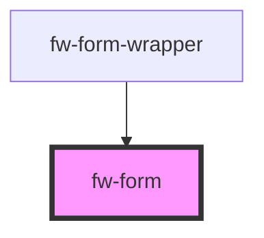

# fw-form

<!-- Auto Generated Below -->

## Properties

| Property           | Attribute           | Description                                                   | Type                                   | Default      |
| ------------------ | ------------------- | ------------------------------------------------------------- | -------------------------------------- | ------------ |
| `initialErrors`    | `initial-errors`    |                                                               | `any`                                  | `undefined`  |
| `initialValues`    | `initial-values`    |                                                               | `any`                                  | `undefined`  |
| `renderer`         | --                  |                                                               | `(props: FormRenderProps<any>) => any` | `() => null` |
| `validate`         | `validate`          |                                                               | `any`                                  | `undefined`  |
| `validateOnBlur`   | `validate-on-blur`  | Tells Form to validate the form on each input's onBlur event  | `boolean`                              | `true`       |
| `validateOnInput`  | `validate-on-input` | Tells Form to validate the form on each input's onInput event | `boolean`                              | `true`       |
| `validationSchema` | `validation-schema` |                                                               | `any`                                  | `undefined`  |

## Events

| Event          | Description | Type                                                                                          |
| -------------- | ----------- | --------------------------------------------------------------------------------------------- |
| `fwFormSubmit` |             | `CustomEvent<{ values: FormValues; actions: { setSubmitting: (value: boolean) => void; }; }>` |

## Methods

### `doReset(e: any) => Promise<void>`

#### Returns

Type: `Promise<void>`

### `doSubmit(e: any) => Promise<void>`

#### Returns

Type: `Promise<void>`

### `setFieldErrors(obj: any) => Promise<void>`

#### Returns

Type: `Promise<void>`

### `setFieldValue(obj: any) => Promise<void>`

#### Returns

Type: `Promise<void>`

## Dependencies

### Used by

 - [fw-form-wrapper](../form-wrapper)

### Graph

----------------------------------------------

Built with ❤ at Freshworks
