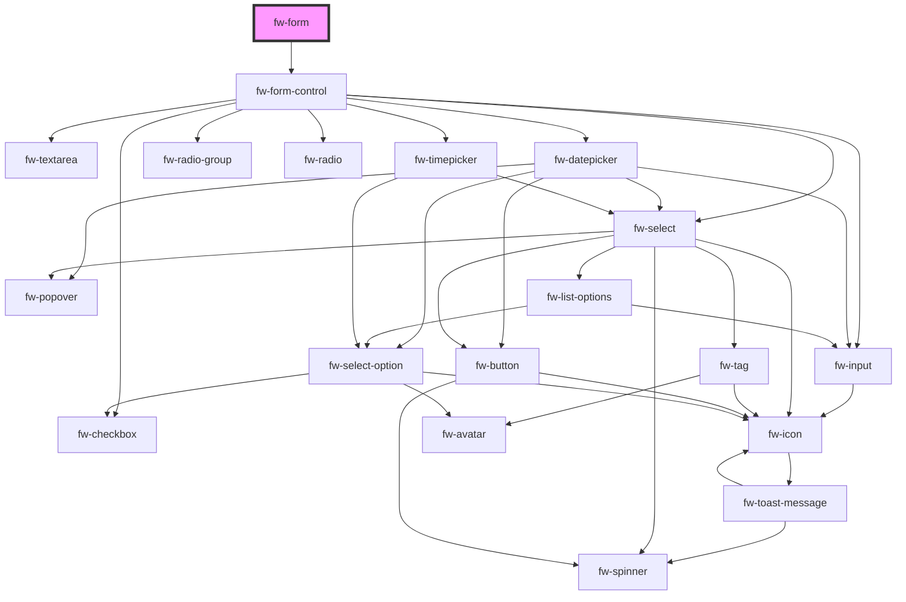

# fw-form

<!-- Auto Generated Below -->

## Properties

| Property           | Attribute           | Description                                                                                                                                                                   | Type      | Default        |
| ------------------ | ------------------- | ----------------------------------------------------------------------------------------------------------------------------------------------------------------------------- | --------- | -------------- |
| `formId`           | `form-id`           | Id to uniquely identify the Form. If not set, a random Id will be generated.                                                                                                  | `string`  | `createGuid()` |
| `formSchema`       | `form-schema`       | Schema to render Dynamic Form. Contains an array of fields pointing to each form control. Please see the usage reference for examples.                                        | `any`     | `{}`           |
| `initialValues`    | `initial-values`    | Initial field values of the form. It is an object with keys pointing to field name                                                                                            | `any`     | `{}`           |
| `validate`         | `validate`          | Validate the form's values with an async function. Should return a Promise which resolves to an errors object. The keys in the errors object must match with the field names. | `any`     | `undefined`    |
| `validateOnBlur`   | `validate-on-blur`  | Tells Form to validate the form on each input's onBlur event                                                                                                                  | `boolean` | `true`         |
| `validateOnInput`  | `validate-on-input` | Tells Form to validate the form on each input's onInput event                                                                                                                 | `boolean` | `true`         |
| `validationSchema` | `validation-schema` | YUP based validation schema for handling validation                                                                                                                           | `any`     | `{}`           |
| `wait`             | `wait`              | The number of milliseconds to delay before doing validation on Input                                                                                                          | `number`  | `1000`         |

## Methods

### `doReset(e: any) => Promise<void>`

#### Returns

Type: `Promise<void>`

### `doSubmit(e: any) => Promise<FormSubmit>`

#### Returns

Type: `Promise<FormSubmit>`

### `setFieldErrors(errorObj: FormErrors<FormValues>) => Promise<void>`

#### Returns

Type: `Promise<void>`

### `setFieldValue(field: string, value: any, shouldValidate?: boolean) => Promise<void>`

#### Returns

Type: `Promise<void>`

## Dependencies

### Depends on

- [fw-form-control](../form-control)

### Graph

----------------------------------------------

Built with ❤ at Freshworks
