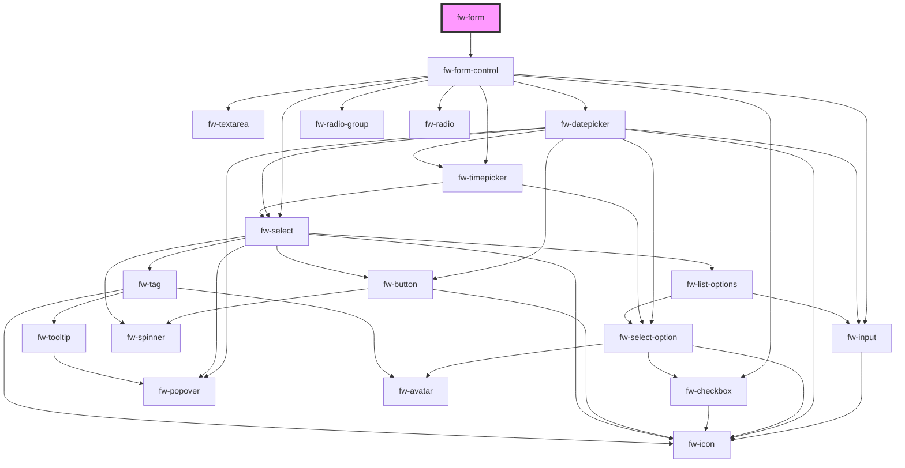

# Form (fw-form)

**Dynamic Form** - Render dynamic form based on the schema passed as a prop.\
**Static Form** - Render form based on the children passed as slots.

## Demo Dynamic Form

Pass [formSchema](#form-schema) to render Dynamic Form. You can also pass `initialValues` to the form.

```html live
<div id="form-container">
  <fw-button id="submit">Submit</fw-button>
  <fw-button id="reset">Reset</fw-button>
</div>
<script type="application/javascript">
  var form = document.createElement('fw-form');
  var formContainer = document.querySelector('#form-container');
  document.querySelector('#submit').addEventListener('click', async (e) => {
    const { values, isValid } = await form.doSubmit(e);
    console.log({ values, isValid });

    if (isValid) {
      // make ajax post end point with values
      // fetch("/post",values);

      // if error from backend , set Errors - passing key value pair
      form.setFieldErrors({
        first_name: 'First Name must be unique <<Server Error>>',
      });

      // reset the form if required if success
      // formRef.current.doReset(e);
    }
  });
  document.querySelector('#reset').addEventListener('click', (e) => {
    form.doReset(e);
  });
  var formSchema = {
    name: 'Test Form',
    fields: [
      {
        id: '2978f820-704b-46c7-9f88-110e14e34a8c',
        name: 'first_name',
        label: 'First Name',
        type: 'TEXT',
        position: 3,
        required: true,
        placeholder: 'Enter…',
        hint: 'Please provide a text of at max 100 characters',
        choices: [],
      },

      {
        id: '3978f820-704b-46c7-9f88-110e14e34a8c',
        name: 'last_name',
        label: 'Last Name',
        type: 'TEXT',
        position: 3,
        required: true,
        placeholder: 'Enter…',
        hint: 'Please provide a text of at max 100 characters',
        choices: [],
      },

      {
        id: '42aecb8f-25cf-47ce-89c6-5410fe3d4315',
        name: 'languages_known',
        label: 'Languages Known',
        type: 'MULTI_SELECT',
        position: 13,
        required: true,
        placeholder: 'Enter…',
        hint: 'Select one or more values',
        choices: [
          {
            id: 1,
            value: 'English',
            position: 1,
            dependent_ids: {},
          },
          {
            id: 2,
            value: 'Hindi',
            position: 2,
            dependent_ids: {},
          },
          {
            id: 3,
            value: 'Tamil',
            position: 3,
            dependent_ids: {},
          },
        ],
      },

      {
        id: '6978f820-704b-46c7-9f88-110e14e34a8c',
        name: 'email',
        label: 'Email',
        type: 'EMAIL',
        position: 3,
        required: true,
        placeholder: 'Enter…',
        hint: 'Please provide an email Id',
        choices: [],
      },

      {
        id: 'f319f86f-1b6a-49cb-b4b6-cf487be94595',
        name: 'date_of_birth',
        label: 'Date Of Birth',
        type: 'DATE',
        position: 11,
        required: true,
        Placeholder: 'Enter…',
        hint: 'Please enter your date of birth',
        choices: [],
      },

      {
        id: 'f319f86f-1b6a-49cb-b4b6-cf487be94595',
        name: 'landmark',
        label: 'Landmark',
        type: 'PARAGRAPH',
        position: 7,
        required: true,
        Placeholder: 'Enter some text…',
        hint: 'Please enter the nearest landmark',
        choices: [],
      },

      {
        id: 'f319f86f-1b6a-49cb-b4b6-cf487be94595',
        name: 'is_indian_citizen',
        label: 'Indian Citizen?',
        type: 'CHECKBOX',
        position: 7,
        required: true,
        placeholder: null,
        hint: 'Check or Uncheck the box',
        choices: [],
      },

      {
        id: '8978f820-704b-46c7-9f88-110e14e34a8c',
        name: 'phone_number',
        label: 'Phone number',
        type: 'TEXT',
        position: 3,
        required: true,
        placeholder: 'Enter…',
        hint: 'Please provide your phone number',
        choices: [],
      },

      {
        id: 'f319f86f-1b6a-49cb-b4b6-cf487be94595',
        name: 'pincode',
        label: 'Pincode',
        type: 'NUMBER',
        position: 8,
        required: false,
        Placeholder: 'Enter…',
        hint: 'Please enter your Pincode',
        choices: [],
      },

      {
        id: 'ba53775e-2948-4065-8a59-d99d4494e845',
        name: 'gender',
        label: 'Gender',
        type: 'RADIO',
        position: 5,
        required: true,
        placeholder: null,
        hint: 'Please specify your gender',
        choices: [
          {
            id: 1,
            value: 'Female',
            position: 1,
            dependent_ids: {},
          },
          {
            id: 2,
            value: 'Male',
            position: 2,
            dependent_ids: {},
          },
        ],
      },

      {
        id: '42aecb8f-25cf-47ce-89c6-5410fe3d4315',
        name: 'order_status',
        label: 'Order Status',
        type: 'DROPDOWN',
        position: 4,
        required: true,
        placeholder: 'Enter…',
        hint: 'Select a value',
        choices: [
          {
            id: 1,
            value: 'open',
            position: 1,
            dependent_ids: {},
          },
          {
            id: 2,
            value: 'pending',
            position: 2,
            dependent_ids: {},
          },
          {
            id: 3,
            value: 'closed',
            position: 3,
            dependent_ids: {},
          },
        ],
      },

      {
        id: 'f319f86f-1b6a-49cb-b4b6-cf487be94595',
        name: 'amount_paid',
        label: 'Amount Paid',
        type: 'DECIMAL',
        position: 10,
        required: true,
        Placeholder: 'Enter…',
        hint: 'Please enter the amount paid',
        choices: [],
      },
    ],
  };
  var initialValues = {
    is_indian_citizen: true,
  };
  formContainer.prepend(form);
  // do any customisation on the field schema to match the props of crayons components.
  var fields = formSchema.fields.map((field) => {
    // select expects `text` and `value` prop
    if (field.type === 'DROPDOWN' || field.type === 'MULTI_SELECT') {
      return {
        ...field,
        choices: field.choices?.map((f) => {
          return {
            ...f,
            text: f.value,
            value: f.id,
          };
        }),
      };
    } else return field;
  });

  var formSchema1 = {
    ...formSchema,
    fields: fields,
  };
  form.formSchema = formSchema1;
  form.initialValues = initialValues;
</script>
```

## form schema

form schema should follow the below structure:

```{
name: '', // Name of the form.
fields: [ // Each item in this array corresponds to a crayons input component.
  {
    id: '2978f820-704b-46c7-9f88-110e14e34a8c', // ID of the input control
    name: 'first_name', // Will be used while serializing form.
    label: 'First Name', // Label to display.
    type: '', // Type of the crayons input component. Possible values are TEXT/NUMBER/DECIMAL/DROPDOWN/MULTI_SELECT/RADIO/CHECKBOX/ DATE/PARAGRAPH/EMAIL/TIME
    position: 3, // Order of the component in the form.
    required: true, // Required while submitting the form.
    placeholder: 'Enter…', // placeholder for the input
    hint: 'Please provide a text of at max 100 characters', // Hint text to be displayed below.
    choices: [], // List of options for DROPDOWN/MULTI_SELECT types. Each option should be of below structure:
    {
    id: 1, // ID for the option.
    text: '', // Text for the option.
    value: '', // Value for the option.
    }
  }
]
}
```

## Usage Dynamic Form

<code-group>
<code-block title="HTML">
```html
<div id="form-container">
  <fw-button id="submit">Submit</fw-button>
  <fw-button id="reset">Reset</fw-button>
</div>
<script type="application/javascript">
  var form = document.createElement('fw-form');
  var formContainer = document.querySelector('#form-container');
  document.querySelector('#submit').addEventListener('click', async (e) => {
    const { values, isValid } = await form.doSubmit(e);
    console.log({ values, isValid });

    if (isValid) {
      // make ajax post end point with values
      // fetch("/post",values);

      // if error from backend , set Errors - passing key value pair
      // set Errors on the form
      form.setFieldErrors({
        first_name: 'First Name must be unique <<Server Error>>',
      });

      // reset the form if required if success
      // formRef.current.doReset(e);
    }

    });
    document.querySelector('#reset').addEventListener('click', (e) => {
      form.doReset(e);
    });
    var formSchema = {
    name: 'Test Form',
    fields: [
      {
        id: '2978f820-704b-46c7-9f88-110e14e34a8c',
        name: 'first_name',
        label: 'First Name',
        type: 'TEXT',
        position: 3,
        required: true,
        placeholder: 'Enter…',
        hint: 'Please provide a text of at max 100 characters',
        choices: [],
      },

      {
        id: '3978f820-704b-46c7-9f88-110e14e34a8c',
        name: 'last_name',
        label: 'Last Name',
        type: 'TEXT',
        position: 3,
        required: true,
        placeholder: 'Enter…',
        hint: 'Please provide a text of at max 100 characters',
        choices: [],
      },

      {
        id: '42aecb8f-25cf-47ce-89c6-5410fe3d4315',
        name: 'languages_known',
        label: 'Languages Known',
        type: 'MULTI_SELECT',
        position: 13,
        required: true,
        placeholder: 'Enter…',
        hint: 'Select one or more values',
        choices: [
          {
            id: 1,
            value: 'English',
            position: 1,
            dependent_ids: {},
          },
          {
            id: 2,
            value: 'Hindi',
            position: 2,
            dependent_ids: {},
          },
          {
            id: 3,
            value: 'Tamil',
            position: 3,
            dependent_ids: {},
          },
        ],
      },

      {
        id: '6978f820-704b-46c7-9f88-110e14e34a8c',
        name: 'email',
        label: 'Email',
        type: 'EMAIL',
        position: 3,
        required: true,
        placeholder: 'Enter…',
        hint: 'Please provide an email Id',
        choices: [],
      },

      {
        id: 'f319f86f-1b6a-49cb-b4b6-cf487be94595',
        name: 'date_of_birth',
        label: 'Date Of Birth',
        type: 'DATE',
        position: 11,
        required: true,
        Placeholder: 'Enter…',
        hint: 'Please enter your date of birth',
        choices: [],
      },

      {
        id: 'f319f86f-1b6a-49cb-b4b6-cf487be94595',
        name: 'landmark',
        label: 'Landmark',
        type: 'PARAGRAPH',
        position: 7,
        required: true,
        Placeholder: 'Enter some text…',
        hint: 'Please enter the nearest landmark',
        choices: [],
      },

      {
        id: 'f319f86f-1b6a-49cb-b4b6-cf487be94595',
        name: 'is_indian_citizen',
        label: 'Indian Citizen?',
        type: 'CHECKBOX',
        position: 7,
        required: true,
        placeholder: null,
        hint: 'Check or Uncheck the box',
        choices: [],
      },

      {
        id: '8978f820-704b-46c7-9f88-110e14e34a8c',
        name: 'phone_number',
        label: 'Phone number',
        type: 'TEXT',
        position: 3,
        required: true,
        placeholder: 'Enter…',
        hint: 'Please provide your phone number',
        choices: [],
      },

      {
        id: 'f319f86f-1b6a-49cb-b4b6-cf487be94595',
        name: 'pincode',
        label: 'Pincode',
        type: 'NUMBER',
        position: 8,
        required: false,
        Placeholder: 'Enter…',
        hint: 'Please enter your Pincode',
        choices: [],
      },

      {
        id: 'ba53775e-2948-4065-8a59-d99d4494e845',
        name: 'gender',
        label: 'Gender',
        type: 'RADIO',
        position: 5,
        required: true,
        placeholder: null,
        hint: 'Please specify your gender',
        choices: [
          {
            id: 1,
            value: 'Female',
            position: 1,
            dependent_ids: {},
          },
          {
            id: 2,
            value: 'Male',
            position: 2,
            dependent_ids: {},
          },
        ],
      },

      {
        id: '42aecb8f-25cf-47ce-89c6-5410fe3d4315',
        name: 'order_status',
        label: 'Order Status',
        type: 'DROPDOWN',
        position: 4,
        required: true,
        placeholder: 'Enter…',
        hint: 'Select a value',
        choices: [
          {
            id: 1,
            value: 'open',
            position: 1,
            dependent_ids: {},
          },
          {
            id: 2,
            value: 'pending',
            position: 2,
            dependent_ids: {},
          },
          {
            id: 3,
            value: 'closed',
            position: 3,
            dependent_ids: {},
          },
        ],
      },

      {
        id: 'f319f86f-1b6a-49cb-b4b6-cf487be94595',
        name: 'amount_paid',
        label: 'Amount Paid',
        type: 'DECIMAL',
        position: 10,
        required: true,
        Placeholder: 'Enter…',
        hint: 'Please enter the amount paid',
        choices: [],
      },
    ],

};
var initialValues = {
is_indian_citizen: true,
};
formContainer.prepend(form);
// do any customisation on the field schema to match the props of crayons components.
const fields = formSchema?.fields?.map((field) => {
// select expects `text` and `value` prop
if (field.type === "DROPDOWN" || field.type === "MULTI_SELECT") {
return {
...field,
choices: field.choices?.map((f) =>{
return {
...f,
text: f.value,
value: f.id
}
})
};
} else return field;
});

const formSchema1 = {
...formSchema,
fields: fields,
};
form.formSchema = formSchema1;

form.initialValues = initialValues;
</script>

````

</code-block>

<code-block title="React">
```jsx
import React, {useRef} from "react";
import ReactDOM from "react-dom";
import {FwForm,FwButton} from "@freshworks/crayons/react";
function App() {
  const formSchema = {
  name: "Test Form",
  fields: [
      {
        id: '2978f820-704b-46c7-9f88-110e14e34a8c',
        name: 'first_name',
        label: 'First Name',
        type: 'TEXT',
        position: 3,
        required: true,
        placeholder: 'Enter…',
        hint: 'Please provide a text of at max 100 characters',
        choices: [],
      },

      {
        id: '3978f820-704b-46c7-9f88-110e14e34a8c',
        name: 'last_name',
        label: 'Last Name',
        type: 'TEXT',
        position: 3,
        required: true,
        placeholder: 'Enter…',
        hint: 'Please provide a text of at max 100 characters',
        choices: [],
      },

      {
        id: '42aecb8f-25cf-47ce-89c6-5410fe3d4315',
        name: 'languages_known',
        label: 'Languages Known',
        type: 'MULTI_SELECT',
        position: 13,
        required: true,
        placeholder: 'Enter…',
        hint: 'Select one or more values',
        choices: [
          {
            id: 1,
            value: 'English',
            position: 1,
            dependent_ids: {},
          },
          {
            id: 2,
            value: 'Hindi',
            position: 2,
            dependent_ids: {},
          },
          {
            id: 3,
            value: 'Tamil',
            position: 3,
            dependent_ids: {},
          },
        ],
      },

      {
        id: '6978f820-704b-46c7-9f88-110e14e34a8c',
        name: 'email',
        label: 'Email',
        type: 'EMAIL',
        position: 3,
        required: true,
        placeholder: 'Enter…',
        hint: 'Please provide an email Id',
        choices: [],
      },

      {
        id: 'f319f86f-1b6a-49cb-b4b6-cf487be94595',
        name: 'date_of_birth',
        label: 'Date Of Birth',
        type: 'DATE',
        position: 11,
        required: true,
        Placeholder: 'Enter…',
        hint: 'Please enter your date of birth',
        choices: [],
      },

      {
        id: 'f319f86f-1b6a-49cb-b4b6-cf487be94595',
        name: 'landmark',
        label: 'Landmark',
        type: 'PARAGRAPH',
        position: 7,
        required: true,
        Placeholder: 'Enter some text…',
        hint: 'Please enter the nearest landmark',
        choices: [],
      },

      {
        id: 'f319f86f-1b6a-49cb-b4b6-cf487be94595',
        name: 'is_indian_citizen',
        label: 'Indian Citizen?',
        type: 'CHECKBOX',
        position: 7,
        required: true,
        placeholder: null,
        hint: 'Check or Uncheck the box',
        choices: [],
      },

      {
        id: '8978f820-704b-46c7-9f88-110e14e34a8c',
        name: 'phone_number',
        label: 'Phone number',
        type: 'TEXT',
        position: 3,
        required: true,
        placeholder: 'Enter…',
        hint: 'Please provide your phone number',
        choices: [],
      },

      {
        id: 'f319f86f-1b6a-49cb-b4b6-cf487be94595',
        name: 'pincode',
        label: 'Pincode',
        type: 'NUMBER',
        position: 8,
        required: false,
        Placeholder: 'Enter…',
        hint: 'Please enter your Pincode',
        choices: [],
      },

      {
        id: 'ba53775e-2948-4065-8a59-d99d4494e845',
        name: 'gender',
        label: 'Gender',
        type: 'RADIO',
        position: 5,
        required: true,
        placeholder: null,
        hint: 'Please specify your gender',
        choices: [
          {
            id: 1,
            value: 'Female',
            position: 1,
            dependent_ids: {},
          },
          {
            id: 2,
            value: 'Male',
            position: 2,
            dependent_ids: {},
          },
        ],
      },

      {
        id: '42aecb8f-25cf-47ce-89c6-5410fe3d4315',
        name: 'order_status',
        label: 'Order Status',
        type: 'DROPDOWN',
        position: 4,
        required: true,
        placeholder: 'Enter…',
        hint: 'Select a value',
        choices: [
          {
            id: 1,
            value: 'open',
            position: 1,
            dependent_ids: {},
          },
          {
            id: 2,
            value: 'pending',
            position: 2,
            dependent_ids: {},
          },
          {
            id: 3,
            value: 'closed',
            position: 3,
            dependent_ids: {},
          },
        ],
      },

      {
        id: 'f319f86f-1b6a-49cb-b4b6-cf487be94595',
        name: 'amount_paid',
        label: 'Amount Paid',
        type: 'DECIMAL',
        position: 10,
        required: true,
        Placeholder: 'Enter…',
        hint: 'Please enter the amount paid',
        choices: [],
      },
    ],

};
// do any customisation on the field schema to match the props of crayons components.
var fields = formSchema?.fields?.map((field) => {
// select expects `text` and `value` prop
if (field.type === "DROPDOWN" || field.type === "MULTI_SELECT") {
return {
...field,
choices: field.choices?.map((f) =>{
return {
...f,
text: f.value,
value: f.id
}
})
};
} else return field;
});

var formSchema1 = {
...formSchema,
fields: fields,
};

const initialValues = {
is_indian_citizen: true,
email: "test",
};
const formRef = useRef<any>(null);
const handleFormSubmit = async (e: any) => {
const { values, isValid, errors } = await formRef.current.doSubmit(e);
console.log({ result: values, errors });

    // make ajax post end point with values
    // fetch("/post",values);

    // if error from backend , set Errors - passing key value pair
    if (isValid) {
      // set Errors on the form
      formRef.current.setFieldErrors({
        first_name: "First Name must be unique <<Server Error>>",
      });
      // reset the form if required if success
      // formRef.current.doReset(e);
    }

};
const handleFormReset = (e: any) => {
formRef.current.doReset(e);
};
return (<div>
<FwForm ref={formRef} formSchema={formSchema1} initialValues={initialValues}
validate={async (values:any) => { // do custom validation and return error or {}
return {
// last_name: "last name is errored",
};
}} >
</FwForm>
<FwButton color="secondary" onClick={handleFormReset}>
Reset Form
</FwButton>
<FwButton onClick={handleFormSubmit}>Submit Form</FwButton>

</div>);
}

````

</code-block>
</code-group>

## Text and Value indicators for select (DROPDOWN/MULTI_SELECT) component choices

The choices for select component(`dropdown/multi_select`) can follow any of the below formats.

1. Using `field_options` object. Pass the key name that needs to be displayed as the dropdown option's text using, `option_label_path` and the key name that needs to to be processed in the backend using, `option_value_path`.

```
{
  id: '420oib8f-25cf-47ce-89c6-5410fe3d4315',
  name: 'languages_known',
  label: 'Languages Known',
  type: 'MULTI_SELECT',
  position: 1,
  required: true,
  placeholder: 'Choose',
  hint: 'Select one or more values',
  field_options: {
    option_label_path: 'value', // This denotes 'value' in the choices object needs to be displayed as the dropdown option text,i.e English & Hindi
    option_value_path: 'id',  // This denotes 'id' in the choices object needs to be used as the dropdown option's value for backend
  },
  choices: [
    {
      id: 1,  // this will be passed to the backend if `English` has been selected in the dropdown options.
      value: 'English',  // This will be displayed in the dropdown options list.
      position: 1,
      dependent_ids: {},
    },
    {
      id: 2,
      value: 'Hindi',
      position: 2,
      dependent_ids: {},
    },
  ],
}
```

#### Usage with field_options

```html live
<div id="form-container-2">
  <fw-button id="submit_2">Submit</fw-button>
  <fw-button id="reset_2">Reset</fw-button>
</div>
<script type="application/javascript">
  var form_2 = document.createElement('fw-form');
  var formContainer_2 = document.querySelector('#form-container-2');
  document.querySelector('#submit_2').addEventListener('click', async (e) => {
    const { values, isValid } = await form_2.doSubmit(e);
    console.log({ values, isValid });
  });
  document.querySelector('#reset_2').addEventListener('click', (e) => {
    form_2.doReset(e);
  });
  var formSchema2 = {
    name: 'Test Form 2',
    fields: [
      {
        id: '2979i920-704b-46c7-9f88-110e14e34a8c',
        name: 'first_name',
        label: 'First Name',
        type: 'TEXT',
        position: 3,
        required: true,
        placeholder: 'Enter…',
        hint: 'Please provide a text of at max 100 characters',
        choices: [],
      },

      {
        id: 'gh67f820-704b-46c7-9f88-110e14e34a8c',
        name: 'last_name',
        label: 'Last Name',
        type: 'TEXT',
        position: 3,
        required: true,
        placeholder: 'Enter…',
        hint: 'Please provide a text of at max 100 characters',
        choices: [],
      },

      {
        id: 'vbg56b8f-25cf-47ce-89c6-5410fe3d4315',
        name: 'languages_known',
        label: 'Languages Known',
        type: 'MULTI_SELECT',
        position: 13,
        required: true,
        placeholder: 'Enter…',
        hint: 'Select one or more values',
        field_options: {
          option_label_path: 'value',
          option_value_path: 'id',
        },
        choices: [
          {
            id: 1,
            value: 'English',
            position: 1,
            dependent_ids: {},
          },
          {
            id: 2,
            value: 'Hindi',
            position: 2,
            dependent_ids: {},
          },
          {
            id: 3,
            value: 'Tamil',
            position: 3,
            dependent_ids: {},
          },
        ],
      },

      {
        id: 'hjuy7820-704b-46c7-9f88-110e14e34a8c',
        name: 'email',
        label: 'Email',
        type: 'EMAIL',
        position: 3,
        required: true,
        placeholder: 'Enter…',
        hint: 'Please provide an email Id',
        choices: [],
      },
      {
        id: 'redf5820-704b-46c7-9f88-110e14e34a8c',
        name: 'phone_number',
        label: 'Phone number',
        type: 'TEXT',
        position: 3,
        required: true,
        placeholder: 'Enter…',
        hint: 'Please provide your phone number',
        choices: [],
      },
    ],
  };
  formContainer_2.prepend(form_2);
  form_2.formSchema = formSchema2;
  form_2.initialValues = initialValues;
</script>
```

2. Using `text` and `value` as key names in choices

```
{
  id: '127yub8f-25cf-47ce-89c6-67yufe3d4315',
  name: 'languages_known',
  label: 'Languages Known',
  type: 'MULTI_SELECT',
  position: 1,
  required: true,
  placeholder: 'Choose',
  hint: 'Select one or more values',
  choices: [
    {
      value: 1,  // this will be passed to the backend if `English` has been selected in the dropdown options.
      text: 'English',  // This will be displayed in the dropdown options list.
      position: 1,
      dependent_ids: {},
    },
    {
      id: 2,
      value: 'Hindi',
      position: 2,
      dependent_ids: {},
    },
  ],
}
```

#### Usage with `text` and `value` as keys in `choices`

```html live
<div id="form-container-3">
  <fw-button id="submit_3">Submit</fw-button>
  <fw-button id="reset_3">Reset</fw-button>
</div>
<script type="application/javascript">
  var form_3 = document.createElement('fw-form');
  var formContainer_3 = document.querySelector('#form-container-3');
  document.querySelector('#submit_3').addEventListener('click', async (e) => {
    const { values, isValid } = await form_3.doSubmit(e);
    console.log({ values, isValid });
  });
  document.querySelector('#reset_3').addEventListener('click', (e) => {
    form_3.doReset(e);
  });
  var formSchema3 = {
    name: 'Test Form 3',
    fields: [
      {
        id: 'juik9920-704b-46c7-9f88-110e14e34a8c',
        name: 'first_name',
        label: 'First Name',
        type: 'TEXT',
        position: 1,
        required: true,
        placeholder: 'Enter…',
        hint: 'Please provide a text of at max 100 characters',
        choices: [],
      },

      {
        id: 'yuhuj820-704b-46c7-9f88-110e14e34a8c',
        name: 'last_name',
        label: 'Last Name',
        type: 'TEXT',
        position: 2,
        required: true,
        placeholder: 'Enter…',
        hint: 'Please provide a text of at max 100 characters',
        choices: [],
      },

      {
        id: 'cdsre4b8f-25cf-47ce-89c6-5410fe3d4315',
        name: 'languages_known',
        label: 'Languages Known',
        type: 'MULTI_SELECT',
        position: 5,
        required: true,
        placeholder: 'Enter…',
        hint: 'Select one or more values',
        choices: [
          {
            value: 1,
            text: 'English',
            position: 1,
            dependent_ids: {},
          },
          {
            value: 2,
            text: 'Hindi',
            position: 2,
            dependent_ids: {},
          },
          {
            value: 3,
            text: 'Tamil',
            position: 3,
            dependent_ids: {},
          },
        ],
      },

      {
        id: '56t7y820-704b-46c7-9f88-110e14e34a8c',
        name: 'email',
        label: 'Email',
        type: 'EMAIL',
        position: 3,
        required: true,
        placeholder: 'Enter…',
        hint: 'Please provide an email Id',
        choices: [],
      },
      {
        id: 'e34r5820-704b-46c7-9f88-110e14e34a8c',
        name: 'phone_number',
        label: 'Phone number',
        type: 'TEXT',
        position: 4,
        required: true,
        placeholder: 'Enter…',
        hint: 'Please provide your phone number',
        choices: [],
      },
    ],
  };
  formContainer_3.prepend(form_3);
  form_3.formSchema = formSchema3;
  form_3.initialValues = initialValues;
</script>
```

## Demo Static Form

You can pass `initialValues` to the form. Wrap all the form controls with `form-control` under `fw-form`.

For `Crayons` controls just pass the `type`, `name`, `placeholder`,`required`, `label` properties to `fw-form-control`.

For `custom` input controls, pass the custom input as `slot` to `fw-form-control`. You can pass the `type`, `name`, `required`, `label` properties to `fw-form-control`. For setting its value in the form, use the method like `handleCustomInput` shown in the below example.

```html live
<div id="static-form-container">
  <fw-form id="fw-static-form">
    <fw-form-control
      type="TEXT"
      name="first_name"
      placeholder="First Name"
      required
      label="First Name"
      id="first_name"
    ></fw-form-control>

    <fw-form-control
      type="TEXT"
      name="last_name"
      placeholder="Last Name"
      required
      label="Last Name"
      id="last_name"
    ></fw-form-control>

    <fw-form-control name="cin" type="TEXT" required label="Custom native in">
      <input name="cin" id="cin" placeholder="custom input" autocomplete="off"
    /></fw-form-control>
  </fw-form>
  <fw-button id="submit-static-form">Submit</fw-button>
  <fw-button id="reset-static-form">Reset</fw-button>
</div>
<script type="application/javascript">
  var formStatic = document.querySelector('#fw-static-form');
  document
    .querySelector('#submit-static-form')
    .addEventListener('click', async (e) => {
      const { values, isValid } = await formStatic.doSubmit(e);
      console.log({ values, isValid });

      if (isValid) {
        // make ajax post end point with values
        // fetch("/post",values);

        // if error from backend , set Errors - passing key value pair
        formStatic.setFieldErrors({
          first_name: 'First Name must be unique <<Server Error>>',
        });

        // reset the form if required if success
        // formRef.current.doReset(e);
      }
    });
  document
    .querySelector('#reset-static-form')
    .addEventListener('click', (e) => {
      if (document.querySelector('#cin'))
        document.querySelector('#cin').value = '';
      formStatic.doReset(e);
    });

  var initialValues = {
    first_name: 'John',
  };
  formStatic.initialValues = initialValues;

  function handleCustomInput(e) {
    console.log('handle input');
    formStatic.setFieldValue([e.target.name], e.target.value);
  }

  document.querySelector('#cin').addEventListener('input', handleCustomInput);
  document.querySelector('#cin').addEventListener('change', handleCustomInput);
  document.querySelector('#cin').addEventListener('blur', handleCustomInput);
</script>
```

## Usage Static Form

<code-group>
<code-block title="HTML">
```html
<div id="static-form-container">
  <fw-form id="fw-static-form">
      <fw-form-control
      type="TEXT"
      name="first_name"
      placeholder="First Name"
      required
      label="First Name"
      id="first_name"
    ></fw-form-control>

    <fw-form-control
      type="TEXT"
      name="last_name"
      placeholder="Last Name"
      required
      label="Last Name"
      id="last_name"
    ></fw-form-control>

    <fw-form-control
      name="cin"
      required
      label="Custom native in"
    >
    <input name="cin" id="cin" placeholder="custom input"
    autocomplete="off"
    /></fw-form-control>
    </fw-form>

<fw-button id="submit-static-form">Submit</fw-button>
<fw-button id="reset-static-form">Reset</fw-button>

</div>
<script type="application/javascript">
  var formStatic = document.querySelector("#fw-static-form")
  document.querySelector('#submit-static-form').addEventListener('click', async (e) => {
    const { values, isValid } = await formStatic.doSubmit(e);
    console.log({ values, isValid });

    if (isValid) {
      // make ajax post end point with values
      // fetch("/post",values);

      // if error from backend , set Errors - passing key value pair
      formStatic.setFieldErrors({
        first_name: 'First Name must be unique <<Server Error>>',
      });

      // reset the form if required if success
      // formRef.current.doReset(e);
    }

});
document.querySelector('#reset-static-form').addEventListener('click', (e) => {
if (document.querySelector('#cin'))
document.querySelector('#cin').value = '';
formStatic.doReset(e);
});

var initialValues = {
first_name: "John",
};
formStatic.initialValues = initialValues;

function handleCustomInput(e) {
console.log('handle input');
formStatic.setFieldValue([e.target.name], e.target.value);
}

document.querySelector('#cin').addEventListener('input', handleCustomInput);
document.querySelector('#cin').addEventListener('change', handleCustomInput);
document.querySelector('#cin').addEventListener('blur', handleCustomInput);
</script>

````

</code-block>

<code-block title="React">
```jsx
import React, {useRef} from "react";
import ReactDOM from "react-dom";
import {FwForm, FwFormControl,FwButton} from "@freshworks/crayons/react";
function App() {

const initialValues = {
first_name:"John"
};
const formRef = useRef<any>(null);
const handleFormSubmit = async (e: any) => {
const { values, isValid, errors } = await formRef.current.doSubmit(e);
console.log({ result: values, errors });

      // make ajax post end point with values
      // fetch("/post",values);

      // if error from backend , set Errors - passing key value pair
      if (isValid) {
        // set Errors on the form
        formRef.current.setFieldErrors({
          first_name: "First Name must be unique <<Server Error>>",
        });
        // reset the form if required if success
        // formRef.current.doReset(e);
      }
    };

const handleFormReset = (e: any) => {
formRef.current.doReset(e);
};
return (<div>
<FwForm ref={formRef} initialValues={initialValues}
validate={async (values:any) => { // do custom validation and return error or {}
if(!cin || !cin.length) {
return {
cin: "cin is required",
};
}
return {}
}}>
<FwFormControl
type="TEXT"
name="first_name"
required
label="Name"
placeholder="Enter First Name"
fieldProps={{ maxlength: 5 }} ></FwFormControl>

              <FwFormControl
                  type="TEXT"
                  name="cin"
                  required
                  label="Custom Input"
              >
                  <input
                    placeholder="cin"
                    id="cin"
                    maxLength={5}
                    name="cin"
                    required
                    onChange={(e) =>
                      formRef.current.setFieldValue("cin", e.target.value, true)
                    }
                    onBlur={(e) =>
                      formRef.current.setFieldValue("cin", e.target.value, true)
                    }
                  ></input>
              </FwFormControl>
            </FwForm>
            <FwButton color="secondary" onClick={handleFormReset}>Reset Form</FwButton>
            <FwButton onClick={handleFormSubmit}>Submit Form</FwButton>

  </div>);
}

````

</code-block>
</code-group>

## Demo - Form inside an accordion

Form can be created inside an accordion by passing the form to accordion body.

```html live
<div style="width: 300px;">
  <fw-accordion expanded style="--fw-accordion-border: 1px solid #ccc">
    <fw-accordion-title
      style="--fw-accordion-title-background-color: #F5F7F9; --fw-accordion-title-expanded-icon-color: #2C5CC5; --fw-accordion-title-collapsed-icon-color: #264966;
      --fw-accordion-title-font-size: 14px; --fw-accordion-title-font-weight: 600; --fw-accordion-title-line-height: 20px;"
      >Title</fw-accordion-title
    >
    <fw-accordion-body style="--fw-accordion-body-background-color: #FFFFFF">
      <div id="accordion-form">
        <fw-button
          id="accordion-form-submit"
          color="secondary"
          style="display: block; margin-bottom:10px;"
          >Submit</fw-button
        >
        <fw-button id="accordion-form-reset" style="display: block;"
          >Reset</fw-button
        >
      </div>
    </fw-accordion-body>
  </fw-accordion>
</div>

<script type="application/javascript">
  var accForm = document.createElement('fw-form');
  var accFormContainer = document.querySelector('#accordion-form');
  document
    .querySelector('#accordion-form-submit')
    .addEventListener('click', async (e) => {
      const { values, isValid } = await accForm.doSubmit(e);
      console.log({ values, isValid });

      if (!isValid) {
        // if error from backend , set Errors - passing key value pair
        accForm.setFieldErrors({
          first_name: 'First Name must be unique <<Server Error>>',
        });
      }
    });
  document
    .querySelector('#accordion-form-reset')
    .addEventListener('click', (e) => {
      accForm.doReset(e);
    });
  var accFormSchema = {
    name: 'Test Form',
    fields: [
      {
        id: '2978f2320-704b-46c7-9f88-110e14e34q3c',
        name: 'first_name',
        label: 'First Name',
        type: 'TEXT',
        position: 3,
        required: true,
        placeholder: 'Enter…',
        hint: 'Please provide a text of at max 100 characters',
        choices: [],
      },

      {
        id: '3971f8320-704b-46c7-9f88-110e1j934a8c',
        name: 'last_name',
        label: 'Last Name',
        type: 'TEXT',
        position: 3,
        required: true,
        placeholder: 'Enter…',
        hint: 'Please provide a text of at max 100 characters',
        choices: [],
      },

      {
        id: '42aeh88f-25cf-46yce-89r5-5410fe3d4315',
        name: 'languages_known',
        label: 'Languages Known',
        type: 'MULTI_SELECT',
        position: 13,
        required: true,
        placeholder: 'Enter…',
        hint: 'Select one or more values',
        choices: [
          {
            id: 1,
            value: 'English',
            position: 1,
            dependent_ids: {},
          },
          {
            id: 2,
            value: 'Hindi',
            position: 2,
            dependent_ids: {},
          },
          {
            id: 3,
            value: 'Tamil',
            position: 3,
            dependent_ids: {},
          },
        ],
      },

      {
        id: '69e48f820-704b-49o7-9f88-110e14e34a8c',
        name: 'email',
        label: 'Email',
        type: 'EMAIL',
        position: 3,
        required: true,
        placeholder: 'Enter…',
        hint: 'Please provide an email Id',
        choices: [],
      },

      {
        id: '8u878cg20-704b-46c7-9f88-110e14e34a8c',
        name: 'phone_number',
        label: 'Phone number',
        type: 'TEXT',
        position: 3,
        required: true,
        placeholder: 'Enter…',
        hint: 'Please provide your phone number',
        choices: [],
      },
    ],
  };
  accFormContainer.prepend(accForm);
  var fields = accFormSchema.fields.map((field) => {
    // select expects `text` and `value` prop
    if (field.type === 'DROPDOWN' || field.type === 'MULTI_SELECT') {
      return {
        ...field,
        choices: field.choices?.map((f) => {
          return {
            ...f,
            text: f.value,
            value: f.id,
          };
        }),
      };
    } else return field;
  });

  var accFormSchema1 = {
    ...accFormSchema,
    fields: fields,
  };
  accForm.formSchema = accFormSchema1;
</script>
```

## Usage - Form inside an accordion

<code-group>
<code-block title="HTML">
  ```html
  <fw-accordion expanded style="--fw-accordion-border: 1px solid #ccc">
    <fw-accordion-title style="--fw-accordion-title-background-color: #F5F7F9; --fw-accordion-title-expanded-icon-color: #2C5CC5; --fw-accordion-title-collapsed-icon-color: #264966;
        --fw-accordion-title-font-size: 14px; --fw-accordion-title-font-weight: 600; --fw-accordion-title-line-height: 20px;">Header Text</fw-accordion-title>
    <fw-accordion-body style="--fw-accordion-body-background-color: #FFFFFF">
      <div id="accordion-form-2">
        <fw-button id="acc-form-2-submit" color="secondary" style="display: block; margin-bottom:10px;">Submit</fw-button>
        <fw-button id="acc-form-2-reset" style="display: block;">Reset</fw-button>
      </div>
    </fw-accordion-body>
  </fw-accordion>

  <script type="application/javascript">
    var accForm_2 = document.createElement('fw-form');
    var accformContainer_2 = document.querySelector('#accordion-form-2');
    document.querySelector('#acc-form-2-submit').addEventListener('click', async (e) => {
      const { values, isValid } = await accForm_2.doSubmit(e);
      console.log({ values, isValid });

      if (!isValid) {
        // if error from backend , set Errors - passing key value pair
        accForm_2.setFieldErrors({
          first_name: 'First Name must be unique <<Server Error>>',
        });
      }
    });
    document.querySelector('#acc-form-2-reset').addEventListener('click', (e) => {
      accForm_2.doReset(e);
    });
    var accFormSchema2 = {
      name: 'Test Form',
      fields: [
        {
          id: '2978f2320-704b-46c7-g788-110e14e34a8c',
          name: 'first_name',
          label: 'First Name',
          type: 'TEXT',
          position: 3,
          required: true,
          placeholder: 'Enter…',
          hint: 'Please provide a text of at max 100 characters',
          choices: [],
        },

        {
          id: '3971f8090-704b-46c7-9f88-110e14e34a8c',
          name: 'last_name',
          label: 'Last Name',
          type: 'TEXT',
          position: 3,
          required: true,
          placeholder: 'Enter…',
          hint: 'Please provide a text of at max 100 characters',
          choices: [],
        },

        {
          id: '69e48f820-704b-46c7-9f88-11r514e34a8c',
          name: 'email',
          label: 'Email',
          type: 'EMAIL',
          position: 3,
          required: true,
          placeholder: 'Enter…',
          hint: 'Please provide an email Id',
          choices: [],
        },

        {
          id: '8u87lo820-704b-46c7-9f88-110e14e34a8c',
          name: 'phone_number',
          label: 'Phone number',
          type: 'TEXT',
          position: 3,
          required: true,
          placeholder: 'Enter…',
          hint: 'Please provide your phone number',
          choices: [],
        }
      ],
    };
    accformContainer_2.prepend(accForm_2);
    accForm_2.formSchema = accFormSchema2;
  </script>

````
</code-block>

<code-block title="React">
```jsx
import React, {useRef} from "react";
import ReactDOM from "react-dom";
import {FwAccordion, FwAccordionTitle, FwAccordionBody, FwForm,FwButton} from "@freshworks/crayons/react";
function App() {

var accFormSchema3 = {
  name: 'Test Form',
  fields: [
    {
      id: '2978f2320-704b-46c7-9f88-110e14e34a8c',
      name: 'first_name',
      label: 'First Name',
      type: 'TEXT',
      position: 3,
      required: true,
      placeholder: 'Enter…',
      hint: 'Please provide a text of at max 100 characters',
      choices: [],
    },

    {
      id: '3971f8320-704b-46c7-9f88-110e14e34a8c',
      name: 'last_name',
      label: 'Last Name',
      type: 'TEXT',
      position: 3,
      required: true,
      placeholder: 'Enter…',
      hint: 'Please provide a text of at max 100 characters',
      choices: [],
    },

    {
      id: '69e48f820-704b-46c7-9f88-110e14e34a8c',
      name: 'email',
      label: 'Email',
      type: 'EMAIL',
      position: 3,
      required: true,
      placeholder: 'Enter…',
      hint: 'Please provide an email Id',
      choices: [],
    },

    {
      id: '8u878f820-704b-46c7-9f88-110e14e34a8c',
      name: 'phone_number',
      label: 'Phone number',
      type: 'TEXT',
      position: 3,
      required: true,
      placeholder: 'Enter…',
      hint: 'Please provide your phone number',
      choices: [],
    }
  ],
};

const accFormRef = useRef<any>(null);

const handleFormSubmit = async (e: any) => {
  const { values, isValid, errors } = await accFormRef.current.doSubmit(e);
  console.log({ result: values, errors });

  // if error from backend , set Errors - passing key value pair
  if (isValid) {
    // set Errors on the form
    accFormRef.current.setFieldErrors({
      first_name: "First Name must be unique <<Server Error>>",
    });
    // reset the form if required if success
    // accFormRef.current.doReset(e);
  }
};

const handleFormReset = (e: any) => {
  accFormRef.current.doReset(e);
};

return (
  <div>
    <FwAccordion expanded style={{"--fw-accordion-border": "1px solid #ccc"}} >
      <FwAccordionTitle style={{ "--fw-accordion-title-background-color":  "#F5F7F9", "--fw-accordion-title-expanded-icon-color" : "#2C5CC5", "--fw-accordion-title-collapsed-icon-color" : "#264966", "--fw-accordion-title-font-size": "14px", "--fw-accordion-title-font-weight" : "600", "--fw-accordion-title-line-height" : "20px"}}>Header Text</FwAccordionTitle>
      <FwAccordionBody style={{"--fw-accordion-body-background-color" : "#FFFFFF"}}>
          <FwForm ref={accFormRef} formSchema={accFormSchema3}
            validate={async (values:any) => { // do custom validation and return error or {}
            return {
            // last_name: "last name is errored",
            };
            }} >
          </FwForm>
          <FwButton id="acc-form-3-submit" color="secondary" style={{"display": "block", "marginBottom": "10px"}} onClick={handleFormSubmit}>Submit</FwButton>
          <FwButton id="acc-form-3-reset" style={{"display": "block"}} onClick={handleFormReset}>Reset</FwButton>
      </FwAccordionBody>
    </FwAccordion>
  </div>
)
}
````

</code-block>
</code-group>

## FORMSERV - mapperType

Set `FORMSERV` to `mapperType` prop to use `FORMSERV` schema instead of default `LEGO` schema.

```html live
<div id="form-container-fs">
  <fw-button id="submit-fs">Submit</fw-button>
  <fw-button id="reset-fs">Reset</fw-button>
</div>
<script type="application/javascript">
  var formFs = document.createElement('fw-form');
  var formContainerFs = document.querySelector('#form-container-fs');

  document.querySelector('#submit-fs').addEventListener('click', async (e) => {
    const { values, isValid } = await formFs.doSubmit(e);
    console.log({ values, isValid });

    if (isValid) {
      // make ajax post end point with values
      // fetch("/post",values);

      // if error from backend , set Errors - passing key value pair
      formFs.setFieldErrors({
        first_name: 'First Name must be unique <<Server Error>>',
      });

      // reset the form if required if success
      // formRef.current.doReset(e);
    }
  });
  document.querySelector('#reset-fs').addEventListener('click', (e) => {
    formFs.doReset(e);
  });
  var formServSchema = {
    name: 'Test Form',
    fields: [
      {
        id: '2978f820-704b-46c7-9f88-110e14e34a8c',
        name: 'first_name',
        label: 'First Name',
        type: 1,
        position: 3,
        required: true,
        placeholder: 'Enter…',
        hint: 'Please provide a text of at max 100 characters',
        choices: [],
      },

      {
        id: '3978f820-704b-46c7-9f88-110e14e34a8c',
        name: 'last_name',
        label: 'Last Name',
        type: 1,
        position: 3,
        required: true,
        placeholder: 'Enter…',
        hint: 'Please provide a text of at max 100 characters',
        choices: [],
      },

      {
        id: '42aecb8f-25cf-47ce-89c6-5410fe3d4315',
        name: 'languages_known',
        label: 'Languages Known',
        type: 18,
        position: 13,
        required: true,
        placeholder: 'Enter…',
        hint: 'Select one or more values',
        choices: [
          {
            id: 1,
            value: 'English',
            position: 1,
            dependent_ids: {},
          },
          {
            id: 2,
            value: 'Hindi',
            position: 2,
            dependent_ids: {},
          },
          {
            id: 3,
            value: 'Tamil',
            position: 3,
            dependent_ids: {},
          },
        ],
      },

      {
        id: '6978f820-704b-46c7-9f88-110e14e34a8c',
        name: 'email',
        label: 'Email',
        type: 3,
        position: 3,
        required: true,
        placeholder: 'Enter…',
        hint: 'Please provide an email Id',
        choices: [],
      },

      {
        id: 'f319f86f-1b6a-49cb-b4b6-cf487be94595',
        name: 'date_of_birth',
        label: 'Date Of Birth',
        type: 7,
        position: 11,
        required: true,
        Placeholder: 'Enter…',
        hint: 'Please enter your date of birth',
        choices: [],
      },

      {
        id: 'f319f86f-1b6a-49cb-b4b6-cf487be94595',
        name: 'landmark',
        label: 'Landmark',
        type: 6,
        position: 7,
        required: true,
        Placeholder: 'Enter some text…',
        hint: 'Please enter the nearest landmark',
        choices: [],
      },

      {
        id: 'f319f86f-1b6a-49cb-b4b6-cf487be94595',
        name: 'is_indian_citizen',
        label: 'Indian Citizen?',
        type: 5,
        position: 7,
        required: true,
        placeholder: null,
        hint: 'Check or Uncheck the box',
        choices: [],
      },

      {
        id: '8978f820-704b-46c7-9f88-110e14e34a8c',
        name: 'phone_number',
        label: 'Phone number',
        type: 1,
        position: 3,
        required: true,
        placeholder: 'Enter…',
        hint: 'Please provide your phone number',
        choices: [],
      },

      {
        id: 'f319f86f-1b6a-49cb-b4b6-cf487be94595',
        name: 'pincode',
        label: 'Pincode',
        type: 8,
        position: 8,
        required: false,
        Placeholder: 'Enter…',
        hint: 'Please enter your Pincode',
        choices: [],
      },

      {
        id: 'ba53775e-2948-4065-8a59-d99d4494e845',
        name: 'gender',
        label: 'Gender',
        type: 12,
        position: 5,
        required: true,
        placeholder: null,
        hint: 'Please specify your gender',
        choices: [
          {
            id: 1,
            value: 'Female',
            position: 1,
            dependent_ids: {},
          },
          {
            id: 2,
            value: 'Male',
            position: 2,
            dependent_ids: {},
          },
        ],
      },

      {
        id: '42aecb8f-25cf-47ce-89c6-5410fe3d4315',
        name: 'order_status',
        label: 'Order Status',
        type: 2,
        position: 4,
        required: true,
        placeholder: 'Enter…',
        hint: 'Select a value',
        choices: [
          {
            id: 1,
            value: 'open',
            position: 1,
            dependent_ids: {},
          },
          {
            id: 2,
            value: 'pending',
            position: 2,
            dependent_ids: {},
          },
          {
            id: 3,
            value: 'closed',
            position: 3,
            dependent_ids: {},
          },
        ],
      },

      {
        id: 'f319f86f-1b6a-49cb-b4b6-cf487be94595',
        name: 'amount_paid',
        label: 'Amount Paid',
        type: 13,
        position: 10,
        required: true,
        Placeholder: 'Enter…',
        hint: 'Please enter the amount paid',
        choices: [],
      },
    ],
  };
  var initialValues = {
    is_indian_citizen: true,
  };
  formContainerFs.prepend(formFs);

  // set mapperType to `FORMSERV` to support `FORMSERV` types out of the box
  formFs.mapperType = 'FORMSERV';

  // do any customisation on the field schema to match the props of crayons components.
  var fieldsFs = formServSchema.fields.map((field) => {
    // select expects `text` and `value` prop
    if (field.type === 'DROPDOWN' || field.type === 'MULTI_SELECT') {
      return {
        ...field,
        choices: field.choices?.map((f) => {
          return {
            ...f,
            text: f.value,
            value: f.id,
          };
        }),
      };
    } else return field;
  });

  var formSchemaFs1 = {
    ...formServSchema,
    fields: fieldsFs,
  };
  formFs.formSchema = formSchemaFs1;
  formFs.initialValues = initialValues;
</script>
```

## Filter Display of Form Fields

Invoke `setFieldSearchText` method on the `form` passing a text that filters the display of the form fields matching the field's label.

```html live
<fw-input
  search
  id="form-filter-search"
  placeholder="Type to filter Form Fields..."
></fw-input>
<div id="form-container-search">
  <fw-button id="submit-search">Submit</fw-button>
  <fw-button id="reset-search">Reset</fw-button>
</div>
<script type="application/javascript">
  var formSearch = document.createElement('fw-form');
  var formContainerSearch = document.querySelector('#form-container-search');

  /**
   * call setFieldSearchText on the form with the typed text to filter the form fields **/
  document
    .querySelector('#form-filter-search')
    // you can debounce this function if required
    .addEventListener('fwInput', (e) => {
      formSearch.setFieldSearchText(e.detail.value);
    });
  document
    .querySelector('#submit-search')
    .addEventListener('click', async (e) => {
      const { values, isValid } = await formSearch.doSubmit(e);
      console.log({ values, isValid });

      if (isValid) {
        // make ajax post end point with values
        // fetch("/post",values);

        // if error from backend , set Errors - passing key value pair
        formSearch.setFieldErrors({
          first_name: 'First Name must be unique <<Server Error>>',
        });

        // reset the form if required if success
        // formRef.current.doReset(e);
      }
    });
  document.querySelector('#reset-search').addEventListener('click', (e) => {
    formSearch.doReset(e);
  });
  var formSchemaSearch = {
    name: 'Test Form',
    fields: [
      {
        id: '2978f820-704b-46c7-9f88-110e14e34a8c',
        name: 'first_name',
        label: 'First Name',
        type: 'TEXT',
        position: 3,
        required: true,
        placeholder: 'Enter…',
        hint: 'Please provide a text of at max 100 characters',
        choices: [],
      },

      {
        id: '3978f820-704b-46c7-9f88-110e14e34a8c',
        name: 'last_name',
        label: 'Last Name',
        type: 'TEXT',
        position: 3,
        required: true,
        placeholder: 'Enter…',
        hint: 'Please provide a text of at max 100 characters',
        choices: [],
      },

      {
        id: '42aecb8f-25cf-47ce-89c6-5410fe3d4315',
        name: 'languages_known',
        label: 'Languages Known',
        type: 'MULTI_SELECT',
        position: 13,
        required: true,
        placeholder: 'Enter…',
        hint: 'Select one or more values',
        choices: [
          {
            id: 1,
            value: 'English',
            position: 1,
            dependent_ids: {},
          },
          {
            id: 2,
            value: 'Hindi',
            position: 2,
            dependent_ids: {},
          },
          {
            id: 3,
            value: 'Tamil',
            position: 3,
            dependent_ids: {},
          },
        ],
      },

      {
        id: '6978f820-704b-46c7-9f88-110e14e34a8c',
        name: 'email',
        label: 'Email',
        type: 'EMAIL',
        position: 3,
        required: true,
        placeholder: 'Enter…',
        hint: 'Please provide an email Id',
        choices: [],
      },

      {
        id: 'f319f86f-1b6a-49cb-b4b6-cf487be94595',
        name: 'date_of_birth',
        label: 'Date Of Birth',
        type: 'DATE',
        position: 11,
        required: true,
        Placeholder: 'Enter…',
        hint: 'Please enter your date of birth',
        choices: [],
      },

      {
        id: 'f319f86f-1b6a-49cb-b4b6-cf487be94595',
        name: 'landmark',
        label: 'Landmark',
        type: 'PARAGRAPH',
        position: 7,
        required: true,
        Placeholder: 'Enter some text…',
        hint: 'Please enter the nearest landmark',
        choices: [],
      },

      {
        id: 'f319f86f-1b6a-49cb-b4b6-cf487be94595',
        name: 'is_indian_citizen',
        label: 'Indian Citizen?',
        type: 'CHECKBOX',
        position: 7,
        required: true,
        placeholder: null,
        hint: 'Check or Uncheck the box',
        choices: [],
      },

      {
        id: '8978f820-704b-46c7-9f88-110e14e34a8c',
        name: 'phone_number',
        label: 'Phone number',
        type: 'TEXT',
        position: 3,
        required: true,
        placeholder: 'Enter…',
        hint: 'Please provide your phone number',
        choices: [],
      },

      {
        id: 'f319f86f-1b6a-49cb-b4b6-cf487be94595',
        name: 'pincode',
        label: 'Pincode',
        type: 'NUMBER',
        position: 8,
        required: false,
        Placeholder: 'Enter…',
        hint: 'Please enter your Pincode',
        choices: [],
      },

      {
        id: 'ba53775e-2948-4065-8a59-d99d4494e845',
        name: 'gender',
        label: 'Gender',
        type: 'RADIO',
        position: 5,
        required: true,
        placeholder: null,
        hint: 'Please specify your gender',
        choices: [
          {
            id: 1,
            value: 'Female',
            position: 1,
            dependent_ids: {},
          },
          {
            id: 2,
            value: 'Male',
            position: 2,
            dependent_ids: {},
          },
        ],
      },

      {
        id: '42aecb8f-25cf-47ce-89c6-5410fe3d4315',
        name: 'order_status',
        label: 'Order Status',
        type: 'DROPDOWN',
        position: 4,
        required: true,
        placeholder: 'Enter…',
        hint: 'Select a value',
        choices: [
          {
            id: 1,
            value: 'open',
            position: 1,
            dependent_ids: {},
          },
          {
            id: 2,
            value: 'pending',
            position: 2,
            dependent_ids: {},
          },
          {
            id: 3,
            value: 'closed',
            position: 3,
            dependent_ids: {},
          },
        ],
      },

      {
        id: 'f319f86f-1b6a-49cb-b4b6-cf487be94595',
        name: 'amount_paid',
        label: 'Amount Paid',
        type: 'DECIMAL',
        position: 10,
        required: true,
        Placeholder: 'Enter…',
        hint: 'Please enter the amount paid',
        choices: [],
      },
    ],
  };
  var initialValues = {
    is_indian_citizen: true,
  };
  formContainerSearch.prepend(formSearch);
  // do any customisation on the field schema to match the props of crayons components.
  var fieldsSearch = formSchemaSearch.fields.map((field) => {
    // select expects `text` and `value` prop
    if (field.type === 'DROPDOWN' || field.type === 'MULTI_SELECT') {
      return {
        ...field,
        choices: field.choices?.map((f) => {
          return {
            ...f,
            text: f.value,
            value: f.id,
          };
        }),
      };
    } else return field;
  });

  var formSchemaSearch1 = {
    ...formSchemaSearch,
    fields: fieldsSearch,
  };
  formSearch.formSchema = formSchemaSearch1;
  formSearch.initialValues = initialValues;
</script>
```

## Dynamically Set Field Choices

Invoke `setFieldChoices` method on the `form` passing the `name` of the field and `choices` array to update the choices in the `DROPDOWN/MULTI_SELECT` form's field-control.

```html live
<div id="form-container-fchoices">
  <fw-button id="submit-fchoices">Submit</fw-button>
  <fw-button id="reset-fchoices">Reset</fw-button>

  <fw-button id="update-choices"> Update Choices Of Order Status</fw-button>
</div>
<script type="application/javascript">
  var formFieldChoices = document.createElement('fw-form');
  var formContainerFieldchoices = document.querySelector(
    '#form-container-fchoices'
  );

  document
    .querySelector('#update-choices')
    .addEventListener('click', async (e) => {
      const newChoices = [
        {
          id: 1,
          value: 'idle',
          position: 1,
          dependent_ids: {},
        },
        {
          id: 2,
          value: 'open',
          position: 2,
          dependent_ids: {},
        },
        {
          id: 3,
          value: 'in progress',
          position: 3,
          dependent_ids: {},
        },
        {
          id: 4,
          value: 'failed',
          position: 4,
          dependent_ids: {},
        },
      ];

      await formFieldChoices.setFieldChoices('order_status', newChoices, {
        option_label_path: 'value',
        option_value_path: 'id',
      });
    });

  document
    .querySelector('#submit-fchoices')
    .addEventListener('click', async (e) => {
      const { values, isValid } = await formFieldChoices.doSubmit(e);
      console.log({ values, isValid });

      if (isValid) {
        // make ajax post end point with values
        // fetch("/post",values);

        // if error from backend , set Errors - passing key value pair
        formFieldChoices.setFieldErrors({
          first_name: 'First Name must be unique <<Server Error>>',
        });

        // reset the form if required if success
        // formRef.current.doReset(e);
      }
    });
  document.querySelector('#reset-fchoices').addEventListener('click', (e) => {
    formFieldChoices.doReset(e);
  });
  var formSchemaFieldChoices = {
    name: 'Test Form',
    fields: [
      {
        id: '2978f820-704b-46c7-9f88-110e14e34a8c',
        name: 'first_name',
        label: 'First Name',
        type: 'TEXT',
        position: 3,
        required: true,
        placeholder: 'Enter…',
        hint: 'Please provide a text of at max 100 characters',
        choices: [],
      },

      {
        id: '3978f820-704b-46c7-9f88-110e14e34a8c',
        name: 'last_name',
        label: 'Last Name',
        type: 'TEXT',
        position: 3,
        required: true,
        placeholder: 'Enter…',
        hint: 'Please provide a text of at max 100 characters',
        choices: [],
      },

      {
        id: '42aecb8f-25cf-47ce-89c6-5410fe3d4315',
        name: 'languages_known',
        label: 'Languages Known',
        type: 'MULTI_SELECT',
        position: 13,
        required: true,
        placeholder: 'Enter…',
        hint: 'Select one or more values',
        field_options: {
          option_label_path: 'value',
          option_value_path: 'id',
        },
        choices: [
          {
            id: 1,
            value: 'English',
            position: 1,
            dependent_ids: {},
          },
          {
            id: 2,
            value: 'Hindi',
            position: 2,
            dependent_ids: {},
          },
          {
            id: 3,
            value: 'Tamil',
            position: 3,
            dependent_ids: {},
          },
        ],
      },

      {
        id: '6978f820-704b-46c7-9f88-110e14e34a8c',
        name: 'email',
        label: 'Email',
        type: 'EMAIL',
        position: 3,
        required: true,
        placeholder: 'Enter…',
        hint: 'Please provide an email Id',
        choices: [],
      },

      {
        id: 'f319f86f-1b6a-49cb-b4b6-cf487be94595',
        name: 'date_of_birth',
        label: 'Date Of Birth',
        type: 'DATE',
        position: 11,
        required: true,
        Placeholder: 'Enter…',
        hint: 'Please enter your date of birth',
        choices: [],
      },

      {
        id: 'f319f86f-1b6a-49cb-b4b6-cf487be94595',
        name: 'landmark',
        label: 'Landmark',
        type: 'PARAGRAPH',
        position: 7,
        required: true,
        Placeholder: 'Enter some text…',
        hint: 'Please enter the nearest landmark',
        choices: [],
      },

      {
        id: 'f319f86f-1b6a-49cb-b4b6-cf487be94595',
        name: 'is_indian_citizen',
        label: 'Indian Citizen?',
        type: 'CHECKBOX',
        position: 7,
        required: true,
        placeholder: null,
        hint: 'Check or Uncheck the box',
        choices: [],
      },

      {
        id: '8978f820-704b-46c7-9f88-110e14e34a8c',
        name: 'phone_number',
        label: 'Phone number',
        type: 'TEXT',
        position: 3,
        required: true,
        placeholder: 'Enter…',
        hint: 'Please provide your phone number',
        choices: [],
      },

      {
        id: 'f319f86f-1b6a-49cb-b4b6-cf487be94595',
        name: 'pincode',
        label: 'Pincode',
        type: 'NUMBER',
        position: 8,
        required: false,
        Placeholder: 'Enter…',
        hint: 'Please enter your Pincode',
        choices: [],
      },

      {
        id: 'ba53775e-2948-4065-8a59-d99d4494e845',
        name: 'gender',
        label: 'Gender',
        type: 'RADIO',
        position: 5,
        required: true,
        placeholder: null,
        hint: 'Please specify your gender',
        field_options: {
          option_label_path: 'value',
          option_value_path: 'id',
        },
        choices: [
          {
            id: 1,
            value: 'Female',
            position: 1,
            dependent_ids: {},
          },
          {
            id: 2,
            value: 'Male',
            position: 2,
            dependent_ids: {},
          },
        ],
      },

      {
        id: '42aecb8f-25cf-47ce-89c6-5410fe3d4315',
        name: 'order_status',
        label: 'Order Status',
        type: 'DROPDOWN',
        position: 4,
        required: true,
        placeholder: 'Enter…',
        hint: 'Select a value',
        field_options: {
          option_label_path: 'value',
          option_value_path: 'id',
        },
        choices: [
          {
            id: 1,
            value: 'open',
            position: 1,
            dependent_ids: {},
          },
          {
            id: 2,
            value: 'pending',
            position: 2,
            dependent_ids: {},
          },
          {
            id: 3,
            value: 'closed',
            position: 3,
            dependent_ids: {},
          },
        ],
      },

      {
        id: 'f319f86f-1b6a-49cb-b4b6-cf487be94595',
        name: 'amount_paid',
        label: 'Amount Paid',
        type: 'DECIMAL',
        position: 10,
        required: true,
        Placeholder: 'Enter…',
        hint: 'Please enter the amount paid',
        choices: [],
      },
    ],
  };
  var initialValuesFchoices = {
    is_indian_citizen: true,
  };
  formContainerFieldchoices.prepend(formFieldChoices);

  var formSchemaFChoices1 = {
    ...formSchemaFieldChoices,
  };
  formFieldChoices.formSchema = formSchemaSearch1;
  formFieldChoices.initialValues = initialValuesFChoices;
</script>
```

## Validations

Validation can be done using [Yup](https://github.com/jquense/yup#yup) based `validationSchema` or `validate` function prop.

### Validations Usage

You can use `validationSchema` prop to do `Yup` based validation.

```js
const validationSchema = Yup.object().shape({
  first_name: Yup.string()
    .required('First name is required')
    .min(5, 'min 5 char')
    .nullable(),
});
// get reference to fw-form and set validationSchema prop.
```

You can also use `validate` async funciton prop to do any custom validation.

```js
const validate = async (values: any) => {
  // do custom validation and return error or {}
  return {
    // last_name: "last name is errored",
  };
};
// get reference to fw-form and set validate function prop.
```

Both `validationSchema` and `validate` prop can be used together.

## Interfaces

### FormValues

```javascript
type FormValues = {
  [field: string]: any,
};
```

### FormSubmit

```javascript
type FormSubmit = {
  values: FormValues,
  errors: FormErrors<FormValues>,
  isValid: boolean,
};
```

### FormErrors

```javascript
type FormErrors = {
  [K in keyof FormValues]?: string;
};
```

<!-- Auto Generated Below -->


## Properties

| Property           | Attribute            | Description                                                                                                                                                                                                                                                                                                                                                                                                                                                                                                                                                                                                                                                                 | Type                               | Default     |
| ------------------ | -------------------- | --------------------------------------------------------------------------------------------------------------------------------------------------------------------------------------------------------------------------------------------------------------------------------------------------------------------------------------------------------------------------------------------------------------------------------------------------------------------------------------------------------------------------------------------------------------------------------------------------------------------------------------------------------------------------- | ---------------------------------- | ----------- |
| `customTypeMapper` | `custom-type-mapper` | A custom type mapper object that maps the type of your fields in the schema to the Internal Field Types. Internal Field Types are `TEXT`, `DROPDOWN`, `EMAIL` etc. In the example below, `1` is the type of a field in your schema that needs to correspond to `TEXT` type. Please pass include the mapper for all the field types that you want to support. Example typeMapper object : {      'CUSTOM_TEXT': { type: 'TEXT' },      'SELECT': { type: 'DROPDOWN' },      'TEL': { type: 'PHONE_NUMBER' },      'CHECKBOX': { type: 'CHECKBOX' },      'TEXTAREA': { type: 'PARAGRAPH' },      'DATETIME': { type: 'DATE_TIME' },      'INTEGER': { type: 'NUMBER' },    } | `any`                              | `{}`        |
| `formId`           | `form-id`            | Id to uniquely identify the Form. If not set, a random Id will be generated.                                                                                                                                                                                                                                                                                                                                                                                                                                                                                                                                                                                                | `any`                              | `uuidv4()`  |
| `formSchema`       | `form-schema`        | Schema to render Dynamic Form. Contains an array of fields pointing to each form control. Please see the usage reference for examples.                                                                                                                                                                                                                                                                                                                                                                                                                                                                                                                                      | `any`                              | `{}`        |
| `initialValues`    | `initial-values`     | Initial field values of the form. It is an object with keys pointing to field name                                                                                                                                                                                                                                                                                                                                                                                                                                                                                                                                                                                          | `any`                              | `{}`        |
| `mapperType`       | `mapper-type`        | Mapper Type - LEGO \| FORMSERV \| CUSTOM. Defaults to `LEGO`.                                                                                                                                                                                                                                                                                                                                                                                                                                                                                                                                                                                                               | `"CUSTOM" \| "FORMSERV" \| "LEGO"` | `LEGO`      |
| `validate`         | `validate`           | Validate the form's values with an async function. Should return a Promise which resolves to an errors object. The keys in the errors object must match with the field names.                                                                                                                                                                                                                                                                                                                                                                                                                                                                                               | `any`                              | `undefined` |
| `validateOnBlur`   | `validate-on-blur`   | Tells Form to validate the form on each input's onBlur event                                                                                                                                                                                                                                                                                                                                                                                                                                                                                                                                                                                                                | `boolean`                          | `true`      |
| `validateOnInput`  | `validate-on-input`  | Tells Form to validate the form on each input's onInput event                                                                                                                                                                                                                                                                                                                                                                                                                                                                                                                                                                                                               | `boolean`                          | `true`      |
| `validationSchema` | `validation-schema`  | YUP based validation schema for handling validation                                                                                                                                                                                                                                                                                                                                                                                                                                                                                                                                                                                                                         | `any`                              | `{}`        |
| `wait`             | `wait`               | The number of milliseconds to delay before doing validation on Input                                                                                                                                                                                                                                                                                                                                                                                                                                                                                                                                                                                                        | `number`                           | `200`       |


## Events

| Event                 | Description                                                       | Type               |
| --------------------- | ----------------------------------------------------------------- | ------------------ |
| `fwFormValuesChanged` | fwFormValuesChanged - event that gets emitted when values change. | `CustomEvent<any>` |


## Methods

### `doReset(event?: any) => Promise<void>`


#### Returns

Type: `Promise<void>`


### `doSubmit(event?: any) => Promise<FormSubmit>`


#### Returns

Type: `Promise<FormSubmit>`


### `getValues() => Promise<{ values: FormValues; serializedValues: FormValues; }>`

getValues

#### Returns

Type: `Promise<{ values: FormValues; serializedValues: FormValues; }>`

An Object containing values and serializedValues.
serializedValues are those that contains the transformed values based on field type.
1. For Number and Decimal: returns floating point number of value or undefined.
2. For Date: returns value as ${year}-${month}-${date} or undefined.
3. For Relationship : returns an array of values or value.

### `setFieldChoices(field: string, choices: Array<any>, fieldOptions?: any) => Promise<void>`

setFieldChoices Method to set field choices for a DROPDOWN/MULTI_SELECT/RADIO fields in formschema.
choices must be in the form of array with the below format:
[{
 id: 1,
 value: 'open',
 position: 1,
 dependent_ids: {},
}].
fieldOptions is an optional parameter, must be an object with keys being option_label_path and option_value_path.
option_label_path refers to the key used for displaying the text.
option_value_path refers to the key which corresponds to the value of item.

#### Returns

Type: `Promise<void>`


### `setFieldErrors(errorObj: FormErrors<FormValues>) => Promise<void>`

Method to set errors on the form fields.

#### Returns

Type: `Promise<void>`


### `setFieldSearchText(text: string) => Promise<void>`


Method to filter the display of fields in the form based
on the passed text.

#### Returns

Type: `Promise<void>`


### `setFieldValue(field: string, value: any, shouldValidate?: boolean) => Promise<void>`

Method to set value on the form field.

#### Returns

Type: `Promise<void>`


## Dependencies

### Depends on

- [fw-form-control](../form-control)

### Graph


----------------------------------------------

Built with ❤ at Freshworks
