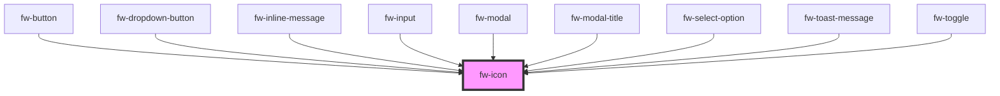

# Icon (fw-icon)
fw-icon displays an icon-sized image that imparts meaning to the component it is associated with.

## Demo

```html live
<fw-icon name="add_contact" size="18" color="green"></fw-icon>
```

## Usage

<code-group>
<code-block title="HTML">
```html 
<fw-icon name="add_contact" size="18" color="green"></fw-icon>
```
</code-block>

<code-block title="React">
```jsx
import React from "react";
import ReactDOM from "react-dom";
import { FwIcon } from "@freshworks/crayons/react";
function App() {
  return (<div>
  <FwIcon name="add_contact" size="18" color="green"></FwIcon>
 </div>);
}
```
</code-block>
</code-group>

### Icons

The following are the icons supported:

<IconGallery/>
<!-- Auto Generated Below -->


## Properties

| Property      | Attribute       | Description                                                                                                                                                                   | Type     | Default     |
| ------------- | --------------- | ----------------------------------------------------------------------------------------------------------------------------------------------------------------------------- | -------- | ----------- |
| `color`       | `color`         | Color in which the icon is displayed, specified as a standard CSS color or as a HEX code.                                                                                     | `string` | `''`        |
| `height`      | `height`        | Height of the icon, specified in number of  pixels.                                                                                                                           | `any`    | `undefined` |
| `lazy`        | `lazy`          | Enable Intersection Observer. Default is true.                                                                                                                                | `string` | `"true"`    |
| `library`     | `library`       | Name of External Library to be used                                                                                                                                           | `string` | `"crayons"` |
| `name`        | `name`          | Identifier of the icon. The attribute’s value must be a valid svg file name or a JS Export of the svg file in the repo of icons (icon-assets/icons) or a named export of svg. | `string` | `undefined` |
| `size`        | `size`          | Size of the icon, specified in number of  pixels. This will be square coordinates of (w X h) = size X size                                                                    | `string` | `''`        |
| `width`       | `width`         | Width of the icon, specified in number of  pixels.                                                                                                                            | `any`    | `undefined` |
| `xRootMargin` | `x-root-margin` | Root Margin in px or percentage for intersection observer                                                                                                                     | `string` | `'50px'`    |


## CSS Custom Properties

| Name           | Description       |
| -------------- | ----------------- |
| `--icon-color` | Color of the icon |


## Dependencies

### Used by

 - [fw-button](../button)
 - [fw-dropdown-button](../dropdown-button)
 - [fw-inline-message](../inline-message)
 - [fw-input](../input)
 - [fw-modal](../modal)
 - [fw-modal-title](../modal-title)
 - [fw-select-option](../select-option)
 - [fw-toast-message](../toast-message)
 - [fw-toggle](../toggle)

### Graph


----------------------------------------------

Built with ❤ at Freshworks
