# Icon (fw-icon)

**fw-icon/FwIcon** is a renderer of SVG file that displays an icon-sized image that imparts meaning to the HTML component it is associated with.
Following features are available as part of the implementation of the fw-icon.

1. Enable `fw-icon` as an optimized renderer for SVG with built-in functions such as `Intersection-Observer` and `Fetch-API Memoization`.
   Go through the docs to understand the various props it supports.
2. Providing icon-support for crayons-system components and also exposing crayons-icon set/tooling for public use.
3. Icons can convey all sorts of semantic meaningful information rather than just being decorational. In order to keep icons on the` accessibility tree`, just
   pass the `label` props and fw-icon does the a11y attribute mapping.
4. Enable `Crayons-Icon` as an iconlib to support external icon libraries. You can register/unregister external icon libraries and also apply mutation to all/selected icons.
   See usage docs.

## Examples Live

```html live
<fw-icon name="twitter" size="18" color="blue"></fw-icon>
<fw-icon
  name="feather"
  src="https://cdn.jsdelivr.net/npm/feather-icons@4.28.0/dist/icons"
  size="18"
  color="blue"
></fw-icon>
```

## Usage in Code

<code-group>
<code-block title="HTML">
```html 
<fw-icon name="add-contact" size=18 color="green" ></fw-icon>
```
</code-block>

<code-block title="React">
```jsx
import React from "react";
import ReactDOM from "react-dom";
import { FwIcon } from "@freshworks/crayons/react";
function App() {
  return (<div>
  <FwIcon name="add-contact" size={18} color="green" ></FwIcon>
 </div>);
}
```
</code-block>

<code-block title="Using Intersection Observer">
```html 
HTML
<fw-icon name="add-contact" size=18  color="green" x-root-margin = "80px" lazy ></fw-icon>
<fw-icon name="add-contact" size=18  color="green" lazy ></fw-icon>
React
<FwIcon  name="add-contact" size={18}  color="green" xRootMargin = "80px" lazy></FwIcon>
```
</code-block>
</code-group>

### Intersection Observer

Use prop `lazy` to enable Intersection-Observer. `By default it is disabled`. You may choose to give the intersection root-margin for icons i.e via prop `x-root-margin` as preloading threshold.Default value is **50px**.

## Crayons Icon Assets

The following icons are presently part of the Crayons-Icon library. These are optimized using SVGO.
Use the name of an icon as listed below it.
In case you are planning to use `svg+xml` source for `crayons` icons, do remember to import icons from `@freshworks/crayons-icon` and substitute an underscore for any hyphen in icon name. You may click the image to copy the import. See usage in section **Icon Library**.
e.g. `import { add_contact, alert, add_remove, ... } from '@freshworks/crayons-icon';` where name of icon is `add-contact`,`alert` and `add-remove`.

<IconGallery/>

## FwIcon as a Renderer for external lib icons.

**fw-icon/FwIcon can also render external icons**. You can use any external libraries from cdn after registering them. If you don't pass `library` props,
it will default to `crayons`. You can even pass the CDN URL of SVG to `src` prop. See the example below on how to use in React App.

The library registration happens via a `resolver` function. If you wish to apply some mutation to the icons , you may choose to pass the `mutator` function.

### Usage in HTML/React Page

<code-group>
<code-block title="HTML">
``` html
<html>
<head>
    <script type="module" src="https://unpkg.com/@freshworks/crayons@canary/dist/crayons/crayons.esm.js" ></script>
    <script type="module" >
        import { registerIconLibrary } from 'https://unpkg.com/@freshworks/crayons@canary/dist/crayons/index.esm.js';
        registerIconLibrary('feather', {
                resolver: (name) => `https://cdn.jsdelivr.net/npm/feather-icons@4.28.0/dist/icons/${name}.svg`,
                mutator: (svg,name) => (name==='feather') ? svg.setAttribute('fill', 'currentColor') : false
        });
    </script>
</head>
<body>
    <fw-icon name="feather" library="feather" color="red" size=30 ></fw-icon>
</body>
</html>
```
</code-block>

<code-block title="React">
``` jsx
import React from 'react';
import './App.css';
import { FwIcon, registerIconLibrary, unregisterIconLibrary } from '@freshworks/crayons/react';

registerIconLibrary('feather', {
resolver : ( name ) => `https://cdn.jsdelivr.net/npm/feather-icons@4.28.0/dist/icons/${name}.svg`,
mutator : (svg,name) => {(name==='feather') ? svg.setAttribute('fill', 'currentColor') : false}
});

registerIconLibrary('heroicons', {
resolver : ( name ) => `https://cdn.jsdelivr.net/npm/heroicons@0.4.2/outline/${name}.svg`
});

unregisterIconLibrary('heroicons');

function App() {
return (
<div >
<FwIcon name = "feather"   library="feather" color = 'red'  label = "feather"   />
<FwIcon name = "pie-chart" library="feather" color = 'blue' label = "pie-chart" />
</div>
);
}
export default App;

````
</code-block>
</code-group>

# Icon Library (@freshworks/crayons-icon)[](https://www.jsdelivr.com/package/npm/@freshworks/crayons-icon)

**Freshworks Crayons** publishes `@freshworks/crayons-icon` as an `Icon Library`. Following features are made available to users via the Lib utils.

1. Optimized set of Crayons Icons in `dist/icons` path. You are free to use them for project related purposes.
2. `Crayons` SVG Icons are also available as an esm module. Supports Tree-Shaking. This is a useful feature especially for customization purposes.
3. Enables `@freshworks/crayons-icon` CLI Interface via which you can leverage the SVGO Tooling to optimize your project svg-icons.
4. Crayons Iconlib default `svgo config` (svg compression util) is available as part of `dist` folder. Refer usage docs on how to use it in your project.

Some implementations via Icon Lib are as below:-

## Importing Icons from '@freshworks/crayons-icon'. [ Supports Tree-Shaking ].

You can also import Crayons Icons as an esm module. In case you wish to use your own `svg+xml` source, please pass the source string to `data-svg` props.
See the code below for implementation.

### Usage in HTML/React Page
<code-group>
<code-block title="HTML">
```html
<html>
<head>
   <script type="module" src="https://unpkg.com/@freshworks/crayons@canary/dist/crayons/crayons.esm.js" ></script>
   <script type="module">
       import { header, add_contact } from '@freshworks/crayons-icon';
       const circle = `<svg viewBox='0 0 100 100'><ellipse cx='50' cy='50' rx='50' ry='50'></ellipse></svg>`;
   </script>
</head>
<body>
      <div>
        <fw-icon data-svg={ header }  label="Crayons Icon Header" />
        <fw-icon data-svg={ add_contact }  label="Crayons Icon Add Contact" />
        <fw-icon data-svg={ circle }  label="circle svg" />
      </div>
</body>
</html>
````

</code-block>

<code-block title="React">
```jsx
import React from 'react';
import { FwIcon } from '@freshworks/crayons/react'; 
import { header, add_contact } from '@freshworks/crayons-icon';
const circle = `<svg viewBox='0 0 100 100'><ellipse cx='50' cy='50' rx='50' ry='50'></ellipse></svg>`;

function App() {
return (
<div>
<FwIcon dataSvg={ header } label="Crayons Icon Header" />
<FwIcon dataSvg={ add_contact } label="Crayons Icon Add-Contact" />
<FwIcon dataSvg={ circle } />
</div>
);
}
export default App;

````
</code-block>
</code-group>

### Example: Rendered in Sample Page as Component

<IconJSExportsShowcase/>

## CLI Tool for processing SVGs

`@freshworks/crayons-icon` is also available as a CLI Tool for processing SVGs with a friendlier interface, options and easily customizable config to optimize your SVGs. See the usage below.
It comes packed with a ultra tuned svgo-config. We support YML Config convention as its better in readability and easy to modify than a JSON. You may use the in-built CLI command to get the default YML File at your command root/ desired location, which you can further customize and use to optimze your SVGs via this CLI Tool.

`See the usage below :-`

<IconCLIShowcase/>

<!-- Auto Generated Below -->


## Properties

| Property      | Attribute       | Description                                                                                                                                                           | Type      | Default     |
| ------------- | --------------- | --------------------------------------------------------------------------------------------------------------------------------------------------------------------- | --------- | ----------- |
| `color`       | `color`         | Color in which the icon is displayed, specified as a standard CSS color or as a HEX code.                                                                             | `string`  | `''`        |
| `dataSvg`     | `data-svg`      | Identifier of the icon. The attribute’s value must be a valid JS Import Name of the svg in the named export from @freshworks/crayons-icon.                            | `string`  | `''`        |
| `height`      | `height`        | Height of the icon, specified in number of  pixels.                                                                                                                   | `number`  | `undefined` |
| `label`       | `label`         | An alternate description to use for accessibility. If omitted, the icon will be ignored by assistive devices.                                                         | `string`  | `undefined` |
| `lazy`        | `lazy`          | Enable Intersection Observer. Default is false.                                                                                                                       | `boolean` | `false`     |
| `library`     | `library`       | Name of External Library to be used                                                                                                                                   | `string`  | `'crayons'` |
| `name`        | `name`          | Identifier of the icon. The attribute’s value must be a valid svg Name in the Crayons-Icon set.                                                                       | `string`  | `undefined` |
| `size`        | `size`          | Size of the icon, specified in number of  pixels. This will be square coordinates of (w X h) = size X size                                                            | `number`  | `undefined` |
| `src`         | `src`           | Identifier of the icon. The attribute’s value must be a valid path to svg file.                                                                                       | `string`  | `undefined` |
| `width`       | `width`         | Width of the icon, specified in number of  pixels.                                                                                                                    | `number`  | `undefined` |
| `xRootMargin` | `x-root-margin` | Root Margin in px or percentage for Intersection-Observer. This means from ref to bottom of loaded view , the item loads when it crosses above the negative y margin. | `string`  | `'50px'`    |


## CSS Custom Properties

| Name              | Description       |
| ----------------- | ----------------- |
| `--fw-icon-color` | Color of the icon |
| `--fw-icon-size`  | Size of the icon  |


## Dependencies

### Used by

 - [fw-accordion-title](../accordion-title)
 - [fw-button](../button)
 - [fw-checkbox](../checkbox)
 - [fw-custom-cell-icon](../data-table/custom-cells/icon)
 - [fw-custom-cell-paragraph](../data-table/custom-cells/paragraph)
 - [fw-data-table](../data-table)
 - [fw-datepicker](../datepicker)
 - [fw-drag-item](../drag-item)
 - [fw-file-uploader-file](../file-uploader/file)
 - [fw-file-uploader-progress](../file-uploader/progress)
 - [fw-inline-message](../inline-message)
 - [fw-input](../input)
 - [fw-menu-item](../menu-item)
 - [fw-modal](../modal)
 - [fw-modal-title](../modal-title)
 - [fw-pagination](../pagination)
 - [fw-select](../select)
 - [fw-select-option](../select-option)
 - [fw-tag](../tag)
 - [fw-toast-message](../toast-message)
 - [fw-toggle](../toggle)
 - [fw-toggle-group-button](../toggle-group-button)

### Depends on

- [fw-toast-message](../toast-message)

### Graph

```mermaid
graph TD;
  fw-icon --> fw-toast-message
  fw-toast-message --> fw-icon
  fw-accordion-title --> fw-icon
  fw-button --> fw-icon
  fw-checkbox --> fw-icon
  fw-custom-cell-icon --> fw-icon
  fw-custom-cell-paragraph --> fw-icon
  fw-data-table --> fw-icon
  fw-datepicker --> fw-icon
  fw-drag-item --> fw-icon
  fw-file-uploader-file --> fw-icon
  fw-file-uploader-progress --> fw-icon
  fw-inline-message --> fw-icon
  fw-input --> fw-icon
  fw-menu-item --> fw-icon
  fw-modal --> fw-icon
  fw-modal-title --> fw-icon
  fw-pagination --> fw-icon
  fw-select --> fw-icon
  fw-select-option --> fw-icon
  fw-tag --> fw-icon
  fw-toggle --> fw-icon
  fw-toggle-group-button --> fw-icon
  style fw-icon fill:#f9f,stroke:#333,stroke-width:4px
```


----------------------------------------------

Built with ❤ at Freshworks
