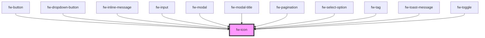

# Icon (fw-icon)
fw-icon displays an icon-sized image that imparts meaning to the component it is associated with.

## Demo

```html live
<fw-icon name="add-contact" size="18" color="green"></fw-icon>
```

## Usage

<code-group>
<code-block title="HTML">
```html 
<fw-icon name="add-contact" size="18" color="green"></fw-icon>
```
</code-block>

<code-block title="React">
```jsx
import React from "react";
import ReactDOM from "react-dom";
import { FwIcon } from "@freshworks/crayons/react";
function App() {
  return (<div>
  <FwIcon name="add-contact" size="18" color="green"></FwIcon>
 </div>);
}
```
</code-block>
</code-group>

### Icons

The following are the icons supported:

<IconGallery/>
<!-- Auto Generated Below -->


## Properties

| Property | Attribute | Description                                                                                                         | Type     | Default     |
| -------- | --------- | ------------------------------------------------------------------------------------------------------------------- | -------- | ----------- |
| `color`  | `color`   | Color in which the icon is displayed, specified as a standard CSS color or as a HEX code.                           | `string` | `''`        |
| `name`   | `name`    | Identifier of the icon. The attribute’s value must be a valid svg file in the repo of icons (assets/icons).         | `string` | `undefined` |
| `size`   | `size`    | Size of the icon, specified in number of  pixels. Default value is 12px defined using the --icon-size css variable. | `number` | `undefined` |


## CSS Custom Properties

| Name           | Description       |
| -------------- | ----------------- |
| `--icon-color` | Color of the icon |
| `--icon-size`  | Size of the icon  |


## Dependencies

### Used by

 - [fw-button](../button)
 - [fw-dropdown-button](../dropdown-button)
 - [fw-inline-message](../inline-message)
 - [fw-input](../input)
 - [fw-modal](../modal)
 - [fw-modal-title](../modal-title)
 - [fw-pagination](../pagination)
 - [fw-select-option](../select-option)
 - [fw-tag](../tag)
 - [fw-toast-message](../toast-message)
 - [fw-toggle](../toggle)

### Graph


----------------------------------------------

Built with ❤ at Freshworks
