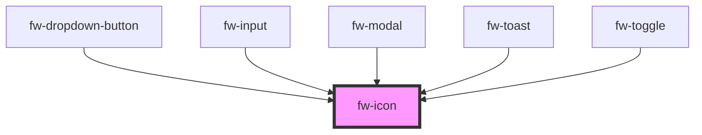

# Icon (fw-icon)
fw-icon displays an icon-sized image that imparts meaning to the component it is associated with.
## Usage

```html live
<fw-label value="Default Crayons icons"></fw-label>
<fw-icon name="add-contact" size="18" color="green"></fw-icon>
<fw-label value="Lazy load Crayons icons"></fw-label>
<fw-icon name="alert" size="18" color="red" lazy></fw-icon>
<fw-label value="Custom icons using path prop"></fw-label>
<fw-icon path="assets" name="aa" size={50} color="blue" lazy/>
```
### Frameworks and Custom Icon Library
To use any custom icon library:
```
import { registerIcons, FwIcon } from "@freshworks/crayons/react"

registerIcons("bootstrap", {
  path: "https://cdn.jsdelivr.net/npm/bootstrap-icons@1.0.0/icons/"
})

<FwIcon library="bootstrap" name="clock" size={50}/>
```

#### Tree shaking: 
To enable tree shaking use below:
```
import { crayonsIconAgent } from '@freshworks/crayons-icons'
import { FwIcon } from '@freshworks/crayons/react"

<FwIcon icon={crayonsIconAlert}  size={50} color="red"/>

```
### Icons

The following are the icons supported:

<IconGallery/>

<!-- Auto Generated Below -->


## Properties

| Property  | Attribute | Description                                                                                                                                                                                    | Type      | Default     |
| --------- | --------- | ---------------------------------------------------------------------------------------------------------------------------------------------------------------------------------------------- | --------- | ----------- |
| `color`   | `color`   | Color in which the icon is displayed, specified as a standard CSS color or as a HEX code.                                                                                                      | `string`  | `''`        |
| `icon`    | `icon`    | Content of the icon. This will be used instead of pulling the icon content from the cdn                                                                                                        | `string`  | `''`        |
| `lazy`    | `lazy`    | If enabled, fw-icon will be loaded lazily when it's visible in the viewport. Default, `false`.                                                                                                 | `boolean` | `false`     |
| `library` | `library` | Namespace for icon library. Call registerIcons with the library name and set the path for custom icons. Uses pre-defined icons by default. See readme.md for more details. Default, `default`. | `string`  | `'default'` |
| `name`    | `name`    | Identifier of the icon. The attribute’s value must be a valid svg file in the repo of icons (assets/icons).                                                                                    | `string`  | `undefined` |
| `path`    | `path`    | Specifies the root folder `path` of an SVG file to use. This is used in combination with `name` attribute svg src is path+name.svg                                                             | `string`  | `''`        |
| `size`    | `size`    | Size of the icon, specified in number of  pixels.                                                                                                                                              | `number`  | `12`        |


## CSS Custom Properties

| Name           | Description       |
| -------------- | ----------------- |
| `--icon-color` | Color of the icon |


## Dependencies

### Used by

 - [fw-dropdown-button](../dropdown-button)
 - [fw-input](../input)
 - [fw-modal](../modal)
 - [fw-toast](../toast)
 - [fw-toggle](../toggle)

### Graph


----------------------------------------------

Built with ❤ at Freshworks
