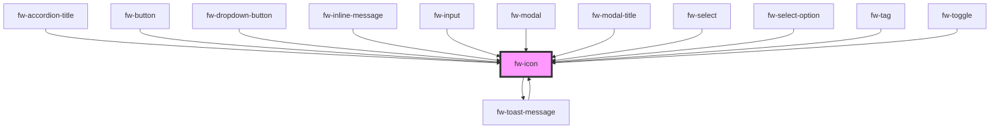

# Icon (fw-icon)

"fw-icon/FwIcon" is a renderer of SVG file that displays an icon-sized image that imparts meaning to the HTML component it is associated with.
Following features are available as part of the implementation of the fw-icon.

1. Enable fw-icon as an optimized renderer for SVG with built-in functions such as Intersection-Observer and Fetch-API Memoization.
   Go through the docs to understand the various props it supports.
2. Providing icon-support for crayons-system components and also exposing crayons-icon set for public use with inbuilt support for external icon-libraries also.
## Examples Live

```html live
<fw-icon name="twitter" size="28" color="blue" ></fw-icon>
<fw-icon name="feather" src = "https://cdn.jsdelivr.net/npm/feather-icons@4.28.0/dist/icons" size="28" color="blue" ></fw-icon>
```

## Usage in Code

<code-group>
<code-block title="HTML">
```html 
<fw-icon name="add-contact" size="18" color="green" ></fw-icon>
```
</code-block>

<code-block title="React">
```jsx
import React from "react";
import ReactDOM from "react-dom";
import { FwIcon } from "@freshworks/crayons/react";
function App() {
  return (<div>
  <FwIcon name="add-contact" size="18" color="green" ></FwIcon>
 </div>);
}
```
</code-block>

<code-block title="Using Intersection Observer">
```html 
HTML
<fw-icon name="add-contact" size="18" color="green" x-root-margin = "80px" lazy ></fw-icon>
<fw-icon name="add-contact" size="18" color="green" lazy ></fw-icon>
React
<FwIcon name="add-contact" size="18" color="green" xRootMargin = "80px" lazy></FwIcon>
```
</code-block>
</code-group>

### Intersection Observer

Use prop 'lazy' to enable Intersection-Observer. By deafult it is disabled. You may choose to give the intersection root-margin for icons i.e via prop 'x-root-margin' as preloading threshold in a viewport.Default value is '50px'.
fw-icon also implements fetch API Memoization so any icon once fetched will not be requested again and will be available throughout the session/pages.

## Crayons Icon Assets 

The following icons are presently part of the Crayons-Icon library. These are optimized using SVGO.
Use the name of an icon as listed below it. For JS Imports, you may click to copy the imports.

<IconGallery/>

# Icon Library (@freshworks/crayons-icon)

Crayons Icon is now available as '@freshworks/crayons-icon' Library. This encapsulates all Icon Tooling icon exports. Following is implemented via the Lib.

1. JS Exports of SVG Icon to enable Tree-Shaking for inline-svg. This is a useful feature where Dev Team can choose to do something offline with SVGs.
2. Enable Crayons-Icon lib to support external icon libraries. The development team can register external icon libraries via register API. See usage docs.
3. Optimized SVGs using SVGO via .yml configuration. The development team can extend the .yml file and use it in their app for optimizing their custom icons. 

Some implementations via Icon Lib are as below:-

## FwIcon as a Renderer for external icons.

fw-icon can also render external icons. You can use any external libraries from cdn after registering them. If you don't pass 'library' props,
it will default to 'crayons'. You can even pass the CDN URL of SVG to 'src' prop. See the example below on how to use in React App.

The library registration happens via a 'resolver' function. If you wish to apply some mutation to the icons , you may also choose to pass the mutator function.

### Usage in HTML/React Page
<code-group>
<code-block title="HTML">
``` html
<html>
<head>
<script type="module" src="https://unpkg.com/@freshworks/crayons@canary/dist/crayons/crayons.esm.js" ></script>
<script type="module" >
import { fwIconRegisterLibrary } from 'https://unpkg.com/@freshworks/crayons@canary/dist/crayons/index.esm.js';
fwIconRegisterLibrary('feather', {
        resolver: () => `https://cdn.jsdelivr.net/npm/feather-icons@4.28.0/dist/icons`,
        mutator: (svg,'all') => svg.setAttribute('fill', 'currentColor')
});
</script>
</head>
<body>
    <fw-icon name="alert" color="red" size="30" ></fw-icon>
    <fw-icon name="feather" library="feather" color="red" size="30" ></fw-icon>
</body>
</html>
```
</code-block>

<code-block title="React">
``` jsx
import React from 'react';
import './App.css';
import { add_contact } from '@freshworks/crayons-icon';
import { FwIcon, fwIconRegisterLibrary } from '@freshworks/crayons/react';

fwIconRegisterLibrary('feather', {
        resolver: () => `https://cdn.jsdelivr.net/npm/feather-icons@4.28.0/dist/icons`,
        mutator: (svg,name) => (name==='feather') ? svg.setAttribute('fill', 'currentColor') : false
        
});
fwIconRegisterLibrary('heroicons', {
        resolver: () => `https://cdn.jsdelivr.net/npm/heroicons@0.4.2/outline`,
        mutator: (svg,name) => svg.setAttribute('fill', 'currentColor')
});
fwIconRegisterLibrary('custom', {
        resolver: () => `assets/icons`
});

function App() {

    return ( 
        <div >
                <div >
                <FwIcon name = "alert"
                        color = 'red'
                        library = "custom" 
                />
                <FwIcon name = "feather"
                        library="feather"
                        color = 'red' 
                />
                <FwIcon name = "alert"
                        color = 'blue'
                        width = "20"
                        height = "20" 
                />
                <FwIcon dataSvg = { add_contact }
                        color = 'blue'
                        size = "30" 
                />
                <FwIcon name = "feather"
                        src = "https://cdn.jsdelivr.net/npm/feather-icons@4.28.0/dist/icons"
                        color = 'blue'
                        size = "30" 
                />
                </div> 
        </div>
    );
}
export default App;
```
</code-block>
</code-group>


## Importing Icons from '@freshworks/crayons-icon' as Inline-SVGs. Supports Tree-Shaking.

We may also import Crayons Icons from '@freshworks/crayons-icon'. These are in form of JS Exports. This helps you to use inline SVG with Tree-Shakeable Imports
This way, you may choose to alter the SVG data and push it for re-render as per your project needs.

<code-group>
<code-block title="HTML">
```html 
<html>
<head>
<script type="module" src="https://unpkg.com/@freshworks/crayons@canary/dist/crayons/crayons.esm.js" ></script>
<script type="module" >
import { header } from '@freshworks/crayons-icon';
</script>
</head>
<body>
    <fw-icon data-svg={ header } size="20" ></fw-icon>
</body>
</html>

```
</code-block>

<code-block title="React">
```jsx
import React from "react";
import ReactDOM from "react-dom";
import { FwIcon } from "@freshworks/crayons/react";
import { header } from '@freshworks/crayons-icon';

function App() {
  return (<div>
  <FwIcon dataSvg={ header } size="20" ></FwIcon>
 </div>);
}
```
</code-block>
</code-group>


### Example: Rendered in Sample Page as Component 

<IconTSExportsShowcase/>


<!-- Auto Generated Below -->


## Properties

| Property      | Attribute       | Description                                                                                                                                                           | Type      | Default     |
| ------------- | --------------- | --------------------------------------------------------------------------------------------------------------------------------------------------------------------- | --------- | ----------- |
| `color`       | `color`         | Color in which the icon is displayed, specified as a standard CSS color or as a HEX code.                                                                             | `string`  | `''`        |
| `dataSvg`     | `data-svg`      | Identifier of the icon. The attribute’s value must be a valid JS Import Name of the svg in the named export from @freshworks/crayons-icon.                            | `string`  | `''`        |
| `height`      | `height`        | Height of the icon, specified in number of  pixels.                                                                                                                   | `number`  | `undefined` |
| `label`       | `label`         | An alternate description to use for accessibility. If omitted, the icon will be ignored by assistive devices.                                                         | `string`  | `undefined` |
| `lazy`        | `lazy`          | Enable Intersection Observer. Default is false.                                                                                                                       | `boolean` | `false`     |
| `library`     | `library`       | Name of External Library to be used                                                                                                                                   | `string`  | `'crayons'` |
| `name`        | `name`          | Identifier of the icon. The attribute’s value must be a valid svg Name in the Crayons-Icon set.                                                                       | `string`  | `undefined` |
| `size`        | `size`          | Size of the icon, specified in number of  pixels. This will be square coordinates of (w X h) = size X size                                                            | `number`  | `undefined` |
| `src`         | `src`           | Identifier of the icon. The attribute’s value must be a valid path to svg file.                                                                                       | `string`  | `undefined` |
| `width`       | `width`         | Width of the icon, specified in number of  pixels.                                                                                                                    | `number`  | `undefined` |
| `xRootMargin` | `x-root-margin` | Root Margin in px or percentage for Intersection-Observer. This means from ref to bottom of loaded view , the item loads when it crosses above the negative y margin. | `string`  | `'50px'`    |


## CSS Custom Properties

| Name           | Description       |
| -------------- | ----------------- |
| `--icon-color` | Color of the icon |
| `--icon-size`  | Size of the icon  |


## Dependencies

### Used by

 - [fw-accordion-title](../accordion-title)
 - [fw-button](../button)
 - [fw-dropdown-button](../dropdown-button)
 - [fw-inline-message](../inline-message)
 - [fw-input](../input)
 - [fw-modal](../modal)
 - [fw-modal-title](../modal-title)
 - [fw-select](../select)
 - [fw-select-option](../select-option)
 - [fw-tag](../tag)
 - [fw-toast-message](../toast-message)
 - [fw-toggle](../toggle)

### Depends on

- [fw-toast-message](../toast-message)

### Graph


----------------------------------------------

Built with ❤ at Freshworks
