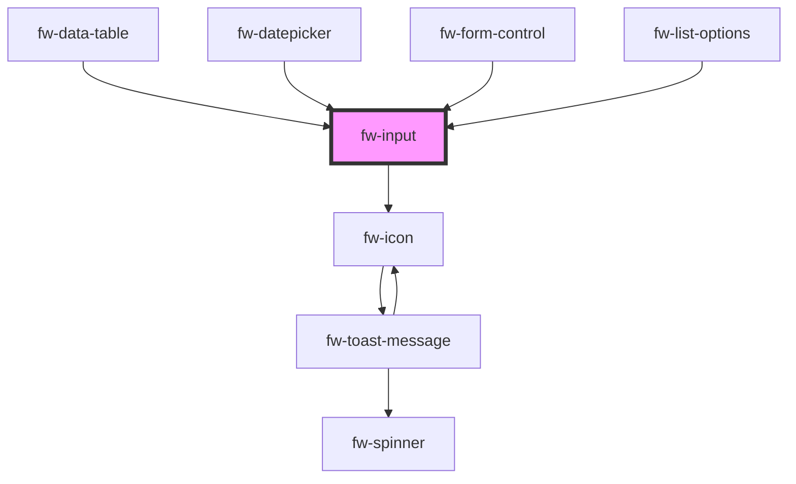

# Input (fw-input)

fw-input displays a single-line input box on the user interface and enables assigning a value to it.

## Demo

You can use Input component for handling `Text`, `Number`, `Decimal` user input.

```html live
<fw-input
  label="Name"
  icon-left="add-contact"
  hint-text="Do not enter your user ID"
  warning-text="Please use numbers for user ID"
  error-text="Invalid user ID"
  state="warning"
  placeholder="Enter your official name"
  required
  clear-input
>
</fw-input>
<fw-input
  label="Password"
  error-text="Password is incorrect"
  state="error"
  required
  clear-input
>
</fw-input>
<h3>`hint-text`, `warning-text`, `error-text` can be passed as slots</h3>
<fw-input
  label="Verification Code"
  placeholder="Enter the verification code sent to the registered email address"
  state="normal"
  clear-input
>
<div slot="hint-text">use the verification code sent to your email address</div>
</fw-input>
<fw-input label="Deprecated Field" disabled state="normal" clear-input>
</fw-input>
<fw-input
  label="Do Not Modify"
  value="Not applicable"
  readonly
  state="normal"
  clear-input
>
</fw-input>
<fw-input value="123" type="number" label="Number Input"></fw-input>
<fw-input
  type="number"
  min="0"
  max="10"
  label="Number Input with min and max"
></fw-input>
<fw-input
  value="3.001"
  type="number"
  step="0.1"
  max="5"
  label="Decimal Input with step and max"
></fw-input>
```

## Usage

<code-group>
<code-block title="HTML">
```html
<fw-input
  label="Name"
  icon-left="add-contact"
  hint-text="Do not enter your user ID"
  warning-text="Please use numbers for user ID"
  error-text="Invalid user ID"
  state="warning"
  placeholder="Enter your official name"
  required
  clear-input
>
</fw-input>
<fw-input
  label="Password"
  error-text="Password is incorrect"
  state="error"
  required
  clear-input
>
</fw-input>
<h3>`hint-text`, `warning-text`, `error-text` can be passed as slots</h3>
<fw-input
  label="Verification Code"
  placeholder="Enter the verification code sent to the registered email address"
  state="normal"
  clear-input
>
<div slot="hint-text">use the verification code sent to your email address</div>
</fw-input>
<fw-input label="Deprecated Field" disabled state="normal" clear-input>
</fw-input>
<fw-input
  label="Do Not Modify"
  value="Not applicable"
  readonly
  state="normal"
  clear-input
>
</fw-input>
<fw-input value="123" type="number" label="Number Input"></fw-input>
<fw-input
  type="number"
  min="0"
  max="10"
  label="Number Input with min and max"
></fw-input>
<fw-input
  value="3.001"
  type="number"
  step="0.1"
  max="5"
  label="Decimal Input with step and max"
></fw-input>
```
</code-block>

<code-block title="React">
```jsx
import React from "react";
import ReactDOM from "react-dom";
import { FwInput } from "@freshworks/crayons/react";
function App() {
  return (<div>
      <FwInput
      label="Name"
      iconLeft="add-contact"
      hintText="Do not enter your user ID"
      warningText="Use only numbers for user ID"
      errorText="Invalid user ID"
      state="warning"
      placeholder="Enter your official name"
      required
      clearInput>
    </FwInput>
    <FwInput
      label="Password"
      errorText="Password is incorrect"
      state="error"
      required
      clearInput>
    </FwInput>
    <h3>`hint-text`, `warning-text`, `error-text` can be passed as slots</h3>
    <FwInput
      label="Verification Code"
      placeholder="Enter the verification code sent to the registered email address"
      state="normal"
      clearInput>
      <div slot="hint-text">Please use the code sent to your email address</div>
    </FwInput>
    <FwInput
      label="Deprecated Field"
      disabled
      state="normal"
      clearInput>
    </FwInput>
    <FwInput
      label="Do Not Modify"
      value="Not applicable"
      readonly
      state="normal"
      clearInput>
    </FwInput>
    <FwInput value="123" type="number" label="Number Input"></FwInput>
    <FwInput type="number" min={0} max={10} label="Number Input with min and max"></FwInput>
    <FwInput value="3.001" type="number" step="0.1" max={5}
    label="Decimal Input with step and max"
    ></FwInput>
 </div>);
```
</code-block>
</code-group>

### Slots

Slots can be used to create complex use cases.

```html live
<template>
  <div>
    <fw-input value="Searching..." icon-left="search" clear-input>
      <fw-spinner slot="input-suffix" size="small"></fw-spinner>
    </fw-input>

    <fw-input placeholder="DD/MM/YYYY">
      <div slot="input-suffix" class="calenderContainer">
        <span class="separator"></span>
        <fw-icon name="calendar" size="16"></fw-icon>
      </div>
    </fw-input>
    <fw-input placeholder="Type to search">
      <div slot="input-prefix" class="tagContainer">
        <fw-tag text="Option 1"></fw-tag>
        <fw-tag text="Option 2"></fw-tag>
      </div>
      <fw-icon slot="input-suffix" name="chevron-down" size="8"></fw-icon>
    </fw-input>

    <h3>`hint-text`, `warning-text`, `error-text` can also be passed as slots</h3>
    <fw-input
      label="Verification Code"
      placeholder="Enter the verification code sent to the registered email address"
      state="normal"
      clear-input
    >
    <div slot="hint-text">use the verification code sent to your email address</div>
    </fw-input>
  </div>
</template>
<style>
  fw-input {
    margin: 12px;
  }

  .calenderContainer {
    display: flex;
    align-items: center;
  }

  .separator {
    background-color: #cfd7df;
    width: 1px;
    height: 20px;
    margin-right: 4px;
  }

  .tagContainer {
    display: flex;
    align-items: center;
    flex-wrap: wrap;
    margin: 4px;
  }

  fw-tag {
    margin: 0 4px;
  }
</style>
```

<!-- Auto Generated Below -->


## Properties

| Property       | Attribute      | Description                                                                                                                                                                                                                                                                                                               | Type                                     | Default     |
| -------------- | -------------- | ------------------------------------------------------------------------------------------------------------------------------------------------------------------------------------------------------------------------------------------------------------------------------------------------------------------------- | ---------------------------------------- | ----------- |
| `autocomplete` | `autocomplete` | Specifies whether the browser can display suggestions to autocomplete the text value.                                                                                                                                                                                                                                     | `"off" \| "on"`                          | `'off'`     |
| `clearInput`   | `clear-input`  | Displays a right-justified clear icon in the text box. Clicking the icon clears the input text. If the attribute’s value is undefined, the value is set to false. For a read-only input box, the clear icon is not displayed unless a default value is specified for the input box.                                       | `boolean`                                | `false`     |
| `disabled`     | `disabled`     | Disables the component on the interface. If the attribute’s value is undefined, the value is set to false.                                                                                                                                                                                                                | `boolean`                                | `false`     |
| `errorText`    | `error-text`   | Error text displayed below the text box.                                                                                                                                                                                                                                                                                  | `string`                                 | `''`        |
| `hintText`     | `hint-text`    | Hint text displayed below the text box.                                                                                                                                                                                                                                                                                   | `string`                                 | `''`        |
| `iconLeft`     | `icon-left`    | Identifier of the icon that is displayed in the left side of the text box. The attribute’s value must be a valid svg file in the repo of icons (assets/icons).                                                                                                                                                            | `string`                                 | `undefined` |
| `iconRight`    | `icon-right`   | Identifier of the icon that is displayed in the right side of the text box. The attribute’s value must be a valid svg file in the repo of icons (assets/icons).                                                                                                                                                           | `string`                                 | `undefined` |
| `label`        | `label`        | Label displayed on the interface, for the component.                                                                                                                                                                                                                                                                      | `string`                                 | `''`        |
| `max`          | `max`          | Specifies a maximum value that can be entered for the number/decimal input.                                                                                                                                                                                                                                               | `number`                                 | `undefined` |
| `maxlength`    | `maxlength`    | Maximum number of characters a user can enter in the text box.                                                                                                                                                                                                                                                            | `number`                                 | `undefined` |
| `min`          | `min`          | Specifies a minimum value that can be entered for the number/decimal input.                                                                                                                                                                                                                                               | `number`                                 | `undefined` |
| `minlength`    | `minlength`    | Minimum number of characters a user must enter in the text box for the value to be valid.                                                                                                                                                                                                                                 | `number`                                 | `undefined` |
| `name`         | `name`         | Name of the component, saved as part of form data.                                                                                                                                                                                                                                                                        | `string`                                 | `''`        |
| `placeholder`  | `placeholder`  | Text displayed in the text box before a user enters a value.                                                                                                                                                                                                                                                              | `string`                                 | `undefined` |
| `readonly`     | `readonly`     | If true, the user cannot enter a value in the input box. If the attribute’s value is undefined, the value is set to false.                                                                                                                                                                                                | `boolean`                                | `false`     |
| `required`     | `required`     | Specifies the input box as a mandatory field and displays an asterisk next to the label. If the attribute’s value is undefined, the value is set to false.                                                                                                                                                                | `boolean`                                | `false`     |
| `state`        | `state`        | Theme based on which the text box is styled.                                                                                                                                                                                                                                                                              | `"error" \| "normal" \| "warning"`       | `'normal'`  |
| `step`         | `step`         | The step attribute is used when the type is `number`. It specifies the interval between legal numbers in a number/decimal input element. Works with the min and max attributes to limit the increments at which a value can be set. Possible values are `any` or a positive floating point number. Default value is `any` | `string`                                 | `'any'`     |
| `type`         | `type`         | Type of value accepted as the input value. If a user enters a value other than the specified type, the input box is not populated.                                                                                                                                                                                        | `"email" \| "number" \| "text" \| "url"` | `'text'`    |
| `value`        | `value`        | Default value displayed in the input box.                                                                                                                                                                                                                                                                                 | `string`                                 | `''`        |
| `warningText`  | `warning-text` | Warning text displayed below the text box.                                                                                                                                                                                                                                                                                | `string`                                 | `''`        |


## Events

| Event          | Description                                         | Type                |
| -------------- | --------------------------------------------------- | ------------------- |
| `fwBlur`       | Triggered when the input box loses focus.           | `CustomEvent<any>`  |
| `fwFocus`      | Triggered when the input box comes into focus.      | `CustomEvent<void>` |
| `fwInput`      | Triggered when a value is entered in the input box. | `CustomEvent<any>`  |
| `fwInputClear` | Triggered when clear icon is clicked.               | `CustomEvent<any>`  |


## Methods

### `setFocus() => Promise<void>`

Sets focus on a specific `fw-input`. Use this method instead of the global `input.focus()`.

#### Returns

Type: `Promise<void>`


## CSS Custom Properties

| Name                 | Description                |
| -------------------- | -------------------------- |
| `--fw-error-color`   | Color of the error text.   |
| `--fw-hint-color`    | Color of the hint text.    |
| `--fw-label-color`   | Color of the label.        |
| `--fw-warning-color` | Color of the warning text. |


## Dependencies

### Used by

 - [fw-data-table](../data-table)
 - [fw-datepicker](../datepicker)
 - [fw-form-control](../form-control)
 - [fw-list-options](../options-list)

### Depends on

- [fw-icon](../icon)

### Graph


----------------------------------------------

Built with ❤ at Freshworks
